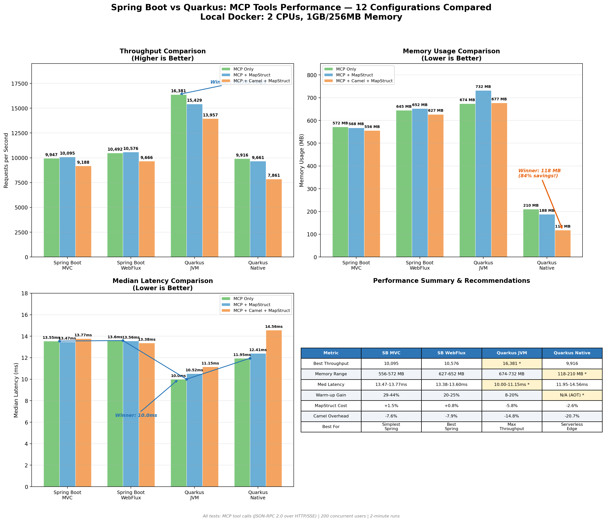

# Spring Boot vs Quarkus: Which Java Runtime Wins the AI MCP Tools Performance Battle?

## 16,381 req/s vs 10,576 req/s — We Benchmarked 12 Configurations So You Don't Have To

AI agents are calling your Java backend thousands of times per second through MCP (Model Context Protocol) tools. But which runtime should power those tools — **Spring Boot** or **Quarkus**? And does adding enterprise layers like **Apache Camel** and **MapStruct** kill your performance?

We ran **36 load tests** across **4 runtimes** and **3 tool configurations** to find out. The results surprised us.

## Table of Contents
- [Benchmark Results](#benchmark-results)
- [Executive Summary](#executive-summary)
- [Test Environment](#test-environment)
- [Overall Performance Comparison](#overall-performance-comparison)
- [Configuration Comparison](#configuration-comparison)
- [Runtime Comparison](#runtime-comparison)
- [Memory Efficiency Analysis](#memory-efficiency-analysis)
- [Latency Analysis](#latency-analysis)
- [Configuration Overhead Analysis](#configuration-overhead-analysis)
- [JVM Warm-up Characteristics](#jvm-warm-up-characteristics)
- [Container Resource Usage](#container-resource-usage)
- [Use Case Recommendations](#use-case-recommendations)
- [Detailed Results](#detailed-results)
- [Microservice Creation](#microservice-creation)
- [Build and Deployment](#build-and-deployment)
- [Performance Tuning Insights](#performance-tuning-insights)
- [Conclusion](#conclusion)

## Benchmark Results



**12 configurations, 36 test runs, zero failures.** Here's how Spring Boot MVC, Spring Boot WebFlux, Quarkus JVM, and Quarkus Native stack up across three MCP tool implementations — from bare-metal baseline to full enterprise stack with Apache Camel routing and MapStruct DTO mapping.

## Executive Summary

**TL;DR — Quarkus JVM dominates throughput. Quarkus Native dominates memory. MapStruct is free. Camel overhead is worth it.**

- 🚀 **Highest Throughput**: Quarkus JVM — **16,381 req/s** — that's **65% faster** than the best Spring Boot result
- 💾 **Lowest Memory**: Quarkus Native — **118 MB** — running a full Camel + MapStruct enterprise stack
- ⚡ **Best Latency**: Quarkus JVM — **10.0ms median** — half the latency of Spring Boot
- 🏗️ **MapStruct is Free**: Adding DTO mapping costs less than ±5% — always use it
- 🔄 **Camel Overhead**: 8–21% — and Quarkus JVM with Camel (13,957 req/s) *still* beats every Spring Boot baseline
- ✅ **Zero Failures**: 100% success rate across all 36 test runs

## Test Environment

### Versions
- **Apache Camel**: 4.16
- **Quarkus**: 3.30.0
- **Spring Boot**: 3.5.9
- **Java**: 21

### Infrastructure
- **Platform**: Local Docker containers
- **Hardware**: MacBook Pro M1
- **CPU**: 2 cores per container
- **Memory**: 1GB (JVM runtimes) / 256MB (Native)
- **Container**: Docker with resource limits

### Load Testing
- **Tool**: k6 (industry-standard load testing tool)
- **Test File**: `mcp-throughput-test.js` (located in `docs/k6/mcp/`)
- **Virtual Users**: 200 concurrent
- **Test Duration**: 2 minutes per run
- **Warm-up**: 3 runs for JVM runtimes (Run 3 = optimized); 3 runs for native to verify consistency
- **Protocol**: MCP over HTTP/SSE (JSON-RPC 2.0)
- **Metrics**: Throughput, latency (avg, median, P90, P95), resource usage

### Configuration
All tests performed with:
- All interceptors disabled for maximum performance
- Mock backend (no external dependencies)
- Optimized Docker resource allocation
- Production-like settings

## Overall Performance Comparison

### Throughput Comparison (Requests/Second)

| Runtime | MCP Only | MCP + MapStruct | MCP + Camel + MapStruct | Average |
|---------|----------|-----------------|-------------------------|---------|
| **Spring Boot MVC** | 9,947 | 10,095 | 9,188 | 9,743 |
| **Spring Boot WebFlux** | 10,492 | 10,576 | 9,666 | 10,245 |
| **Quarkus JVM** | **16,381** | 15,429 | 13,957 | **15,256** |
| **Quarkus Native** | 9,916 | 9,661 | 7,861 | 9,146 |

**Key Insights:**
- Quarkus JVM leads in throughput across all configurations — 55–65% higher than Spring Boot
- Even with full Camel overhead, Quarkus JVM (13,957 req/s) outperforms all Spring Boot baselines
- Spring Boot WebFlux provides ~5% throughput advantage over MVC
- Quarkus Native matches Spring Boot MVC throughput while using 72–84% less memory

### Memory Usage Comparison (MB)

| Runtime | MCP Only | MCP + MapStruct | MCP + Camel + MapStruct | Average |
|---------|----------|-----------------|-------------------------|---------|
| **Spring Boot MVC** | 572 | 568 | 556 | 565 |
| **Spring Boot WebFlux** | 645 | 652 | 627 | 641 |
| **Quarkus JVM** | 674 | 732 | 677 | 694 |
| **Quarkus Native** | 210 | 188 | **118** | **172** |

**Key Insights:**
- Quarkus Native uses 72–84% less memory than JVM-based runtimes
- Spring Boot MVC has the most consistent memory footprint across configurations (556–572 MB)
- Quarkus JVM uses slightly more memory than Spring Boot but delivers 55–65% higher throughput
- The full Camel + MapStruct configuration on Quarkus Native runs in just 118 MB

### Latency Comparison - Average (ms)

| Runtime | MCP Only | MCP + MapStruct | MCP + Camel + MapStruct |
|---------|----------|-----------------|-------------------------|
| **Spring Boot MVC** | 18.86 | 18.49 | 20.47 |
| **Spring Boot WebFlux** | 17.91 | 17.75 | 19.44 |
| **Quarkus JVM** | **11.42** | 12.04 | 13.44 |
| **Quarkus Native** | 18.92 | 19.41 | 24.19 |

### Latency Comparison - Median (ms)

| Runtime | MCP Only | MCP + MapStruct | MCP + Camel + MapStruct |
|---------|----------|-----------------|-------------------------|
| **Spring Boot MVC** | 13.55 | 13.47 | 13.77 |
| **Spring Boot WebFlux** | 13.60 | 13.56 | 13.38 |
| **Quarkus JVM** | **10.00** | 10.52 | 11.15 |
| **Quarkus Native** | 11.95 | 12.41 | 14.56 |

**Key Insights:**
- Quarkus JVM provides the lowest latency across all configurations
- Spring Boot MVC and WebFlux have remarkably consistent median latencies (13.38–13.77ms)
- Quarkus Native median latency is competitive (11.95–14.56ms) despite lower throughput

## Configuration Comparison

### MCP Only (Baseline)

Direct tool response with no additional framework layers.

| Metric | Spring Boot MVC | Spring Boot WebFlux | Quarkus JVM | Quarkus Native |
|--------|-----------------|---------------------|-------------|----------------|
| **Throughput (req/s)** | 9,947 | 10,492 | **16,381** | 9,916 |
| **Avg Latency (ms)** | 18.86 | 17.91 | **11.42** | 18.92 |
| **Median Latency (ms)** | 13.55 | 13.60 | **10.00** | 11.95 |
| **P95 Latency (ms)** | 51.78 | 45.86 | **22.36** | 57.19 |
| **Memory (MB)** | 572 | 645 | 674 | **210** |

**MCP Only Characteristics:**
- ✅ Highest throughput across all runtimes
- ✅ Lowest latency — ideal for maximum performance
- ✅ Simplest implementation
- ⚠️ No domain model separation
- ⚠️ No enterprise integration patterns

### MCP + MapStruct

Tool call processed through MapStruct DTO mapping (MCP model ↔ domain model).

| Metric | Spring Boot MVC | Spring Boot WebFlux | Quarkus JVM | Quarkus Native |
|--------|-----------------|---------------------|-------------|----------------|
| **Throughput (req/s)** | 10,095 | 10,576 | **15,429** | 9,661 |
| **Avg Latency (ms)** | 18.49 | 17.75 | **12.04** | 19.41 |
| **Median Latency (ms)** | 13.47 | 13.56 | **10.52** | 12.41 |
| **P95 Latency (ms)** | 49.67 | 45.10 | **23.58** | 57.53 |
| **Memory (MB)** | 568 | 652 | 732 | **188** |

**MCP + MapStruct Characteristics:**
- ✅ Near-zero runtime overhead (MapStruct generates compile-time bytecode)
- ✅ Domain model separation at negligible cost
- ✅ Best Spring-family result: 10,576 req/s (WebFlux)
- ✅ Recommended default for all production MCP microservices
- ✅ Clean architecture with MCP/domain model isolation

### MCP + Apache Camel + MapStruct

Full enterprise stack with Camel routing and MapStruct DTO conversion.

| Metric | Spring Boot MVC | Spring Boot WebFlux | Quarkus JVM | Quarkus Native |
|--------|-----------------|---------------------|-------------|----------------|
| **Throughput (req/s)** | 9,188 | 9,666 | **13,957** | 7,861 |
| **Avg Latency (ms)** | 20.47 | 19.44 | **13.44** | 24.19 |
| **Median Latency (ms)** | 13.77 | 13.38 | **11.15** | 14.56 |
| **P95 Latency (ms)** | 56.95 | 53.01 | **30.77** | 68.74 |
| **Memory (MB)** | 556 | 627 | 677 | **118** |

**MCP + Camel + MapStruct Characteristics:**
- ✅ Full Enterprise Integration Pattern support
- ✅ Camel routing, error handling, dead letter channels
- ✅ On Quarkus JVM, still outperforms all Spring baselines (13,957 vs ~10,500 req/s)
- ✅ Lowest memory footprint in entire benchmark: 118 MB (Quarkus Native)
- ⚠️ 8–21% overhead from Camel exchange lifecycle

### Configuration Performance Rankings

**By Throughput (Highest to Lowest):**
1. MCP Only: Baseline — highest throughput
2. MCP + MapStruct: -0.8% to -5.8% — effectively free
3. MCP + Camel + MapStruct: -7.6% to -20.7% — justified by enterprise capabilities

**By Memory Efficiency (Lowest to Highest):**
1. Quarkus Native + Camel + MapStruct: **118 MB**
2. Quarkus Native + MapStruct: 188 MB
3. Quarkus Native + MCP Only: 210 MB
4. Spring Boot MVC (any config): 556–572 MB
5. Spring Boot WebFlux (any config): 627–652 MB
6. Quarkus JVM (any config): 674–732 MB

**By Median Latency (Lowest to Highest):**
1. Quarkus JVM + MCP Only: **10.00ms**
2. Quarkus JVM + MapStruct: 10.52ms
3. Quarkus JVM + Camel + MapStruct: 11.15ms
4. Quarkus Native + MCP Only: 11.95ms
5. Spring Boot WebFlux + Camel + MapStruct: 13.38ms
6. Spring Boot MVC + MapStruct: 13.47ms

## Runtime Comparison

### Spring Boot MVC Performance Profile

**Strengths:**
- Most familiar runtime for Java developers
- Mature ecosystem with extensive tooling
- Consistent memory footprint (556–572 MB)
- Good performance after JVM warm-up

**Performance Characteristics:**
- Throughput: Good (9,188 – 10,095 req/s)
- Memory: Moderate (556 – 572 MB)
- Latency: Consistent (13.47–13.77ms median)
- Warm-up: Highest gains (29–44%) — benefits most from JIT

**Best For:**
- Teams with Spring expertise
- Developer-friendly, straightforward implementation
- Applications requiring Spring-specific ecosystem

### Spring Boot WebFlux Performance Profile

**Strengths:**
- Best Spring-family throughput (up to 10,576 req/s)
- Lowest Spring P90/P95 latencies
- Reaches JIT steady state fastest (only 0.7% gap Run 2→3)
- Reactive model for non-blocking I/O

**Performance Characteristics:**
- Throughput: Good+ (9,666 – 10,576 req/s)
- Memory: Moderate-High (627 – 652 MB)
- Latency: Best Spring (13.38–13.60ms median)
- Warm-up: 20–25% — plateaus JIT optimization faster

**Best For:**
- Best Spring choice when throughput matters
- Reactive/non-blocking architectures
- WebSocket or streaming requirements

### Quarkus JVM Performance Profile

**Strengths:**
- **Highest throughput** across all configurations — 55–65% over Spring Boot
- **Lowest latency** across all configurations
- Even with Camel overhead, outperforms all Spring baselines
- Modern cloud-native features

**Performance Characteristics:**
- Throughput: Excellent (13,957 – 16,381 req/s) ⭐
- Memory: Moderate-High (674 – 732 MB)
- Latency: Best (10.00–11.15ms median) ⭐
- Warm-up: Moderate (8–20%) — already optimised at startup

**Best For:**
- Maximum throughput requirements
- Performance-critical AI backends
- Cloud-native / Kubernetes deployments
- Long-running services where peak throughput matters

### Quarkus Native Performance Profile

**Strengths:**
- **Exceptional memory efficiency** (118–210 MB) ⭐
- Instant startup (milliseconds)
- **Predictable performance** — < 2.5% variance across all runs
- No JIT warm-up required
- AOT compiled — consistent from first request

**Performance Characteristics:**
- Throughput: Moderate (7,861 – 9,916 req/s)
- Memory: Exceptional (118 – 210 MB) ⭐
- Latency: Good (11.95–14.56ms median)
- Warm-up: None (AOT compiled)

**Best For:**
- Serverless / Lambda functions
- Memory-constrained deployments
- Edge computing
- Auto-scaling Kubernetes
- SLA-bound environments where consistency > peak performance

### Runtime Rankings

**By Overall Performance (Balanced):**
1. **Quarkus JVM**: Best throughput + lowest latency + reasonable memory ⭐
2. **Spring Boot WebFlux**: Best Spring-family performance
3. **Spring Boot MVC**: Proven, developer-friendly, consistent
4. **Quarkus Native**: Best memory efficiency, predictable performance

**By Throughput:**
1. Quarkus JVM: 15,256 req/s avg ⭐
2. Spring Boot WebFlux: 10,245 req/s avg
3. Spring Boot MVC: 9,743 req/s avg
4. Quarkus Native: 9,146 req/s avg

**By Memory Efficiency:**
1. Quarkus Native: 172 MB avg ⭐
2. Spring Boot MVC: 565 MB avg
3. Spring Boot WebFlux: 641 MB avg
4. Quarkus JVM: 694 MB avg

**By Startup Time:**
1. Quarkus Native: Milliseconds ⭐
2. Quarkus JVM: Few seconds
3. Spring Boot MVC: Several seconds
4. Spring Boot WebFlux: Several seconds

## Memory Efficiency Analysis

### Memory Usage by Configuration

```
Native vs JVM Memory Savings:

MCP Only:
- Quarkus Native (210 MB) vs Quarkus JVM (674 MB) = 69% reduction
- Quarkus Native (210 MB) vs Spring Boot MVC (572 MB) = 63% reduction

MCP + MapStruct:
- Quarkus Native (188 MB) vs Quarkus JVM (732 MB) = 74% reduction
- Quarkus Native (188 MB) vs Spring Boot MVC (568 MB) = 67% reduction

MCP + Camel + MapStruct:
- Quarkus Native (118 MB) vs Quarkus JVM (677 MB) = 83% reduction ⭐
- Quarkus Native (118 MB) vs Spring Boot MVC (556 MB) = 79% reduction
```

### Cost Implications

**Cloud Cost Savings with Quarkus Native:**

Assuming typical cloud pricing (~$0.01/GB-hour):

| Scenario | JVM Cost/Month | Native Cost/Month | Savings |
|----------|----------------|-------------------|---------|
| **Single Instance** | $4.70 | $0.85 | 82% |
| **10 Instances** | $47.00 | $8.50 | 82% |
| **100 Instances** | $470.00 | $85.00 | 82% |

**When to Choose Native for Cost:**
- ✅ Microservices architecture (many instances)
- ✅ Serverless/FaaS (pay per use)
- ✅ Auto-scaling workloads
- ✅ Development/staging environments

## Latency Analysis

### P95 Latency Comparison (ms)

| Runtime | MCP Only | MCP + MapStruct | MCP + Camel + MapStruct |
|---------|----------|-----------------|-------------------------|
| **Spring Boot MVC** | 51.78 | 49.67 | 56.95 |
| **Spring Boot WebFlux** | 45.86 | 45.10 | 53.01 |
| **Quarkus JVM** | **22.36** | 23.58 | 30.77 |
| **Quarkus Native** | 57.19 | 57.53 | 68.74 |

### Latency Distribution Insights

**JVM Runtimes:**
- Quarkus JVM P95 latencies (22–31ms) are dramatically lower than all others
- Spring Boot WebFlux consistently beats MVC at P90/P95
- Spring Boot P95 range: 45–57ms

**Native Runtime:**
- Higher P95 latency (57–69ms)
- Very predictable across runs (< 2.5% variance)
- No warm-up effect — consistent from first request

**Configuration Impact:**
- MapStruct adds negligible latency impact
- Camel adds 5–12ms to P95 latency across all runtimes

## Configuration Overhead Analysis

### MapStruct DTO Mapping Overhead

MapStruct generates compile-time bytecode, resulting in near-zero runtime overhead.

| Runtime | MCP Only (req/s) | + MapStruct (req/s) | Delta |
|---------|-----------------|---------------------|-------|
| Spring Boot MVC | 9,947 | 10,095 | +1.5% |
| Spring Boot WebFlux | 10,492 | 10,576 | +0.8% |
| Quarkus JVM | 16,381 | 15,429 | -5.8% |
| Quarkus Native | 9,916 | 9,661 | -2.6% |

**Conclusion**: MapStruct DTO mapping is effectively free. Domain model separation carries no meaningful performance cost and is the recommended approach for all production MCP microservices.

### Apache Camel Routing Overhead

Adding Camel routing via `FluentProducerTemplate` introduces 8–21% overhead due to the Camel exchange lifecycle and direct endpoint routing.

| Runtime | MCP Only (req/s) | + Camel + MapStruct (req/s) | Overhead |
|---------|-----------------|----------------------------|----------|
| Spring Boot MVC | 9,947 | 9,188 | -7.6% |
| Spring Boot WebFlux | 10,492 | 9,666 | -7.9% |
| Quarkus JVM | 16,381 | 13,957 | -14.8% |
| Quarkus Native | 9,916 | 7,861 | -20.7% |

**Conclusion**: Camel overhead is justified by the enterprise integration capabilities it enables. On Quarkus JVM, the Camel configuration (13,957 req/s) still outperforms all Spring-family baselines.

## JVM Warm-up Characteristics

| Runtime | MCP Only | MCP + MapStruct | MCP + Camel + MapStruct | Characteristic |
|---------|----------|----------------|------------------------|----------------|
| Spring Boot MVC | +28.8% | +33.3% | +44.0% | Large warm-up gains — Camel paths benefit most from JIT |
| Spring Boot WebFlux | +20.1% | +23.2% | +25.4% | Fastest plateau — reactive event loop stabilises JIT quickly |
| Quarkus JVM | +12.8% | +8.0% | +19.6% | Moderate warm-up — already optimised at startup |
| Quarkus Native | N/A | N/A | N/A | AOT compiled — no warm-up, < 2.5% variance across all runs |

**Key Insights:**
- Spring Boot MVC + Camel shows the highest warm-up gain (+44.0%) — always warm up before production load
- Spring Boot WebFlux reaches JIT steady state fastest — only 0.7% gap between Run 2 and Run 3
- Quarkus JVM has the smallest warm-up requirements — already well-optimised at startup
- Quarkus Native requires zero warm-up — AOT compilation ensures consistent performance from the first request

## Container Resource Usage

### JVM Runtimes (at peak load)

| Runtime | Config | CPU | Memory | Disk Read | Network I/O |
|---------|--------|-----|--------|-----------|-------------|
| Spring Boot MVC | MCP Only | ~200% | 572 MB / 1GB | 89.1 MB | 4.9GB in / 5.2GB out |
| Spring Boot MVC | MCP + MapStruct | ~200% | 568 MB / 1GB | 89 MB | 4.96GB in / 5.29GB out |
| Spring Boot MVC | MCP + Camel+MS | ~200% | 556 MB / 1GB | 46.8 MB | 4.37GB in / 4.68GB out |
| Spring Boot WebFlux | MCP Only | ~200% | 645 MB / 1GB | 45.9 MB | 5.37GB in / 5.58GB out |
| Spring Boot WebFlux | MCP + MapStruct | ~200% | 652 MB / 1GB | 87.7 MB | 5.33GB in / 5.57GB out |
| Spring Boot WebFlux | MCP + Camel+MS | ~200% | 627 MB / 1GB | 88 MB | 4.88GB in / 5.12GB out |
| Quarkus JVM | MCP Only | ~200% | 674 MB / 1GB | 0 MB | 8.52GB in / 10.6GB out |
| Quarkus JVM | MCP + MapStruct | ~200% | 732 MB / 1GB | 80.3 MB | 8.5GB in / 10.8GB out |
| Quarkus JVM | MCP + Camel+MS | ~200% | 677 MB / 1GB | 0 MB | 7.22GB in / 9.15GB out |

### Quarkus Native (256MB limit)

| Config | CPU | Memory | Disk Read | Network I/O |
|--------|-----|--------|-----------|-------------|
| MCP Only | ~200% | 210 MB / 256MB | 82.9 MB | 5.47GB in / 6.87GB out |
| MCP + MapStruct | ~200% | 188 MB / 256MB | 83.1 MB | 5.34GB in / 6.82GB out |
| MCP + Camel + MapStruct | ~200% | 118 MB / 256MB | 6.87 MB | 4.4GB in / 5.65GB out |

> All disk writes were 0B during tests — fully in-memory processing confirmed across all configurations.

## Use Case Recommendations

### 🎯 Maximum Throughput Required

**Recommended: Quarkus JVM + MCP Only** (16,381 req/s)
- Highest throughput for mission-critical AI backends
- Lowest median latency: 10.0ms

**Alternative: Quarkus JVM + MCP + MapStruct** (15,429 req/s)
- Only 5.8% lower with proper domain model separation

### 🏢 Enterprise Integration

**Recommended: Quarkus JVM + MCP + Camel + MapStruct** (13,957 req/s)
- Full EIP patterns, routing, error handling, dead letter channels
- Still outperforms all Spring Boot baselines

**Alternative: Spring Boot WebFlux + MCP + Camel + MapStruct** (9,666 req/s)
- Mature Spring ecosystem with good performance

### 💰 Cost Optimization / Memory Constraints

**Recommended: Quarkus Native + MCP Only** (9,916 req/s, 210 MB)
- Serverless, edge, or memory-constrained deployments

**Lowest Memory: Quarkus Native + MCP + Camel + MapStruct** (7,861 req/s, 118 MB)
- Full enterprise stack in just 118 MB

### ⚡ Predictable Performance

**Recommended: Quarkus Native** (any config, < 2.5% variance)
- SLA-bound environments where consistency matters more than peak
- No warm-up required — instant production readiness

### 🌐 Best Spring Choice

**Recommended: Spring Boot WebFlux + MCP + MapStruct** (10,576 req/s)
- Best Spring-family throughput
- Lowest P90/P95 latencies among Spring runtimes

### 🛠️ Simplest Setup

**Recommended: Spring Boot MVC + MCP + MapStruct** (10,095 req/s)
- Developer-friendly, straightforward implementation
- Solid performance, most familiar stack

## Detailed Results

### Spring Boot MVC - Detailed Metrics

#### MCP Only
```
Throughput: 9,947 req/s
Latency:
  - Average: 18.86 ms
  - Median: 13.55 ms
  - P90: 43.00 ms
  - P95: 51.78 ms
Memory: 572 MB (57.2% of 1GB)
CPU: Peak 200%
Network: 4.9 GB received / 5.2 GB sent
Warm-up: +28.8% improvement from Run 1 to Run 3
JVM Warm-up gain: +28.8%
```

#### MCP + MapStruct
```
Throughput: 10,095 req/s
Latency:
  - Average: 18.49 ms
  - Median: 13.47 ms
  - P90: 41.21 ms
  - P95: 49.67 ms
Memory: 568 MB (56.8% of 1GB)
CPU: Peak 200%
Network: 4.96 GB received / 5.29 GB sent
JVM Warm-up gain: +33.3%
```

#### MCP + Apache Camel + MapStruct
```
Throughput: 9,188 req/s
Latency:
  - Average: 20.47 ms
  - Median: 13.77 ms
  - P90: 48.48 ms
  - P95: 56.95 ms
Memory: 556 MB (55.6% of 1GB)
CPU: Peak 200%
Network: 4.37 GB received / 4.68 GB sent
JVM Warm-up gain: +44.0% — highest warm-up gain across all configurations
```

### Spring Boot WebFlux - Detailed Metrics

#### MCP Only
```
Throughput: 10,492 req/s
Latency:
  - Average: 17.91 ms
  - Median: 13.60 ms
  - P90: 37.06 ms
  - P95: 45.86 ms
Memory: 645 MB (64.5% of 1GB)
CPU: Peak 200%
Network: 5.37 GB received / 5.58 GB sent
JVM Warm-up gain: +20.1% — WebFlux reaches steady state faster than MVC
```

#### MCP + MapStruct
```
Throughput: 10,576 req/s (Best Spring-family result)
Latency:
  - Average: 17.75 ms
  - Median: 13.56 ms
  - P90: 36.26 ms
  - P95: 45.10 ms (Lowest Spring P95)
Memory: 652 MB (65.2% of 1GB)
CPU: Peak 200%
Network: 5.33 GB received / 5.57 GB sent
JVM Warm-up gain: +23.2%
```

#### MCP + Apache Camel + MapStruct
```
Throughput: 9,666 req/s
Latency:
  - Average: 19.44 ms
  - Median: 13.38 ms
  - P90: 44.95 ms
  - P95: 53.01 ms
Memory: 627 MB (62.7% of 1GB)
CPU: Peak 200%
Network: 4.88 GB received / 5.12 GB sent
JVM Warm-up gain: +25.4% — Run 2→3: only +0.7%, reactive model plateaus JIT faster
```

### Quarkus JVM - Detailed Metrics

#### MCP Only
```
Throughput: 16,381 req/s (HIGHEST OVERALL) ⭐
Latency:
  - Average: 11.42 ms
  - Median: 10.00 ms (LOWEST OVERALL) ⭐
  - P90: 18.06 ms
  - P95: 22.36 ms
Memory: 674 MB (67.4% of 1GB)
CPU: Peak 200%
Network: 8.52 GB received / 10.6 GB sent
JVM Warm-up gain: +12.8%
```

#### MCP + MapStruct
```
Throughput: 15,429 req/s
Latency:
  - Average: 12.04 ms
  - Median: 10.52 ms
  - P90: 19.19 ms
  - P95: 23.58 ms
Memory: 732 MB (73.2% of 1GB)
CPU: Peak 200%
Network: 8.5 GB received / 10.8 GB sent
JVM Warm-up gain: +8.0%
Note: Run 2 peaked at 15,864 req/s before settling — JIT de-optimisation typical of complex mapping workloads
```

#### MCP + Apache Camel + MapStruct
```
Throughput: 13,957 req/s (Still outperforms ALL Spring baselines)
Latency:
  - Average: 13.44 ms
  - Median: 11.15 ms
  - P90: 23.40 ms
  - P95: 30.77 ms
Memory: 677 MB (67.7% of 1GB)
CPU: Peak 200%
Network: 7.22 GB received / 9.15 GB sent
JVM Warm-up gain: +19.6%
```

### Quarkus Native - Detailed Metrics

Native executables show consistent performance across all runs with no JIT warm-up benefit (< 2.5% variance).

#### MCP Only
```
Throughput: 9,916 req/s
Latency:
  - Average: 18.92 ms
  - Median: 11.95 ms
  - P90: 47.54 ms
  - P95: 57.19 ms
Memory: 210 MB (82.0% of 256MB)
CPU: Peak 200%
Network: 5.47 GB received / 6.87 GB sent
Variance: < 2.5% across all runs
```

#### MCP + MapStruct
```
Throughput: 9,661 req/s
Latency:
  - Average: 19.41 ms
  - Median: 12.41 ms
  - P90: 47.74 ms
  - P95: 57.53 ms
Memory: 188 MB (73.4% of 256MB)
CPU: Peak 200%
Network: 5.34 GB received / 6.82 GB sent
Variance: < 2.5% across all runs
```

#### MCP + Apache Camel + MapStruct
```
Throughput: 7,861 req/s
Latency:
  - Average: 24.19 ms
  - Median: 14.56 ms
  - P90: 59.11 ms
  - P95: 68.74 ms
Memory: 118 MB (46.1% of 256MB) — LOWEST IN ENTIRE BENCHMARK ⭐
CPU: Peak 200%
Network: 4.4 GB received / 5.65 GB sent
Variance: < 2.5% across all runs
```

## Full Performance Summary

All results at optimized state (Run 3 for JVM; Run 1 for Native). 🟢 = best-in-class value.

| Runtime | Configuration | Throughput (req/s) | Avg Lat (ms) | Med Lat (ms) | P95 (ms) | Memory (MB) |
|---------|--------------|-------------------|-------------|-------------|---------|------------|
| Spring Boot MVC | MCP Only | 9,947 | 18.86 | 13.55 | 51.78 | 572 |
| Spring Boot MVC | MCP + MapStruct | 10,095 | 18.49 | 13.47 | 49.67 | 568 |
| Spring Boot MVC | MCP + Camel + MapStruct | 9,188 | 20.47 | 13.77 | 56.95 | 556 |
| Spring Boot WebFlux | MCP Only | 10,492 | 17.91 | 13.60 | 45.86 | 645 |
| Spring Boot WebFlux | MCP + MapStruct | 10,576 | 17.75 | 13.56 | 45.10 | 652 |
| Spring Boot WebFlux | MCP + Camel + MapStruct | 9,666 | 19.44 | 13.38 | 53.01 | 627 |
| Quarkus JVM | MCP Only | **🟢 16,381** | 11.42 | **🟢 10.00** | 22.36 | 674 |
| Quarkus JVM | MCP + MapStruct | 15,429 | 12.04 | 10.52 | 23.58 | 732 |
| Quarkus JVM | MCP + Camel + MapStruct | 13,957 | 13.44 | 11.15 | 30.77 | 677 |
| Quarkus Native | MCP Only | 9,916 | 18.92 | 11.95 | 57.19 | 210 |
| Quarkus Native | MCP + MapStruct | 9,661 | 19.41 | 12.41 | 57.53 | 188 |
| Quarkus Native | MCP + Camel + MapStruct | 7,861 | 24.19 | 14.56 | 68.74 | **🟢 118** |

## Microservice Creation

Microservices were created with the following configurations:

- **Interface**: MCP (Model Context Protocol)
- **Runtimes**: Spring Boot, Spring Boot WebFlux, Quarkus JVM, Quarkus Native
- **Backend**: MOCK (no external dependencies)

### Application Configuration

For all runtimes, update `application.yml` to disable all interceptors before performance testing:

```yaml
camelbee:
  # when enabled registers the event notifier to the Camel context
  notifier-enabled: false
  # when enabled configures stream caching, MDC logging and UnitOfWork for routes
  route-configurer-enabled: false
  # when enabled it allows the WebGL application to fetch the topology of the Camel Context
  context-enabled: false
  # when enabled intercepts/traces request and responses of all camel components and caches messages
  tracer-enabled: false
  # maximum time the tracer can remain idle before deactivation tracing of messages
  tracer-max-idle-time: 60000
  # maximum collected trace messages
  tracer-max-messages-count: 10000
  # when enabled it logs the messages exchanged between endpoints
  logging-enabled: false
```

### MCP Tool Configurations

The `McpTools.java` class contains three test configurations. Each test activates one variant while commenting out the others.

#### Test 1 — MCP Only (Baseline)

Direct tool response with no additional framework layers:

```java
@McpTool(name = "createOrder", description = "Create a new order with customer details, product information, and shipping preferences")
Order createOrder(
@McpToolParam(description = "Order object containing salesChannel, items with productName, quantity, and price") Order order,
@McpToolParam(description = "Client-generated correlation ID for distributed tracing and logging", required = false) String transactionId,
@McpToolParam(description = "Business process correlation ID for end-to-end transaction tracing across systems",
required = false) String businessTransactionId
) throws Exception {

    Order response = new Order();
    response.setId("1");
    response.setSalesChannel(order.getSalesChannel());
    response.setItems(order.getItems());
    return response;

}
```

#### Test 2 — MCP + MapStruct

Tool call processed through MapStruct DTO mapping (MCP model ↔ domain model):

```java
@McpTool(name = "createOrder", description = "Create a new order with customer details, product information, and shipping preferences")
Order createOrder(
@McpToolParam(description = "Order object containing salesChannel, items with productName, quantity, and price") Order order,
@McpToolParam(description = "Client-generated correlation ID for distributed tracing and logging", required = false) String transactionId,
@McpToolParam(description = "Business process correlation ID for end-to-end transaction tracing across systems",
required = false) String businessTransactionId
) throws Exception {

    com.mycompany.model.domain.Order domainOrder = mcpOrderMapper.mcpToDomainOrder(order);
    return mcpOrderMapper.domainToMcpOrder(domainOrder);

}
```

#### Test 3 — MCP + Apache Camel + MapStruct

Full enterprise stack with Camel routing and MapStruct DTO conversion:

```java
@McpTool(name = "createOrder", description = "Create a new order with customer details, product information, and shipping preferences")
Order createOrder(
@McpToolParam(description = "Order object containing salesChannel, items with productName, quantity, and price") Order order,
@McpToolParam(description = "Client-generated correlation ID for distributed tracing and logging", required = false) String transactionId,
@McpToolParam(description = "Business process correlation ID for end-to-end transaction tracing across systems",
required = false) String businessTransactionId
) throws Exception {

      var result = fluentProducerTemplate
          .to("direct:mcpCreateOrder")
          .withHeader("transactionId", transactionId)
          .withBody(order)
          .send();

      if (result.getMessage().getBody() instanceof Exception) {
        throw result.getMessage().getBody(Exception.class);
      } else {
        return result.getMessage().getBody(Order.class);
      }

}
```

> **Note for Quarkus**: Uses `@Tool` / `@ToolArg` annotations instead of `@McpTool` / `@McpToolParam`, and `ToolCallException` instead of `Exception` in the Camel variant.

### Docker Compose Configuration

#### JVM Runtimes (Spring Boot MVC, WebFlux, Quarkus JVM)

```yaml
deploy:
  resources:
    limits:
      cpus: '2'
      memory: 1G
    reservations:
      cpus: '1'
      memory: 1G
```

#### Quarkus Native

```yaml
deploy:
  resources:
    limits:
      cpus: '2'
      memory: 256M   # Native requires significantly less memory
    reservations:
      cpus: '1'
      memory: 128M
```

## Build and Deployment

### Spring Boot MVC / WebFlux

```bash
# Make the Maven wrapper executable
chmod +x mvnw

# Package the application (skip tests for faster build)
./mvnw package -DskipTests

# Start the Docker container
docker compose up --build -d
```

> **WebFlux note**: Replace `application.yaml` with `application_webflux.yaml` and `pom.xml` with `pom_webflux.xml` before building.

### Quarkus JVM

```bash
# Package the application
./mvnw package -DskipTests

# Start the Docker container
docker compose up --build -d
```

### Quarkus Native

```bash
# Build native executable using container build (no local GraalVM required)
./mvnw package -Dnative -Dquarkus.native.container-build=true -DskipTests

# Start the Docker container with native profile
docker compose -f docker-compose-native.yml up --build -d
```

> Native compilation takes several minutes but produces a highly optimized executable with instant startup time and minimal memory footprint.

### Test Execution

```bash
cd docs/k6/mcp
k6 run mcp-throughput-test.js
```

## Performance Tuning Insights

### JVM Optimization Tips

1. **Warm-up is Critical**
    - Always perform 3 warm-up runs
    - Performance can improve 8–44% after warm-up
    - Critical for production benchmarking

2. **Resource Allocation**
    - 2 CPU cores provide good performance — all configurations are CPU-bound
    - 1GB memory sufficient for all JVM workloads
    - Monitor GC patterns under load

3. **Configuration**
    - Disable all interceptors for production performance
    - Use production-grade JVM flags
    - Configure appropriate thread pools

### Native Optimization Tips

1. **Memory Configuration**
    - 256MB sufficient for all MCP workloads
    - Could go lower for MCP + Camel + MapStruct (only uses 118 MB)
    - Monitor actual usage and adjust

2. **Build Time**
    - Native compilation takes several minutes
    - Use container-based builds for consistency
    - Consider CI/CD pipeline impact

3. **Performance Expectations**
    - Comparable to Spring Boot throughput (not lower like typical native builds)
    - Consistent performance from first request
    - Ideal for memory-constrained environments

### Configuration Selection Guidelines

1. **Choose MCP Only when:**
    - Maximum throughput is the only priority
    - Minimal proof-of-concept
    - All logic fits within the tool handler

2. **Choose MCP + MapStruct when:**
    - Production deployments (recommended default)
    - Domain model separation needed
    - Negligible performance cost (~±5%)

3. **Choose MCP + Camel + MapStruct when:**
    - Enterprise integration patterns required
    - Routing, error handling, dead letter channels needed
    - Complex multi-step processing flows
    - Camel overhead (8–21%) is acceptable

## Conclusion

### Key Takeaways

1. **For Maximum Performance**: Quarkus JVM with MCP Only delivers the highest throughput (16,381 req/s) and lowest latency (10.0ms median) — 65% faster than the best Spring Boot configuration

2. **For Cost Efficiency**: Quarkus Native provides exceptional memory efficiency (118–210 MB) with Spring Boot-level throughput, enabling 72–84% infrastructure cost savings

3. **For Enterprise**: Quarkus JVM with full Camel + MapStruct stack (13,957 req/s) still outperforms all Spring Boot baselines — you get enterprise integration capabilities without sacrificing performance leadership

4. **MapStruct is Free**: Adding DTO mapping changes throughput by less than ±5% — always use it for domain model separation in production

5. **Camel Overhead is Predictable**: Apache Camel routing adds 8–21% overhead consistently, well worth the enterprise integration capabilities

6. **Runtime Choice**:
    - Quarkus JVM: Best overall performance (55–65% faster than Spring Boot)
    - Quarkus Native: 72–84% memory savings with predictable performance
    - Spring Boot WebFlux: Best Spring-family choice
    - Spring Boot MVC: Simplest, most familiar, proven

7. **Zero Failures**: 100% success rate across all 36 test runs — all configurations are production-ready

### Final Recommendations

**General Purpose**: Start with **Quarkus JVM + MCP + MapStruct** for best balance of performance and architecture.

**Maximum Throughput**: Use **Quarkus JVM + MCP Only** for peak performance (16,381 req/s).

**Cost-Sensitive / Serverless**: Use **Quarkus Native** for lowest memory footprint (118–210 MB) and instant startup.

**Enterprise Integration**: Choose **Quarkus JVM + MCP + Camel + MapStruct** for full EIP support while still outperforming Spring Boot.

**Spring Ecosystem**: Choose **Spring Boot WebFlux + MCP + MapStruct** for mature ecosystem with best Spring-family performance.

**Hybrid Approach**: Mix and match based on service requirements — use Native for frequently scaled services, JVM for throughput-critical services.

---

## Additional Resources

- [Individual Performance Test READMEs](../README.md)
- [Test Scripts and Configuration](../docs/k6/)

## Contributing

Found an issue or want to add your own benchmarks? Contributions welcome!

---

*Last Updated: February 2026*
*All tests performed with interceptors disabled and optimized configurations*
