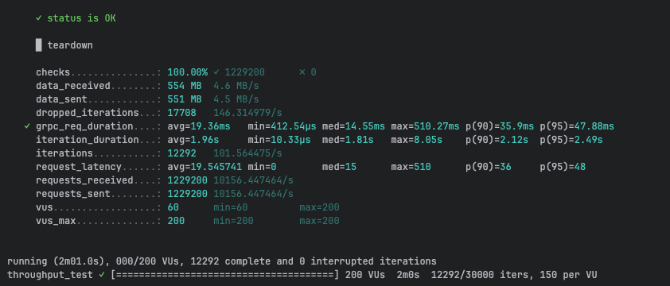
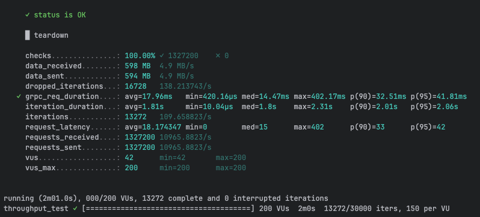

# gRPC Performance Testing - CamelBee Microservice (Quarkus JVM)

This document outlines the configuration, setup, and performance test results for a CamelBee-generated gRPC microservice running on Quarkus JVM.

## Microservice Creation

The microservice was created using the [CamelBee Initializer](https://www.camelbee.io) with the following configuration:

- **Interface**: gRPC (unary RPC)
- **Runtime**: Quarkus
- **Backend**: MOCK (no external dependencies)

After generating and downloading the microservice from CamelBee, apply the following configurations for optimal performance testing.

## Configuration

### Application Configuration

After creating the microservice, update the `application.yml` with the following settings to disable all interceptors:

```yaml
camelbee:
  # when enabled registers the CamelBee event notifier to the Camel context
  notifier-enabled: false
  # when enabled configures stream caching, MDC logging and CamelBeeUnitOfWork for routes
  route-configurer-enabled: false
  # when enabled it allows the CamelBee WebGL application to fetch the topology of the Camel Context
  context-enabled: false
  # when enabled intercepts/traces request and responses of all camel components and caches messages
  tracer-enabled: false
  # maximum time the tracer can remain idle before deactivation tracing of messages
  tracer-max-idle-time: 60000
  # maximum collected trace messages
  tracer-max-messages-count: 10000
  # when enabled it logs the messages exchanged between endpoints
  logging-enabled: false
```

### Docker Compose Configuration

Update the CPU allocation in `docker-compose.yml` to **2 cores** for optimal performance:

```yaml
deploy:
  resources:
    limits:
      cpus: '2'      # Updated from default to 2 cores
      memory: 1G
    reservations:
      cpus: '1'
      memory: 1G
```

> **Note**: Increasing the CPU limit to 2 cores significantly improves throughput and allows the microservice to handle higher concurrent loads efficiently.

## Build and Deployment

### Build Steps

```bash
# Package the application (skip tests for faster build)
./mvnw package -DskipTests

# Start the Docker container
docker compose up --build -d
```

## Performance Testing

### Test Setup

- **Tool**: k6 load testing tool
- **Test File**: `grpc-throughput-test.js` (located in `docs/k6/grpc/`)
- **VUs (Virtual Users)**: 200
- **Duration**: 2 minutes per run
- **Warm-up**: 2 test runs to ensure JVM optimization, 3rd run for final results

### Test Execution

```bash
cd docs/k6/grpc
k6 run grpc-throughput-test.js
```

## Performance Results

### Run 1 - Initial Warm-up

```
Duration: 2m01.0s
✓ checks...............: 100.00% ✓ 1,229,200  ✗ 0
  data_received........: 554 MB  4.6 MB/s
  data_sent............: 551 MB  4.5 MB/s
  dropped_iterations...: 17,708  146.31/s
✓ grpc_req_duration....: avg=19.36ms  min=412.54µs  med=14.55ms  max=510.27ms
                         p(90)=35.9ms  p(95)=47.88ms
  iteration_duration...: avg=1.96s    min=10.33µs   med=1.81s    max=8.05s
  iterations...........: 12,292   101.56/s
  requests_received....: 1,229,200  10,156.45/s
  requests_sent........: 1,229,200  10,156.45/s
```

**Throughput**: ~10,156 requests/second

**Screenshot of the result:**



---

### Run 2 - JVM Optimization Phase

```
Duration: 2m01.0s
✓ checks...............: 100.00% ✓ 1,332,100  ✗ 0
  data_received........: 600 MB  5.0 MB/s
  data_sent............: 596 MB  4.9 MB/s
  dropped_iterations...: 16,679  137.85/s
✓ grpc_req_duration....: avg=17.9ms   min=357.08µs  med=14.3ms   max=146.41ms
                         p(90)=33.4ms  p(95)=42.96ms
  iteration_duration...: avg=1.81s    min=8.79µs    med=1.8s     max=2.34s
  iterations...........: 13,321   110.10/s
  requests_received....: 1,332,100  11,009.64/s
  requests_sent........: 1,332,100  11,009.64/s
```

**Throughput**: ~11,010 requests/second
**Improvement**: +8.4% from Run 1

**Screenshot of the result:**


---

### Run 3 - Optimized Performance

```
Duration: 2m01.0s
✓ checks...............: 100.00% ✓ 1,327,200  ✗ 0
  data_received........: 598 MB  4.9 MB/s
  data_sent............: 594 MB  4.9 MB/s
  dropped_iterations...: 16,728  138.21/s
✓ grpc_req_duration....: avg=17.96ms  min=420.16µs  med=14.47ms  max=402.17ms
                         p(90)=32.51ms  p(95)=41.81ms
  iteration_duration...: avg=1.81s    min=10.04µs   med=1.8s     max=2.31s
  iterations...........: 13,272   109.66/s
  requests_received....: 1,327,200  10,965.88/s
  requests_sent........: 1,327,200  10,965.88/s
```

**Throughput**: ~10,966 requests/second
**Improvement**: +8.0% from Run 1

**Screenshot of the result:**



---

## Performance Summary

| Metric | Run 1 | Run 2 | Run 3 |
|--------|-------|-------|-------|
| **Throughput (req/s)** | 10,156 | 11,010 | 10,966 |
| **Avg Latency (ms)** | 19.36 | 17.9 | 17.96 |
| **Median Latency (ms)** | 14.55 | 14.3 | 14.47 |
| **P90 Latency (ms)** | 35.9 | 33.4 | 32.51 |
| **P95 Latency (ms)** | 47.88 | 42.96 | 41.81 |
| **Max Latency (ms)** | 510.27 | 146.41 | 402.17 |
| **Total Requests** | 1,229,200 | 1,332,100 | 1,327,200 |
| **Success Rate** | 100% | 100% | 100% |

## Key Observations

1. **JVM Warm-up Effect**: Performance improved by ~8% after initial warm-up, demonstrating effective JIT compilation
2. **High Throughput**: Achieved stable ~11K requests/second after warm-up
3. **Low Latency**: Median latency consistently around 14-15ms
4. **Zero Failures**: 100% success rate across all test runs
5. **Quarkus Efficiency**: Quarkus JVM demonstrates excellent performance with low resource overhead

## Container Resource Usage

During the performance tests, the container exhibited the following resource utilization patterns:

- **CPU Usage**: Peak at ~220% (utilizing 2 CPU cores effectively), averaging ~0.39% during idle periods
- **Memory Usage**: Stable at ~633.1MB out of 1GB allocated (63.3% utilization)
- **Disk Read/Write**: 0B read / 446KB write
- **Network I/O**: 2.71GB received / 2.39GB sent across all three test runs

The CPU graph shows three clear spikes corresponding to each test run, demonstrating efficient utilization of the allocated resources. Memory usage remained stable throughout at a lower footprint compared to Spring Boot, indicating Quarkus's efficiency. The lower memory usage (~633MB vs ~757MB) demonstrates Quarkus's optimized resource consumption.

**Screenshot of Docker container statistics:**


## Recommendations

1. **Production Deployment**: Disable all CamelBee interceptors as shown in the configuration for optimal performance
2. **Resource Allocation**: 2 CPU cores and 1GB memory provides excellent performance for this workload
3. **Warm-up Strategy**: Perform at least 2 warm-up runs before measuring production performance
4. **Monitoring**: Track P95 and P99 latencies in production to catch performance degradation early
5. **Memory Efficiency**: Quarkus JVM uses ~16% less memory than Spring Boot while maintaining similar throughput

## Quarkus vs Spring Boot Comparison

| Metric | Quarkus JVM | Spring Boot | Difference |
|--------|-------------|-------------|------------|
| **Peak Throughput (req/s)** | 11,010 | 10,208 | +7.9% |
| **Avg Latency (ms)** | 17.9 | 19.31 | -7.3% (better) |
| **Memory Usage (MB)** | 633 | 757 | -16.4% (better) |
| **Startup Behavior** | Faster warm-up | Gradual optimization | Quarkus advantage |

## Environment

- **Runtime**: Quarkus JVM with Apache Camel
- **Protocol**: gRPC (unary RPC)
- **Container**: Docker
- **Resource Limits**: 2 CPUs, 1GB memory
- **Test Load**: 200 concurrent virtual users
