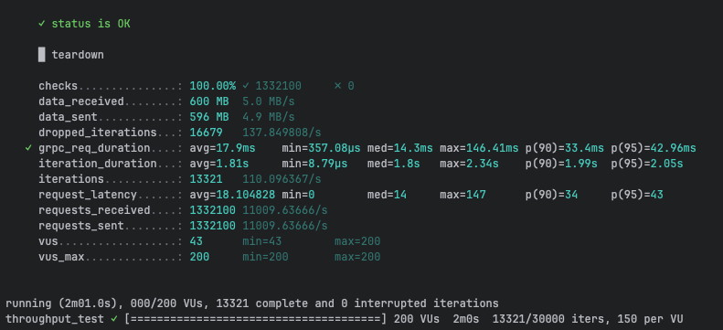
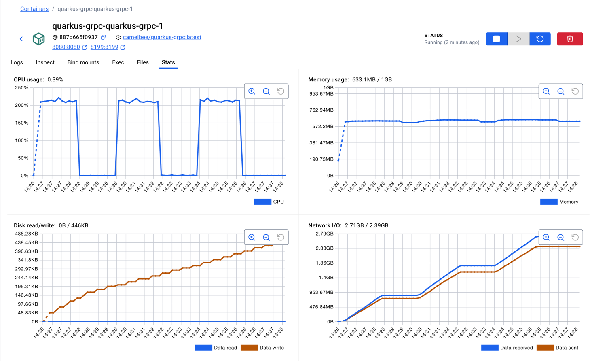

NOTE after creating the micreoservoce update the application yaml like below, set all the interceptors to false

camelbee:
# when enabled registers the CamelBee event notifier to the Camel context
notifier-enabled: false
# when enabled configures stream caching, MDC logging and CamelBeeUnitOfWork for routes
route-configurer-enabled: false
# when enabled it allows the CamelBe WebGL application to fetch the topology of the Camel Context.
context-enabled: false
# when enabled intercepts/traces request and responses of all camel components and caches messages.
tracer-enabled: false
# maximum time the tracer can remain idle before deactivation tracing of messages.
tracer-max-idle-time: 60000
# maximum collected trace messages
tracer-max-messages-count: 10000
# when enabled it logs the messages exchanged between endpoints
logging-enabled: false

and in docker compoes: updated CPU as 2

    deploy:
      resources:
        limits:
          cpus: '2'
          memory: 1G
        reservations:
          cpus: '1'
          memory: 1G

./mvnw package -DskipTests

docker compose up --build -d

and then ran the 
k6 run grpc-ttt.js  2 time to get the jvm warmed up the third run cloocedted the results:

first run:

grpc % k6 run grpc-throughput-test.js

     ✓ status is OK

     █ teardown

     checks...............: 100.00% ✓ 1229200      ✗ 0    
     data_received........: 554 MB  4.6 MB/s
     data_sent............: 551 MB  4.5 MB/s
     dropped_iterations...: 17708   146.314979/s
✓ grpc_req_duration....: avg=19.36ms   min=412.54µs med=14.55ms max=510.27ms p(90)=35.9ms p(95)=47.88ms
iteration_duration...: avg=1.96s     min=10.33µs  med=1.81s   max=8.05s    p(90)=2.12s  p(95)=2.49s  
iterations...........: 12292   101.564475/s
request_latency......: avg=19.545741 min=0        med=15      max=510      p(90)=36     p(95)=48     
requests_received....: 1229200 10156.447464/s
requests_sent........: 1229200 10156.447464/s
vus..................: 60      min=60         max=200
vus_max..............: 200     min=200        max=200

running (2m01.0s), 000/200 VUs, 12292 complete and 0 interrupted iterations
throughput_test ✓ [======================================] 200 VUs  2m0s  12292/30000 iters, 150 per VU

second run

grpc % k6 run grpc-throughput-test.js

     ✓ status is OK

     █ teardown

     checks...............: 100.00% ✓ 1332100     ✗ 0    
     data_received........: 600 MB  5.0 MB/s
     data_sent............: 596 MB  4.9 MB/s
     dropped_iterations...: 16679   137.849808/s
✓ grpc_req_duration....: avg=17.9ms    min=357.08µs med=14.3ms max=146.41ms p(90)=33.4ms p(95)=42.96ms
iteration_duration...: avg=1.81s     min=8.79µs   med=1.8s   max=2.34s    p(90)=1.99s  p(95)=2.05s  
iterations...........: 13321   110.096367/s
request_latency......: avg=18.104828 min=0        med=14     max=147      p(90)=34     p(95)=43     
requests_received....: 1332100 11009.63666/s
requests_sent........: 1332100 11009.63666/s
vus..................: 43      min=43        max=200
vus_max..............: 200     min=200       max=200

running (2m01.0s), 000/200 VUs, 13321 complete and 0 interrupted iterations
throughput_test ✓ [======================================] 200 VUs  2m0s  13321/30000 iters, 150 per VU

third run:

     ✓ status is OK

     █ teardown

     checks...............: 100.00% ✓ 1327200    ✗ 0    
     data_received........: 598 MB  4.9 MB/s
     data_sent............: 594 MB  4.9 MB/s
     dropped_iterations...: 16728   138.213743/s
✓ grpc_req_duration....: avg=17.96ms   min=420.16µs med=14.47ms max=402.17ms p(90)=32.51ms p(95)=41.81ms
iteration_duration...: avg=1.81s     min=10.04µs  med=1.8s    max=2.31s    p(90)=2.01s   p(95)=2.06s  
iterations...........: 13272   109.658823/s
request_latency......: avg=18.174347 min=0        med=15      max=402      p(90)=33      p(95)=42     
requests_received....: 1327200 10965.8823/s
requests_sent........: 1327200 10965.8823/s
vus..................: 42      min=42       max=200
vus_max..............: 200     min=200      max=200

running (2m01.0s), 000/200 VUs, 13272 complete and 0 interrupted iterations
throughput_test ✓ [======================================] 200 VUs  2m0s  13272/30000 iters, 150 per VU

full docker container stas in 3 runs:

