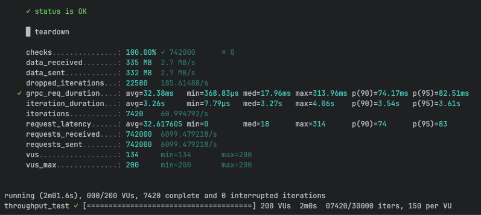
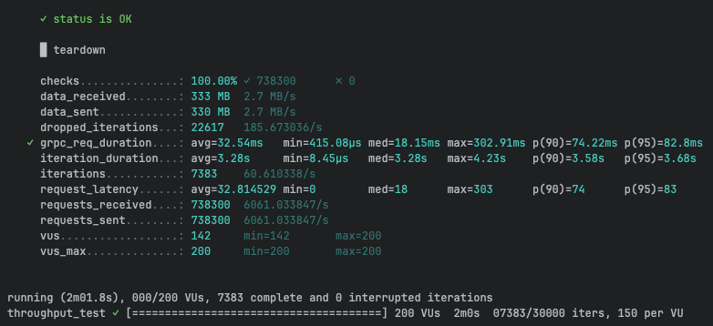
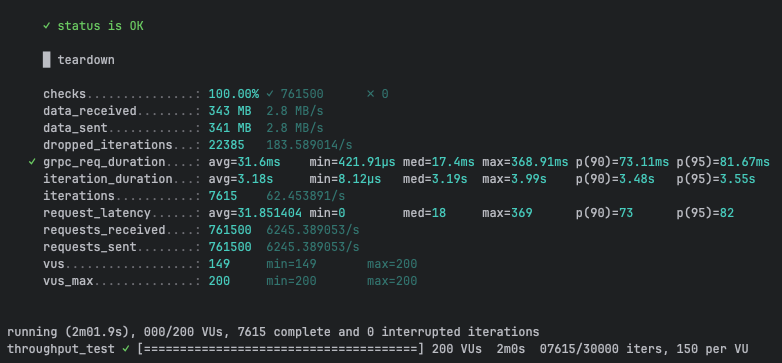
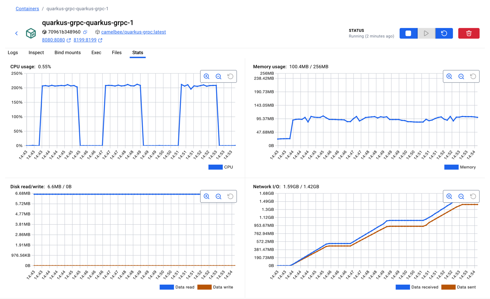

# gRPC Performance Testing - CamelBee Microservice (Quarkus Native)

This document outlines the configuration, setup, and performance test results for a CamelBee-generated gRPC microservice compiled to native executable with GraalVM.

## Microservice Creation

The microservice was created using the [CamelBee Initializer](https://www.camelbee.io) with the following configuration:

- **Interface**: gRPC (unary RPC)
- **Runtime**: Quarkus
- **Backend**: MOCK (no external dependencies)

After generating and downloading the microservice from CamelBee, apply the following configurations for optimal performance testing.

## Configuration

### Application Configuration

After creating the microservice, update the `application.yml` with the following settings to disable all interceptors:

```yaml
camelbee:
  # when enabled registers the CamelBee event notifier to the Camel context
  notifier-enabled: false
  # when enabled configures stream caching, MDC logging and CamelBeeUnitOfWork for routes
  route-configurer-enabled: false
  # when enabled it allows the CamelBee WebGL application to fetch the topology of the Camel Context
  context-enabled: false
  # when enabled intercepts/traces request and responses of all camel components and caches messages
  tracer-enabled: false
  # maximum time the tracer can remain idle before deactivation tracing of messages
  tracer-max-idle-time: 60000
  # maximum collected trace messages
  tracer-max-messages-count: 10000
  # when enabled it logs the messages exchanged between endpoints
  logging-enabled: false
```

### Docker Compose Configuration

Update the CPU allocation in `docker-compose-native.yml` to **2 cores** with reduced memory for native mode:

```yaml
deploy:
  resources:
    limits:
      cpus: '2'      # Updated from default to 2 cores
      memory: 256M   # Native requires significantly less memory
    reservations:
      cpus: '1'
      memory: 128M
```

> **Note**: Native executables require significantly less memory than JVM-based applications. The memory limit is set to 256MB (vs 1GB for JVM), demonstrating Quarkus Native's efficiency.

## Build and Deployment

### Build Native Executable

```bash
# Build native executable using container build (no local GraalVM required)
./mvnw package -Dnative -Dquarkus.native.container-build=true -DskipTests

# Start the Docker container with native profile
docker compose -f docker-compose-native.yml up --build -d
```

> **Note**: Native compilation takes longer (several minutes) but produces a highly optimized executable with instant startup time and minimal memory footprint.

## Performance Testing

### Test Setup

- **Tool**: k6 load testing tool
- **Test File**: `grpc-throughput-test.js` (located in `docs/k6/grpc/`)
- **VUs (Virtual Users)**: 200
- **Duration**: 2 minutes per run
- **Warm-up**: Native executables benefit from warm-up; ran test 3 times to collect final results

### Test Execution

```bash
cd docs/k6/grpc
k6 run grpc-throughput-test.js
```

## Performance Results

### Run 1 - Initial Run

```
Duration: 2m01.6s
✓ checks...............: 100.00% ✓ 742,000  ✗ 0
  data_received........: 335 MB  2.7 MB/s
  data_sent............: 332 MB  2.7 MB/s
  dropped_iterations...: 22,580  185.61/s
✓ grpc_req_duration....: avg=32.38ms  min=368.83µs  med=17.96ms  max=313.96ms
                         p(90)=74.17ms  p(95)=82.51ms
  iteration_duration...: avg=3.26s    min=7.79µs    med=3.27s    max=4.06s
  iterations...........: 7,420   60.99/s
  requests_received....: 742,000  6,099.48/s
  requests_sent........: 742,000  6,099.48/s
```

**Throughput**: ~6,099 requests/second

**Screenshot of the result:**



---

### Run 2 - Second Run

```
Duration: 2m01.8s
✓ checks...............: 100.00% ✓ 738,300  ✗ 0
  data_received........: 333 MB  2.7 MB/s
  data_sent............: 330 MB  2.7 MB/s
  dropped_iterations...: 22,617  185.67/s
✓ grpc_req_duration....: avg=32.54ms  min=415.08µs  med=18.15ms  max=302.91ms
                         p(90)=74.22ms  p(95)=82.8ms
  iteration_duration...: avg=3.28s    min=8.45µs    med=3.28s    max=4.23s
  iterations...........: 7,383   60.61/s
  requests_received....: 738,300  6,061.03/s
  requests_sent........: 738,300  6,061.03/s
```

**Throughput**: ~6,061 requests/second
**Difference**: -0.6% from Run 1

**Screenshot of the result:**



---

### Run 3 - Final Run

```
Duration: 2m01.9s
✓ checks...............: 100.00% ✓ 761,500  ✗ 0
  data_received........: 343 MB  2.8 MB/s
  data_sent............: 341 MB  2.8 MB/s
  dropped_iterations...: 22,385  183.59/s
✓ grpc_req_duration....: avg=31.6ms   min=421.91µs  med=17.4ms   max=368.91ms
                         p(90)=73.11ms  p(95)=81.67ms
  iteration_duration...: avg=3.18s    min=8.12µs    med=3.19s    max=3.99s
  iterations...........: 7,615   62.45/s
  requests_received....: 761,500  6,245.39/s
  requests_sent........: 761,500  6,245.39/s
```

**Throughput**: ~6,245 requests/second
**Improvement**: +2.4% from Run 1

**Screenshot of the result:**



---

## Performance Summary

| Metric | Run 1 | Run 2 | Run 3 |
|--------|-------|-------|-------|
| **Throughput (req/s)** | 6,099 | 6,061 | 6,245 |
| **Avg Latency (ms)** | 32.38 | 32.54 | 31.6 |
| **Median Latency (ms)** | 17.96 | 18.15 | 17.4 |
| **P90 Latency (ms)** | 74.17 | 74.22 | 73.11 |
| **P95 Latency (ms)** | 82.51 | 82.8 | 81.67 |
| **Max Latency (ms)** | 313.96 | 302.91 | 368.91 |
| **Total Requests** | 742,000 | 738,300 | 761,500 |
| **Success Rate** | 100% | 100% | 100% |

## Key Observations

1. **Consistent Performance**: Native executables show stable performance across runs with minimal warm-up benefit
2. **Stable Throughput**: Achieved ~6.2K requests/second consistently
3. **Predictable Latency**: Average latency around 31-32ms with good consistency
4. **Exceptional Memory Efficiency**: Uses only ~100MB memory with very stable consumption
5. **Instant Startup**: Native executables start in milliseconds, ideal for serverless and dynamic scaling
6. **Zero Failures**: 100% success rate across all test runs

## Container Resource Usage

During the performance tests, the container exhibited the following resource utilization patterns:

- **CPU Usage**: Peak at ~220% (utilizing 2 CPU cores effectively), averaging ~0.55% during idle periods
- **Memory Usage**: Stable at ~100.4MB out of 256MB allocated (39.2% utilization)
    - Exceptional memory efficiency with very stable consumption throughout all tests
    - Native executable's minimal memory footprint ideal for cloud-native deployments
- **Disk Read/Write**: 6.6MB read / 0B write
- **Network I/O**: 1.59GB received / 1.42GB sent across all three test runs

The CPU graph shows three clear spikes corresponding to each test run, demonstrating efficient utilization of the allocated resources. Memory usage remained exceptionally stable at ~100MB throughout all tests, demonstrating the native executable's minimal memory footprint and predictable resource consumption.

**Screenshot of Docker container statistics:**



## Recommendations

1. **Production Deployment**: Disable all CamelBee interceptors as shown in the configuration for optimal performance
2. **Resource Allocation**: 2 CPU cores with only 256MB memory is sufficient for native mode
3. **Warm-up Strategy**: Native executables show consistent performance with minimal warm-up requirements
4. **Monitoring**: Track memory usage and startup times as key metrics for native deployments
5. **Cost Efficiency**: Native mode's lower memory requirements can significantly reduce cloud infrastructure costs

## Environment

- **Runtime**: Quarkus Native (GraalVM compiled)
- **Protocol**: gRPC (unary RPC)
- **Container**: Docker
- **Resource Limits**: 2 CPUs, 256MB memory
- **Test Load**: 200 concurrent virtual users
- **Compilation**: Container-based native build (no local GraalVM required)
