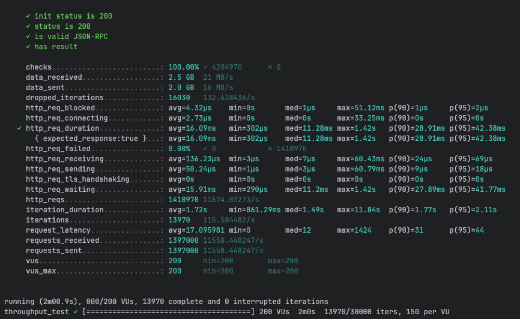
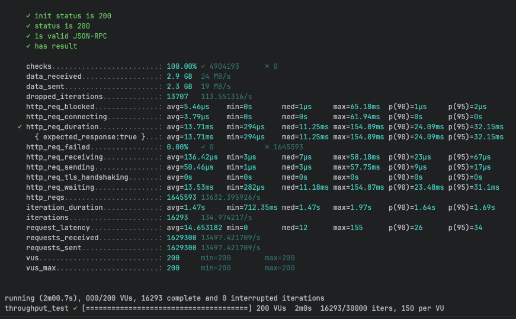
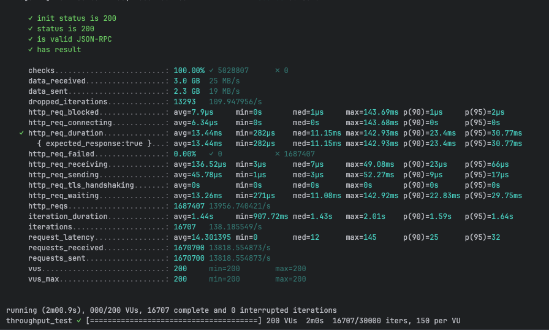
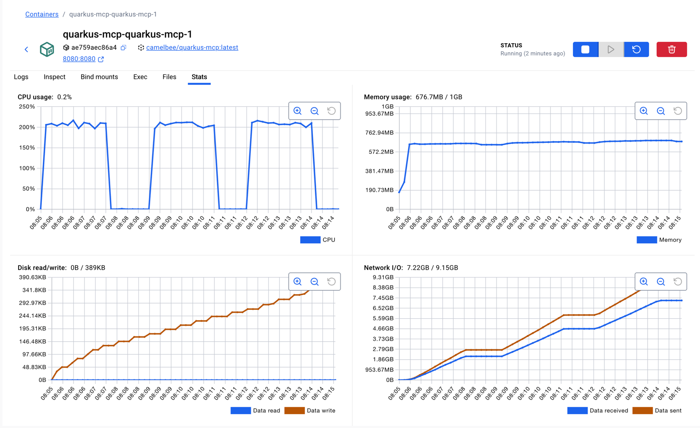

# MCP Performance Testing - CamelBee Microservice (Quarkus JVM)

This document outlines the configuration, setup, and performance test results for a CamelBee-generated MCP microservice running on Quarkus JVM.

## Microservice Creation

The microservice was created using the [CamelBee Initializer](https://www.camelbee.io) with the following configuration:

- **Interface**: MCP (Model Context Protocol)
- **Runtime**: Quarkus
- **Backend**: MOCK (no external dependencies)

After generating and downloading the microservice from CamelBee, apply the following configurations for optimal performance testing.

## Configuration

### Application Configuration

After creating the microservice, update the `application.yml` with the following settings to disable all interceptors:

```yaml
camelbee:
  # when enabled registers the CamelBee event notifier to the Camel context
  notifier-enabled: false
  # when enabled configures stream caching, MDC logging and CamelBeeUnitOfWork for routes
  route-configurer-enabled: false
  # when enabled it allows the CamelBee WebGL application to fetch the topology of the Camel Context
  context-enabled: false
  # when enabled intercepts/traces request and responses of all camel components and caches messages
  tracer-enabled: false
  # maximum time the tracer can remain idle before deactivation tracing of messages
  tracer-max-idle-time: 60000
  # maximum collected trace messages
  tracer-max-messages-count: 10000
  # when enabled it logs the messages exchanged between endpoints
  logging-enabled: false
```

> **Note**: The `McpTools.java` class contains three test configurations. For this test, **Test 3 (MCP Tool + MapStruct + Apache Camel)** is active — the MCP tool call goes through a MapStruct DTO mapping (`mcpToDomainOrder` → `domainToMcpOrder`) and is routed through Apache Camel. Tests 1 and 2 are commented out.

```java 
@Tool(description = "Create a new order with customer details, product information, and shipping preferences")
Order createOrder(
@ToolArg(description = "Order object containing salesChannel, items with productName, quantity, and price") Order order,
@ToolArg(description = "Client-generated correlation ID for distributed tracing and logging", required = false) String transactionId,
@ToolArg(description = "Business process correlation ID for end-to-end transaction tracing across systems", required = false) String businessTransactionId
) {

        var result = fluentProducerTemplate
            .to("direct:mcpCreateOrder")
            .withHeader("transactionId", transactionId)
            .withBody(order)
            .send();

        if (result.getMessage().getBody() instanceof ToolCallException) {
          throw result.getMessage().getBody(ToolCallException.class);
        } else {
          return result.getMessage().getBody(Order.class);
        }

}
```

### Docker Compose Configuration

Update the CPU allocation in `docker-compose.yml` to **2 cores** for optimal performance:

```yaml
deploy:
  resources:
    limits:
      cpus: '2'      # Updated from default to 2 cores
      memory: 1G
    reservations:
      cpus: '1'
      memory: 1G
```

> **Note**: Increasing the CPU limit to 2 cores significantly improves throughput and allows the microservice to handle higher concurrent loads efficiently.

## Build and Deployment

### Build Steps

```bash
# Package the application (skip tests for faster build)
./mvnw package -DskipTests

# Start the Docker container
docker compose up --build -d
```

## Performance Testing

### Test Setup

- **Tool**: k6 load testing tool
- **Test File**: `mcp-throughput-test.js` (located in `docs/k6/mcp/`)
- **VUs (Virtual Users)**: 200
- **Duration**: 2 minutes per run
- **Warm-up**: 2 test runs to ensure JVM optimization, 3rd run for final results

### Test Execution

```bash
cd docs/k6/mcp
k6 run mcp-throughput-test.js
```

## Performance Results

### Run 1 - Initial Warm-up

```

     ✓ init status is 200
     ✓ status is 200
     ✓ is valid JSON-RPC
     ✓ has result

     checks.........................: 100.00% ✓ 4204970      ✗ 0      
     data_received..................: 2.5 GB  21 MB/s
     data_sent......................: 2.0 GB  16 MB/s
     dropped_iterations.............: 16030   132.628436/s
     http_req_blocked...............: avg=4.32µs    min=0s       med=1µs     max=51.12ms p(90)=1µs     p(95)=2µs    
     http_req_connecting............: avg=2.73µs    min=0s       med=0s      max=33.25ms p(90)=0s      p(95)=0s     
   ✓ http_req_duration..............: avg=16.09ms   min=302µs    med=11.28ms max=1.42s   p(90)=28.91ms p(95)=42.38ms
       { expected_response:true }...: avg=16.09ms   min=302µs    med=11.28ms max=1.42s   p(90)=28.91ms p(95)=42.38ms
     http_req_failed................: 0.00%   ✓ 0            ✗ 1410970
     http_req_receiving.............: avg=136.23µs  min=3µs      med=7µs     max=60.43ms p(90)=24µs    p(95)=69µs   
     http_req_sending...............: avg=50.24µs   min=1µs      med=3µs     max=60.79ms p(90)=9µs     p(95)=18µs   
     http_req_tls_handshaking.......: avg=0s        min=0s       med=0s      max=0s      p(90)=0s      p(95)=0s     
     http_req_waiting...............: avg=15.91ms   min=290µs    med=11.2ms  max=1.42s   p(90)=27.89ms p(95)=41.77ms
     http_reqs......................: 1410970 11674.03273/s
     iteration_duration.............: avg=1.72s     min=861.29ms med=1.49s   max=11.84s  p(90)=1.77s   p(95)=2.11s  
     iterations.....................: 13970   115.584482/s
     request_latency................: avg=17.095981 min=0        med=12      max=1424    p(90)=31      p(95)=44     
     requests_received..............: 1397000 11558.448247/s
     requests_sent..................: 1397000 11558.448247/s
     vus............................: 200     min=200        max=200  
     vus_max........................: 200     min=200        max=200  


running (2m00.9s), 000/200 VUs, 13970 complete and 0 interrupted iterations
throughput_test ✓ [======================================] 200 VUs  2m0s  13970/30000 iters, 150 per VU
```

**Throughput**: ~11,674 req/s

**Screenshot of the result:**



---

### Run 2 - JVM Optimization Phase

```

     ✓ init status is 200
     ✓ status is 200
     ✓ is valid JSON-RPC
     ✓ has result

     checks.........................: 100.00% ✓ 4904193      ✗ 0      
     data_received..................: 2.9 GB  24 MB/s
     data_sent......................: 2.3 GB  19 MB/s
     dropped_iterations.............: 13707   113.551316/s
     http_req_blocked...............: avg=5.46µs    min=0s       med=1µs     max=65.18ms  p(90)=1µs     p(95)=2µs    
     http_req_connecting............: avg=3.79µs    min=0s       med=0s      max=61.94ms  p(90)=0s      p(95)=0s     
   ✓ http_req_duration..............: avg=13.71ms   min=294µs    med=11.25ms max=154.89ms p(90)=24.09ms p(95)=32.15ms
       { expected_response:true }...: avg=13.71ms   min=294µs    med=11.25ms max=154.89ms p(90)=24.09ms p(95)=32.15ms
     http_req_failed................: 0.00%   ✓ 0            ✗ 1645593
     http_req_receiving.............: avg=136.42µs  min=3µs      med=7µs     max=58.18ms  p(90)=23µs    p(95)=67µs   
     http_req_sending...............: avg=50.46µs   min=1µs      med=3µs     max=57.75ms  p(90)=9µs     p(95)=17µs   
     http_req_tls_handshaking.......: avg=0s        min=0s       med=0s      max=0s       p(90)=0s      p(95)=0s     
     http_req_waiting...............: avg=13.53ms   min=282µs    med=11.18ms max=154.87ms p(90)=23.48ms p(95)=31.1ms 
     http_reqs......................: 1645593 13632.395926/s
     iteration_duration.............: avg=1.47s     min=712.35ms med=1.47s   max=1.97s    p(90)=1.64s   p(95)=1.69s  
     iterations.....................: 16293   134.974217/s
     request_latency................: avg=14.653182 min=0        med=12      max=155      p(90)=26      p(95)=34     
     requests_received..............: 1629300 13497.421709/s
     requests_sent..................: 1629300 13497.421709/s
     vus............................: 200     min=200        max=200  
     vus_max........................: 200     min=200        max=200  


running (2m00.7s), 000/200 VUs, 16293 complete and 0 interrupted iterations
throughput_test ✓ [======================================] 200 VUs  2m0s  16293/30000 iters, 150 per VU
```

**Throughput**: ~13,632 req/s
**Improvement**: +16.8% over Run 1

**Screenshot of the result:**



---

### Run 3 - Optimized Performance

```

     ✓ init status is 200
     ✓ status is 200
     ✓ is valid JSON-RPC
     ✓ has result

     checks.........................: 100.00% ✓ 5028807      ✗ 0      
     data_received..................: 3.0 GB  25 MB/s
     data_sent......................: 2.3 GB  19 MB/s
     dropped_iterations.............: 13293   109.947956/s
     http_req_blocked...............: avg=7.9µs     min=0s       med=1µs     max=143.69ms p(90)=1µs     p(95)=2µs    
     http_req_connecting............: avg=6.34µs    min=0s       med=0s      max=143.68ms p(90)=0s      p(95)=0s     
   ✓ http_req_duration..............: avg=13.44ms   min=282µs    med=11.15ms max=142.93ms p(90)=23.4ms  p(95)=30.77ms
       { expected_response:true }...: avg=13.44ms   min=282µs    med=11.15ms max=142.93ms p(90)=23.4ms  p(95)=30.77ms
     http_req_failed................: 0.00%   ✓ 0            ✗ 1687407
     http_req_receiving.............: avg=136.52µs  min=3µs      med=7µs     max=49.08ms  p(90)=23µs    p(95)=66µs   
     http_req_sending...............: avg=45.78µs   min=1µs      med=3µs     max=52.27ms  p(90)=9µs     p(95)=17µs   
     http_req_tls_handshaking.......: avg=0s        min=0s       med=0s      max=0s       p(90)=0s      p(95)=0s     
     http_req_waiting...............: avg=13.26ms   min=271µs    med=11.08ms max=142.92ms p(90)=22.83ms p(95)=29.75ms
     http_reqs......................: 1687407 13956.740421/s
     iteration_duration.............: avg=1.44s     min=907.72ms med=1.43s   max=2.01s    p(90)=1.59s   p(95)=1.64s  
     iterations.....................: 16707   138.185549/s
     request_latency................: avg=14.301395 min=0        med=12      max=145      p(90)=25      p(95)=32     
     requests_received..............: 1670700 13818.554873/s
     requests_sent..................: 1670700 13818.554873/s
     vus............................: 200     min=200        max=200  
     vus_max........................: 200     min=200        max=200  


running (2m00.9s), 000/200 VUs, 16707 complete and 0 interrupted iterations
throughput_test ✓ [======================================] 200 VUs  2m0s  16707/30000 iters, 150 per VU
```

**Throughput**: ~13,957 req/s
**Improvement**: +19.6% over Run 1, +2.4% over Run 2

**Screenshot of the result:**



---

## Performance Summary

| Metric | Run 1 | Run 2 | Run 3 |
|--------|-------|-------|-------|
| **Throughput (req/s)** | 11,674 | 13,632 | 13,957 |
| **Avg Latency (ms)** | 16.09 | 13.71 | 13.44 |
| **Median Latency (ms)** | 11.28 | 11.25 | 11.15 |
| **P90 Latency (ms)** | 28.91 | 24.09 | 23.40 |
| **P95 Latency (ms)** | 42.38 | 32.15 | 30.77 |
| **Max Latency (ms)** | 1,420 | 154.89 | 142.93 |
| **Total Requests** | 1,410,970 | 1,645,593 | 1,687,407 |
| **Success Rate** | 100% | 100% | 100% |

## Key Observations

1. **JVM Warm-up Effect**: Performance improved by ~19.6% after initial warm-up, demonstrating effective JIT compilation
2. **High Throughput**: Achieved stable ~13,957 requests/second after warm-up
3. **Low Latency**: Median latency consistently around 11ms
4. **Zero Failures**: 100% success rate across all test runs
5. **Quarkus Efficiency**: Quarkus JVM demonstrates excellent performance with low resource overhead

## Container Resource Usage

During the performance tests, the container exhibited the following resource utilization patterns:

- **CPU Usage**: Peaked at ~200% (fully utilizing both allocated cores) during each test run, dropping to ~0.2% at idle between runs
- **Memory Usage**: 676.7MB / 1GB — stabilized at ~651MB after warm-up, with gradual step increases during the first two runs before leveling off
- **Disk Read/Write**: 0B read / 389KB write — minimal disk writes (likely logging) accumulating across test runs, with zero disk reads confirming fully in-memory processing
- **Network I/O**: 7.22GB received / 9.15GB sent — cumulative across all three test runs

The CPU graph shows three clear spikes corresponding to each test run, demonstrating efficient utilization of the allocated resources. Memory usage remained stable throughout, indicating no memory leaks or excessive garbage collection pressure.

**Screenshot of Docker container statistics:**



## Recommendations

1. **Production Deployment**: Disable all CamelBee interceptors as shown in the configuration for optimal performance
2. **Resource Allocation**: 2 CPU cores and 1GB memory provides excellent performance for this workload
3. **Warm-up Strategy**: Perform at least 2 warm-up runs before measuring production performance
4. **Monitoring**: Track P95 and P99 latencies in production to catch performance degradation early
5. **Memory Efficiency**: Quarkus JVM demonstrates efficient resource consumption at ~676MB for high-throughput workloads

## Environment

- **Runtime**: Quarkus JVM with Apache Camel
- **Protocol**: MCP
- **Container**: Docker
- **Resource Limits**: 2 CPUs, 1GB memory
- **Test Load**: 200 concurrent virtual users
