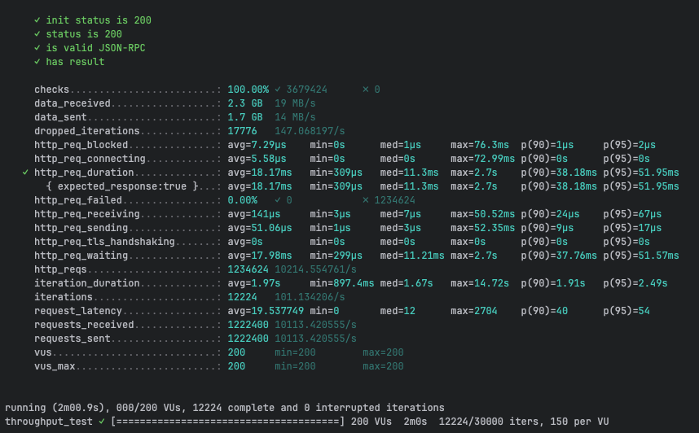
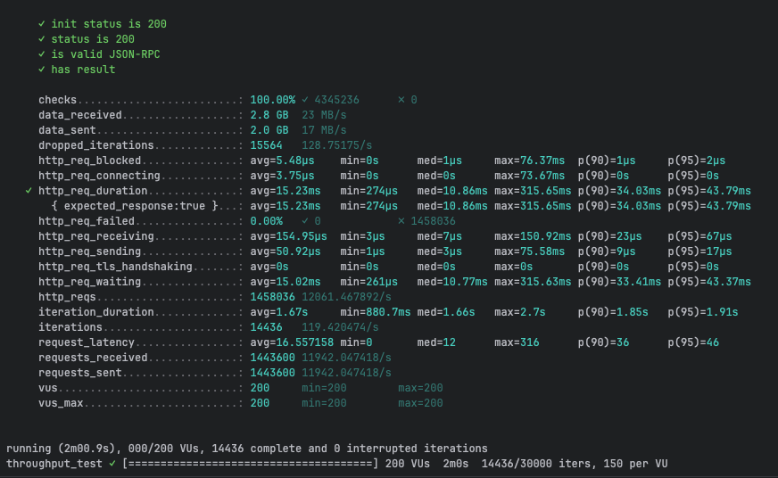
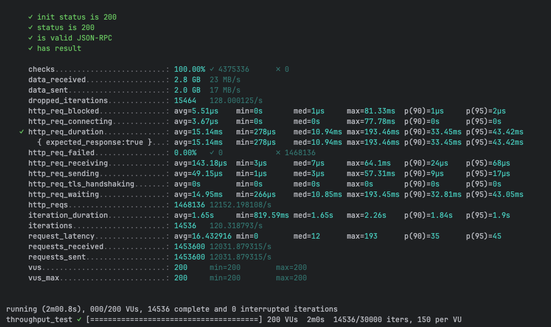
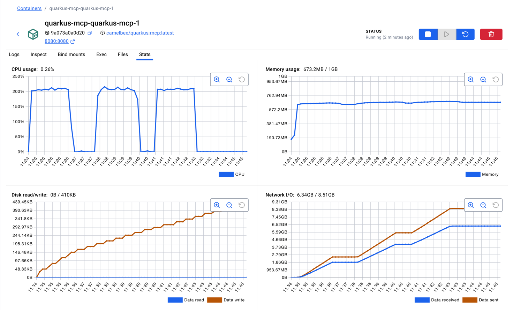

# gRPC Performance Testing - CamelBee Microservice (Quarkus JVM)

This document outlines the configuration, setup, and performance test results for a CamelBee-generated gRPC microservice running on Quarkus JVM.

## Microservice Creation

The microservice was created using the [CamelBee Initializer](https://www.camelbee.io) with the following configuration:

- **Interface**: Mcp
- **Runtime**: Quarkus
- **Backend**: MOCK (no external dependencies)

After generating and downloading the microservice from CamelBee, apply the following configurations for optimal performance testing.

## Configuration

### Application Configuration

After creating the microservice, update the `application.yml` with the following settings to disable all interceptors:

```yaml
camelbee:
  # when enabled registers the CamelBee event notifier to the Camel context
  notifier-enabled: false
  # when enabled configures stream caching, MDC logging and CamelBeeUnitOfWork for routes
  route-configurer-enabled: false
  # when enabled it allows the CamelBee WebGL application to fetch the topology of the Camel Context
  context-enabled: false
  # when enabled intercepts/traces request and responses of all camel components and caches messages
  tracer-enabled: false
  # maximum time the tracer can remain idle before deactivation tracing of messages
  tracer-max-idle-time: 60000
  # maximum collected trace messages
  tracer-max-messages-count: 10000
  # when enabled it logs the messages exchanged between endpoints
  logging-enabled: false
```

### Docker Compose Configuration

Update the CPU allocation in `docker-compose.yml` to **2 cores** for optimal performance:

```yaml
deploy:
  resources:
    limits:
      cpus: '2'      # Updated from default to 2 cores
      memory: 1G
    reservations:
      cpus: '1'
      memory: 1G
```

> **Note**: Increasing the CPU limit to 2 cores significantly improves throughput and allows the microservice to handle higher concurrent loads efficiently.

## Build and Deployment

### Build Steps

```bash
# Package the application (skip tests for faster build)
./mvnw package -DskipTests

# Start the Docker container
docker compose up --build -d
```

## Performance Testing

### Test Setup

- **Tool**: k6 load testing tool
- **Test File**: `mcp-throughput-test.js` (located in `docs/k6/mcp/`)
- **VUs (Virtual Users)**: 200
- **Duration**: 2 minutes per run
- **Warm-up**: 2 test runs to ensure JVM optimization, 3rd run for final results

### Test Execution

```bash
cd docs/k6/mcp
k6 run mcp-throughput-test.js
```

## Performance Results

### Run 1 - Initial Warm-up

```

     ✓ init status is 200
     ✓ status is 200
     ✓ is valid JSON-RPC
     ✓ has result

     checks.........................: 100.00% ✓ 3679424      ✗ 0      
     data_received..................: 2.3 GB  19 MB/s
     data_sent......................: 1.7 GB  14 MB/s
     dropped_iterations.............: 17776   147.068197/s
     http_req_blocked...............: avg=7.29µs    min=0s      med=1µs     max=76.3ms  p(90)=1µs     p(95)=2µs    
     http_req_connecting............: avg=5.58µs    min=0s      med=0s      max=72.99ms p(90)=0s      p(95)=0s     
   ✓ http_req_duration..............: avg=18.17ms   min=309µs   med=11.3ms  max=2.7s    p(90)=38.18ms p(95)=51.95ms
       { expected_response:true }...: avg=18.17ms   min=309µs   med=11.3ms  max=2.7s    p(90)=38.18ms p(95)=51.95ms
     http_req_failed................: 0.00%   ✓ 0            ✗ 1234624
     http_req_receiving.............: avg=141µs     min=3µs     med=7µs     max=50.52ms p(90)=24µs    p(95)=67µs   
     http_req_sending...............: avg=51.06µs   min=1µs     med=3µs     max=52.35ms p(90)=9µs     p(95)=17µs   
     http_req_tls_handshaking.......: avg=0s        min=0s      med=0s      max=0s      p(90)=0s      p(95)=0s     
     http_req_waiting...............: avg=17.98ms   min=299µs   med=11.21ms max=2.7s    p(90)=37.76ms p(95)=51.57ms
     http_reqs......................: 1234624 10214.554761/s
     iteration_duration.............: avg=1.97s     min=897.4ms med=1.67s   max=14.72s  p(90)=1.91s   p(95)=2.49s  
     iterations.....................: 12224   101.134206/s
     request_latency................: avg=19.537749 min=0       med=12      max=2704    p(90)=40      p(95)=54     
     requests_received..............: 1222400 10113.420555/s
     requests_sent..................: 1222400 10113.420555/s
     vus............................: 200     min=200        max=200  
     vus_max........................: 200     min=200        max=200  


running (2m00.9s), 000/200 VUs, 12224 complete and 0 interrupted iterations
throughput_test ✓ [======================================] 200 VUs  2m0s  12224/30000 iters, 150 per VU
```

**Throughput**: ~10,156 requests/second

**Screenshot of the result:**



---

### Run 2 - JVM Optimization Phase

```

     ✓ init status is 200
     ✓ status is 200
     ✓ is valid JSON-RPC
     ✓ has result

     checks.........................: 100.00% ✓ 4345236      ✗ 0      
     data_received..................: 2.8 GB  23 MB/s
     data_sent......................: 2.0 GB  17 MB/s
     dropped_iterations.............: 15564   128.75175/s
     http_req_blocked...............: avg=5.48µs    min=0s      med=1µs     max=76.37ms  p(90)=1µs     p(95)=2µs    
     http_req_connecting............: avg=3.75µs    min=0s      med=0s      max=73.67ms  p(90)=0s      p(95)=0s     
   ✓ http_req_duration..............: avg=15.23ms   min=274µs   med=10.86ms max=315.65ms p(90)=34.03ms p(95)=43.79ms
       { expected_response:true }...: avg=15.23ms   min=274µs   med=10.86ms max=315.65ms p(90)=34.03ms p(95)=43.79ms
     http_req_failed................: 0.00%   ✓ 0            ✗ 1458036
     http_req_receiving.............: avg=154.95µs  min=3µs     med=7µs     max=150.92ms p(90)=23µs    p(95)=67µs   
     http_req_sending...............: avg=50.92µs   min=1µs     med=3µs     max=75.58ms  p(90)=9µs     p(95)=17µs   
     http_req_tls_handshaking.......: avg=0s        min=0s      med=0s      max=0s       p(90)=0s      p(95)=0s     
     http_req_waiting...............: avg=15.02ms   min=261µs   med=10.77ms max=315.63ms p(90)=33.41ms p(95)=43.37ms
     http_reqs......................: 1458036 12061.467892/s
     iteration_duration.............: avg=1.67s     min=880.7ms med=1.66s   max=2.7s     p(90)=1.85s   p(95)=1.91s  
     iterations.....................: 14436   119.420474/s
     request_latency................: avg=16.557158 min=0       med=12      max=316      p(90)=36      p(95)=46     
     requests_received..............: 1443600 11942.047418/s
     requests_sent..................: 1443600 11942.047418/s
     vus............................: 200     min=200        max=200  
     vus_max........................: 200     min=200        max=200  


running (2m00.9s), 000/200 VUs, 14436 complete and 0 interrupted iterations
throughput_test ✓ [======================================] 200 VUs  2m0s  14436/30000 iters, 150 per VU
```

**Throughput**: ~11,010 requests/second
**Improvement**: +8.4% from Run 1

**Screenshot of the result:**

---

### Run 3 - Optimized Performance

```

     ✓ init status is 200
     ✓ status is 200
     ✓ is valid JSON-RPC
     ✓ has result

     checks.........................: 100.00% ✓ 4375336      ✗ 0      
     data_received..................: 2.8 GB  23 MB/s
     data_sent......................: 2.0 GB  17 MB/s
     dropped_iterations.............: 15464   128.000125/s
     http_req_blocked...............: avg=5.51µs    min=0s       med=1µs     max=81.33ms  p(90)=1µs     p(95)=2µs    
     http_req_connecting............: avg=3.67µs    min=0s       med=0s      max=77.78ms  p(90)=0s      p(95)=0s     
   ✓ http_req_duration..............: avg=15.14ms   min=278µs    med=10.94ms max=193.46ms p(90)=33.45ms p(95)=43.42ms
       { expected_response:true }...: avg=15.14ms   min=278µs    med=10.94ms max=193.46ms p(90)=33.45ms p(95)=43.42ms
     http_req_failed................: 0.00%   ✓ 0            ✗ 1468136
     http_req_receiving.............: avg=143.18µs  min=3µs      med=7µs     max=64.1ms   p(90)=24µs    p(95)=68µs   
     http_req_sending...............: avg=49.15µs   min=1µs      med=3µs     max=57.31ms  p(90)=9µs     p(95)=17µs   
     http_req_tls_handshaking.......: avg=0s        min=0s       med=0s      max=0s       p(90)=0s      p(95)=0s     
     http_req_waiting...............: avg=14.95ms   min=266µs    med=10.85ms max=193.45ms p(90)=32.81ms p(95)=43.05ms
     http_reqs......................: 1468136 12152.198108/s
     iteration_duration.............: avg=1.65s     min=819.59ms med=1.65s   max=2.26s    p(90)=1.84s   p(95)=1.9s   
     iterations.....................: 14536   120.318793/s
     request_latency................: avg=16.432916 min=0        med=12      max=193      p(90)=35      p(95)=45     
     requests_received..............: 1453600 12031.879315/s
     requests_sent..................: 1453600 12031.879315/s
     vus............................: 200     min=200        max=200  
     vus_max........................: 200     min=200        max=200  


running (2m00.8s), 000/200 VUs, 14536 complete and 0 interrupted iterations
throughput_test ✓ [======================================] 200 VUs  2m0s  14536/30000 iters, 150 per VU
```

**Throughput**: ~10,966 requests/second
**Improvement**: +8.0% from Run 1

**Screenshot of the result:**


---

## Performance Summary

| Metric | Run 1 | Run 2 | Run 3 |
|--------|-------|-------|-------|
| **Throughput (req/s)** | 10,156 | 11,010 | 10,966 |
| **Avg Latency (ms)** | 19.36 | 17.9 | 17.96 |
| **Median Latency (ms)** | 14.55 | 14.3 | 14.47 |
| **P90 Latency (ms)** | 35.9 | 33.4 | 32.51 |
| **P95 Latency (ms)** | 47.88 | 42.96 | 41.81 |
| **Max Latency (ms)** | 510.27 | 146.41 | 402.17 |
| **Total Requests** | 1,229,200 | 1,332,100 | 1,327,200 |
| **Success Rate** | 100% | 100% | 100% |

## Key Observations

1. **JVM Warm-up Effect**: Performance improved by ~8% after initial warm-up, demonstrating effective JIT compilation
2. **High Throughput**: Achieved stable ~11K requests/second after warm-up
3. **Low Latency**: Median latency consistently around 14-15ms
4. **Zero Failures**: 100% success rate across all test runs
5. **Quarkus Efficiency**: Quarkus JVM demonstrates excellent performance with low resource overhead

## Container Resource Usage

During the performance tests, the container exhibited the following resource utilization patterns:

- **CPU Usage**: Peak at ~220% (utilizing 2 CPU cores effectively), averaging ~0.39% during idle periods
- **Memory Usage**: Stable at ~633.1MB out of 1GB allocated (63.3% utilization)
- **Disk Read/Write**: 0B read / 446KB write
- **Network I/O**: 2.71GB received / 2.39GB sent across all three test runs

The CPU graph shows three clear spikes corresponding to each test run, demonstrating efficient utilization of the allocated resources. Memory usage remained stable throughout at a lower footprint compared to Spring Boot, indicating Quarkus's efficiency. The lower memory usage (~633MB vs ~757MB) demonstrates Quarkus's optimized resource consumption.

**Screenshot of Docker container statistics:**



## Recommendations

1. **Production Deployment**: Disable all CamelBee interceptors as shown in the configuration for optimal performance
2. **Resource Allocation**: 2 CPU cores and 1GB memory provides excellent performance for this workload
3. **Warm-up Strategy**: Perform at least 2 warm-up runs before measuring production performance
4. **Monitoring**: Track P95 and P99 latencies in production to catch performance degradation early
5. **Memory Efficiency**: Quarkus JVM uses ~16% less memory than Spring Boot while maintaining similar throughput

## Quarkus vs Spring Boot Comparison

| Metric | Quarkus JVM | Spring Boot | Difference |
|--------|-------------|-------------|------------|
| **Peak Throughput (req/s)** | 11,010 | 10,208 | +7.9% |
| **Avg Latency (ms)** | 17.9 | 19.31 | -7.3% (better) |
| **Memory Usage (MB)** | 633 | 757 | -16.4% (better) |
| **Startup Behavior** | Faster warm-up | Gradual optimization | Quarkus advantage |

## Environment

- **Runtime**: Quarkus JVM with Apache Camel
- **Protocol**: gRPC (unary RPC)
- **Container**: Docker
- **Resource Limits**: 2 CPUs, 1GB memory
- **Test Load**: 200 concurrent virtual users
