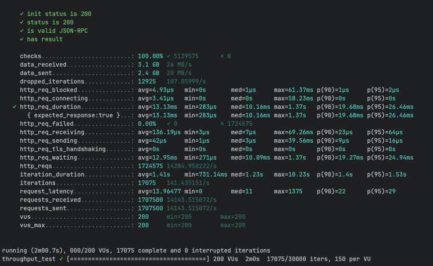
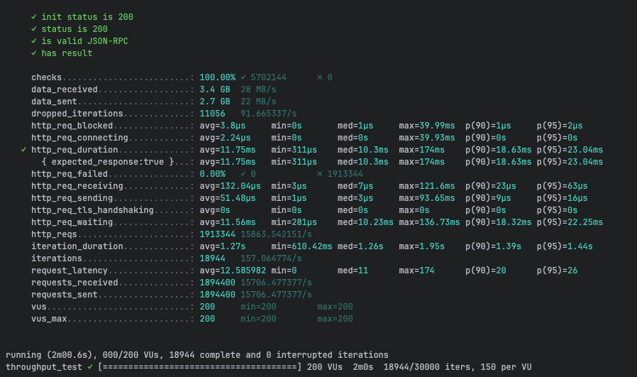
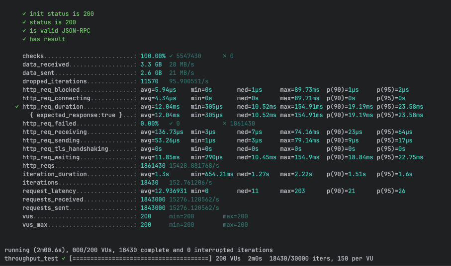
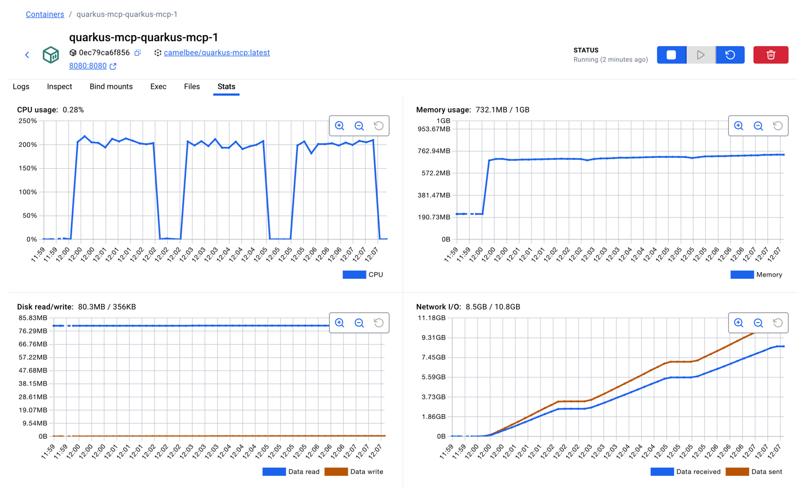

# MCP Performance Testing - CamelBee Microservice (Quarkus JVM)

This document outlines the configuration, setup, and performance test results for a CamelBee-generated MCP microservice running on Quarkus JVM.

## Microservice Creation

The microservice was created using the [CamelBee Initializer](https://www.camelbee.io) with the following configuration:

- **Interface**: MCP (Model Context Protocol)
- **Runtime**: Quarkus
- **Backend**: MOCK (no external dependencies)

After generating and downloading the microservice from CamelBee, apply the following configurations for optimal performance testing.

## Configuration

### Application Configuration

After creating the microservice, update the `application.yml` with the following settings to disable all interceptors:

```yaml
camelbee:
  # when enabled registers the CamelBee event notifier to the Camel context
  notifier-enabled: false
  # when enabled configures stream caching, MDC logging and CamelBeeUnitOfWork for routes
  route-configurer-enabled: false
  # when enabled it allows the CamelBee WebGL application to fetch the topology of the Camel Context
  context-enabled: false
  # when enabled intercepts/traces request and responses of all camel components and caches messages
  tracer-enabled: false
  # maximum time the tracer can remain idle before deactivation tracing of messages
  tracer-max-idle-time: 60000
  # maximum collected trace messages
  tracer-max-messages-count: 10000
  # when enabled it logs the messages exchanged between endpoints
  logging-enabled: false
```

> **Note**: The `McpTools.java` class contains three test configurations. For this test, **Test 2 (MCP Tool + MapStruct)** is active — the MCP tool call goes through a MapStruct DTO mapping (`mcpToDomainOrder` → `domainToMcpOrder`) without involving Apache Camel. Tests 1 and 3 are commented out.

```java 
@Tool(description = "Create a new order with customer details, product information, and shipping preferences")
Order createOrder(
@ToolArg(description = "Order object containing salesChannel, items with productName, quantity, and price") Order order,
@ToolArg(description = "Client-generated correlation ID for distributed tracing and logging", required = false) String transactionId,
@ToolArg(description = "Business process correlation ID for end-to-end transaction tracing across systems", required = false) String businessTransactionId
) {

    com.mycompany.model.domain.Order domainOrder = mcpOrderMapper.mcpToDomainOrder(order);
    domainOrder.setId("1");
    return mcpOrderMapper.domainToMcpOrder(domainOrder);

}
```

### Docker Compose Configuration

Update the CPU allocation in `docker-compose.yml` to **2 cores** for optimal performance:

```yaml
deploy:
  resources:
    limits:
      cpus: '2'      # Updated from default to 2 cores
      memory: 1G
    reservations:
      cpus: '1'
      memory: 1G
```

> **Note**: Increasing the CPU limit to 2 cores significantly improves throughput and allows the microservice to handle higher concurrent loads efficiently.

## Build and Deployment

### Build Steps

```bash
# Package the application (skip tests for faster build)
./mvnw package -DskipTests

# Start the Docker container
docker compose up --build -d
```

## Performance Testing

### Test Setup

- **Tool**: k6 load testing tool
- **Test File**: `mcp-throughput-test.js` (located in `docs/k6/mcp/`)
- **VUs (Virtual Users)**: 200
- **Duration**: 2 minutes per run
- **Warm-up**: 2 test runs to ensure JVM optimization, 3rd run for final results

### Test Execution

```bash
cd docs/k6/mcp
k6 run mcp-throughput-test.js
```

## Performance Results

### Run 1 - Initial Warm-up

```

     ✓ init status is 200
     ✓ status is 200
     ✓ is valid JSON-RPC
     ✓ has result

     checks.........................: 100.00% ✓ 5139575      ✗ 0      
     data_received..................: 3.1 GB  26 MB/s
     data_sent......................: 2.4 GB  20 MB/s
     dropped_iterations.............: 12925   107.05999/s
     http_req_blocked...............: avg=4.93µs   min=0s       med=1µs     max=61.37ms p(90)=1µs     p(95)=2µs    
     http_req_connecting............: avg=3.41µs   min=0s       med=0s      max=58.23ms p(90)=0s      p(95)=0s     
   ✓ http_req_duration..............: avg=13.13ms  min=283µs    med=10.16ms max=1.37s   p(90)=19.68ms p(95)=26.46ms
       { expected_response:true }...: avg=13.13ms  min=283µs    med=10.16ms max=1.37s   p(90)=19.68ms p(95)=26.46ms
     http_req_failed................: 0.00%   ✓ 0            ✗ 1724575
     http_req_receiving.............: avg=136.19µs min=3µs      med=7µs     max=69.26ms p(90)=23µs    p(95)=64µs   
     http_req_sending...............: avg=42µs     min=1µs      med=3µs     max=39.56ms p(90)=9µs     p(95)=16µs   
     http_req_tls_handshaking.......: avg=0s       min=0s       med=0s      max=0s      p(90)=0s      p(95)=0s     
     http_req_waiting...............: avg=12.95ms  min=271µs    med=10.09ms max=1.37s   p(90)=19.27ms p(95)=24.94ms
     http_reqs......................: 1724575 14284.950222/s
     iteration_duration.............: avg=1.41s    min=731.14ms med=1.23s   max=10.23s  p(90)=1.4s    p(95)=1.53s  
     iterations.....................: 17075   141.435151/s
     request_latency................: avg=13.96477 min=0        med=11      max=1375    p(90)=22      p(95)=29     
     requests_received..............: 1707500 14143.515072/s
     requests_sent..................: 1707500 14143.515072/s
     vus............................: 200     min=200        max=200  
     vus_max........................: 200     min=200        max=200  


running (2m00.7s), 000/200 VUs, 17075 complete and 0 interrupted iterations
throughput_test ✓ [======================================] 200 VUs  2m0s  17075/30000 iters, 150 per VU
```

**Throughput**: ~14,285 req/s

**Screenshot of the result:**



---

### Run 2 - JVM Optimization Phase

```

     ✓ init status is 200
     ✓ status is 200
     ✓ is valid JSON-RPC
     ✓ has result

     checks.........................: 100.00% ✓ 5702144      ✗ 0      
     data_received..................: 3.4 GB  28 MB/s
     data_sent......................: 2.7 GB  22 MB/s
     dropped_iterations.............: 11056   91.665337/s
     http_req_blocked...............: avg=3.8µs     min=0s       med=1µs     max=39.99ms  p(90)=1µs     p(95)=2µs    
     http_req_connecting............: avg=2.24µs    min=0s       med=0s      max=39.93ms  p(90)=0s      p(95)=0s     
   ✓ http_req_duration..............: avg=11.75ms   min=311µs    med=10.3ms  max=174ms    p(90)=18.63ms p(95)=23.04ms
       { expected_response:true }...: avg=11.75ms   min=311µs    med=10.3ms  max=174ms    p(90)=18.63ms p(95)=23.04ms
     http_req_failed................: 0.00%   ✓ 0            ✗ 1913344
     http_req_receiving.............: avg=132.04µs  min=3µs      med=7µs     max=121.6ms  p(90)=23µs    p(95)=63µs   
     http_req_sending...............: avg=51.48µs   min=1µs      med=3µs     max=93.65ms  p(90)=9µs     p(95)=16µs   
     http_req_tls_handshaking.......: avg=0s        min=0s       med=0s      max=0s       p(90)=0s      p(95)=0s     
     http_req_waiting...............: avg=11.56ms   min=281µs    med=10.23ms max=136.73ms p(90)=18.32ms p(95)=22.25ms
     http_reqs......................: 1913344 15863.542151/s
     iteration_duration.............: avg=1.27s     min=610.42ms med=1.26s   max=1.95s    p(90)=1.39s   p(95)=1.44s  
     iterations.....................: 18944   157.064774/s
     request_latency................: avg=12.585982 min=0        med=11      max=174      p(90)=20      p(95)=26     
     requests_received..............: 1894400 15706.477377/s
     requests_sent..................: 1894400 15706.477377/s
     vus............................: 200     min=200        max=200  
     vus_max........................: 200     min=200        max=200  


running (2m00.6s), 000/200 VUs, 18944 complete and 0 interrupted iterations
throughput_test ✓ [======================================] 200 VUs  2m0s  18944/30000 iters, 150 per VU
```

**Throughput**: ~15,864 req/s
**Improvement**: +11.1% over Run 1

**Screenshot of the result:**



---

### Run 3 - Optimized Performance

```

     ✓ init status is 200
     ✓ status is 200
     ✓ is valid JSON-RPC
     ✓ has result

     checks.........................: 100.00% ✓ 5547430      ✗ 0      
     data_received..................: 3.3 GB  28 MB/s
     data_sent......................: 2.6 GB  21 MB/s
     dropped_iterations.............: 11570   95.900551/s
     http_req_blocked...............: avg=5.94µs    min=0s       med=1µs     max=89.73ms  p(90)=1µs     p(95)=2µs    
     http_req_connecting............: avg=4.34µs    min=0s       med=0s      max=89.71ms  p(90)=0s      p(95)=0s     
   ✓ http_req_duration..............: avg=12.04ms   min=305µs    med=10.52ms max=154.91ms p(90)=19.19ms p(95)=23.58ms
       { expected_response:true }...: avg=12.04ms   min=305µs    med=10.52ms max=154.91ms p(90)=19.19ms p(95)=23.58ms
     http_req_failed................: 0.00%   ✓ 0            ✗ 1861430
     http_req_receiving.............: avg=136.73µs  min=3µs      med=7µs     max=74.16ms  p(90)=23µs    p(95)=64µs   
     http_req_sending...............: avg=53.26µs   min=1µs      med=3µs     max=79.14ms  p(90)=9µs     p(95)=17µs   
     http_req_tls_handshaking.......: avg=0s        min=0s       med=0s      max=0s       p(90)=0s      p(95)=0s     
     http_req_waiting...............: avg=11.85ms   min=290µs    med=10.45ms max=154.9ms  p(90)=18.84ms p(95)=22.75ms
     http_reqs......................: 1861430 15428.881768/s
     iteration_duration.............: avg=1.3s      min=654.21ms med=1.27s   max=2.22s    p(90)=1.51s   p(95)=1.6s   
     iterations.....................: 18430   152.761206/s
     request_latency................: avg=12.936931 min=0        med=11      max=203      p(90)=21      p(95)=26     
     requests_received..............: 1843000 15276.120562/s
     requests_sent..................: 1843000 15276.120562/s
     vus............................: 200     min=200        max=200  
     vus_max........................: 200     min=200        max=200  


running (2m00.6s), 000/200 VUs, 18430 complete and 0 interrupted iterations
throughput_test ✓ [======================================] 200 VUs  2m0s  18430/30000 iters, 150 per VU

```

**Throughput**: ~15,429 req/s
**Improvement**: +8.0% over Run 1, -2.7% vs Run 2

**Screenshot of the result:**


---

## Performance Summary

| Metric | Run 1 | Run 2 | Run 3 |
|--------|-------|-------|-------|
| **Throughput (req/s)** | 14,285 | 15,864 | 15,429 |
| **Avg Latency (ms)** | 13.13 | 11.75 | 12.04 |
| **Median Latency (ms)** | 10.16 | 10.30 | 10.52 |
| **P90 Latency (ms)** | 19.68 | 18.63 | 19.19 |
| **P95 Latency (ms)** | 26.46 | 23.04 | 23.58 |
| **Max Latency (ms)** | 1,370 | 174 | 154.91 |
| **Total Requests** | 1,724,575 | 1,913,344 | 1,861,430 |
| **Success Rate** | 100% | 100% | 100% |

## Key Observations

1. **JVM Warm-up Effect**: Performance improved by ~11% after initial warm-up, demonstrating effective JIT compilation
2. **High Throughput**: Achieved peak ~15.9K requests/second at Run 2, with Run 3 showing slight variance at ~15.4K
3. **Low Latency**: Median latency consistently around 10ms
4. **Zero Failures**: 100% success rate across all test runs
5. **Quarkus Efficiency**: Quarkus JVM demonstrates excellent performance with low resource overhead

## Container Resource Usage

During the performance tests, the container exhibited the following resource utilization patterns:

- **CPU Usage**: Peaked at ~200% (fully utilizing both allocated cores) during each test run, dropping to ~0.28% at idle between runs
- **Memory Usage**: 732.1MB / 1GB — stabilized at ~732MB after warm-up, with gradual step increases visible during the first two runs before leveling off
- **Disk Read/Write**: 80.3MB read / 356KB write — disk reads occurred at startup (class loading and JAR extraction), with minimal incremental writes during test runs
- **Network I/O**: 8.5GB received / 10.8GB sent cumulative across all three test runs

The CPU graph shows three clear spikes corresponding to each test run, demonstrating efficient utilization of the allocated resources. Memory usage remained stable throughout, indicating no memory leaks or excessive garbage collection pressure.

**Screenshot of Docker container statistics:**



## Recommendations

1. **Production Deployment**: Disable all CamelBee interceptors as shown in the configuration for optimal performance
2. **Resource Allocation**: 2 CPU cores and 1GB memory provides excellent performance for this workload
3. **Warm-up Strategy**: Perform at least 2 warm-up runs before measuring production performance
4. **Monitoring**: Track P95 and P99 latencies in production to catch performance degradation early
5. **Memory Efficiency**: Quarkus JVM demonstrates efficient resource consumption at 732MB for high-throughput workloads

## Environment

- **Runtime**: Quarkus JVM with Apache Camel
- **Protocol**: MCP
- **Container**: Docker
- **Resource Limits**: 2 CPUs, 1GB memory
- **Test Load**: 200 concurrent virtual users
