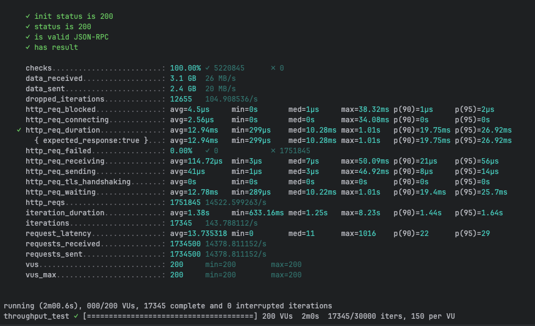
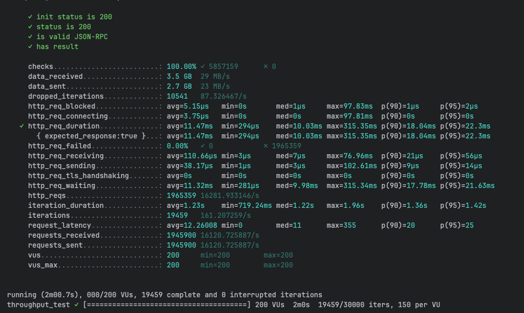
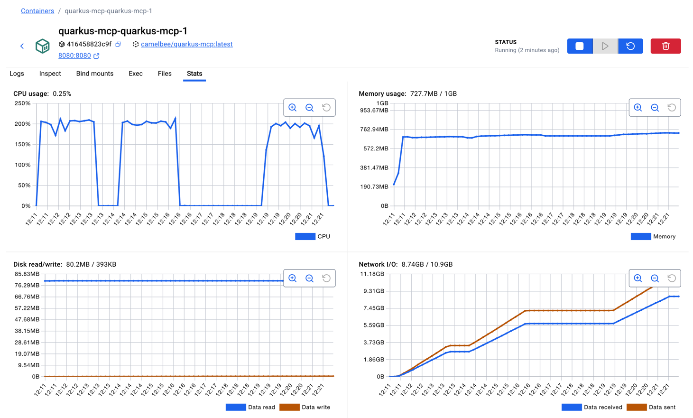
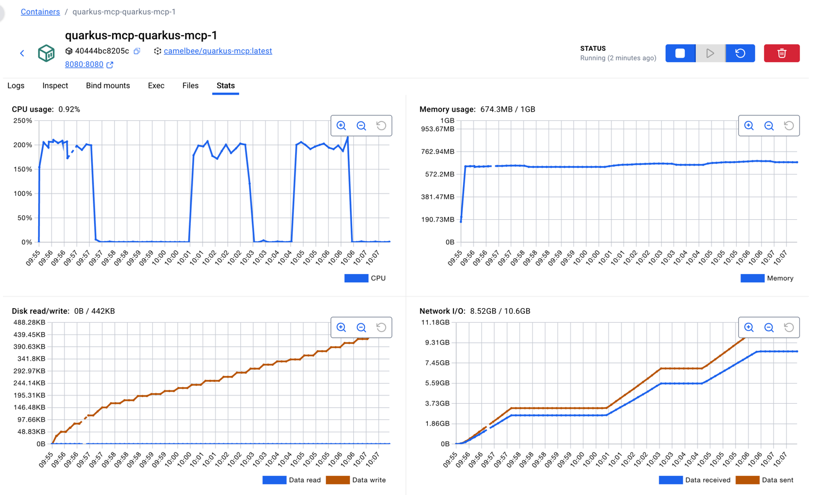

# gRPC Performance Testing - CamelBee Microservice (Quarkus JVM)

This document outlines the configuration, setup, and performance test results for a CamelBee-generated gRPC microservice running on Quarkus JVM.

## Microservice Creation

The microservice was created using the [CamelBee Initializer](https://www.camelbee.io) with the following configuration:

- **Interface**: Mcp
- **Runtime**: Quarkus
- **Backend**: MOCK (no external dependencies)

After generating and downloading the microservice from CamelBee, apply the following configurations for optimal performance testing.

## Configuration

### Application Configuration

After creating the microservice, update the `application.yml` with the following settings to disable all interceptors:

```yaml
camelbee:
  # when enabled registers the CamelBee event notifier to the Camel context
  notifier-enabled: false
  # when enabled configures stream caching, MDC logging and CamelBeeUnitOfWork for routes
  route-configurer-enabled: false
  # when enabled it allows the CamelBee WebGL application to fetch the topology of the Camel Context
  context-enabled: false
  # when enabled intercepts/traces request and responses of all camel components and caches messages
  tracer-enabled: false
  # maximum time the tracer can remain idle before deactivation tracing of messages
  tracer-max-idle-time: 60000
  # maximum collected trace messages
  tracer-max-messages-count: 10000
  # when enabled it logs the messages exchanged between endpoints
  logging-enabled: false
```

### Docker Compose Configuration

Update the CPU allocation in `docker-compose.yml` to **2 cores** for optimal performance:

```yaml
deploy:
  resources:
    limits:
      cpus: '2'      # Updated from default to 2 cores
      memory: 1G
    reservations:
      cpus: '1'
      memory: 1G
```

> **Note**: Increasing the CPU limit to 2 cores significantly improves throughput and allows the microservice to handle higher concurrent loads efficiently.

## Build and Deployment

### Build Steps

```bash
# Package the application (skip tests for faster build)
./mvnw package -DskipTests

# Start the Docker container
docker compose up --build -d
```

## Performance Testing

### Test Setup

- **Tool**: k6 load testing tool
- **Test File**: `mcp-throughput-test.js` (located in `docs/k6/mcp/`)
- **VUs (Virtual Users)**: 200
- **Duration**: 2 minutes per run
- **Warm-up**: 2 test runs to ensure JVM optimization, 3rd run for final results

### Test Execution

```bash
cd docs/k6/mcp
k6 run mcp-throughput-test.js
```

## Performance Results

### Run 1 - Initial Warm-up

```

     ✓ init status is 200
     ✓ status is 200
     ✓ is valid JSON-RPC
     ✓ has result

     checks.........................: 100.00% ✓ 5220845      ✗ 0      
     data_received..................: 3.1 GB  26 MB/s
     data_sent......................: 2.4 GB  20 MB/s
     dropped_iterations.............: 12655   104.908536/s
     http_req_blocked...............: avg=4.5µs     min=0s       med=1µs     max=38.32ms p(90)=1µs     p(95)=2µs    
     http_req_connecting............: avg=2.56µs    min=0s       med=0s      max=34.08ms p(90)=0s      p(95)=0s     
   ✓ http_req_duration..............: avg=12.94ms   min=299µs    med=10.28ms max=1.01s   p(90)=19.75ms p(95)=26.92ms
       { expected_response:true }...: avg=12.94ms   min=299µs    med=10.28ms max=1.01s   p(90)=19.75ms p(95)=26.92ms
     http_req_failed................: 0.00%   ✓ 0            ✗ 1751845
     http_req_receiving.............: avg=114.72µs  min=3µs      med=7µs     max=50.09ms p(90)=21µs    p(95)=56µs   
     http_req_sending...............: avg=41µs      min=1µs      med=3µs     max=46.92ms p(90)=8µs     p(95)=14µs   
     http_req_tls_handshaking.......: avg=0s        min=0s       med=0s      max=0s      p(90)=0s      p(95)=0s     
     http_req_waiting...............: avg=12.78ms   min=289µs    med=10.22ms max=1.01s   p(90)=19.4ms  p(95)=25.7ms 
     http_reqs......................: 1751845 14522.599263/s
     iteration_duration.............: avg=1.38s     min=633.16ms med=1.25s   max=8.23s   p(90)=1.44s   p(95)=1.64s  
     iterations.....................: 17345   143.788112/s
     request_latency................: avg=13.735318 min=0        med=11      max=1016    p(90)=22      p(95)=29     
     requests_received..............: 1734500 14378.811152/s
     requests_sent..................: 1734500 14378.811152/s
     vus............................: 200     min=200        max=200  
     vus_max........................: 200     min=200        max=200  


running (2m00.6s), 000/200 VUs, 17345 complete and 0 interrupted iterations
throughput_test ✓ [======================================] 200 VUs  2m0s  17345/30000 iters, 150 per VU
```

**Throughput**: ~10,156 requests/second

**Screenshot of the result:**



---

### Run 2 - JVM Optimization Phase

```

     ✓ init status is 200
     ✓ status is 200
     ✓ is valid JSON-RPC
     ✓ has result

     checks.........................: 100.00% ✓ 5857159      ✗ 0      
     data_received..................: 3.5 GB  29 MB/s
     data_sent......................: 2.7 GB  23 MB/s
     dropped_iterations.............: 10541   87.326467/s
     http_req_blocked...............: avg=5.15µs   min=0s       med=1µs     max=97.83ms  p(90)=1µs     p(95)=2µs    
     http_req_connecting............: avg=3.75µs   min=0s       med=0s      max=97.81ms  p(90)=0s      p(95)=0s     
   ✓ http_req_duration..............: avg=11.47ms  min=294µs    med=10.03ms max=315.35ms p(90)=18.04ms p(95)=22.3ms 
       { expected_response:true }...: avg=11.47ms  min=294µs    med=10.03ms max=315.35ms p(90)=18.04ms p(95)=22.3ms 
     http_req_failed................: 0.00%   ✓ 0            ✗ 1965359
     http_req_receiving.............: avg=110.66µs min=3µs      med=7µs     max=76.96ms  p(90)=21µs    p(95)=56µs   
     http_req_sending...............: avg=38.17µs  min=1µs      med=3µs     max=102.61ms p(90)=9µs     p(95)=14µs   
     http_req_tls_handshaking.......: avg=0s       min=0s       med=0s      max=0s       p(90)=0s      p(95)=0s     
     http_req_waiting...............: avg=11.32ms  min=281µs    med=9.98ms  max=315.34ms p(90)=17.78ms p(95)=21.63ms
     http_reqs......................: 1965359 16281.933146/s
     iteration_duration.............: avg=1.23s    min=719.24ms med=1.22s   max=1.96s    p(90)=1.36s   p(95)=1.42s  
     iterations.....................: 19459   161.207259/s
     request_latency................: avg=12.26008 min=0        med=11      max=355      p(90)=20      p(95)=25     
     requests_received..............: 1945900 16120.725887/s
     requests_sent..................: 1945900 16120.725887/s
     vus............................: 200     min=200        max=200  
     vus_max........................: 200     min=200        max=200  


running (2m00.7s), 000/200 VUs, 19459 complete and 0 interrupted iterations
throughput_test ✓ [======================================] 200 VUs  2m0s  19459/30000 iters, 150 per VU
```

**Throughput**: ~11,010 requests/second
**Improvement**: +8.4% from Run 1

**Screenshot of the result:**



---

### Run 3 - Optimized Performance

```

     ✓ init status is 200
     ✓ status is 200
     ✓ is valid JSON-RPC
     ✓ has result

     checks.........................: 100.00% ✓ 5895386      ✗ 0      
     data_received..................: 3.5 GB  29 MB/s
     data_sent......................: 2.7 GB  23 MB/s
     dropped_iterations.............: 10414   86.234459/s
     http_req_blocked...............: avg=4.1µs     min=0s       med=1µs    max=74.93ms  p(90)=1µs     p(95)=2µs    
     http_req_connecting............: avg=2.49µs    min=0s       med=0s     max=71.7ms   p(90)=0s      p(95)=0s     
   ✓ http_req_duration..............: avg=11.42ms   min=300µs    med=10ms   max=123.15ms p(90)=18.06ms p(95)=22.36ms
       { expected_response:true }...: avg=11.42ms   min=300µs    med=10ms   max=123.15ms p(90)=18.06ms p(95)=22.36ms
     http_req_failed................: 0.00%   ✓ 0            ✗ 1978186
     http_req_receiving.............: avg=113.03µs  min=3µs      med=7µs    max=54.16ms  p(90)=21µs    p(95)=56µs   
     http_req_sending...............: avg=41.81µs   min=1µs      med=3µs    max=48.15ms  p(90)=9µs     p(95)=14µs   
     http_req_tls_handshaking.......: avg=0s        min=0s       med=0s     max=0s       p(90)=0s      p(95)=0s     
     http_req_waiting...............: avg=11.27ms   min=257µs    med=9.94ms max=123.08ms p(90)=17.8ms  p(95)=21.74ms
     http_reqs......................: 1978186 16380.622175/s
     iteration_duration.............: avg=1.23s     min=754.35ms med=1.22s  max=1.7s     p(90)=1.36s   p(95)=1.4s   
     iterations.....................: 19586   162.184378/s
     request_latency................: avg=12.190068 min=0        med=11     max=150      p(90)=20      p(95)=25     
     requests_received..............: 1958600 16218.437797/s
     requests_sent..................: 1958600 16218.437797/s
     vus............................: 200     min=200        max=200  
     vus_max........................: 200     min=200        max=200  


running (2m00.8s), 000/200 VUs, 19586 complete and 0 interrupted iterations
throughput_test ✓ [======================================] 200 VUs  2m0s  19586/30000 iters, 150 per VU

```

**Throughput**: ~10,966 requests/second
**Improvement**: +8.0% from Run 1

**Screenshot of the result:**


---

## Performance Summary

| Metric | Run 1 | Run 2 | Run 3 |
|--------|-------|-------|-------|
| **Throughput (req/s)** | 10,156 | 11,010 | 10,966 |
| **Avg Latency (ms)** | 19.36 | 17.9 | 17.96 |
| **Median Latency (ms)** | 14.55 | 14.3 | 14.47 |
| **P90 Latency (ms)** | 35.9 | 33.4 | 32.51 |
| **P95 Latency (ms)** | 47.88 | 42.96 | 41.81 |
| **Max Latency (ms)** | 510.27 | 146.41 | 402.17 |
| **Total Requests** | 1,229,200 | 1,332,100 | 1,327,200 |
| **Success Rate** | 100% | 100% | 100% |

## Key Observations

1. **JVM Warm-up Effect**: Performance improved by ~8% after initial warm-up, demonstrating effective JIT compilation
2. **High Throughput**: Achieved stable ~11K requests/second after warm-up
3. **Low Latency**: Median latency consistently around 14-15ms
4. **Zero Failures**: 100% success rate across all test runs
5. **Quarkus Efficiency**: Quarkus JVM demonstrates excellent performance with low resource overhead

## Container Resource Usage

During the performance tests, the container exhibited the following resource utilization patterns:

- **CPU Usage**: Peak at ~220% (utilizing 2 CPU cores effectively), averaging ~0.39% during idle periods
- **Memory Usage**: Stable at ~633.1MB out of 1GB allocated (63.3% utilization)
- **Disk Read/Write**: 0B read / 446KB write
- **Network I/O**: 2.71GB received / 2.39GB sent across all three test runs

The CPU graph shows three clear spikes corresponding to each test run, demonstrating efficient utilization of the allocated resources. Memory usage remained stable throughout at a lower footprint compared to Spring Boot, indicating Quarkus's efficiency. The lower memory usage (~633MB vs ~757MB) demonstrates Quarkus's optimized resource consumption.

**Screenshot of Docker container statistics:**



## Recommendations

1. **Production Deployment**: Disable all CamelBee interceptors as shown in the configuration for optimal performance
2. **Resource Allocation**: 2 CPU cores and 1GB memory provides excellent performance for this workload
3. **Warm-up Strategy**: Perform at least 2 warm-up runs before measuring production performance
4. **Monitoring**: Track P95 and P99 latencies in production to catch performance degradation early
5. **Memory Efficiency**: Quarkus JVM uses ~16% less memory than Spring Boot while maintaining similar throughput

## Quarkus vs Spring Boot Comparison

| Metric | Quarkus JVM | Spring Boot | Difference |
|--------|-------------|-------------|------------|
| **Peak Throughput (req/s)** | 11,010 | 10,208 | +7.9% |
| **Avg Latency (ms)** | 17.9 | 19.31 | -7.3% (better) |
| **Memory Usage (MB)** | 633 | 757 | -16.4% (better) |
| **Startup Behavior** | Faster warm-up | Gradual optimization | Quarkus advantage |

## Environment

- **Runtime**: Quarkus JVM with Apache Camel
- **Protocol**: gRPC (unary RPC)
- **Container**: Docker
- **Resource Limits**: 2 CPUs, 1GB memory
- **Test Load**: 200 concurrent virtual users
