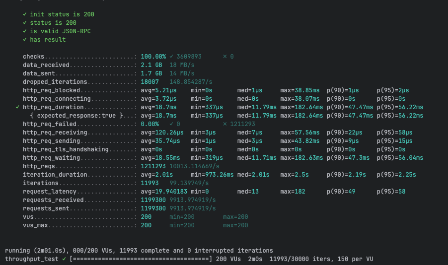
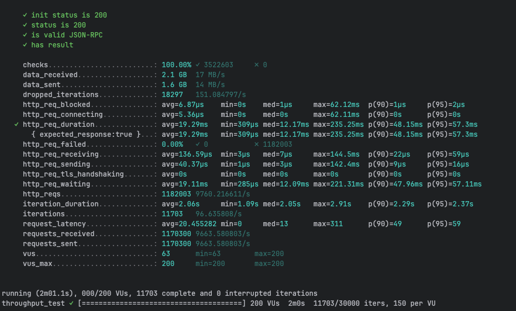
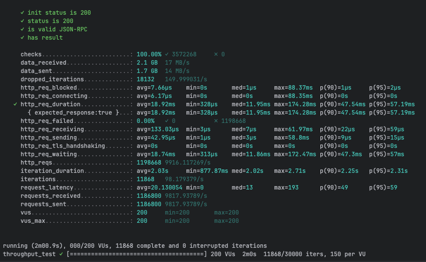
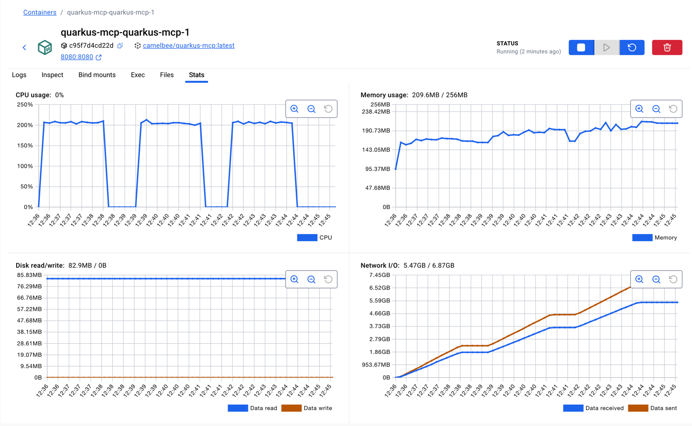

# MCP Performance Testing - CamelBee Microservice (Quarkus Native)

This document outlines the configuration, setup, and performance test results for a CamelBee-generated MCP microservice compiled to native executable with GraalVM.

## Microservice Creation

The microservice was created using the [CamelBee Initializer](https://www.camelbee.io) with the following configuration:

- **Interface**: MCP (Model Context Protocol)
- **Runtime**: Quarkus
- **Backend**: MOCK (no external dependencies)

After generating and downloading the microservice from CamelBee, apply the following configurations for optimal performance testing.

## Configuration

### Application Configuration

After creating the microservice, update the `application.yml` with the following settings to disable all interceptors:

```yaml
camelbee:
  # when enabled registers the CamelBee event notifier to the Camel context
  notifier-enabled: false
  # when enabled configures stream caching, MDC logging and CamelBeeUnitOfWork for routes
  route-configurer-enabled: false
  # when enabled it allows the CamelBee WebGL application to fetch the topology of the Camel Context
  context-enabled: false
  # when enabled intercepts/traces request and responses of all camel components and caches messages
  tracer-enabled: false
  # maximum time the tracer can remain idle before deactivation tracing of messages
  tracer-max-idle-time: 60000
  # maximum collected trace messages
  tracer-max-messages-count: 10000
  # when enabled it logs the messages exchanged between endpoints
  logging-enabled: false
```

> **Note**: The `McpTools.java` class contains three test configurations. For this test, **Test 1 (MCP Tool only)** is active — the MCP tool call is handled directly without MapStruct DTO mapping or Apache Camel. Tests 2 and 3 are commented out.

```java
@Tool(description = "Create a new order with customer details, product information, and shipping preferences")
Order createOrder(
@ToolArg(description = "Order object containing salesChannel, items with productName, quantity, and price") Order order,
@ToolArg(description = "Client-generated correlation ID for distributed tracing and logging", required = false) String transactionId,
@ToolArg(description = "Business process correlation ID for end-to-end transaction tracing across systems", required = false) String businessTransactionId
) {

    Order response = new Order();
    response.setId("1");
    response.setSalesChannel(order.getSalesChannel());
    response.setItems(order.getItems());
    return response;


}
```

### Docker Compose Configuration

Update the CPU allocation in `docker-compose-native.yml` to **2 cores** with reduced memory for native mode:

```yaml
deploy:
  resources:
    limits:
      cpus: '2'      # Updated from default to 2 cores
      memory: 256M   # Native requires significantly less memory
    reservations:
      cpus: '1'
      memory: 128M
```

> **Note**: Native executables require significantly less memory than JVM-based applications. The memory limit is set to 256MB (vs 1GB for JVM), demonstrating Quarkus Native's efficiency.

## Build and Deployment

### Build Native Executable

```bash
# Build native executable using container build (no local GraalVM required)
./mvnw package -Dnative -Dquarkus.native.container-build=true -DskipTests

# Start the Docker container with native profile
docker compose -f docker-compose-native.yml up --build -d
```

> **Note**: Native compilation takes longer (several minutes) but produces a highly optimized executable with instant startup time and minimal memory footprint.

## Performance Testing

### Test Setup

- **Tool**: k6 load testing tool
- **Test File**: `mcp-throughput-test.js` (located in `docs/k6/mcp/`)
- **VUs (Virtual Users)**: 200
- **Duration**: 2 minutes per run
- **Warm-up**: Native executables benefit from warm-up; ran test 3 times to collect final results

### Test Execution

```bash
cd docs/k6/mcp
k6 run mcp-throughput-test.js
```

## Performance Results

### Run 1 - Initial Run

```

     ✓ init status is 200
     ✓ status is 200
     ✓ is valid JSON-RPC
     ✓ has result

     checks.........................: 100.00% ✓ 3609893      ✗ 0      
     data_received..................: 2.1 GB  18 MB/s
     data_sent......................: 1.7 GB  14 MB/s
     dropped_iterations.............: 18007   148.854287/s
     http_req_blocked...............: avg=5.21µs    min=0s       med=1µs     max=38.85ms  p(90)=1µs     p(95)=2µs    
     http_req_connecting............: avg=3.72µs    min=0s       med=0s      max=38.07ms  p(90)=0s      p(95)=0s     
   ✓ http_req_duration..............: avg=18.7ms    min=337µs    med=11.79ms max=182.64ms p(90)=47.47ms p(95)=56.22ms
       { expected_response:true }...: avg=18.7ms    min=337µs    med=11.79ms max=182.64ms p(90)=47.47ms p(95)=56.22ms
     http_req_failed................: 0.00%   ✓ 0            ✗ 1211293
     http_req_receiving.............: avg=120.26µs  min=3µs      med=7µs     max=57.56ms  p(90)=22µs    p(95)=58µs   
     http_req_sending...............: avg=35.74µs   min=1µs      med=3µs     max=43.82ms  p(90)=9µs     p(95)=15µs   
     http_req_tls_handshaking.......: avg=0s        min=0s       med=0s      max=0s       p(90)=0s      p(95)=0s     
     http_req_waiting...............: avg=18.55ms   min=319µs    med=11.71ms max=182.63ms p(90)=47.3ms  p(95)=56.04ms
     http_reqs......................: 1211293 10013.114669/s
     iteration_duration.............: avg=2.01s     min=973.26ms med=2.01s   max=2.5s     p(90)=2.19s   p(95)=2.25s  
     iterations.....................: 11993   99.139749/s
     request_latency................: avg=19.940183 min=0        med=13      max=182      p(90)=49      p(95)=58     
     requests_received..............: 1199300 9913.974919/s
     requests_sent..................: 1199300 9913.974919/s
     vus............................: 200     min=200        max=200  
     vus_max........................: 200     min=200        max=200  


running (2m01.0s), 000/200 VUs, 11993 complete and 0 interrupted iterations
throughput_test ✓ [======================================] 200 VUs  2m0s  11993/30000 iters, 150 per VU
```

**Throughput**: ~10,013 req/s

**Screenshot of the result:**



---

### Run 2 - Second Run

```

     ✓ init status is 200
     ✓ status is 200
     ✓ is valid JSON-RPC
     ✓ has result

     checks.........................: 100.00% ✓ 3522603     ✗ 0      
     data_received..................: 2.1 GB  17 MB/s
     data_sent......................: 1.6 GB  14 MB/s
     dropped_iterations.............: 18297   151.084797/s
     http_req_blocked...............: avg=6.87µs    min=0s    med=1µs     max=62.12ms  p(90)=1µs     p(95)=2µs    
     http_req_connecting............: avg=5.36µs    min=0s    med=0s      max=62.11ms  p(90)=0s      p(95)=0s     
   ✓ http_req_duration..............: avg=19.29ms   min=309µs med=12.17ms max=235.25ms p(90)=48.15ms p(95)=57.3ms 
       { expected_response:true }...: avg=19.29ms   min=309µs med=12.17ms max=235.25ms p(90)=48.15ms p(95)=57.3ms 
     http_req_failed................: 0.00%   ✓ 0           ✗ 1182003
     http_req_receiving.............: avg=136.59µs  min=3µs   med=7µs     max=144.5ms  p(90)=22µs    p(95)=59µs   
     http_req_sending...............: avg=40.37µs   min=1µs   med=3µs     max=142.4ms  p(90)=9µs     p(95)=16µs   
     http_req_tls_handshaking.......: avg=0s        min=0s    med=0s      max=0s       p(90)=0s      p(95)=0s     
     http_req_waiting...............: avg=19.11ms   min=285µs med=12.09ms max=221.31ms p(90)=47.96ms p(95)=57.11ms
     http_reqs......................: 1182003 9760.216611/s
     iteration_duration.............: avg=2.06s     min=1.09s med=2.05s   max=2.91s    p(90)=2.29s   p(95)=2.37s  
     iterations.....................: 11703   96.635808/s
     request_latency................: avg=20.455282 min=0     med=13      max=311      p(90)=49      p(95)=59     
     requests_received..............: 1170300 9663.580803/s
     requests_sent..................: 1170300 9663.580803/s
     vus............................: 63      min=63        max=200  
     vus_max........................: 200     min=200       max=200  


running (2m01.1s), 000/200 VUs, 11703 complete and 0 interrupted iterations
throughput_test ✓ [======================================] 200 VUs  2m0s  11703/30000 iters, 150 per VU
```

**Throughput**: ~9,760 req/s
**Improvement**: -2.5% vs Run 1 (consistent with native's stable performance profile)

**Screenshot of the result:**



---

### Run 3 - Final Run

```

     ✓ init status is 200
     ✓ status is 200
     ✓ is valid JSON-RPC
     ✓ has result

     checks.........................: 100.00% ✓ 3572268     ✗ 0      
     data_received..................: 2.1 GB  17 MB/s
     data_sent......................: 1.7 GB  14 MB/s
     dropped_iterations.............: 18132   149.999031/s
     http_req_blocked...............: avg=7.66µs    min=0s       med=1µs     max=88.37ms  p(90)=1µs     p(95)=2µs    
     http_req_connecting............: avg=6.17µs    min=0s       med=0s      max=88.35ms  p(90)=0s      p(95)=0s     
   ✓ http_req_duration..............: avg=18.92ms   min=328µs    med=11.95ms max=174.28ms p(90)=47.54ms p(95)=57.19ms
       { expected_response:true }...: avg=18.92ms   min=328µs    med=11.95ms max=174.28ms p(90)=47.54ms p(95)=57.19ms
     http_req_failed................: 0.00%   ✓ 0           ✗ 1198668
     http_req_receiving.............: avg=133.03µs  min=3µs      med=7µs     max=61.97ms  p(90)=22µs    p(95)=59µs   
     http_req_sending...............: avg=42.95µs   min=1µs      med=3µs     max=58.8ms   p(90)=9µs     p(95)=15µs   
     http_req_tls_handshaking.......: avg=0s        min=0s       med=0s      max=0s       p(90)=0s      p(95)=0s     
     http_req_waiting...............: avg=18.74ms   min=313µs    med=11.86ms max=172.47ms p(90)=47.3ms  p(95)=57ms   
     http_reqs......................: 1198668 9916.117269/s
     iteration_duration.............: avg=2.03s     min=877.87ms med=2.02s   max=2.71s    p(90)=2.25s   p(95)=2.31s  
     iterations.....................: 11868   98.179379/s
     request_latency................: avg=20.130054 min=0        med=13      max=193      p(90)=49      p(95)=59     
     requests_received..............: 1186800 9817.93789/s
     requests_sent..................: 1186800 9817.93789/s
     vus............................: 200     min=200       max=200  
     vus_max........................: 200     min=200       max=200  


running (2m00.9s), 000/200 VUs, 11868 complete and 0 interrupted iterations
throughput_test ✓ [======================================] 200 VUs  2m0s  11868/30000 iters, 150 per VU
```

**Throughput**: ~9,916 req/s
**Improvement**: -1.0% vs Run 1 (native executables show consistent performance without JIT warm-up benefits)

**Screenshot of the result:**



---

## Performance Summary

| Metric | Run 1 | Run 2 | Run 3 |
|--------|-------|-------|-------|
| **Throughput (req/s)** | 10,013 | 9,760 | 9,916 |
| **Avg Latency (ms)** | 18.70 | 19.29 | 18.92 |
| **Median Latency (ms)** | 11.79 | 12.17 | 11.95 |
| **P90 Latency (ms)** | 47.47 | 48.15 | 47.54 |
| **P95 Latency (ms)** | 56.22 | 57.30 | 57.19 |
| **Max Latency (ms)** | 182.64 | 235.25 | 174.28 |
| **Total Requests** | 1,211,293 | 1,182,003 | 1,198,668 |
| **Success Rate** | 100% | 100% | 100% |

## Key Observations

1. **Consistent Performance**: Native executables show stable performance across runs with no JIT warm-up benefit — all three runs within ~2.5% of each other
2. **Stable Throughput**: Achieved ~10K requests/second consistently across all runs
3. **Predictable Latency**: Median latency around 12ms with consistent P90/P95 profiles
4. **Exceptional Memory Efficiency**: Uses only ~210MB memory (vs 674-732MB for Quarkus JVM), running within a 256MB container limit
5. **Instant Startup**: Native executables start in milliseconds, ideal for serverless and dynamic scaling
6. **Zero Failures**: 100% success rate across all test runs

## Container Resource Usage

During the performance tests, the container exhibited the following resource utilization patterns:

- **CPU Usage**: Peaked at ~200% (fully utilizing both allocated cores) during each test run, dropping to 0% at idle between runs
- **Memory Usage**: 209.6MB / 256MB — stabilized at ~210MB, with remarkably flat memory consumption throughout all test runs
- **Disk Read/Write**: 82.9MB read / 0B write — disk reads occurred at startup (native binary loading), zero writes during tests
- **Network I/O**: 5.47GB received / 6.87GB sent cumulative across all three test runs

The CPU graph shows three clear spikes corresponding to each test run, demonstrating efficient utilization of the allocated resources. Memory usage remained exceptionally stable at ~210MB throughout all tests, demonstrating the native executable's minimal memory footprint and predictable resource consumption.

**Screenshot of Docker container statistics:**


## Recommendations

1. **Production Deployment**: Disable all CamelBee interceptors as shown in the configuration for optimal performance
2. **Resource Allocation**: 2 CPU cores with only 256MB memory is sufficient for native mode
3. **Warm-up Strategy**: Native executables show consistent performance with minimal warm-up requirements
4. **Monitoring**: Track memory usage and startup times as key metrics for native deployments
5. **Cost Efficiency**: Native mode's lower memory requirements can significantly reduce cloud infrastructure costs

## Environment

- **Runtime**: Quarkus Native (GraalVM compiled)
- **Protocol**: MCP
- **Container**: Docker
- **Resource Limits**: 2 CPUs, 256MB memory
- **Test Load**: 200 concurrent virtual users
- **Compilation**: Container-based native build (no local GraalVM required)
