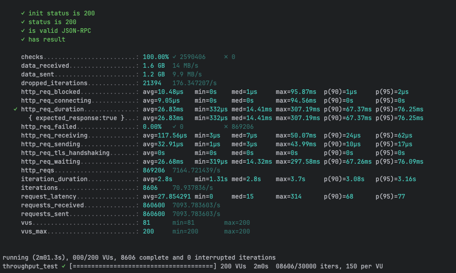
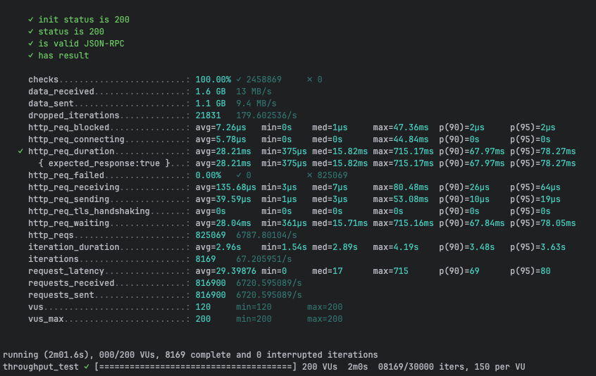
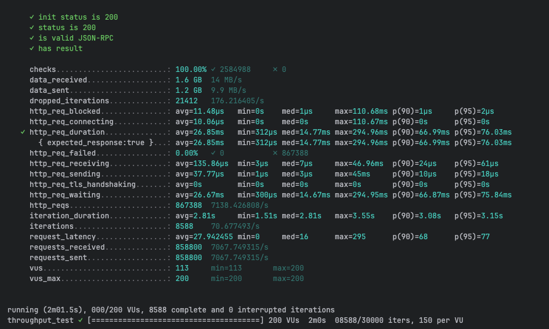
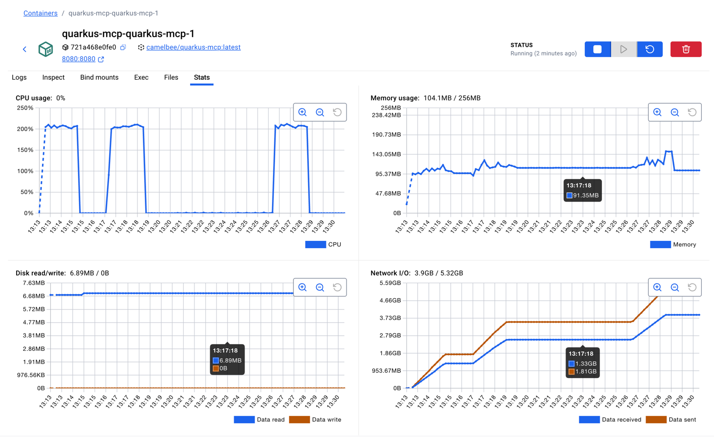

# MCP Performance Testing - CamelBee Microservice (Quarkus Native)

This document outlines the configuration, setup, and performance test results for a CamelBee-generated MCP microservice compiled to native executable with GraalVM.

## Microservice Creation

The microservice was created using the [CamelBee Initializer](https://www.camelbee.io) with the following configuration:

- **Interface**: MCP (Model Context Protocol)
- **Runtime**: Quarkus
- **Backend**: MOCK (no external dependencies)

After generating and downloading the microservice from CamelBee, apply the following configurations for optimal performance testing.

## Configuration

### Application Configuration

After creating the microservice, update the `application.yml` with the following settings to disable all interceptors:

```yaml
camelbee:
  # when enabled registers the CamelBee event notifier to the Camel context
  notifier-enabled: false
  # when enabled configures stream caching, MDC logging and CamelBeeUnitOfWork for routes
  route-configurer-enabled: false
  # when enabled it allows the CamelBee WebGL application to fetch the topology of the Camel Context
  context-enabled: false
  # when enabled intercepts/traces request and responses of all camel components and caches messages
  tracer-enabled: false
  # maximum time the tracer can remain idle before deactivation tracing of messages
  tracer-max-idle-time: 60000
  # maximum collected trace messages
  tracer-max-messages-count: 10000
  # when enabled it logs the messages exchanged between endpoints
  logging-enabled: false
```

### Docker Compose Configuration

Update the CPU allocation in `docker-compose-native.yml` to **2 cores** with reduced memory for native mode:

```yaml
deploy:
  resources:
    limits:
      cpus: '2'      # Updated from default to 2 cores
      memory: 256M   # Native requires significantly less memory
    reservations:
      cpus: '1'
      memory: 128M
```

> **Note**: Native executables require significantly less memory than JVM-based applications. The memory limit is set to 256MB (vs 1GB for JVM), demonstrating Quarkus Native's efficiency.

## Build and Deployment

### Build Native Executable

```bash
# Build native executable using container build (no local GraalVM required)
./mvnw package -Dnative -Dquarkus.native.container-build=true -DskipTests

# Start the Docker container with native profile
docker compose -f docker-compose-native.yml up --build -d
```

> **Note**: Native compilation takes longer (several minutes) but produces a highly optimized executable with instant startup time and minimal memory footprint.

## Performance Testing

### Test Setup

- **Tool**: k6 load testing tool
- **Test File**: `mcp-throughput-test.js` (located in `docs/k6/mcp/`)
- **VUs (Virtual Users)**: 200
- **Duration**: 2 minutes per run
- **Warm-up**: Native executables benefit from warm-up; ran test 3 times to collect final results

### Test Execution

```bash
cd docs/k6/mcp
k6 run mcp-throughput-test.js
```

## Performance Results

### Run 1 - Initial Run

```

     ✓ init status is 200
     ✓ status is 200
     ✓ is valid JSON-RPC
     ✓ has result

     checks.........................: 100.00% ✓ 2590406     ✗ 0     
     data_received..................: 1.6 GB  14 MB/s
     data_sent......................: 1.2 GB  9.9 MB/s
     dropped_iterations.............: 21394   176.347207/s
     http_req_blocked...............: avg=10.48µs   min=0s    med=1µs     max=95.87ms  p(90)=1µs     p(95)=2µs    
     http_req_connecting............: avg=9.05µs    min=0s    med=0s      max=94.56ms  p(90)=0s      p(95)=0s     
   ✓ http_req_duration..............: avg=26.83ms   min=332µs med=14.41ms max=307.19ms p(90)=67.37ms p(95)=76.25ms
       { expected_response:true }...: avg=26.83ms   min=332µs med=14.41ms max=307.19ms p(90)=67.37ms p(95)=76.25ms
     http_req_failed................: 0.00%   ✓ 0           ✗ 869206
     http_req_receiving.............: avg=117.56µs  min=3µs   med=7µs     max=50.07ms  p(90)=24µs    p(95)=62µs   
     http_req_sending...............: avg=32.91µs   min=1µs   med=3µs     max=43.99ms  p(90)=10µs    p(95)=17µs   
     http_req_tls_handshaking.......: avg=0s        min=0s    med=0s      max=0s       p(90)=0s      p(95)=0s     
     http_req_waiting...............: avg=26.68ms   min=319µs med=14.32ms max=297.58ms p(90)=67.26ms p(95)=76.09ms
     http_reqs......................: 869206  7164.721439/s
     iteration_duration.............: avg=2.8s      min=1.31s med=2.8s    max=3.7s     p(90)=3.08s   p(95)=3.16s  
     iterations.....................: 8606    70.937836/s
     request_latency................: avg=27.854291 min=0     med=15      max=314      p(90)=68      p(95)=77     
     requests_received..............: 860600  7093.783603/s
     requests_sent..................: 860600  7093.783603/s
     vus............................: 81      min=81        max=200 
     vus_max........................: 200     min=200       max=200 


running (2m01.3s), 000/200 VUs, 8606 complete and 0 interrupted iterations
throughput_test ✓ [======================================] 200 VUs  2m0s  08606/30000 iters, 150 per VU
```

**Throughput**: ~7,165 req/s

**Screenshot of the result:**



---

### Run 2 - Second Run

```

     ✓ init status is 200
     ✓ status is 200
     ✓ is valid JSON-RPC
     ✓ has result

     checks.........................: 100.00% ✓ 2458869     ✗ 0     
     data_received..................: 1.6 GB  13 MB/s
     data_sent......................: 1.1 GB  9.4 MB/s
     dropped_iterations.............: 21831   179.602536/s
     http_req_blocked...............: avg=7.26µs   min=0s    med=1µs     max=47.36ms  p(90)=2µs     p(95)=2µs    
     http_req_connecting............: avg=5.78µs   min=0s    med=0s      max=44.84ms  p(90)=0s      p(95)=0s     
   ✓ http_req_duration..............: avg=28.21ms  min=375µs med=15.82ms max=715.17ms p(90)=67.97ms p(95)=78.27ms
       { expected_response:true }...: avg=28.21ms  min=375µs med=15.82ms max=715.17ms p(90)=67.97ms p(95)=78.27ms
     http_req_failed................: 0.00%   ✓ 0           ✗ 825069
     http_req_receiving.............: avg=135.68µs min=3µs   med=7µs     max=80.48ms  p(90)=26µs    p(95)=64µs   
     http_req_sending...............: avg=39.59µs  min=1µs   med=3µs     max=53.08ms  p(90)=10µs    p(95)=19µs   
     http_req_tls_handshaking.......: avg=0s       min=0s    med=0s      max=0s       p(90)=0s      p(95)=0s     
     http_req_waiting...............: avg=28.04ms  min=361µs med=15.71ms max=715.16ms p(90)=67.84ms p(95)=78.05ms
     http_reqs......................: 825069  6787.80104/s
     iteration_duration.............: avg=2.96s    min=1.54s med=2.89s   max=4.19s    p(90)=3.48s   p(95)=3.63s  
     iterations.....................: 8169    67.205951/s
     request_latency................: avg=29.39876 min=0     med=17      max=715      p(90)=69      p(95)=80     
     requests_received..............: 816900  6720.595089/s
     requests_sent..................: 816900  6720.595089/s
     vus............................: 120     min=120       max=200 
     vus_max........................: 200     min=200       max=200 


running (2m01.6s), 000/200 VUs, 8169 complete and 0 interrupted iterations
throughput_test ✓ [======================================] 200 VUs  2m0s  08169/30000 iters, 150 per VU
```

**Throughput**: ~6,788 req/s
**Improvement**: -5.3% vs Run 1 (consistent with native's stable performance profile — no JIT warm-up benefit)

**Screenshot of the result:**

---

### Run 3 - Final Run

```

     ✓ init status is 200
     ✓ status is 200
     ✓ is valid JSON-RPC
     ✓ has result

     checks.........................: 100.00% ✓ 2584988     ✗ 0     
     data_received..................: 1.6 GB  14 MB/s
     data_sent......................: 1.2 GB  9.9 MB/s
     dropped_iterations.............: 21412   176.216405/s
     http_req_blocked...............: avg=11.48µs   min=0s    med=1µs     max=110.68ms p(90)=1µs     p(95)=2µs    
     http_req_connecting............: avg=10.06µs   min=0s    med=0s      max=110.67ms p(90)=0s      p(95)=0s     
   ✓ http_req_duration..............: avg=26.85ms   min=312µs med=14.77ms max=294.96ms p(90)=66.99ms p(95)=76.03ms
       { expected_response:true }...: avg=26.85ms   min=312µs med=14.77ms max=294.96ms p(90)=66.99ms p(95)=76.03ms
     http_req_failed................: 0.00%   ✓ 0           ✗ 867388
     http_req_receiving.............: avg=135.86µs  min=3µs   med=7µs     max=46.96ms  p(90)=24µs    p(95)=61µs   
     http_req_sending...............: avg=37.77µs   min=1µs   med=3µs     max=45ms     p(90)=10µs    p(95)=18µs   
     http_req_tls_handshaking.......: avg=0s        min=0s    med=0s      max=0s       p(90)=0s      p(95)=0s     
     http_req_waiting...............: avg=26.67ms   min=300µs med=14.67ms max=294.95ms p(90)=66.87ms p(95)=75.84ms
     http_reqs......................: 867388  7138.426808/s
     iteration_duration.............: avg=2.81s     min=1.51s med=2.81s   max=3.55s    p(90)=3.08s   p(95)=3.15s  
     iterations.....................: 8588    70.677493/s
     request_latency................: avg=27.942455 min=0     med=16      max=295      p(90)=68      p(95)=77     
     requests_received..............: 858800  7067.749315/s
     requests_sent..................: 858800  7067.749315/s
     vus............................: 113     min=113       max=200 
     vus_max........................: 200     min=200       max=200 


running (2m01.5s), 000/200 VUs, 8588 complete and 0 interrupted iterations
throughput_test ✓ [======================================] 200 VUs  2m0s  08588/30000 iters, 150 per VU
```

**Throughput**: ~7,138 req/s
**Improvement**: -0.4% vs Run 1 (native executables maintain consistent performance without JIT optimization)

**Screenshot of the result:**


---

## Performance Summary

| Metric | Run 1 | Run 2 | Run 3 |
|--------|-------|-------|-------|
| **Throughput (req/s)** | 7,165 | 6,788 | 7,138 |
| **Avg Latency (ms)** | 26.83 | 28.21 | 26.85 |
| **Median Latency (ms)** | 14.41 | 15.82 | 14.77 |
| **P90 Latency (ms)** | 67.37 | 67.97 | 66.99 |
| **P95 Latency (ms)** | 76.25 | 78.27 | 76.03 |
| **Max Latency (ms)** | 307.19 | 715.17 | 294.96 |
| **Total Requests** | 869,206 | 825,069 | 867,388 |
| **Success Rate** | 100% | 100% | 100% |

## Key Observations

1. **Consistent Performance**: Native executables show stable performance across runs with no JIT warm-up benefit — all three runs within ~5% of each other
2. **Stable Throughput**: Achieved ~7K requests/second consistently
3. **Predictable Latency**: Median latency around 14-16ms with consistent P90/P95 profiles
4. **Exceptional Memory Efficiency**: Uses only ~104MB memory (within a 256MB container limit), roughly half of the non-Camel native variant
5. **Instant Startup**: Native executables start in milliseconds, ideal for serverless and dynamic scaling
6. **Zero Failures**: 100% success rate across all test runs

## Container Resource Usage

During the performance tests, the container exhibited the following resource utilization patterns:

- **CPU Usage**: Peaked at ~200% (fully utilizing both allocated cores) during each test run, dropping to 0% at idle between runs
- **Memory Usage**: 104.1MB / 256MB — remarkably stable at ~104MB throughout all test runs, with slight increases during load visible in the memory graph
- **Disk Read/Write**: 6.89MB read / 0B write — minimal disk reads at startup (native binary is much smaller than JVM JARs), zero writes during tests
- **Network I/O**: 3.9GB received / 5.32GB sent cumulative across all three test runs

The CPU graph shows three clear spikes corresponding to each test run, demonstrating efficient utilization of the allocated resources. Memory usage remained exceptionally stable at ~104MB throughout all tests, demonstrating the native executable's minimal memory footprint and predictable resource consumption.

**Screenshot of Docker container statistics:**



## Recommendations

1. **Production Deployment**: Disable all CamelBee interceptors as shown in the configuration for optimal performance
2. **Resource Allocation**: 2 CPU cores with only 256MB memory is sufficient for native mode
3. **Warm-up Strategy**: Native executables show consistent performance with minimal warm-up requirements
4. **Monitoring**: Track memory usage and startup times as key metrics for native deployments
5. **Cost Efficiency**: Native mode's lower memory requirements can significantly reduce cloud infrastructure costs

## Environment

- **Runtime**: Quarkus Native (GraalVM compiled)
- **Protocol**: MCP
- **Container**: Docker
- **Resource Limits**: 2 CPUs, 256MB memory
- **Test Load**: 200 concurrent virtual users
- **Compilation**: Container-based native build (no local GraalVM required)
