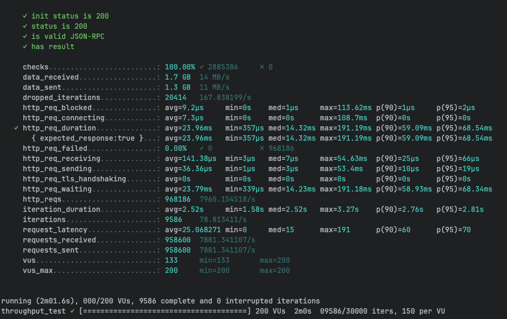
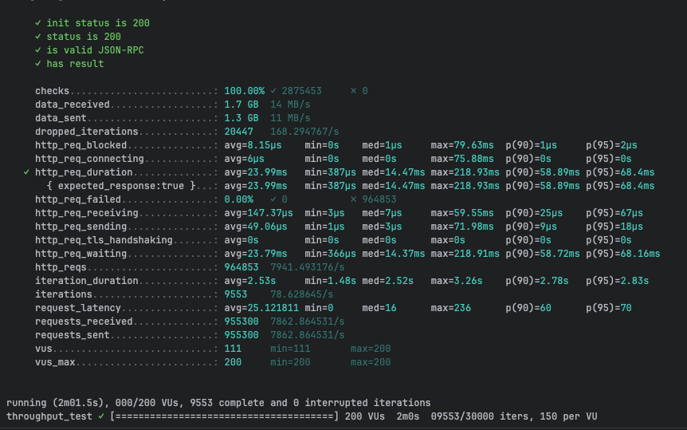
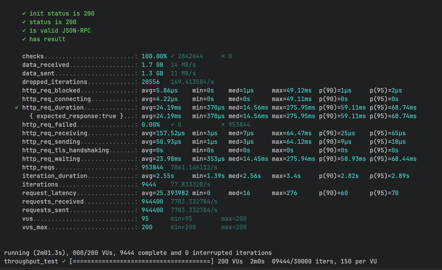
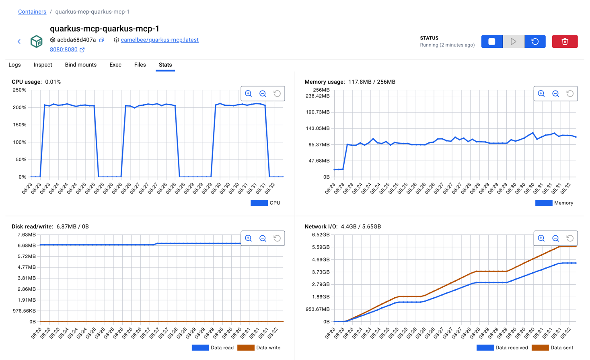

# MCP Performance Testing - CamelBee Microservice (Quarkus Native)

This document outlines the configuration, setup, and performance test results for a CamelBee-generated MCP microservice compiled to native executable with GraalVM.

## Microservice Creation

The microservice was created using the [CamelBee Initializer](https://www.camelbee.io) with the following configuration:

- **Interface**: MCP (Model Context Protocol)
- **Runtime**: Quarkus
- **Backend**: MOCK (no external dependencies)

After generating and downloading the microservice from CamelBee, apply the following configurations for optimal performance testing.

## Configuration

### Application Configuration

After creating the microservice, update the `application.yml` with the following settings to disable all interceptors:

```yaml
camelbee:
  # when enabled registers the CamelBee event notifier to the Camel context
  notifier-enabled: false
  # when enabled configures stream caching, MDC logging and CamelBeeUnitOfWork for routes
  route-configurer-enabled: false
  # when enabled it allows the CamelBee WebGL application to fetch the topology of the Camel Context
  context-enabled: false
  # when enabled intercepts/traces request and responses of all camel components and caches messages
  tracer-enabled: false
  # maximum time the tracer can remain idle before deactivation tracing of messages
  tracer-max-idle-time: 60000
  # maximum collected trace messages
  tracer-max-messages-count: 10000
  # when enabled it logs the messages exchanged between endpoints
  logging-enabled: false
```

> **Note**: The `McpTools.java` class contains three test configurations. For this test, **Test 3 (MCP Tool + MapStruct + Apache Camel)** is active — the MCP tool call goes through a MapStruct DTO mapping (`mcpToDomainOrder` → `domainToMcpOrder`) and is routed through Apache Camel. Tests 1 and 2 are commented out.

```java 
@Tool(description = "Create a new order with customer details, product information, and shipping preferences")
Order createOrder(
@ToolArg(description = "Order object containing salesChannel, items with productName, quantity, and price") Order order,
@ToolArg(description = "Client-generated correlation ID for distributed tracing and logging", required = false) String transactionId,
@ToolArg(description = "Business process correlation ID for end-to-end transaction tracing across systems", required = false) String businessTransactionId
) {

        var result = fluentProducerTemplate
            .to("direct:mcpCreateOrder")
            .withHeader("transactionId", transactionId)
            .withBody(order)
            .send();

        if (result.getMessage().getBody() instanceof ToolCallException) {
          throw result.getMessage().getBody(ToolCallException.class);
        } else {
          return result.getMessage().getBody(Order.class);
        }

}
```

### Docker Compose Configuration

Update the CPU allocation in `docker-compose-native.yml` to **2 cores** with reduced memory for native mode:

```yaml
deploy:
  resources:
    limits:
      cpus: '2'      # Updated from default to 2 cores
      memory: 256M   # Native requires significantly less memory
    reservations:
      cpus: '1'
      memory: 128M
```

> **Note**: Native executables require significantly less memory than JVM-based applications. The memory limit is set to 256MB (vs 1GB for JVM), demonstrating Quarkus Native's efficiency.

## Build and Deployment

### Build Native Executable

```bash
# Build native executable using container build (no local GraalVM required)
./mvnw package -Dnative -Dquarkus.native.container-build=true -DskipTests

# Start the Docker container with native profile
docker compose -f docker-compose-native.yml up --build -d
```

> **Note**: Native compilation takes longer (several minutes) but produces a highly optimized executable with instant startup time and minimal memory footprint.

## Performance Testing

### Test Setup

- **Tool**: k6 load testing tool
- **Test File**: `mcp-throughput-test.js` (located in `docs/k6/mcp/`)
- **VUs (Virtual Users)**: 200
- **Duration**: 2 minutes per run
- **Warm-up**: Native executables benefit from warm-up; ran test 3 times to collect final results

### Test Execution

```bash
cd docs/k6/mcp
k6 run mcp-throughput-test.js
```

## Performance Results

### Run 1 - Initial Run

```

     ✓ init status is 200
     ✓ status is 200
     ✓ is valid JSON-RPC
     ✓ has result

     checks.........................: 100.00% ✓ 2885386     ✗ 0     
     data_received..................: 1.7 GB  14 MB/s
     data_sent......................: 1.3 GB  11 MB/s
     dropped_iterations.............: 20414   167.838199/s
     http_req_blocked...............: avg=9.2µs     min=0s    med=1µs     max=113.62ms p(90)=1µs     p(95)=2µs    
     http_req_connecting............: avg=7.3µs     min=0s    med=0s      max=108.7ms  p(90)=0s      p(95)=0s     
   ✓ http_req_duration..............: avg=23.96ms   min=357µs med=14.32ms max=191.19ms p(90)=59.09ms p(95)=68.54ms
       { expected_response:true }...: avg=23.96ms   min=357µs med=14.32ms max=191.19ms p(90)=59.09ms p(95)=68.54ms
     http_req_failed................: 0.00%   ✓ 0           ✗ 968186
     http_req_receiving.............: avg=141.38µs  min=3µs   med=7µs     max=54.63ms  p(90)=25µs    p(95)=66µs   
     http_req_sending...............: avg=36.36µs   min=1µs   med=3µs     max=53.4ms   p(90)=10µs    p(95)=19µs   
     http_req_tls_handshaking.......: avg=0s        min=0s    med=0s      max=0s       p(90)=0s      p(95)=0s     
     http_req_waiting...............: avg=23.79ms   min=339µs med=14.23ms max=191.18ms p(90)=58.93ms p(95)=68.34ms
     http_reqs......................: 968186  7960.154518/s
     iteration_duration.............: avg=2.52s     min=1.58s med=2.52s   max=3.27s    p(90)=2.76s   p(95)=2.81s  
     iterations.....................: 9586    78.813411/s
     request_latency................: avg=25.068271 min=0     med=15      max=191      p(90)=60      p(95)=70     
     requests_received..............: 958600  7881.341107/s
     requests_sent..................: 958600  7881.341107/s
     vus............................: 133     min=133       max=200 
     vus_max........................: 200     min=200       max=200 


running (2m01.6s), 000/200 VUs, 9586 complete and 0 interrupted iterations
throughput_test ✓ [======================================] 200 VUs  2m0s  09586/30000 iters, 150 per VU
```

**Throughput**: ~7,960 req/s

**Screenshot of the result:**



---

### Run 2 - Second Run

```

     ✓ init status is 200
     ✓ status is 200
     ✓ is valid JSON-RPC
     ✓ has result

     checks.........................: 100.00% ✓ 2875453     ✗ 0     
     data_received..................: 1.7 GB  14 MB/s
     data_sent......................: 1.3 GB  11 MB/s
     dropped_iterations.............: 20447   168.294767/s
     http_req_blocked...............: avg=8.15µs    min=0s    med=1µs     max=79.63ms  p(90)=1µs     p(95)=2µs    
     http_req_connecting............: avg=6µs       min=0s    med=0s      max=75.88ms  p(90)=0s      p(95)=0s     
   ✓ http_req_duration..............: avg=23.99ms   min=387µs med=14.47ms max=218.93ms p(90)=58.89ms p(95)=68.4ms 
       { expected_response:true }...: avg=23.99ms   min=387µs med=14.47ms max=218.93ms p(90)=58.89ms p(95)=68.4ms 
     http_req_failed................: 0.00%   ✓ 0           ✗ 964853
     http_req_receiving.............: avg=147.37µs  min=3µs   med=7µs     max=59.55ms  p(90)=25µs    p(95)=67µs   
     http_req_sending...............: avg=49.06µs   min=1µs   med=3µs     max=71.98ms  p(90)=9µs     p(95)=18µs   
     http_req_tls_handshaking.......: avg=0s        min=0s    med=0s      max=0s       p(90)=0s      p(95)=0s     
     http_req_waiting...............: avg=23.79ms   min=366µs med=14.37ms max=218.91ms p(90)=58.72ms p(95)=68.16ms
     http_reqs......................: 964853  7941.493176/s
     iteration_duration.............: avg=2.53s     min=1.48s med=2.52s   max=3.26s    p(90)=2.78s   p(95)=2.83s  
     iterations.....................: 9553    78.628645/s
     request_latency................: avg=25.121811 min=0     med=16      max=236      p(90)=60      p(95)=70     
     requests_received..............: 955300  7862.864531/s
     requests_sent..................: 955300  7862.864531/s
     vus............................: 111     min=111       max=200 
     vus_max........................: 200     min=200       max=200 


running (2m01.5s), 000/200 VUs, 9553 complete and 0 interrupted iterations
throughput_test ✓ [======================================] 200 VUs  2m0s  09553/30000 iters, 150 per VU
```

**Throughput**: ~7,941 req/s
**Change**: -0.2% vs Run 1 (consistent with native's stable performance profile — no JIT warm-up benefit)

**Screenshot of the result:**



---

### Run 3 - Final Run

```

     ✓ init status is 200
     ✓ status is 200
     ✓ is valid JSON-RPC
     ✓ has result

     checks.........................: 100.00% ✓ 2842644     ✗ 0     
     data_received..................: 1.7 GB  14 MB/s
     data_sent......................: 1.3 GB  11 MB/s
     dropped_iterations.............: 20556   169.413584/s
     http_req_blocked...............: avg=5.86µs    min=0s    med=1µs     max=49.12ms  p(90)=1µs     p(95)=2µs    
     http_req_connecting............: avg=4.22µs    min=0s    med=0s      max=49.11ms  p(90)=0s      p(95)=0s     
   ✓ http_req_duration..............: avg=24.19ms   min=370µs med=14.56ms max=275.95ms p(90)=59.11ms p(95)=68.74ms
       { expected_response:true }...: avg=24.19ms   min=370µs med=14.56ms max=275.95ms p(90)=59.11ms p(95)=68.74ms
     http_req_failed................: 0.00%   ✓ 0           ✗ 953844
     http_req_receiving.............: avg=157.52µs  min=3µs   med=7µs     max=64.47ms  p(90)=25µs    p(95)=65µs   
     http_req_sending...............: avg=50.93µs   min=1µs   med=3µs     max=64.12ms  p(90)=9µs     p(95)=18µs   
     http_req_tls_handshaking.......: avg=0s        min=0s    med=0s      max=0s       p(90)=0s      p(95)=0s     
     http_req_waiting...............: avg=23.98ms   min=353µs med=14.45ms max=275.94ms p(90)=58.93ms p(95)=68.44ms
     http_reqs......................: 953844  7861.166112/s
     iteration_duration.............: avg=2.55s     min=1.39s med=2.56s   max=3.4s     p(90)=2.82s   p(95)=2.89s  
     iterations.....................: 9444    77.833328/s
     request_latency................: avg=25.393982 min=0     med=16      max=276      p(90)=60      p(95)=70     
     requests_received..............: 944400  7783.332784/s
     requests_sent..................: 944400  7783.332784/s
     vus............................: 95      min=95        max=200 
     vus_max........................: 200     min=200       max=200 


running (2m01.3s), 000/200 VUs, 9444 complete and 0 interrupted iterations
throughput_test ✓ [======================================] 200 VUs  2m0s  09444/30000 iters, 150 per VU
```

**Throughput**: ~7,861 req/s
**Change**: -1.2% vs Run 1, -1.0% vs Run 2 (native executables maintain consistent performance without JIT optimization)

**Screenshot of the result:**



---

## Performance Summary

| Metric | Run 1 | Run 2 | Run 3 |
|--------|-------|-------|-------|
| **Throughput (req/s)** | ~7,960 | ~7,941 | ~7,861 |
| **Avg Latency (ms)** | 23.96 | 23.99 | 24.19 |
| **Median Latency (ms)** | 14.32 | 14.47 | 14.56 |
| **P90 Latency (ms)** | 59.09 | 58.89 | 59.11 |
| **P95 Latency (ms)** | 68.54 | 68.4 | 68.74 |
| **Max Latency (ms)** | 191.19 | 218.93 | 275.95 |
| **Total Requests** | 968,186 | 964,853 | 953,844 |
| **Success Rate** | 100% | 100% | 100% |

## Key Observations

1. **Consistent Performance**: Native executables show stable performance across runs with no JIT warm-up benefit — all three runs within ~1.5% of each other
2. **Stable Throughput**: Achieved ~7.9K requests/second consistently
3. **Predictable Latency**: Median latency around 14–15ms with highly consistent P90/P95 profiles across all runs
4. **Exceptional Memory Efficiency**: Uses only ~117.8MB memory (within a 256MB container limit), a fraction of JVM-based equivalents
5. **Instant Startup**: Native executables start in milliseconds, ideal for serverless and dynamic scaling
6. **Zero Failures**: 100% success rate across all test runs

## Container Resource Usage

During the performance tests, the container exhibited the following resource utilization patterns:

- **CPU Usage**: Peaked at ~200% (fully utilizing both allocated cores) during each test run, dropping to ~0.01% at idle between runs
- **Memory Usage**: 117.8MB / 256MB — remarkably stable throughout all test runs, with gradual increases visible during load indicating active request processing
- **Disk Read/Write**: 6.87MB read / 0B write — minimal disk reads at startup (native binary is much smaller than JVM JARs), zero writes during tests
- **Network I/O**: 4.4GB received / 5.65GB sent — cumulative across all three test runs

The CPU graph shows three clear spikes corresponding to each test run, demonstrating efficient utilization of the allocated resources. Memory usage remained exceptionally stable throughout all tests, demonstrating the native executable's minimal memory footprint and predictable resource consumption.

**Screenshot of Docker container statistics:**



## Recommendations

1. **Production Deployment**: Disable all CamelBee interceptors as shown in the configuration for optimal performance
2. **Resource Allocation**: 2 CPU cores with only 256MB memory is sufficient for native mode
3. **Warm-up Strategy**: Native executables show consistent performance with minimal warm-up requirements
4. **Monitoring**: Track memory usage and startup times as key metrics for native deployments
5. **Cost Efficiency**: Native mode's lower memory requirements can significantly reduce cloud infrastructure costs

## Environment

- **Runtime**: Quarkus Native (GraalVM compiled)
- **Protocol**: MCP
- **Container**: Docker
- **Resource Limits**: 2 CPUs, 256MB memory
- **Test Load**: 200 concurrent virtual users
- **Compilation**: Container-based native build (no local GraalVM required)
