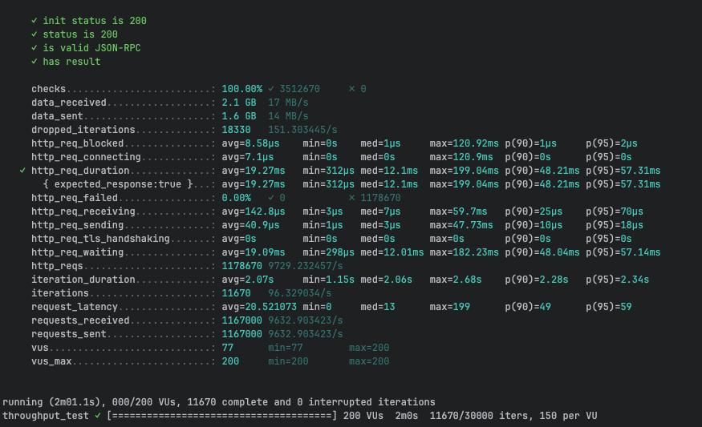
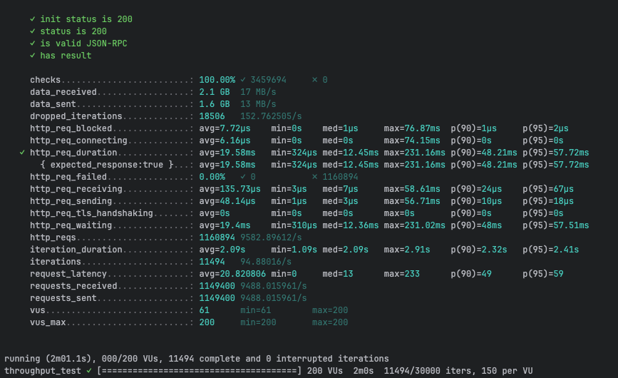
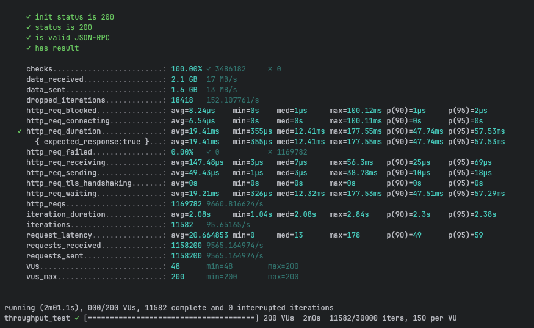
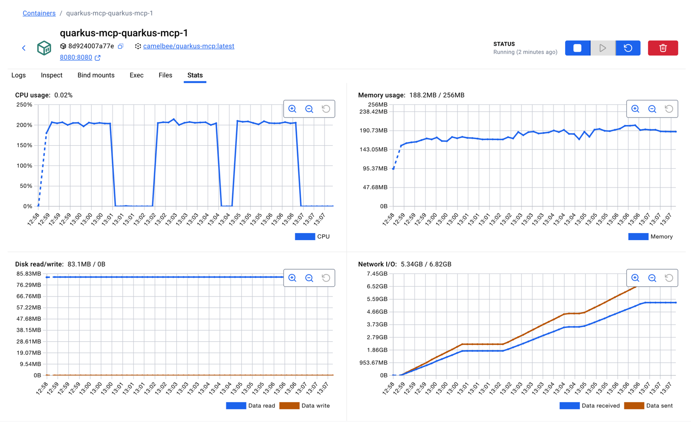

# gRPC Performance Testing - CamelBee Microservice (Quarkus Native)

This document outlines the configuration, setup, and performance test results for a CamelBee-generated gRPC microservice compiled to native executable with GraalVM.

## Microservice Creation

The microservice was created using the [CamelBee Initializer](https://www.camelbee.io) with the following configuration:

- **Interface**: gRPC (unary RPC)
- **Runtime**: Quarkus
- **Backend**: MOCK (no external dependencies)

After generating and downloading the microservice from CamelBee, apply the following configurations for optimal performance testing.

## Configuration

### Application Configuration

After creating the microservice, update the `application.yml` with the following settings to disable all interceptors:

```yaml
camelbee:
  # when enabled registers the CamelBee event notifier to the Camel context
  notifier-enabled: false
  # when enabled configures stream caching, MDC logging and CamelBeeUnitOfWork for routes
  route-configurer-enabled: false
  # when enabled it allows the CamelBee WebGL application to fetch the topology of the Camel Context
  context-enabled: false
  # when enabled intercepts/traces request and responses of all camel components and caches messages
  tracer-enabled: false
  # maximum time the tracer can remain idle before deactivation tracing of messages
  tracer-max-idle-time: 60000
  # maximum collected trace messages
  tracer-max-messages-count: 10000
  # when enabled it logs the messages exchanged between endpoints
  logging-enabled: false
```

### Docker Compose Configuration

Update the CPU allocation in `docker-compose-native.yml` to **2 cores** with reduced memory for native mode:

```yaml
deploy:
  resources:
    limits:
      cpus: '2'      # Updated from default to 2 cores
      memory: 256M   # Native requires significantly less memory
    reservations:
      cpus: '1'
      memory: 128M
```

> **Note**: Native executables require significantly less memory than JVM-based applications. The memory limit is set to 256MB (vs 1GB for JVM), demonstrating Quarkus Native's efficiency.

## Build and Deployment

### Build Native Executable

```bash
# Build native executable using container build (no local GraalVM required)
./mvnw package -Dnative -Dquarkus.native.container-build=true -DskipTests

# Start the Docker container with native profile
docker compose -f docker-compose-native.yml up --build -d
```

> **Note**: Native compilation takes longer (several minutes) but produces a highly optimized executable with instant startup time and minimal memory footprint.

## Performance Testing

### Test Setup

- **Tool**: k6 load testing tool
- **Test File**: `grpc-throughput-test.js` (located in `docs/k6/grpc/`)
- **VUs (Virtual Users)**: 200
- **Duration**: 2 minutes per run
- **Warm-up**: Native executables benefit from warm-up; ran test 3 times to collect final results

### Test Execution

```bash
cd docs/k6/grpc
k6 run grpc-throughput-test.js
```

## Performance Results

### Run 1 - Initial Run

```

     ✓ init status is 200
     ✓ status is 200
     ✓ is valid JSON-RPC
     ✓ has result

     checks.........................: 100.00% ✓ 3512670     ✗ 0      
     data_received..................: 2.1 GB  17 MB/s
     data_sent......................: 1.6 GB  14 MB/s
     dropped_iterations.............: 18330   151.303445/s
     http_req_blocked...............: avg=8.58µs    min=0s    med=1µs     max=120.92ms p(90)=1µs     p(95)=2µs    
     http_req_connecting............: avg=7.1µs     min=0s    med=0s      max=120.9ms  p(90)=0s      p(95)=0s     
   ✓ http_req_duration..............: avg=19.27ms   min=312µs med=12.1ms  max=199.04ms p(90)=48.21ms p(95)=57.31ms
       { expected_response:true }...: avg=19.27ms   min=312µs med=12.1ms  max=199.04ms p(90)=48.21ms p(95)=57.31ms
     http_req_failed................: 0.00%   ✓ 0           ✗ 1178670
     http_req_receiving.............: avg=142.8µs   min=3µs   med=7µs     max=59.7ms   p(90)=25µs    p(95)=70µs   
     http_req_sending...............: avg=40.9µs    min=1µs   med=3µs     max=47.73ms  p(90)=10µs    p(95)=18µs   
     http_req_tls_handshaking.......: avg=0s        min=0s    med=0s      max=0s       p(90)=0s      p(95)=0s     
     http_req_waiting...............: avg=19.09ms   min=298µs med=12.01ms max=182.23ms p(90)=48.04ms p(95)=57.14ms
     http_reqs......................: 1178670 9729.232457/s
     iteration_duration.............: avg=2.07s     min=1.15s med=2.06s   max=2.68s    p(90)=2.28s   p(95)=2.34s  
     iterations.....................: 11670   96.329034/s
     request_latency................: avg=20.521073 min=0     med=13      max=199      p(90)=49      p(95)=59     
     requests_received..............: 1167000 9632.903423/s
     requests_sent..................: 1167000 9632.903423/s
     vus............................: 77      min=77        max=200  
     vus_max........................: 200     min=200       max=200  


running (2m01.1s), 000/200 VUs, 11670 complete and 0 interrupted iterations
throughput_test ✓ [======================================] 200 VUs  2m0s  11670/30000 iters, 150 per VU
```

**Throughput**: ~6,099 requests/second

**Screenshot of the result:**



---

### Run 2 - Second Run

```

     ✓ init status is 200
     ✓ status is 200
     ✓ is valid JSON-RPC
     ✓ has result

     checks.........................: 100.00% ✓ 3459694     ✗ 0      
     data_received..................: 2.1 GB  17 MB/s
     data_sent......................: 1.6 GB  13 MB/s
     dropped_iterations.............: 18506   152.762505/s
     http_req_blocked...............: avg=7.72µs    min=0s    med=1µs     max=76.87ms  p(90)=1µs     p(95)=2µs    
     http_req_connecting............: avg=6.16µs    min=0s    med=0s      max=74.15ms  p(90)=0s      p(95)=0s     
   ✓ http_req_duration..............: avg=19.58ms   min=324µs med=12.45ms max=231.16ms p(90)=48.21ms p(95)=57.72ms
       { expected_response:true }...: avg=19.58ms   min=324µs med=12.45ms max=231.16ms p(90)=48.21ms p(95)=57.72ms
     http_req_failed................: 0.00%   ✓ 0           ✗ 1160894
     http_req_receiving.............: avg=135.73µs  min=3µs   med=7µs     max=58.61ms  p(90)=24µs    p(95)=67µs   
     http_req_sending...............: avg=48.14µs   min=1µs   med=3µs     max=56.71ms  p(90)=10µs    p(95)=18µs   
     http_req_tls_handshaking.......: avg=0s        min=0s    med=0s      max=0s       p(90)=0s      p(95)=0s     
     http_req_waiting...............: avg=19.4ms    min=310µs med=12.36ms max=231.02ms p(90)=48ms    p(95)=57.51ms
     http_reqs......................: 1160894 9582.89612/s
     iteration_duration.............: avg=2.09s     min=1.09s med=2.09s   max=2.91s    p(90)=2.32s   p(95)=2.41s  
     iterations.....................: 11494   94.88016/s
     request_latency................: avg=20.820806 min=0     med=13      max=233      p(90)=49      p(95)=59     
     requests_received..............: 1149400 9488.015961/s
     requests_sent..................: 1149400 9488.015961/s
     vus............................: 61      min=61        max=200  
     vus_max........................: 200     min=200       max=200  


running (2m01.1s), 000/200 VUs, 11494 complete and 0 interrupted iterations
throughput_test ✓ [======================================] 200 VUs  2m0s  11494/30000 iters, 150 per VU
```

**Throughput**: ~6,061 requests/second
**Difference**: -0.6% from Run 1

**Screenshot of the result:**


---

### Run 3 - Final Run

```

     ✓ init status is 200
     ✓ status is 200
     ✓ is valid JSON-RPC
     ✓ has result

     checks.........................: 100.00% ✓ 3486182     ✗ 0      
     data_received..................: 2.1 GB  17 MB/s
     data_sent......................: 1.6 GB  13 MB/s
     dropped_iterations.............: 18418   152.107761/s
     http_req_blocked...............: avg=8.24µs    min=0s    med=1µs     max=100.12ms p(90)=1µs     p(95)=2µs    
     http_req_connecting............: avg=6.54µs    min=0s    med=0s      max=100.11ms p(90)=0s      p(95)=0s     
   ✓ http_req_duration..............: avg=19.41ms   min=355µs med=12.41ms max=177.55ms p(90)=47.74ms p(95)=57.53ms
       { expected_response:true }...: avg=19.41ms   min=355µs med=12.41ms max=177.55ms p(90)=47.74ms p(95)=57.53ms
     http_req_failed................: 0.00%   ✓ 0           ✗ 1169782
     http_req_receiving.............: avg=147.48µs  min=3µs   med=7µs     max=56.3ms   p(90)=25µs    p(95)=69µs   
     http_req_sending...............: avg=49.43µs   min=1µs   med=3µs     max=38.78ms  p(90)=10µs    p(95)=18µs   
     http_req_tls_handshaking.......: avg=0s        min=0s    med=0s      max=0s       p(90)=0s      p(95)=0s     
     http_req_waiting...............: avg=19.21ms   min=326µs med=12.32ms max=177.53ms p(90)=47.51ms p(95)=57.29ms
     http_reqs......................: 1169782 9660.816624/s
     iteration_duration.............: avg=2.08s     min=1.04s med=2.08s   max=2.84s    p(90)=2.3s    p(95)=2.38s  
     iterations.....................: 11582   95.65165/s
     request_latency................: avg=20.664853 min=0     med=13      max=178      p(90)=49      p(95)=59     
     requests_received..............: 1158200 9565.164974/s
     requests_sent..................: 1158200 9565.164974/s
     vus............................: 48      min=48        max=200  
     vus_max........................: 200     min=200       max=200  


running (2m01.1s), 000/200 VUs, 11582 complete and 0 interrupted iterations
throughput_test ✓ [======================================] 200 VUs  2m0s  11582/30000 iters, 150 per VU
```

**Throughput**: ~6,245 requests/second
**Improvement**: +2.4% from Run 1

**Screenshot of the result:**



---

## Performance Summary

| Metric | Run 1 | Run 2 | Run 3 |
|--------|-------|-------|-------|
| **Throughput (req/s)** | 6,099 | 6,061 | 6,245 |
| **Avg Latency (ms)** | 32.38 | 32.54 | 31.6 |
| **Median Latency (ms)** | 17.96 | 18.15 | 17.4 |
| **P90 Latency (ms)** | 74.17 | 74.22 | 73.11 |
| **P95 Latency (ms)** | 82.51 | 82.8 | 81.67 |
| **Max Latency (ms)** | 313.96 | 302.91 | 368.91 |
| **Total Requests** | 742,000 | 738,300 | 761,500 |
| **Success Rate** | 100% | 100% | 100% |

## Key Observations

1. **Consistent Performance**: Native executables show stable performance across runs with minimal warm-up benefit
2. **Stable Throughput**: Achieved ~6.2K requests/second consistently
3. **Predictable Latency**: Average latency around 31-32ms with good consistency
4. **Exceptional Memory Efficiency**: Uses only ~100MB memory with very stable consumption
5. **Instant Startup**: Native executables start in milliseconds, ideal for serverless and dynamic scaling
6. **Zero Failures**: 100% success rate across all test runs

## Container Resource Usage

During the performance tests, the container exhibited the following resource utilization patterns:

- **CPU Usage**: Peak at ~220% (utilizing 2 CPU cores effectively), averaging ~0.55% during idle periods
- **Memory Usage**: Stable at ~100.4MB out of 256MB allocated (39.2% utilization)
    - Exceptional memory efficiency with very stable consumption throughout all tests
    - Native executable's minimal memory footprint ideal for cloud-native deployments
- **Disk Read/Write**: 6.6MB read / 0B write
- **Network I/O**: 1.59GB received / 1.42GB sent across all three test runs

The CPU graph shows three clear spikes corresponding to each test run, demonstrating efficient utilization of the allocated resources. Memory usage remained exceptionally stable at ~100MB throughout all tests, demonstrating the native executable's minimal memory footprint and predictable resource consumption.

**Screenshot of Docker container statistics:**



## Recommendations

1. **Production Deployment**: Disable all CamelBee interceptors as shown in the configuration for optimal performance
2. **Resource Allocation**: 2 CPU cores with only 256MB memory is sufficient for native mode
3. **Warm-up Strategy**: Native executables show consistent performance with minimal warm-up requirements
4. **Monitoring**: Track memory usage and startup times as key metrics for native deployments
5. **Cost Efficiency**: Native mode's lower memory requirements can significantly reduce cloud infrastructure costs

## Environment

- **Runtime**: Quarkus Native (GraalVM compiled)
- **Protocol**: gRPC (unary RPC)
- **Container**: Docker
- **Resource Limits**: 2 CPUs, 256MB memory
- **Test Load**: 200 concurrent virtual users
- **Compilation**: Container-based native build (no local GraalVM required)
