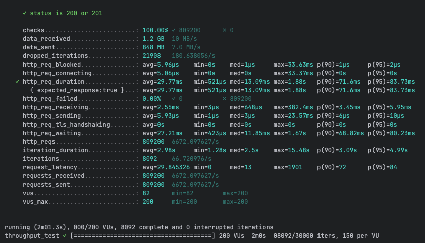
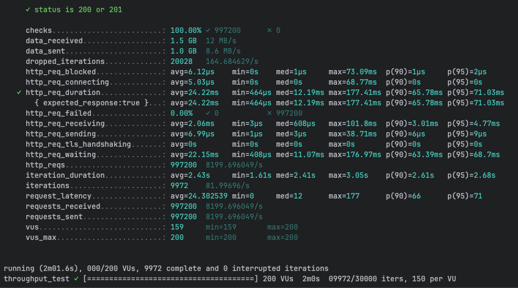
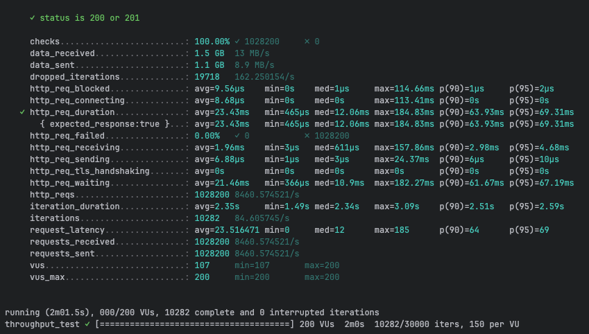
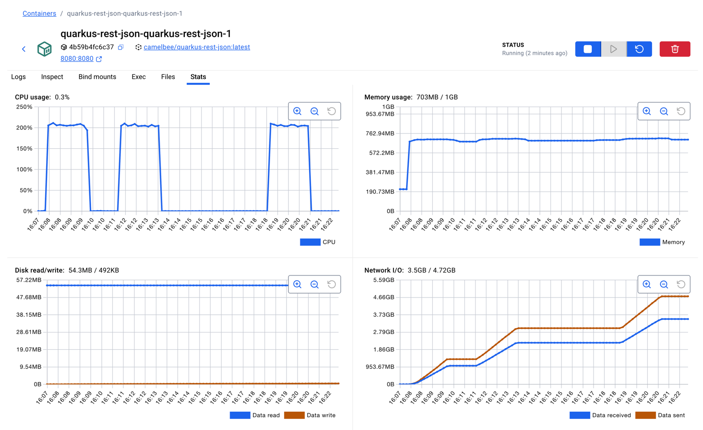

# REST with JSON Performance Testing - CamelBee Microservice (Quarkus JVM)

This document outlines the configuration, setup, and performance test results for a CamelBee-generated REST microservice using JSON serialization on Quarkus JVM.

## Microservice Creation

The microservice was created using the [CamelBee Initializer](https://www.camelbee.io) with the following configuration:

- **Interface**: REST with JSON serialization
- **Runtime**: Quarkus JVM
- **Backend**: MOCK (no external dependencies)

After generating and downloading the microservice from CamelBee, apply the following configurations for optimal performance testing.

## Configuration

### Application Configuration

After creating the microservice, update the `application.yml` with the following settings to disable all interceptors:

```yaml
camelbee:
  # when enabled registers the CamelBee event notifier to the Camel context
  notifier-enabled: false
  # when enabled configures stream caching, MDC logging and CamelBeeUnitOfWork for routes
  route-configurer-enabled: false
  # when enabled it allows the CamelBee WebGL application to fetch the topology of the Camel Context
  context-enabled: false
  # when enabled intercepts/traces request and responses of all camel components and caches messages
  tracer-enabled: false
  # maximum time the tracer can remain idle before deactivation tracing of messages
  tracer-max-idle-time: 60000
  # maximum collected trace messages
  tracer-max-messages-count: 10000
  # when enabled it logs the messages exchanged between endpoints
  logging-enabled: false
```

### Docker Compose Configuration

Update the CPU allocation in `docker-compose.yml` to **2 cores** for optimal performance:

```yaml
deploy:
  resources:
    limits:
      cpus: '2'      # Updated from default to 2 cores
      memory: 1G
    reservations:
      cpus: '1'
      memory: 1G
```

> **Note**: Increasing the CPU limit to 2 cores significantly improves throughput and allows the microservice to handle higher concurrent loads efficiently.

## Build and Deployment

### Build Steps

```bash
# Make the Maven wrapper executable
chmod +x mvnw

# Package the application (skip tests for faster build)
./mvnw package -DskipTests

# Start the Docker container
docker compose up --build -d
```

## Performance Testing

### Test Setup

- **Tool**: k6 load testing tool
- **Test File**: `rest-throughput-test.js` (located in `docs/k6/grpc/`)
- **Protocol**: REST with JSON serialization
- **VUs (Virtual Users)**: 200
- **Duration**: 2 minutes per run
- **Warm-up**: 2 test runs to ensure JVM optimization, 3rd run for final results

### Test Execution

```bash
cd docs/k6/grpc
k6 run rest-throughput-test.js
```

## Performance Results

### Run 1 - Initial Warm-up

```
Duration: 2m01.3s
✓ checks.........................: 100.00% ✓ 809,200  ✗ 0
  data_received..................: 1.2 GB  10 MB/s
  data_sent......................: 848 MB  7.0 MB/s
  dropped_iterations.............: 21,908  180.64/s
✓ http_req_duration..............: avg=29.77ms  min=521µs    med=13.09ms  max=1.88s
                                   p(90)=71.6ms  p(95)=83.73ms
  http_req_failed................: 0.00%   ✓ 0  ✗ 809,200
  http_req_receiving.............: avg=2.55ms   min=3µs      med=648µs    max=382.4ms
  http_req_sending...............: avg=5.93µs   min=1µs      med=3µs      max=23.57ms
  http_req_waiting...............: avg=27.21ms  min=423µs    med=11.85ms  max=1.67s
  http_reqs......................: 809,200  6,672.10/s
  iteration_duration.............: avg=2.98s    min=1.28s    med=2.5s     max=15.48s
  iterations.....................: 8,092   66.72/s
```

**Throughput**: ~6,672 requests/second

**Screenshot of the result:**



---

### Run 2 - JVM Optimization Phase

```
Duration: 2m01.6s
✓ checks.........................: 100.00% ✓ 997,200  ✗ 0
  data_received..................: 1.5 GB  12 MB/s
  data_sent......................: 1.0 GB  8.6 MB/s
  dropped_iterations.............: 20,028  164.68/s
✓ http_req_duration..............: avg=24.22ms  min=464µs    med=12.19ms  max=177.41ms
                                   p(90)=65.78ms  p(95)=71.03ms
  http_req_failed................: 0.00%   ✓ 0  ✗ 997,200
  http_req_receiving.............: avg=2.06ms   min=3µs      med=608µs    max=101.8ms
  http_req_sending...............: avg=6.99µs   min=1µs      med=3µs      max=38.71ms
  http_req_waiting...............: avg=22.15ms  min=408µs    med=11.07ms  max=176.97ms
  http_reqs......................: 997,200  8,199.70/s
  iteration_duration.............: avg=2.43s    min=1.61s    med=2.41s    max=3.05s
  iterations.....................: 9,972   82.00/s
```

**Throughput**: ~8,200 requests/second
**Improvement**: +22.9% from Run 1

**Screenshot of the result:**



---

### Run 3 - Optimized Performance

```
Duration: 2m01.5s
✓ checks.........................: 100.00% ✓ 1,028,200  ✗ 0
  data_received..................: 1.5 GB  13 MB/s
  data_sent......................: 1.1 GB  8.9 MB/s
  dropped_iterations.............: 19,718  162.25/s
✓ http_req_duration..............: avg=23.43ms  min=465µs    med=12.06ms  max=184.83ms
                                   p(90)=63.93ms  p(95)=69.31ms
  http_req_failed................: 0.00%   ✓ 0  ✗ 1,028,200
  http_req_receiving.............: avg=1.96ms   min=3µs      med=611µs    max=157.86ms
  http_req_sending...............: avg=6.88µs   min=1µs      med=3µs      max=24.37ms
  http_req_waiting...............: avg=21.46ms  min=366µs    med=10.9ms   max=182.27ms
  http_reqs......................: 1,028,200  8,460.57/s
  iteration_duration.............: avg=2.35s    min=1.49s    med=2.34s    max=3.09s
  iterations.....................: 10,282   84.61/s
```

**Throughput**: ~8,461 requests/second
**Improvement**: +26.8% from Run 1, +3.2% from Run 2

**Screenshot of the result:**



---

## Performance Summary

| Metric | Run 1 | Run 2 | Run 3 |
|--------|-------|-------|-------|
| **Throughput (req/s)** | 6,672 | 8,200 | 8,461 |
| **Avg Latency (ms)** | 29.77 | 24.22 | 23.43 |
| **Median Latency (ms)** | 13.09 | 12.19 | 12.06 |
| **P90 Latency (ms)** | 71.6 | 65.78 | 63.93 |
| **P95 Latency (ms)** | 83.73 | 71.03 | 69.31 |
| **Max Latency (ms)** | 1,880 | 177.41 | 184.83 |
| **Total Requests** | 809,200 | 997,200 | 1,028,200 |
| **Success Rate** | 100% | 100% | 100% |

## Key Observations

1. **Significant JVM Warm-up Effect**: Performance improved by ~27% after warm-up, demonstrating effective JIT compilation
2. **Strong Throughput**: Achieved stable ~8.5K requests/second after warm-up
3. **Low Latency**: Median latency consistently around 12ms
4. **Zero Failures**: 100% success rate across all test runs
5. **JSON Serialization**: Text-based JSON serialization provides good performance with human-readable payloads
6. **Improved Stability**: Max latency improved dramatically from 1.88s to ~185ms after warm-up
7. **Higher Data Volume**: JSON payloads are larger than Protocol Buffers, resulting in higher network throughput (13 MB/s received)

## Container Resource Usage

During the performance tests, the container exhibited the following resource utilization patterns:

- **CPU Usage**: Peak at ~210% (utilizing 2 CPU cores effectively), averaging ~0.3% during idle periods
- **Memory Usage**: Stable at ~703MB out of 1GB allocated (70.3% utilization)
- **Disk Read/Write**: 54.3MB read / 492KB write
- **Network I/O**: 3.5GB received / 4.72GB sent across all three test runs

The CPU graph shows three clear spikes corresponding to each test run, demonstrating efficient utilization of the allocated resources. Memory usage remained stable throughout with a slightly higher footprint than Protocol Buffers due to JSON processing overhead. The higher network throughput reflects the larger payload sizes of JSON compared to binary formats.

**Screenshot of Docker container statistics:**



## Recommendations

1. **Production Deployment**: Disable all CamelBee interceptors as shown in the configuration for optimal performance
2. **Resource Allocation**: 2 CPU cores and 1GB memory provides excellent performance for this workload
3. **Warm-up Strategy**: Perform at least 2 warm-up runs before measuring production performance to allow JIT compilation to optimize
4. **Monitoring**: Track P95 and P99 latencies in production to catch performance degradation early
5. **Serialization Choice**: Use JSON when human-readable payloads and broad compatibility are priorities; consider Protocol Buffers for better performance and smaller payloads
6. **Memory Considerations**: JSON processing uses slightly more memory (~703MB) compared to binary formats

## Environment

- **Runtime**: Quarkus JVM with Apache Camel
- **Protocol**: REST (HTTP/1.1) with JSON serialization
- **Container**: Docker
- **Resource Limits**: 2 CPUs, 1GB memory
- **Test Load**: 200 concurrent virtual users
