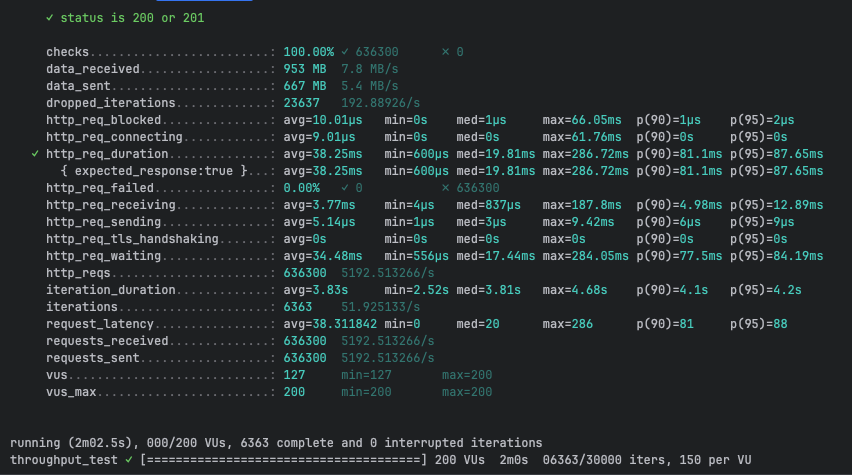
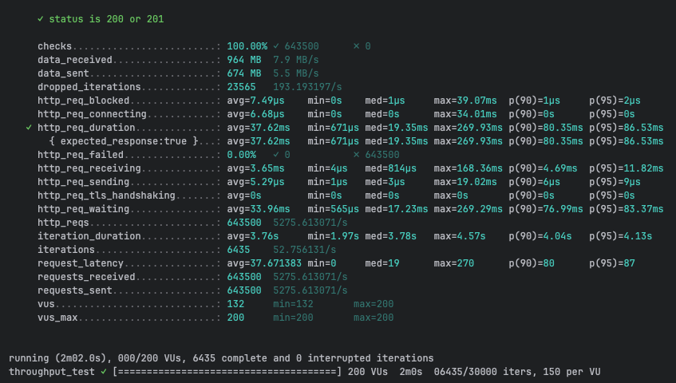
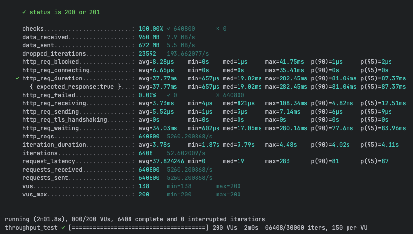
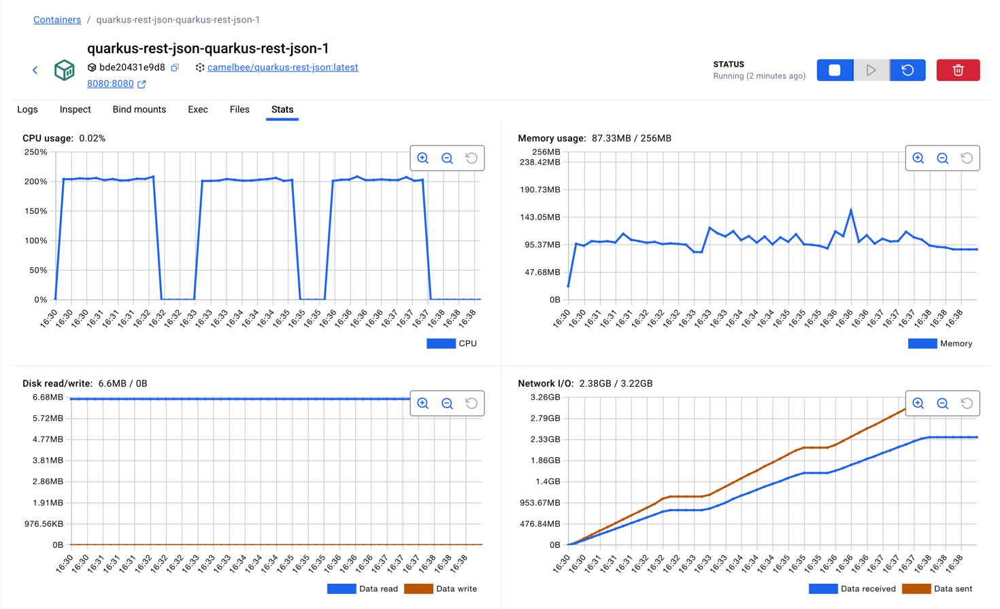

# REST with JSON Performance Testing - CamelBee Microservice (Quarkus Native)

This document outlines the configuration, setup, and performance test results for a CamelBee-generated REST microservice using JSON serialization, compiled to native executable with GraalVM.

## Microservice Creation

The microservice was created using the [CamelBee Initializer](https://www.camelbee.io) with the following configuration:

- **Interface**: REST with JSON serialization
- **Runtime**: Quarkus Native
- **Backend**: MOCK (no external dependencies)

After generating and downloading the microservice from CamelBee, apply the following configurations for optimal performance testing.

## Configuration

### Application Configuration

After creating the microservice, update the `application.yml` with the following settings to disable all interceptors:

```yaml
camelbee:
  # when enabled registers the CamelBee event notifier to the Camel context
  notifier-enabled: false
  # when enabled configures stream caching, MDC logging and CamelBeeUnitOfWork for routes
  route-configurer-enabled: false
  # when enabled it allows the CamelBee WebGL application to fetch the topology of the Camel Context
  context-enabled: false
  # when enabled intercepts/traces request and responses of all camel components and caches messages
  tracer-enabled: false
  # maximum time the tracer can remain idle before deactivation tracing of messages
  tracer-max-idle-time: 60000
  # maximum collected trace messages
  tracer-max-messages-count: 10000
  # when enabled it logs the messages exchanged between endpoints
  logging-enabled: false
```

### Docker Compose Configuration

Update the CPU allocation in `docker-compose-native.yml` to **2 cores** with reduced memory for native mode:

```yaml
deploy:
  resources:
    limits:
      cpus: '2'      # Updated from default to 2 cores
      memory: 256M   # Native requires significantly less memory
    reservations:
      cpus: '1'
      memory: 128M
```

> **Note**: Native executables require significantly less memory than JVM-based applications. The memory limit is set to 256MB (vs 1GB for JVM), demonstrating Quarkus Native's efficiency.

## Build and Deployment

### Build Native Executable

```bash
# Build native executable using container build (no local GraalVM required)
./mvnw package -Dnative -Dquarkus.native.container-build=true -DskipTests

# Start the Docker container with native profile
docker compose -f docker-compose-native.yml up --build -d
```

> **Note**: Native compilation takes longer (several minutes) but produces a highly optimized executable with instant startup time and minimal memory footprint.

## Performance Testing

### Test Setup

- **Tool**: k6 load testing tool
- **Test File**: `rest-throughput-test.js` (located in `docs/k6/grpc/`)
- **Protocol**: REST with JSON serialization
- **VUs (Virtual Users)**: 200
- **Duration**: 2 minutes per run
- **Warm-up**: Native executables show consistent performance; ran test 3 times

### Test Execution

```bash
cd docs/k6/grpc
k6 run rest-throughput-test.js
```

## Performance Results

### Run 1 - Initial Run

```
Duration: 2m02.5s
✓ checks.........................: 100.00% ✓ 636,300  ✗ 0
  data_received..................: 953 MB  7.8 MB/s
  data_sent......................: 667 MB  5.4 MB/s
  dropped_iterations.............: 23,637  192.89/s
✓ http_req_duration..............: avg=38.25ms  min=600µs    med=19.81ms  max=286.72ms
                                   p(90)=81.1ms  p(95)=87.65ms
  http_req_failed................: 0.00%   ✓ 0  ✗ 636,300
  http_req_receiving.............: avg=3.77ms   min=4µs      med=837µs    max=187.8ms
  http_req_sending...............: avg=5.14µs   min=1µs      med=3µs      max=9.42ms
  http_req_waiting...............: avg=34.48ms  min=556µs    med=17.44ms  max=284.05ms
  http_reqs......................: 636,300  5,192.51/s
  iteration_duration.............: avg=3.83s    min=2.52s    med=3.81s    max=4.68s
  iterations.....................: 6,363   51.93/s
```

**Throughput**: ~5,193 requests/second

**Screenshot of the result:**



---

### Run 2 - Second Run

```
Duration: 2m02.0s
✓ checks.........................: 100.00% ✓ 643,500  ✗ 0
  data_received..................: 964 MB  7.9 MB/s
  data_sent......................: 674 MB  5.5 MB/s
  dropped_iterations.............: 23,565  193.19/s
✓ http_req_duration..............: avg=37.62ms  min=671µs    med=19.35ms  max=269.93ms
                                   p(90)=80.35ms  p(95)=86.53ms
  http_req_failed................: 0.00%   ✓ 0  ✗ 643,500
  http_req_receiving.............: avg=3.65ms   min=4µs      med=814µs    max=168.36ms
  http_req_sending...............: avg=5.29µs   min=1µs      med=3µs      max=19.02ms
  http_req_waiting...............: avg=33.96ms  min=565µs    med=17.23ms  max=269.29ms
  http_reqs......................: 643,500  5,275.61/s
  iteration_duration.............: avg=3.76s    min=1.97s    med=3.78s    max=4.57s
  iterations.....................: 6,435   52.76/s
```

**Throughput**: ~5,276 requests/second
**Improvement**: +1.6% from Run 1

**Screenshot of the result:**



---

### Run 3 - Final Run

```
Duration: 2m01.8s
✓ checks.........................: 100.00% ✓ 640,800  ✗ 0
  data_received..................: 960 MB  7.9 MB/s
  data_sent......................: 672 MB  5.5 MB/s
  dropped_iterations.............: 23,592  193.66/s
✓ http_req_duration..............: avg=37.77ms  min=657µs    med=19.02ms  max=282.45ms
                                   p(90)=81.04ms  p(95)=87.37ms
  http_req_failed................: 0.00%   ✓ 0  ✗ 640,800
  http_req_receiving.............: avg=3.73ms   min=4µs      med=821µs    max=108.34ms
  http_req_sending...............: avg=5.52µs   min=1µs      med=3µs      max=7.14ms
  http_req_waiting...............: avg=34.03ms  min=602µs    med=17.05ms  max=280.16ms
  http_reqs......................: 640,800  5,260.20/s
  iteration_duration.............: avg=3.78s    min=1.87s    med=3.79s    max=4.48s
  iterations.....................: 6,408   52.60/s
```

**Throughput**: ~5,260 requests/second
**Improvement**: +1.3% from Run 1

**Screenshot of the result:**



---

## Performance Summary

| Metric | Run 1 | Run 2 | Run 3 |
|--------|-------|-------|-------|
| **Throughput (req/s)** | 5,193 | 5,276 | 5,260 |
| **Avg Latency (ms)** | 38.25 | 37.62 | 37.77 |
| **Median Latency (ms)** | 19.81 | 19.35 | 19.02 |
| **P90 Latency (ms)** | 81.1 | 80.35 | 81.04 |
| **P95 Latency (ms)** | 87.65 | 86.53 | 87.37 |
| **Max Latency (ms)** | 286.72 | 269.93 | 282.45 |
| **Total Requests** | 636,300 | 643,500 | 640,800 |
| **Success Rate** | 100% | 100% | 100% |

## Key Observations

1. **Consistent Performance**: Native executables show remarkably stable performance across runs with minimal variance
2. **Stable Throughput**: Achieved ~5.2K requests/second consistently
3. **Predictable Latency**: Average latency around 37-38ms with consistent P90/P95 values
4. **Exceptional Memory Efficiency**: Uses only ~87MB memory with stable consumption
5. **Instant Startup**: Native executables start in milliseconds, ideal for serverless and dynamic scaling
6. **Zero Failures**: 100% success rate across all test runs
7. **JSON Processing**: Text-based JSON serialization with minimal memory overhead in native mode

## Container Resource Usage

During the performance tests, the container exhibited the following resource utilization patterns:

- **CPU Usage**: Peak at ~210% (utilizing 2 CPU cores effectively), averaging ~0.02% during idle periods
- **Memory Usage**: Stable at ~87.3MB out of 256MB allocated (34.1% utilization)
    - Exceptional memory efficiency with very low and stable consumption throughout all tests
    - Native executable's minimal memory footprint ideal for cloud-native deployments
- **Disk Read/Write**: 6.6MB read / 0B write
- **Network I/O**: 2.38GB received / 3.22GB sent across all three test runs

The CPU graph shows three clear spikes corresponding to each test run, demonstrating efficient utilization of the allocated resources. Memory usage remained exceptionally stable at ~87MB throughout all tests, demonstrating the native executable's minimal memory footprint and predictable resource consumption even with JSON processing.

**Screenshot of Docker container statistics:**



## Recommendations

1. **Production Deployment**: Disable all CamelBee interceptors as shown in the configuration for optimal performance
2. **Resource Allocation**: 2 CPU cores with only 256MB memory is sufficient for native mode
3. **Warm-up Strategy**: Native executables show consistent performance with minimal warm-up requirements
4. **Monitoring**: Track memory usage and startup times as key metrics for native deployments
5. **Cost Efficiency**: Native mode's extremely low memory requirements (~87MB) can significantly reduce cloud infrastructure costs
6. **Serialization Choice**: JSON provides human-readable payloads with reasonable performance in native mode

## Environment

- **Runtime**: Quarkus Native (GraalVM compiled)
- **Protocol**: REST (HTTP/1.1) with JSON serialization
- **Container**: Docker
- **Resource Limits**: 2 CPUs, 256MB memory
- **Test Load**: 200 concurrent virtual users
- **Compilation**: Container-based native build (no local GraalVM required)
