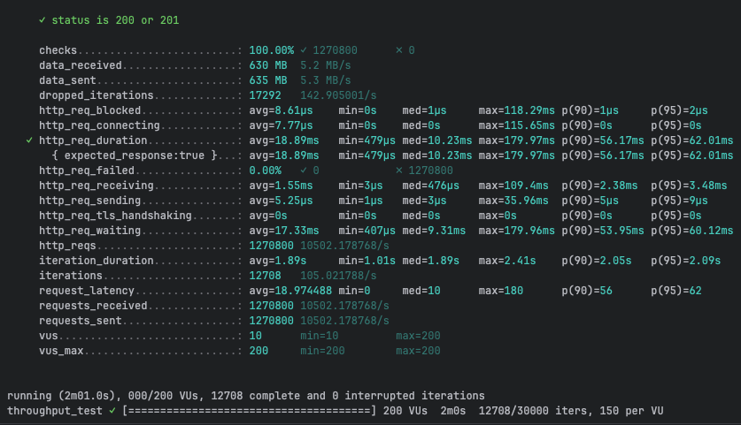
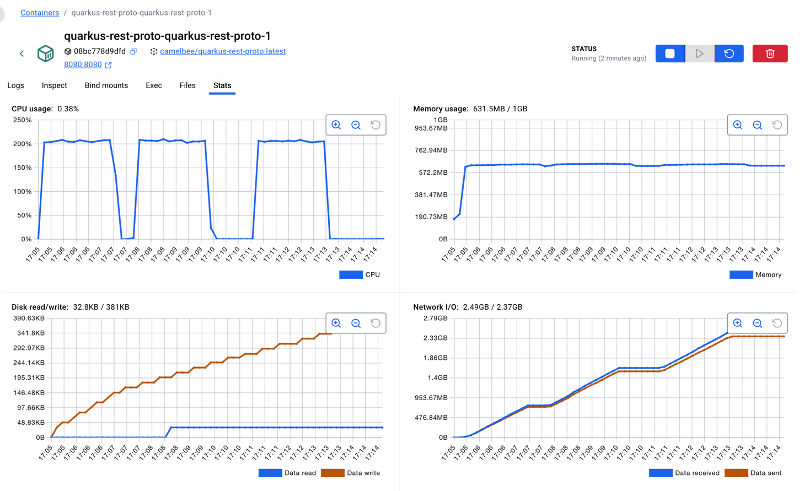

# REST with Protobuf Performance Testing - CamelBee Microservice (Quarkus JVM)

This document outlines the configuration, setup, and performance test results for a CamelBee-generated REST microservice using Protocol Buffers serialization on Quarkus JVM.

## Microservice Creation

The microservice was created using the [CamelBee Initializer](https://www.camelbee.io) with the following configuration:

- **Interface**: REST with Protocol Buffers (Protobuf) serialization
- **Runtime**: Quarkus JVM
- **Backend**: MOCK (no external dependencies)

After generating and downloading the microservice from CamelBee, apply the following configurations for optimal performance testing.

## Configuration

### Application Configuration

After creating the microservice, update the `application.yml` with the following settings to disable all interceptors:

```yaml
camelbee:
  # when enabled registers the CamelBee event notifier to the Camel context
  notifier-enabled: false
  # when enabled configures stream caching, MDC logging and CamelBeeUnitOfWork for routes
  route-configurer-enabled: false
  # when enabled it allows the CamelBee WebGL application to fetch the topology of the Camel Context
  context-enabled: false
  # when enabled intercepts/traces request and responses of all camel components and caches messages
  tracer-enabled: false
  # maximum time the tracer can remain idle before deactivation tracing of messages
  tracer-max-idle-time: 60000
  # maximum collected trace messages
  tracer-max-messages-count: 10000
  # when enabled it logs the messages exchanged between endpoints
  logging-enabled: false
```

### Docker Compose Configuration

Update the CPU allocation in `docker-compose.yml` to **2 cores** for optimal performance:

```yaml
deploy:
  resources:
    limits:
      cpus: '2'      # Updated from default to 2 cores
      memory: 1G
    reservations:
      cpus: '1'
      memory: 1G
```

> **Note**: Increasing the CPU limit to 2 cores significantly improves throughput and allows the microservice to handle higher concurrent loads efficiently.

## Build and Deployment

### Build Steps

```bash
# Make the Maven wrapper executable
chmod +x mvnw

# Package the application (skip tests for faster build)
./mvnw package -DskipTests

# Start the Docker container
docker compose up --build -d
```

## Performance Testing

### Test Setup

- **Tool**: k6 load testing tool
- **Test File**: `rest-throughput-test-proto.js` (located in `docs/k6/grpc/`)
- **Protocol**: REST with Protocol Buffers serialization
- **VUs (Virtual Users)**: 200
- **Duration**: 2 minutes per run
- **Warm-up**: 2 test runs to ensure JVM optimization, 3rd run for final results

### Test Execution

```bash
cd docs/k6/grpc
k6 run rest-throughput-test-proto.js
```

## Performance Results

### Run 1 - Initial Warm-up

```
Duration: 2m01.1s
✓ checks.........................: 100.00% ✓ 1,130,900  ✗ 0
  data_received..................: 561 MB  4.6 MB/s
  data_sent......................: 566 MB  4.7 MB/s
  dropped_iterations.............: 18,691  154.31/s
✓ http_req_duration..............: avg=21.26ms  min=471µs    med=10.52ms  max=1s
                                   p(90)=58.9ms  p(95)=67.74ms
  http_req_failed................: 0.00%   ✓ 0  ✗ 1,130,900
  http_req_receiving.............: avg=1.8ms    min=3µs      med=488µs    max=387.49ms
  http_req_sending...............: avg=6.42µs   min=1µs      med=3µs      max=29ms
  http_req_waiting...............: avg=19.45ms  min=421µs    med=9.55ms   max=706.63ms
  http_reqs......................: 1,130,900  9,336.55/s
  iteration_duration.............: avg=2.13s    min=1.11s    med=1.9s     max=11.1s
  iterations.....................: 11,309   93.37/s
```

**Throughput**: ~9,337 requests/second

**Screenshot of the result:**


---

### Run 2 - JVM Optimization Phase

```
Duration: 2m01.0s
✓ checks.........................: 100.00% ✓ 1,258,100  ✗ 0
  data_received..................: 624 MB  5.2 MB/s
  data_sent......................: 629 MB  5.2 MB/s
  dropped_iterations.............: 17,419  143.99/s
✓ http_req_duration..............: avg=19.09ms  min=432µs    med=10.32ms  max=206.22ms
                                   p(90)=56.63ms  p(95)=62.55ms
  http_req_failed................: 0.00%   ✓ 0  ✗ 1,258,100
  http_req_receiving.............: avg=1.58ms   min=3µs      med=480µs    max=86.95ms
  http_req_sending...............: avg=5.59µs   min=1µs      med=3µs      max=45.93ms
  http_req_waiting...............: avg=17.5ms   min=385µs    med=9.39ms   max=195.08ms
  http_reqs......................: 1,258,100  10,399.68/s
  iteration_duration.............: avg=1.91s    min=983.2ms  med=1.9s     max=2.4s
  iterations.....................: 12,581   104.00/s
```

**Throughput**: ~10,400 requests/second
**Improvement**: +11.4% from Run 1

**Screenshot of the result:**


---

### Run 3 - Optimized Performance

```
Duration: 2m01.0s
✓ checks.........................: 100.00% ✓ 1,270,800  ✗ 0
  data_received..................: 630 MB  5.2 MB/s
  data_sent......................: 635 MB  5.3 MB/s
  dropped_iterations.............: 17,292  142.91/s
✓ http_req_duration..............: avg=18.89ms  min=479µs    med=10.23ms  max=179.97ms
                                   p(90)=56.17ms  p(95)=62.01ms
  http_req_failed................: 0.00%   ✓ 0  ✗ 1,270,800
  http_req_receiving.............: avg=1.55ms   min=3µs      med=476µs    max=109.4ms
  http_req_sending...............: avg=5.25µs   min=1µs      med=3µs      max=35.96ms
  http_req_waiting...............: avg=17.33ms  min=407µs    med=9.31ms   max=179.96ms
  http_reqs......................: 1,270,800  10,502.18/s
  iteration_duration.............: avg=1.89s    min=1.01s    med=1.89s    max=2.41s
  iterations.....................: 12,708   105.02/s
```

**Throughput**: ~10,502 requests/second
**Improvement**: +12.5% from Run 1, +1.0% from Run 2

**Screenshot of the result:**



---

## Performance Summary

| Metric | Run 1 | Run 2 | Run 3 |
|--------|-------|-------|-------|
| **Throughput (req/s)** | 9,337 | 10,400 | 10,502 |
| **Avg Latency (ms)** | 21.26 | 19.09 | 18.89 |
| **Median Latency (ms)** | 10.52 | 10.32 | 10.23 |
| **P90 Latency (ms)** | 58.9 | 56.63 | 56.17 |
| **P95 Latency (ms)** | 67.74 | 62.55 | 62.01 |
| **Max Latency (ms)** | 1,000 | 206.22 | 179.97 |
| **Total Requests** | 1,130,900 | 1,258,100 | 1,270,800 |
| **Success Rate** | 100% | 100% | 100% |

## Key Observations

1. **JVM Warm-up Effect**: Performance improved by ~12.5% after warm-up, demonstrating effective JIT compilation
2. **High Throughput**: Achieved stable ~10.5K requests/second after warm-up
3. **Low Latency**: Median latency consistently around 10ms
4. **Zero Failures**: 100% success rate across all test runs
5. **Efficient Protocol Buffers**: Binary serialization provides excellent performance with compact payloads
6. **Stable Performance**: Latency variance decreased significantly after warm-up (max latency improved from 1s to ~180ms)

## Container Resource Usage

During the performance tests, the container exhibited the following resource utilization patterns:

- **CPU Usage**: Peak at ~210% (utilizing 2 CPU cores effectively), averaging ~0.38% during idle periods
- **Memory Usage**: Stable at ~631.5MB out of 1GB allocated (63.2% utilization)
- **Disk Read/Write**: 32.8KB read / 381KB write
- **Network I/O**: 2.49GB received / 2.37GB sent across all three test runs

The CPU graph shows three clear spikes corresponding to each test run, demonstrating efficient utilization of the allocated resources. Memory usage remained stable throughout at a similar footprint to gRPC, indicating consistent resource consumption for Protobuf-based protocols.

**Screenshot of Docker container statistics:**



## Recommendations

1. **Production Deployment**: Disable all CamelBee interceptors as shown in the configuration for optimal performance
2. **Resource Allocation**: 2 CPU cores and 1GB memory provides excellent performance for this workload
3. **Warm-up Strategy**: Perform at least 2 warm-up runs before measuring production performance
4. **Monitoring**: Track P95 and P99 latencies in production to catch performance degradation early
5. **Protocol Buffers Advantage**: Binary serialization offers better performance and smaller payloads compared to JSON

## REST with Protobuf vs gRPC Observations

While both use Protocol Buffers, REST and gRPC show different characteristics:

**REST with Protobuf Characteristics:**
- HTTP/1.1 based with binary Protobuf payloads
- Similar throughput to gRPC (~10.5K vs ~11K req/s)
- Slightly higher median latency (~10ms vs ~14ms for gRPC)
- More predictable latency distribution
- Better compatibility with existing HTTP infrastructure
- Easier debugging with standard HTTP tools

## Environment

- **Runtime**: Quarkus JVM with Apache Camel
- **Protocol**: REST (HTTP/1.1) with Protocol Buffers serialization
- **Container**: Docker
- **Resource Limits**: 2 CPUs, 1GB memory
- **Test Load**: 200 concurrent virtual users
