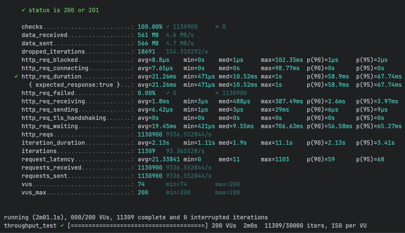
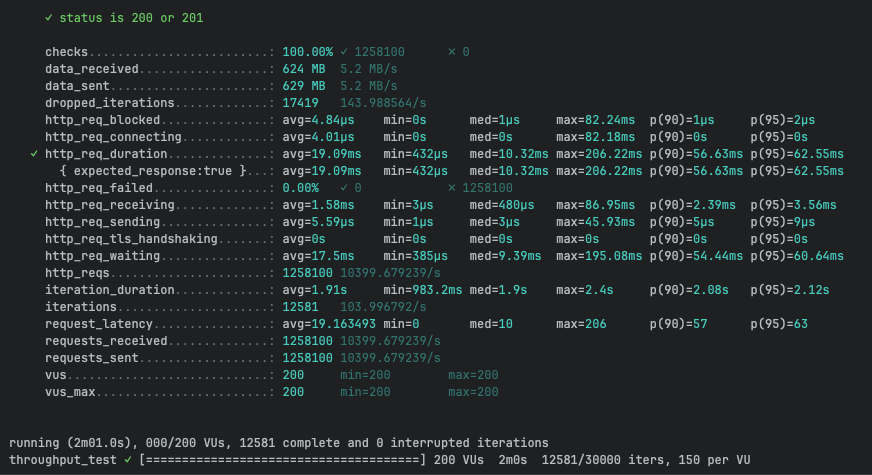

NOTE after creating the micreoservoce update the application yaml like below, set all the interceptors to false

camelbee:
# when enabled registers the CamelBee event notifier to the Camel context
notifier-enabled: false
# when enabled configures stream caching, MDC logging and CamelBeeUnitOfWork for routes
route-configurer-enabled: false
# when enabled it allows the CamelBe WebGL application to fetch the topology of the Camel Context.
context-enabled: false
# when enabled intercepts/traces request and responses of all camel components and caches messages.
tracer-enabled: false
# maximum time the tracer can remain idle before deactivation tracing of messages.
tracer-max-idle-time: 60000
# maximum collected trace messages
tracer-max-messages-count: 10000
# when enabled it logs the messages exchanged between endpoints
logging-enabled: false

and in docker compoes: updated CPU as 2

    deploy:
      resources:
        limits:
          cpus: '2'
          memory: 1G
        reservations:
          cpus: '1'
          memory: 1G

chmod +x mvnw

./mvnw package -DskipTests

docker compose up --build -d

and then ran the
k6 run grpc-ttt.js  2 time to get the jvm warmed up the third run cloocedted the results:

first run:

k6 run rest-throughput-test-proto.js

     ✓ status is 200 or 201

     checks.........................: 100.00% ✓ 1130900     ✗ 0      
     data_received..................: 561 MB  4.6 MB/s
     data_sent......................: 566 MB  4.7 MB/s
     dropped_iterations.............: 18691   154.310292/s
     http_req_blocked...............: avg=8.8µs    min=0s    med=1µs     max=102.35ms p(90)=1µs     p(95)=2µs    
     http_req_connecting............: avg=7.65µs   min=0s    med=0s      max=98.77ms  p(90)=0s      p(95)=0s     
✓ http_req_duration..............: avg=21.26ms  min=471µs med=10.52ms max=1s       p(90)=58.9ms  p(95)=67.74ms
{ expected_response:true }...: avg=21.26ms  min=471µs med=10.52ms max=1s       p(90)=58.9ms  p(95)=67.74ms
http_req_failed................: 0.00%   ✓ 0           ✗ 1130900
http_req_receiving.............: avg=1.8ms    min=3µs   med=488µs   max=387.49ms p(90)=2.6ms   p(95)=3.97ms
http_req_sending...............: avg=6.42µs   min=1µs   med=3µs     max=29ms     p(90)=6µs     p(95)=9µs    
http_req_tls_handshaking.......: avg=0s       min=0s    med=0s      max=0s       p(90)=0s      p(95)=0s     
http_req_waiting...............: avg=19.45ms  min=421µs med=9.55ms  max=706.63ms p(90)=56.58ms p(95)=65.27ms
http_reqs......................: 1130900 9336.552844/s
iteration_duration.............: avg=2.13s    min=1.11s med=1.9s    max=11.1s    p(90)=2.13s   p(95)=3.41s  
iterations.....................: 11309   93.365528/s
request_latency................: avg=21.33841 min=0     med=11      max=1103     p(90)=59      p(95)=68     
requests_received..............: 1130900 9336.552844/s
requests_sent..................: 1130900 9336.552844/s
vus............................: 74      min=74        max=200  
vus_max........................: 200     min=200       max=200

running (2m01.1s), 000/200 VUs, 11309 complete and 0 interrupted iterations
throughput_test ✓ [======================================] 200 VUs  2m0s  11309/30000 iters, 150 per VU

second run:

k6 run rest-throughput-test-proto.js

     ✓ status is 200 or 201

     checks.........................: 100.00% ✓ 1258100      ✗ 0      
     data_received..................: 624 MB  5.2 MB/s
     data_sent......................: 629 MB  5.2 MB/s
     dropped_iterations.............: 17419   143.988564/s
     http_req_blocked...............: avg=4.84µs    min=0s      med=1µs     max=82.24ms  p(90)=1µs     p(95)=2µs    
     http_req_connecting............: avg=4.01µs    min=0s      med=0s      max=82.18ms  p(90)=0s      p(95)=0s     
✓ http_req_duration..............: avg=19.09ms   min=432µs   med=10.32ms max=206.22ms p(90)=56.63ms p(95)=62.55ms
{ expected_response:true }...: avg=19.09ms   min=432µs   med=10.32ms max=206.22ms p(90)=56.63ms p(95)=62.55ms
http_req_failed................: 0.00%   ✓ 0            ✗ 1258100
http_req_receiving.............: avg=1.58ms    min=3µs     med=480µs   max=86.95ms  p(90)=2.39ms  p(95)=3.56ms
http_req_sending...............: avg=5.59µs    min=1µs     med=3µs     max=45.93ms  p(90)=5µs     p(95)=9µs    
http_req_tls_handshaking.......: avg=0s        min=0s      med=0s      max=0s       p(90)=0s      p(95)=0s     
http_req_waiting...............: avg=17.5ms    min=385µs   med=9.39ms  max=195.08ms p(90)=54.44ms p(95)=60.64ms
http_reqs......................: 1258100 10399.679239/s
iteration_duration.............: avg=1.91s     min=983.2ms med=1.9s    max=2.4s     p(90)=2.08s   p(95)=2.12s  
iterations.....................: 12581   103.996792/s
request_latency................: avg=19.163493 min=0       med=10      max=206      p(90)=57      p(95)=63     
requests_received..............: 1258100 10399.679239/s
requests_sent..................: 1258100 10399.679239/s
vus............................: 200     min=200        max=200  
vus_max........................: 200     min=200        max=200

running (2m01.0s), 000/200 VUs, 12581 complete and 0 interrupted iterations
throughput_test ✓ [======================================] 200 VUs  2m0s  12581/30000 iters, 150 per VU

third run:

k6 run rest-throughput-test-proto.js

     ✓ status is 200 or 201

     checks.........................: 100.00% ✓ 1270800      ✗ 0      
     data_received..................: 630 MB  5.2 MB/s
     data_sent......................: 635 MB  5.3 MB/s
     dropped_iterations.............: 17292   142.905001/s
     http_req_blocked...............: avg=8.61µs    min=0s    med=1µs     max=118.29ms p(90)=1µs     p(95)=2µs    
     http_req_connecting............: avg=7.77µs    min=0s    med=0s      max=115.65ms p(90)=0s      p(95)=0s     
✓ http_req_duration..............: avg=18.89ms   min=479µs med=10.23ms max=179.97ms p(90)=56.17ms p(95)=62.01ms
{ expected_response:true }...: avg=18.89ms   min=479µs med=10.23ms max=179.97ms p(90)=56.17ms p(95)=62.01ms
http_req_failed................: 0.00%   ✓ 0            ✗ 1270800
http_req_receiving.............: avg=1.55ms    min=3µs   med=476µs   max=109.4ms  p(90)=2.38ms  p(95)=3.48ms
http_req_sending...............: avg=5.25µs    min=1µs   med=3µs     max=35.96ms  p(90)=5µs     p(95)=9µs    
http_req_tls_handshaking.......: avg=0s        min=0s    med=0s      max=0s       p(90)=0s      p(95)=0s     
http_req_waiting...............: avg=17.33ms   min=407µs med=9.31ms  max=179.96ms p(90)=53.95ms p(95)=60.12ms
http_reqs......................: 1270800 10502.178768/s
iteration_duration.............: avg=1.89s     min=1.01s med=1.89s   max=2.41s    p(90)=2.05s   p(95)=2.09s  
iterations.....................: 12708   105.021788/s
request_latency................: avg=18.974488 min=0     med=10      max=180      p(90)=56      p(95)=62     
requests_received..............: 1270800 10502.178768/s
requests_sent..................: 1270800 10502.178768/s
vus............................: 10      min=10         max=200  
vus_max........................: 200     min=200        max=200

running (2m01.0s), 000/200 VUs, 12708 complete and 0 interrupted iterations
throughput_test ✓ [======================================] 200 VUs  2m0s  12708/30000 iters, 150 per VU

docker stats:

