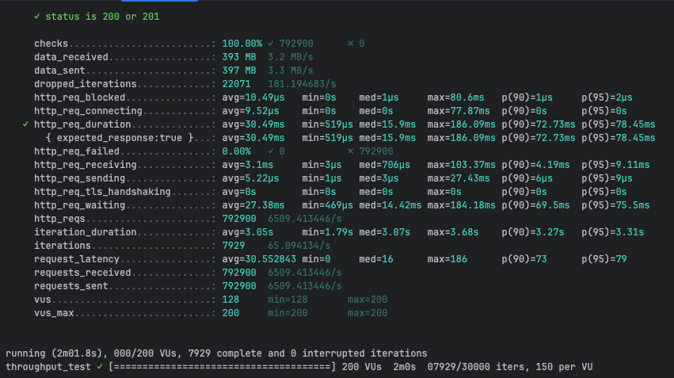
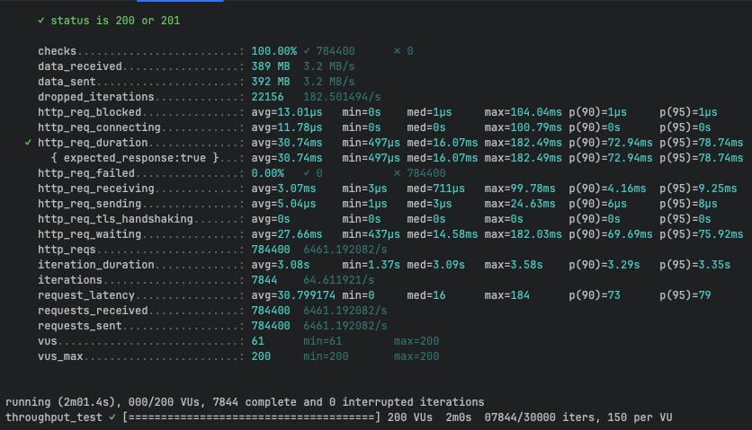

# REST with Protobuf Performance Testing - CamelBee Microservice (Quarkus Native)

This document outlines the configuration, setup, and performance test results for a CamelBee-generated REST microservice using Protocol Buffers serialization, compiled to native executable with GraalVM.

## Microservice Creation

The microservice was created using the [CamelBee Initializer](https://www.camelbee.io) with the following configuration:

- **Interface**: REST with Protocol Buffers (Protobuf) serialization
- **Runtime**: Quarkus Native
- **Backend**: MOCK (no external dependencies)

After generating and downloading the microservice from CamelBee, apply the following configurations for optimal performance testing.

## Configuration

### Application Configuration

After creating the microservice, update the `application.yml` with the following settings to disable all interceptors:

```yaml
camelbee:
  # when enabled registers the CamelBee event notifier to the Camel context
  notifier-enabled: false
  # when enabled configures stream caching, MDC logging and CamelBeeUnitOfWork for routes
  route-configurer-enabled: false
  # when enabled it allows the CamelBee WebGL application to fetch the topology of the Camel Context
  context-enabled: false
  # when enabled intercepts/traces request and responses of all camel components and caches messages
  tracer-enabled: false
  # maximum time the tracer can remain idle before deactivation tracing of messages
  tracer-max-idle-time: 60000
  # maximum collected trace messages
  tracer-max-messages-count: 10000
  # when enabled it logs the messages exchanged between endpoints
  logging-enabled: false
```

### Docker Compose Configuration

Update the CPU allocation in `docker-compose-native.yml` to **2 cores** with reduced memory for native mode:

```yaml
deploy:
  resources:
    limits:
      cpus: '2'      # Updated from default to 2 cores
      memory: 256M   # Native requires significantly less memory
    reservations:
      cpus: '1'
      memory: 128M
```

> **Note**: Native executables require significantly less memory than JVM-based applications. The memory limit is set to 256MB (vs 1GB for JVM), demonstrating Quarkus Native's efficiency.

## Build and Deployment

### Build Native Executable

```bash
# Build native executable using container build (no local GraalVM required)
./mvnw package -Dnative -Dquarkus.native.container-build=true -DskipTests

# Start the Docker container with native profile
docker compose -f docker-compose-native.yml up --build -d
```

> **Note**: Native compilation takes longer (several minutes) but produces a highly optimized executable with instant startup time and minimal memory footprint.

## Performance Testing

### Test Setup

- **Tool**: k6 load testing tool
- **Test File**: `rest-throughput-test-proto.js` (located in `docs/k6/grpc/`)
- **Protocol**: REST with Protocol Buffers serialization
- **VUs (Virtual Users)**: 200
- **Duration**: 2 minutes per run
- **Warm-up**: Native executables show consistent performance; ran test 3 times

### Test Execution

```bash
cd docs/k6/grpc
k6 run rest-throughput-test-proto.js
```

## Performance Results

### Run 1 - Initial Run

```
Duration: 2m01.8s
✓ checks.........................: 100.00% ✓ 792,900  ✗ 0
  data_received..................: 393 MB  3.2 MB/s
  data_sent......................: 397 MB  3.3 MB/s
  dropped_iterations.............: 22,071  181.19/s
✓ http_req_duration..............: avg=30.49ms  min=519µs    med=15.9ms   max=186.09ms
                                   p(90)=72.73ms  p(95)=78.45ms
  http_req_failed................: 0.00%   ✓ 0  ✗ 792,900
  http_req_receiving.............: avg=3.1ms    min=3µs      med=706µs    max=103.37ms
  http_req_sending...............: avg=5.22µs   min=1µs      med=3µs      max=27.43ms
  http_req_waiting...............: avg=27.38ms  min=469µs    med=14.42ms  max=184.18ms
  http_reqs......................: 792,900  6,509.41/s
  iteration_duration.............: avg=3.05s    min=1.79s    med=3.07s    max=3.68s
  iterations.....................: 7,929   65.09/s
```

**Throughput**: ~6,509 requests/second

**Screenshot of the result:**



---

### Run 2 - Second Run

```
Duration: 2m01.8s
✓ checks.........................: 100.00% ✓ 795,200  ✗ 0
  data_received..................: 394 MB  3.2 MB/s
  data_sent......................: 398 MB  3.3 MB/s
  dropped_iterations.............: 22,048  180.94/s
✓ http_req_duration..............: avg=30.4ms   min=627µs    med=16.18ms  max=192.09ms
                                   p(90)=72.13ms  p(95)=78.27ms
  http_req_failed................: 0.00%   ✓ 0  ✗ 795,200
  http_req_receiving.............: avg=3.05ms   min=4µs      med=714µs    max=121.87ms
  http_req_sending...............: avg=4.73µs   min=1µs      med=3µs      max=15.51ms
  http_req_waiting...............: avg=27.34ms  min=524µs    med=14.57ms  max=180.8ms
  http_reqs......................: 795,200  6,526.10/s
  iteration_duration.............: avg=3.04s    min=1.83s    med=3.06s    max=3.59s
  iterations.....................: 7,952   65.26/s
```

**Throughput**: ~6,526 requests/second
**Improvement**: +0.3% from Run 1

**Screenshot of the result:**


---

### Run 3 - Final Run

```
Duration: 2m01.4s
✓ checks.........................: 100.00% ✓ 784,400  ✗ 0
  data_received..................: 389 MB  3.2 MB/s
  data_sent......................: 392 MB  3.2 MB/s
  dropped_iterations.............: 22,156  182.50/s
✓ http_req_duration..............: avg=30.74ms  min=497µs    med=16.07ms  max=182.49ms
                                   p(90)=72.94ms  p(95)=78.74ms
  http_req_failed................: 0.00%   ✓ 0  ✗ 784,400
  http_req_receiving.............: avg=3.07ms   min=3µs      med=711µs    max=99.78ms
  http_req_sending...............: avg=5.04µs   min=1µs      med=3µs      max=24.63ms
  http_req_waiting...............: avg=27.66ms  min=437µs    med=14.58ms  max=182.03ms
  http_reqs......................: 784,400  6,461.19/s
  iteration_duration.............: avg=3.08s    min=1.37s    med=3.09s    max=3.58s
  iterations.....................: 7,844   64.61/s
```

**Throughput**: ~6,461 requests/second
**Difference**: -0.7% from Run 1

**Screenshot of the result:**



---

## Performance Summary

| Metric | Run 1 | Run 2 | Run 3 |
|--------|-------|-------|-------|
| **Throughput (req/s)** | 6,509 | 6,526 | 6,461 |
| **Avg Latency (ms)** | 30.49 | 30.4 | 30.74 |
| **Median Latency (ms)** | 15.9 | 16.18 | 16.07 |
| **P90 Latency (ms)** | 72.73 | 72.13 | 72.94 |
| **P95 Latency (ms)** | 78.45 | 78.27 | 78.74 |
| **Max Latency (ms)** | 186.09 | 192.09 | 182.49 |
| **Total Requests** | 792,900 | 795,200 | 784,400 |
| **Success Rate** | 100% | 100% | 100% |

## Key Observations

1. **Consistent Performance**: Native executables show remarkably stable performance across runs
2. **Stable Throughput**: Achieved ~6.5K requests/second consistently with minimal variance
3. **Predictable Latency**: Average latency around 30ms with very consistent P90/P95 values
4. **Exceptional Memory Efficiency**: Uses only ~77MB memory with stable consumption
5. **Instant Startup**: Native executables start in milliseconds, ideal for serverless and dynamic scaling
6. **Zero Failures**: 100% success rate across all test runs
7. **Lower Latency Variance**: Max latency remained under 200ms across all runs

## Container Resource Usage

During the performance tests, the container exhibited the following resource utilization patterns:

- **CPU Usage**: Peak at ~210% (utilizing 2 CPU cores effectively), averaging ~0.02% during idle periods
- **Memory Usage**: Stable at ~77.7MB out of 256MB allocated (30.4% utilization)
    - Exceptional memory efficiency with very low and stable consumption throughout all tests
    - Native executable's minimal memory footprint ideal for cloud-native deployments
- **Disk Read/Write**: 0B read / 0B write
- **Network I/O**: 1.63GB received / 1.57GB sent across all three test runs

The CPU graph shows three clear spikes corresponding to each test run, demonstrating efficient utilization of the allocated resources. Memory usage remained exceptionally stable at ~77MB throughout all tests, demonstrating the native executable's minimal memory footprint and predictable resource consumption.

**Screenshot of Docker container statistics:**


## Recommendations

1. **Production Deployment**: Disable all CamelBee interceptors as shown in the configuration for optimal performance
2. **Resource Allocation**: 2 CPU cores with only 256MB memory is sufficient for native mode
3. **Warm-up Strategy**: Native executables show consistent performance with minimal warm-up requirements
4. **Monitoring**: Track memory usage and startup times as key metrics for native deployments
5. **Cost Efficiency**: Native mode's extremely low memory requirements (~77MB) can significantly reduce cloud infrastructure costs
6. **Protocol Choice**: REST with Protobuf provides good HTTP compatibility while maintaining binary serialization efficiency

## Environment

- **Runtime**: Quarkus Native (GraalVM compiled)
- **Protocol**: REST (HTTP/1.1) with Protocol Buffers serialization
- **Container**: Docker
- **Resource Limits**: 2 CPUs, 256MB memory
- **Test Load**: 200 concurrent virtual users
- **Compilation**: Container-based native build (no local GraalVM required)
