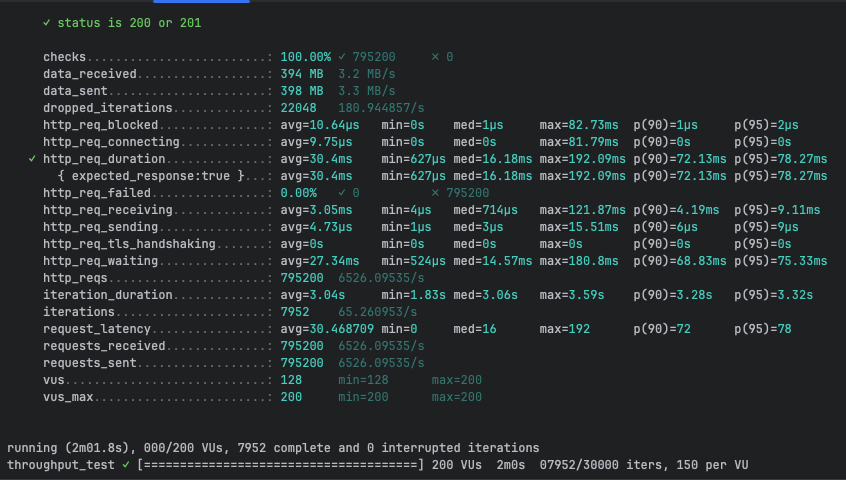
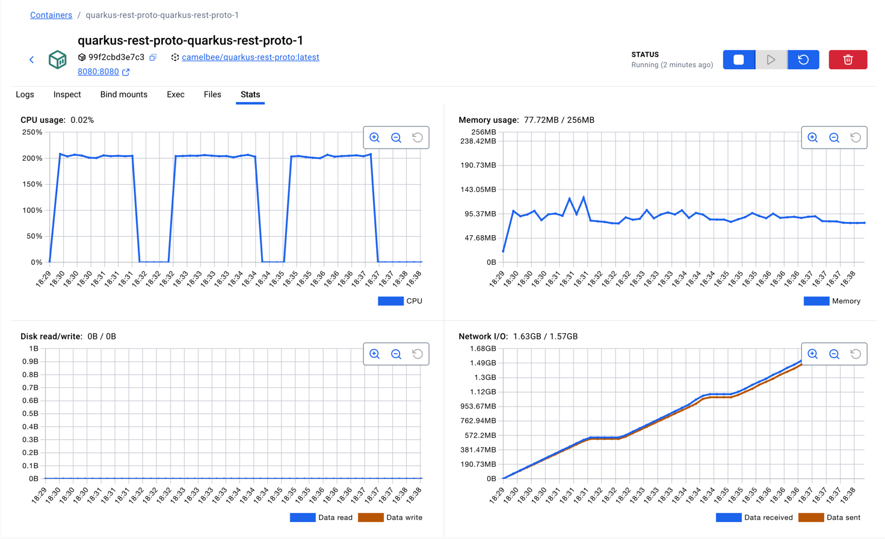

NOTE after creating the micreoservoce update the application yaml like below, set all the interceptors to false

camelbee:
# when enabled registers the CamelBee event notifier to the Camel context
notifier-enabled: false
# when enabled configures stream caching, MDC logging and CamelBeeUnitOfWork for routes
route-configurer-enabled: false
# when enabled it allows the CamelBe WebGL application to fetch the topology of the Camel Context.
context-enabled: false
# when enabled intercepts/traces request and responses of all camel components and caches messages.
tracer-enabled: false
# maximum time the tracer can remain idle before deactivation tracing of messages.
tracer-max-idle-time: 60000
# maximum collected trace messages
tracer-max-messages-count: 10000
# when enabled it logs the messages exchanged between endpoints
logging-enabled: false

and in docker-compose-native: updated CPU as 2

    deploy:
      resources:
        limits:
          cpus: '2'
          memory: 256M
        reservations:
          cpus: '1'
          memory: 128M

build native executable:

./mvnw package -Dnative -Dquarkus.native.container-build=true -DskipTests

docker compose -f docker-compose-native.yml up --build -d

and then ran the k6 test script:

rest-throughput-test-proto.js 3 times

first run:

k6 run rest-throughput-test-proto.js

     ✓ status is 200 or 201

     checks.........................: 100.00% ✓ 792900      ✗ 0     
     data_received..................: 393 MB  3.2 MB/s
     data_sent......................: 397 MB  3.3 MB/s
     dropped_iterations.............: 22071   181.194683/s
     http_req_blocked...............: avg=10.49µs   min=0s    med=1µs     max=80.6ms   p(90)=1µs     p(95)=2µs    
     http_req_connecting............: avg=9.52µs    min=0s    med=0s      max=77.87ms  p(90)=0s      p(95)=0s     
✓ http_req_duration..............: avg=30.49ms   min=519µs med=15.9ms  max=186.09ms p(90)=72.73ms p(95)=78.45ms
{ expected_response:true }...: avg=30.49ms   min=519µs med=15.9ms  max=186.09ms p(90)=72.73ms p(95)=78.45ms
http_req_failed................: 0.00%   ✓ 0           ✗ 792900
http_req_receiving.............: avg=3.1ms     min=3µs   med=706µs   max=103.37ms p(90)=4.19ms  p(95)=9.11ms
http_req_sending...............: avg=5.22µs    min=1µs   med=3µs     max=27.43ms  p(90)=6µs     p(95)=9µs    
http_req_tls_handshaking.......: avg=0s        min=0s    med=0s      max=0s       p(90)=0s      p(95)=0s     
http_req_waiting...............: avg=27.38ms   min=469µs med=14.42ms max=184.18ms p(90)=69.5ms  p(95)=75.5ms
http_reqs......................: 792900  6509.413446/s
iteration_duration.............: avg=3.05s     min=1.79s med=3.07s   max=3.68s    p(90)=3.27s   p(95)=3.31s  
iterations.....................: 7929    65.094134/s
request_latency................: avg=30.552843 min=0     med=16      max=186      p(90)=73      p(95)=79     
requests_received..............: 792900  6509.413446/s
requests_sent..................: 792900  6509.413446/s
vus............................: 128     min=128       max=200
vus_max........................: 200     min=200       max=200

running (2m01.8s), 000/200 VUs, 7929 complete and 0 interrupted iterations
throughput_test ✓ [======================================] 200 VUs  2m0s  07929/30000 iters, 150 per VU

second run:

     ✓ status is 200 or 201

     checks.........................: 100.00% ✓ 795200     ✗ 0     
     data_received..................: 394 MB  3.2 MB/s
     data_sent......................: 398 MB  3.3 MB/s
     dropped_iterations.............: 22048   180.944857/s
     http_req_blocked...............: avg=10.64µs   min=0s    med=1µs     max=82.73ms  p(90)=1µs     p(95)=2µs    
     http_req_connecting............: avg=9.75µs    min=0s    med=0s      max=81.79ms  p(90)=0s      p(95)=0s     
✓ http_req_duration..............: avg=30.4ms    min=627µs med=16.18ms max=192.09ms p(90)=72.13ms p(95)=78.27ms
{ expected_response:true }...: avg=30.4ms    min=627µs med=16.18ms max=192.09ms p(90)=72.13ms p(95)=78.27ms
http_req_failed................: 0.00%   ✓ 0          ✗ 795200
http_req_receiving.............: avg=3.05ms    min=4µs   med=714µs   max=121.87ms p(90)=4.19ms  p(95)=9.11ms
http_req_sending...............: avg=4.73µs    min=1µs   med=3µs     max=15.51ms  p(90)=6µs     p(95)=9µs    
http_req_tls_handshaking.......: avg=0s        min=0s    med=0s      max=0s       p(90)=0s      p(95)=0s     
http_req_waiting...............: avg=27.34ms   min=524µs med=14.57ms max=180.8ms  p(90)=68.83ms p(95)=75.33ms
http_reqs......................: 795200  6526.09535/s
iteration_duration.............: avg=3.04s     min=1.83s med=3.06s   max=3.59s    p(90)=3.28s   p(95)=3.32s  
iterations.....................: 7952    65.260953/s
request_latency................: avg=30.468709 min=0     med=16      max=192      p(90)=72      p(95)=78     
requests_received..............: 795200  6526.09535/s
requests_sent..................: 795200  6526.09535/s
vus............................: 128     min=128      max=200
vus_max........................: 200     min=200      max=200

running (2m01.8s), 000/200 VUs, 7952 complete and 0 interrupted iterations
throughput_test ✓ [======================================] 200 VUs  2m0s  07952/30000 iters, 150 per VU

third run:

     ✓ status is 200 or 201

     checks.........................: 100.00% ✓ 784400      ✗ 0     
     data_received..................: 389 MB  3.2 MB/s
     data_sent......................: 392 MB  3.2 MB/s
     dropped_iterations.............: 22156   182.501494/s
     http_req_blocked...............: avg=13.01µs   min=0s    med=1µs     max=104.04ms p(90)=1µs     p(95)=1µs    
     http_req_connecting............: avg=11.78µs   min=0s    med=0s      max=100.79ms p(90)=0s      p(95)=0s     
✓ http_req_duration..............: avg=30.74ms   min=497µs med=16.07ms max=182.49ms p(90)=72.94ms p(95)=78.74ms
{ expected_response:true }...: avg=30.74ms   min=497µs med=16.07ms max=182.49ms p(90)=72.94ms p(95)=78.74ms
http_req_failed................: 0.00%   ✓ 0           ✗ 784400
http_req_receiving.............: avg=3.07ms    min=3µs   med=711µs   max=99.78ms  p(90)=4.16ms  p(95)=9.25ms
http_req_sending...............: avg=5.04µs    min=1µs   med=3µs     max=24.63ms  p(90)=6µs     p(95)=8µs    
http_req_tls_handshaking.......: avg=0s        min=0s    med=0s      max=0s       p(90)=0s      p(95)=0s     
http_req_waiting...............: avg=27.66ms   min=437µs med=14.58ms max=182.03ms p(90)=69.69ms p(95)=75.92ms
http_reqs......................: 784400  6461.192082/s
iteration_duration.............: avg=3.08s     min=1.37s med=3.09s   max=3.58s    p(90)=3.29s   p(95)=3.35s  
iterations.....................: 7844    64.611921/s
request_latency................: avg=30.799174 min=0     med=16      max=184      p(90)=73      p(95)=79     
requests_received..............: 784400  6461.192082/s
requests_sent..................: 784400  6461.192082/s
vus............................: 61      min=61        max=200
vus_max........................: 200     min=200       max=200

running (2m01.4s), 000/200 VUs, 7844 complete and 0 interrupted iterations
throughput_test ✓ [======================================] 200 VUs  2m0s  07844/30000 iters, 150 per VU

docker container stats:

