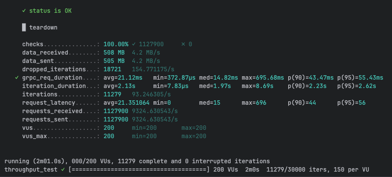
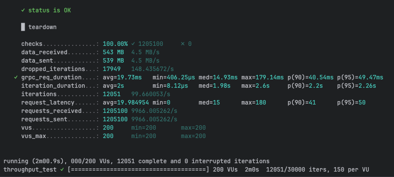
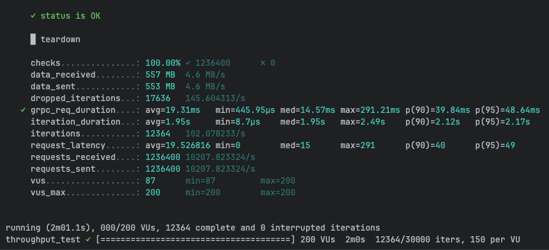
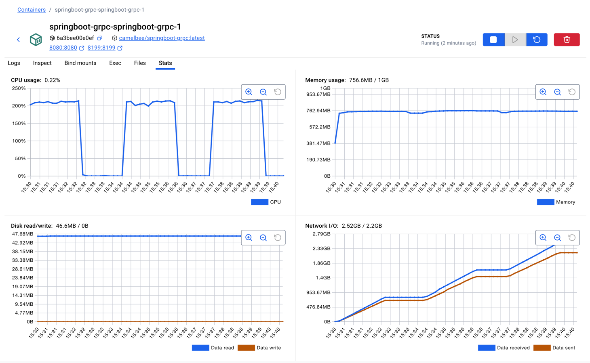

# gRPC Performance Testing - CamelBee Microservice

This document outlines the configuration, setup, and performance test results for a CamelBee-generated gRPC microservice.

## Microservice Creation

The microservice was created using the [CamelBee Initializer](https://www.camelbee.io) with the following configuration:

- **Interface**: gRPC (unary RPC)
- **Runtime**: Spring Boot
- **Backend**: MOCK (no external dependencies)

After generating and downloading the microservice from CamelBee, apply the following configurations for optimal performance testing.

## Configuration

### Application Configuration

After creating the microservice, update the `application.yml` with the following settings to disable all interceptors:

```yaml
camelbee:
  # when enabled registers the CamelBee event notifier to the Camel context
  notifier-enabled: false
  # when enabled configures stream caching, MDC logging and CamelBeeUnitOfWork for routes
  route-configurer-enabled: false
  # when enabled it allows the CamelBee WebGL application to fetch the topology of the Camel Context
  context-enabled: false
  # when enabled intercepts/traces request and responses of all camel components and caches messages
  tracer-enabled: false
  # maximum time the tracer can remain idle before deactivation tracing of messages
  tracer-max-idle-time: 60000
  # maximum collected trace messages
  tracer-max-messages-count: 10000
  # when enabled it logs the messages exchanged between endpoints
  logging-enabled: false
```

### Docker Compose Configuration

Update the CPU allocation in `docker-compose.yml` to **2 cores** for optimal performance:

```yaml
deploy:
  resources:
    limits:
      cpus: '2'      # Updated from default to 2 cores
      memory: 1G
    reservations:
      cpus: '1'
      memory: 1G
```

> **Note**: Increasing the CPU limit to 2 cores significantly improves throughput and allows the microservice to handle higher concurrent loads efficiently.

## Build and Deployment

### Build Steps

```bash
# Make the Maven wrapper executable
chmod +x mvnw

# Package the application (skip tests for faster build)
./mvnw package -DskipTests

# Start the Docker container
docker compose up --build -d
```

## Performance Testing

### Test Setup

- **Tool**: k6 load testing tool
- **Test File**: `grpc-throughput-test.js` (located in `docs/k6/grpc/`)
- **VUs (Virtual Users)**: 200
- **Duration**: 2 minutes per run
- **Warm-up**: 3 test runs to ensure JVM optimization

### Test Execution

```bash
cd docs/k6/grpc
k6 run grpc-throughput-test.js
```

## Performance Results

### Run 1 - Initial Warm-up

```
Duration: 2m01.0s
✓ checks...............: 100.00% ✓ 1,127,900  ✗ 0
  data_received........: 508 MB  4.2 MB/s
  data_sent............: 505 MB  4.2 MB/s
  dropped_iterations...: 18,721  154.77/s
✓ grpc_req_duration....: avg=21.12ms  min=372.87µs  med=14.82ms  max=695.68ms
                         p(90)=43.47ms  p(95)=55.43ms
  iteration_duration...: avg=2.13s    min=7.83µs    med=1.97s    max=8.69s
  iterations...........: 11,279   93.25/s
  requests_received....: 1,127,900  9,324.63/s
  requests_sent........: 1,127,900  9,324.63/s
```

**Throughput**: ~9,325 requests/second

**Screenshot of the result:**



---

### Run 2 - JVM Optimization Phase

```
Duration: 2m00.9s
✓ checks...............: 100.00% ✓ 1,205,100  ✗ 0
  data_received........: 543 MB  4.5 MB/s
  data_sent............: 539 MB  4.5 MB/s
  dropped_iterations...: 17,949  148.44/s
✓ grpc_req_duration....: avg=19.73ms  min=406.25µs  med=14.93ms  max=179.14ms
                         p(90)=40.54ms  p(95)=49.47ms
  iteration_duration...: avg=2s       min=8.12µs    med=1.98s    max=2.6s
  iterations...........: 12,051   99.66/s
  requests_received....: 1,205,100  9,966.01/s
  requests_sent........: 1,205,100  9,966.01/s
```

**Throughput**: ~9,966 requests/second
**Improvement**: +6.9% from Run 1

**Screenshot of the result:**



---

### Run 3 - Optimized Performance

```
Duration: 2m01.1s
✓ checks...............: 100.00% ✓ 1,236,400  ✗ 0
  data_received........: 557 MB  4.6 MB/s
  data_sent............: 553 MB  4.6 MB/s
  dropped_iterations...: 17,636  145.60/s
✓ grpc_req_duration....: avg=19.31ms  min=445.95µs  med=14.57ms  max=291.21ms
                         p(90)=39.84ms  p(95)=48.64ms
  iteration_duration...: avg=1.95s    min=8.7µs     med=1.95s    max=2.49s
  iterations...........: 12,364   102.08/s
  requests_received....: 1,236,400  10,207.82/s
  requests_sent........: 1,236,400  10,207.82/s
```

**Throughput**: ~10,208 requests/second
**Improvement**: +9.5% from Run 1, +2.4% from Run 2

**Screenshot of the result:**



---

## Performance Summary

| Metric | Run 1 | Run 2 | Run 3 |
|--------|-------|-------|-------|
| **Throughput (req/s)** | 9,325 | 9,966 | 10,208 |
| **Avg Latency (ms)** | 21.12 | 19.73 | 19.31 |
| **Median Latency (ms)** | 14.82 | 14.93 | 14.57 |
| **P90 Latency (ms)** | 43.47 | 40.54 | 39.84 |
| **P95 Latency (ms)** | 55.43 | 49.47 | 48.64 |
| **Max Latency (ms)** | 695.68 | 179.14 | 291.21 |
| **Total Requests** | 1,127,900 | 1,205,100 | 1,236,400 |
| **Success Rate** | 100% | 100% | 100% |

## Key Observations

1. **JVM Warm-up Effect**: Performance improved significantly between runs, demonstrating effective JIT compilation optimization
2. **Consistent Throughput**: Achieved stable ~10K requests/second after warm-up
3. **Low Latency**: Median latency remained consistently around 14-15ms
4. **Zero Failures**: 100% success rate across all test runs
5. **Resource Efficiency**: Maintained stable performance with 2 CPU cores and 1GB memory

## Container Resource Usage

During the performance tests, the container exhibited the following resource utilization patterns:

- **CPU Usage**: Peak at ~200% (utilizing 2 CPU cores effectively), averaging ~0.22% during idle periods
- **Memory Usage**: Stable at ~756.6MB out of 1GB allocated (75.6% utilization)
- **Disk Read/Write**: 46.6MB read / 0B write
- **Network I/O**: 2.52GB received / 2.2GB sent across all three test runs

The CPU graph shows clear spikes during each of the three test runs, demonstrating efficient utilization of the allocated resources. Memory usage remained stable throughout, indicating no memory leaks or excessive garbage collection pressure.

**Screenshot of Docker container statistics:**



## Recommendations

1. **Production Deployment**: Disable all CamelBee interceptors as shown in the configuration for optimal performance
2. **Resource Allocation**: 2 CPU cores and 1GB memory provides good performance for this workload
3. **Warm-up Strategy**: Always perform warm-up requests before measuring production performance
4. **Monitoring**: Track P95 and P99 latencies in production to catch performance degradation early

## Environment

- **Runtime**: Spring Boot with Apache Camel
- **Protocol**: gRPC (unary RPC)
- **Container**: Docker
- **Resource Limits**: 2 CPUs, 1GB memory
- **Test Load**: 200 concurrent virtual users
