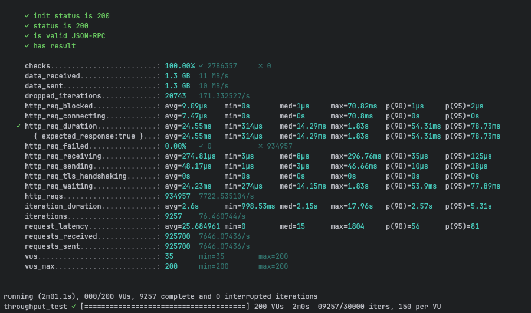
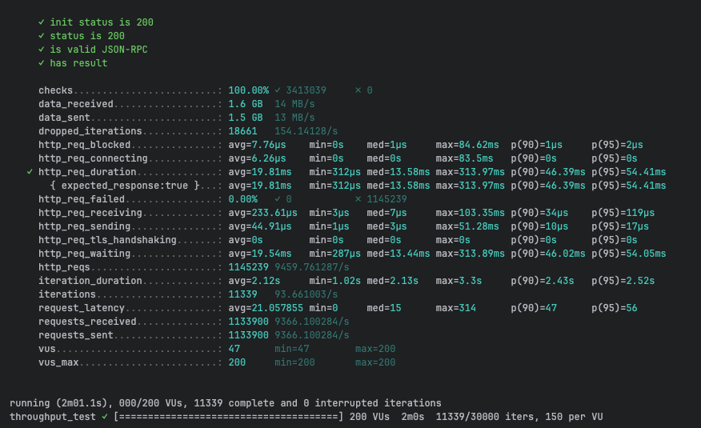
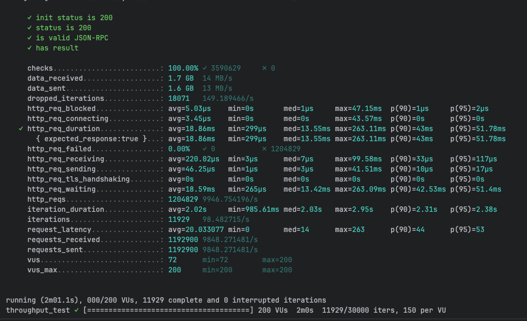
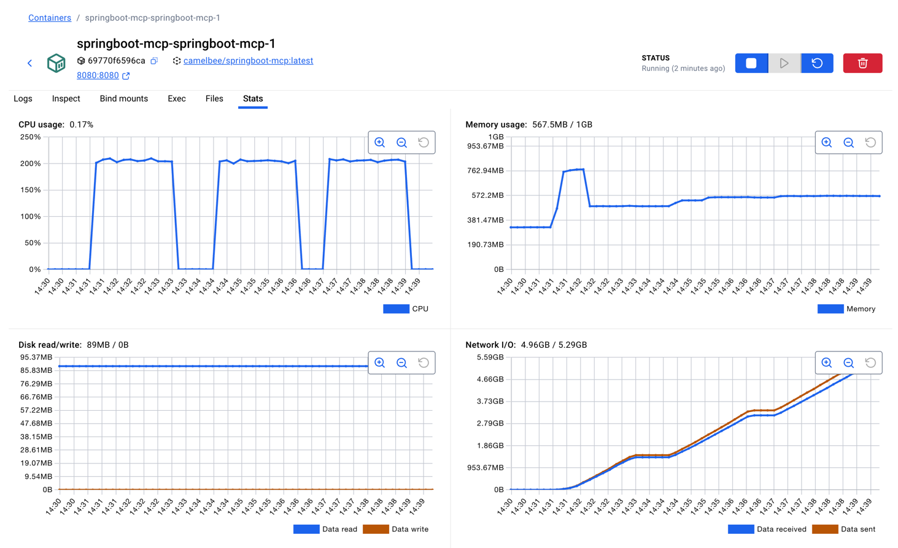

# MCP Performance Testing - CamelBee Microservice

This document outlines the configuration, setup, and performance test results for a CamelBee-generated MCP microservice.

## Microservice Creation

The microservice was created using the [CamelBee Initializer](https://www.camelbee.io) with the following configuration:

- **Interface**: MCP (Model Context Protocol)
- **Runtime**: Spring Boot
- **Backend**: MOCK (no external dependencies)

After generating and downloading the microservice from CamelBee, apply the following configurations for optimal performance testing.

## Configuration

### Application Configuration

After creating the microservice, update the `application.yml` with the following settings to disable all interceptors:

```yaml
camelbee:
  # when enabled registers the CamelBee event notifier to the Camel context
  notifier-enabled: false
  # when enabled configures stream caching, MDC logging and CamelBeeUnitOfWork for routes
  route-configurer-enabled: false
  # when enabled it allows the CamelBee WebGL application to fetch the topology of the Camel Context
  context-enabled: false
  # when enabled intercepts/traces request and responses of all camel components and caches messages
  tracer-enabled: false
  # maximum time the tracer can remain idle before deactivation tracing of messages
  tracer-max-idle-time: 60000
  # maximum collected trace messages
  tracer-max-messages-count: 10000
  # when enabled it logs the messages exchanged between endpoints
  logging-enabled: false
```

> **Note**: The `McpTools.java` class contains three test configurations. For this test, **Test 1 (MCP Tool only)** is active — the MCP tool call is handled directly without MapStruct DTO mapping or Apache Camel. Tests 2 and 3 are commented out.

```java 
@McpTool(name = "createOrder", description = "Create a new order with customer details, product information, and shipping preferences")
Order createOrder(
@McpToolParam(description = "Order object containing salesChannel, items with productName, quantity, and price") Order order,
@McpToolParam(description = "Client-generated correlation ID for distributed tracing and logging", required = false) String transactionId,
@McpToolParam(description = "Business process correlation ID for end-to-end transaction tracing across systems",
required = false) String businessTransactionId
) throws Exception {

    Order response = new Order();
    response.setId("1");
    response.setSalesChannel(order.getSalesChannel());
    response.setItems(order.getItems());
    return response;

}
```

### Docker Compose Configuration

Update the CPU allocation in `docker-compose.yml` to **2 cores** for optimal performance:

```yaml
deploy:
  resources:
    limits:
      cpus: '2'      # Updated from default to 2 cores
      memory: 1G
    reservations:
      cpus: '1'
      memory: 1G
```

> **Note**: Increasing the CPU limit to 2 cores significantly improves throughput and allows the microservice to handle higher concurrent loads efficiently.

## Build and Deployment

### Build Steps

```bash
# Make the Maven wrapper executable
chmod +x mvnw

# Package the application (skip tests for faster build)
./mvnw package -DskipTests

# Start the Docker container
docker compose up --build -d
```

## Performance Testing

### Test Setup

- **Tool**: k6 load testing tool
- **Test File**: `mcp-throughput-test.js` (located in `docs/k6/mcp/`)
- **VUs (Virtual Users)**: 200
- **Duration**: 2 minutes per run
- **Warm-up**: 3 test runs to ensure JVM optimization

### Test Execution

```bash
cd docs/k6/mcp
k6 run mcp-throughput-test.js
```

## Performance Results

### Run 1 - Initial Warm-up

```

     ✓ init status is 200
     ✓ status is 200
     ✓ is valid JSON-RPC
     ✓ has result

     checks.........................: 100.00% ✓ 2786357     ✗ 0     
     data_received..................: 1.3 GB  11 MB/s
     data_sent......................: 1.3 GB  10 MB/s
     dropped_iterations.............: 20743   171.332527/s
     http_req_blocked...............: avg=9.09µs    min=0s       med=1µs     max=70.82ms  p(90)=1µs     p(95)=2µs    
     http_req_connecting............: avg=7.47µs    min=0s       med=0s      max=70.8ms   p(90)=0s      p(95)=0s     
   ✓ http_req_duration..............: avg=24.55ms   min=314µs    med=14.29ms max=1.83s    p(90)=54.31ms p(95)=78.73ms
       { expected_response:true }...: avg=24.55ms   min=314µs    med=14.29ms max=1.83s    p(90)=54.31ms p(95)=78.73ms
     http_req_failed................: 0.00%   ✓ 0           ✗ 934957
     http_req_receiving.............: avg=274.81µs  min=3µs      med=8µs     max=296.76ms p(90)=35µs    p(95)=125µs  
     http_req_sending...............: avg=48.17µs   min=1µs      med=3µs     max=46.66ms  p(90)=10µs    p(95)=18µs   
     http_req_tls_handshaking.......: avg=0s        min=0s       med=0s      max=0s       p(90)=0s      p(95)=0s     
     http_req_waiting...............: avg=24.23ms   min=274µs    med=14.15ms max=1.83s    p(90)=53.9ms  p(95)=77.89ms
     http_reqs......................: 934957  7722.535104/s
     iteration_duration.............: avg=2.6s      min=998.53ms med=2.15s   max=17.96s   p(90)=2.57s   p(95)=5.31s  
     iterations.....................: 9257    76.460744/s
     request_latency................: avg=25.684961 min=0        med=15      max=1804     p(90)=56      p(95)=81     
     requests_received..............: 925700  7646.07436/s
     requests_sent..................: 925700  7646.07436/s
     vus............................: 35      min=35        max=200 
     vus_max........................: 200     min=200       max=200 


running (2m01.1s), 000/200 VUs, 9257 complete and 0 interrupted iterations
throughput_test ✓ [======================================] 200 VUs  2m0s  09257/30000 iters, 150 per VU
```

**Throughput**: ~7,723 req/s

**Screenshot of the result:**



---

### Run 2 - JVM Optimization Phase

```

     ✓ init status is 200
     ✓ status is 200
     ✓ is valid JSON-RPC
     ✓ has result

     checks.........................: 100.00% ✓ 3413039     ✗ 0      
     data_received..................: 1.6 GB  14 MB/s
     data_sent......................: 1.5 GB  13 MB/s
     dropped_iterations.............: 18661   154.14128/s
     http_req_blocked...............: avg=7.76µs    min=0s    med=1µs     max=84.62ms  p(90)=1µs     p(95)=2µs    
     http_req_connecting............: avg=6.26µs    min=0s    med=0s      max=83.5ms   p(90)=0s      p(95)=0s     
   ✓ http_req_duration..............: avg=19.81ms   min=312µs med=13.58ms max=313.97ms p(90)=46.39ms p(95)=54.41ms
       { expected_response:true }...: avg=19.81ms   min=312µs med=13.58ms max=313.97ms p(90)=46.39ms p(95)=54.41ms
     http_req_failed................: 0.00%   ✓ 0           ✗ 1145239
     http_req_receiving.............: avg=233.61µs  min=3µs   med=7µs     max=103.35ms p(90)=34µs    p(95)=119µs  
     http_req_sending...............: avg=44.91µs   min=1µs   med=3µs     max=51.28ms  p(90)=10µs    p(95)=17µs   
     http_req_tls_handshaking.......: avg=0s        min=0s    med=0s      max=0s       p(90)=0s      p(95)=0s     
     http_req_waiting...............: avg=19.54ms   min=287µs med=13.44ms max=313.89ms p(90)=46.02ms p(95)=54.05ms
     http_reqs......................: 1145239 9459.761287/s
     iteration_duration.............: avg=2.12s     min=1.02s med=2.13s   max=3.3s     p(90)=2.43s   p(95)=2.52s  
     iterations.....................: 11339   93.661003/s
     request_latency................: avg=21.057855 min=0     med=15      max=314      p(90)=47      p(95)=56     
     requests_received..............: 1133900 9366.100284/s
     requests_sent..................: 1133900 9366.100284/s
     vus............................: 47      min=47        max=200  
     vus_max........................: 200     min=200       max=200  


running (2m01.1s), 000/200 VUs, 11339 complete and 0 interrupted iterations
throughput_test ✓ [======================================] 200 VUs  2m0s  11339/30000 iters, 150 per VU
```

**Throughput**: ~9,460 req/s
**Improvement**: +22.5% over Run 1

**Screenshot of the result:**



---

### Run 3 - Optimized Performance

```

     ✓ init status is 200
     ✓ status is 200
     ✓ is valid JSON-RPC
     ✓ has result

     checks.........................: 100.00% ✓ 3590629     ✗ 0      
     data_received..................: 1.7 GB  14 MB/s
     data_sent......................: 1.6 GB  13 MB/s
     dropped_iterations.............: 18071   149.189466/s
     http_req_blocked...............: avg=5.03µs    min=0s       med=1µs     max=47.15ms  p(90)=1µs     p(95)=2µs    
     http_req_connecting............: avg=3.45µs    min=0s       med=0s      max=43.57ms  p(90)=0s      p(95)=0s     
   ✓ http_req_duration..............: avg=18.86ms   min=299µs    med=13.55ms max=263.11ms p(90)=43ms    p(95)=51.78ms
       { expected_response:true }...: avg=18.86ms   min=299µs    med=13.55ms max=263.11ms p(90)=43ms    p(95)=51.78ms
     http_req_failed................: 0.00%   ✓ 0           ✗ 1204829
     http_req_receiving.............: avg=220.02µs  min=3µs      med=7µs     max=99.58ms  p(90)=33µs    p(95)=117µs  
     http_req_sending...............: avg=46.25µs   min=1µs      med=3µs     max=41.51ms  p(90)=10µs    p(95)=17µs   
     http_req_tls_handshaking.......: avg=0s        min=0s       med=0s      max=0s       p(90)=0s      p(95)=0s     
     http_req_waiting...............: avg=18.59ms   min=265µs    med=13.42ms max=263.09ms p(90)=42.53ms p(95)=51.4ms 
     http_reqs......................: 1204829 9946.754196/s
     iteration_duration.............: avg=2.02s     min=985.61ms med=2.03s   max=2.95s    p(90)=2.31s   p(95)=2.38s  
     iterations.....................: 11929   98.482715/s
     request_latency................: avg=20.033077 min=0        med=14      max=263      p(90)=44      p(95)=53     
     requests_received..............: 1192900 9848.271481/s
     requests_sent..................: 1192900 9848.271481/s
     vus............................: 72      min=72        max=200  
     vus_max........................: 200     min=200       max=200  


running (2m01.1s), 000/200 VUs, 11929 complete and 0 interrupted iterations
throughput_test ✓ [======================================] 200 VUs  2m0s  11929/30000 iters, 150 per VU
```

**Throughput**: ~9,947 req/s
**Improvement**: +28.8% over Run 1, +5.1% over Run 2

**Screenshot of the result:**



---

## Performance Summary

| Metric | Run 1 | Run 2 | Run 3 |
|--------|-------|-------|-------|
| **Throughput (req/s)** | 7,723 | 9,460 | 9,947 |
| **Avg Latency (ms)** | 24.55 | 19.81 | 18.86 |
| **Median Latency (ms)** | 14.29 | 13.58 | 13.55 |
| **P90 Latency (ms)** | 54.31 | 46.39 | 43.00 |
| **P95 Latency (ms)** | 78.73 | 54.41 | 51.78 |
| **Max Latency (ms)** | 1,830 | 313.97 | 263.11 |
| **Total Requests** | 934,957 | 1,145,239 | 1,204,829 |
| **Success Rate** | 100% | 100% | 100% |

## Key Observations

1. **JVM Warm-up Effect**: Performance improved significantly between runs, demonstrating effective JIT compilation optimization
2. **Consistent Throughput**: Achieved stable ~10K requests/second after warm-up
3. **Low Latency**: Median latency remained consistently around 14-15ms
4. **Zero Failures**: 100% success rate across all test runs
5. **Resource Efficiency**: Maintained stable performance with 2 CPU cores and 1GB memory

## Container Resource Usage

During the performance tests, the container exhibited the following resource utilization patterns:

- **CPU Usage**: Peaked at ~200% (fully utilizing both allocated cores) during each test run, dropping to ~0.16% at idle between runs
- **Memory Usage**: 572.1MB / 1GB — stabilized at ~572MB after initial warm-up (peaked at ~763MB during the first run before settling), indicating efficient memory management with no leaks
- **Disk Read/Write**: 89.1MB read / 0B write — all disk reads occurred at startup (class loading, JARs), with zero disk writes during the tests confirming fully in-memory processing
- **Network I/O**: 4.9GB received / 5.2GB sent — cumulative across all three test runs, consistent with the total data volumes reported by k6 (~4.6GB received and ~4.4GB sent combined)

The CPU graph shows clear spikes during each of the three test runs, demonstrating efficient utilization of the allocated resources. Memory usage remained stable throughout, indicating no memory leaks or excessive garbage collection pressure.

**Screenshot of Docker container statistics:**



## Recommendations

1. **Production Deployment**: Disable all CamelBee interceptors as shown in the configuration for optimal performance
2. **Resource Allocation**: 2 CPU cores and 1GB memory provides good performance for this workload
3. **Warm-up Strategy**: Always perform warm-up requests before measuring production performance
4. **Monitoring**: Track P95 and P99 latencies in production to catch performance degradation early

## Environment

- **Runtime**: Spring Boot with Apache Camel
- **Protocol**: MCP
- **Container**: Docker
- **Resource Limits**: 2 CPUs, 1GB memory
- **Test Load**: 200 concurrent virtual users
