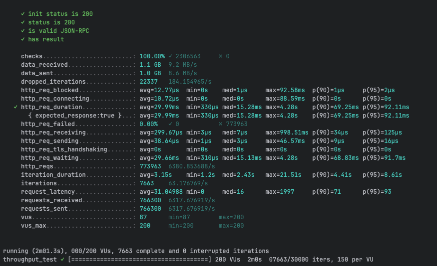
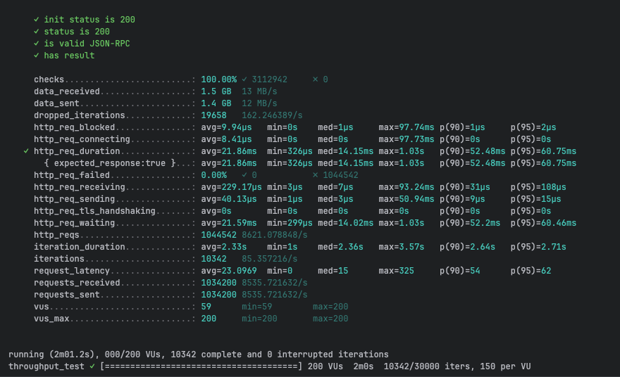
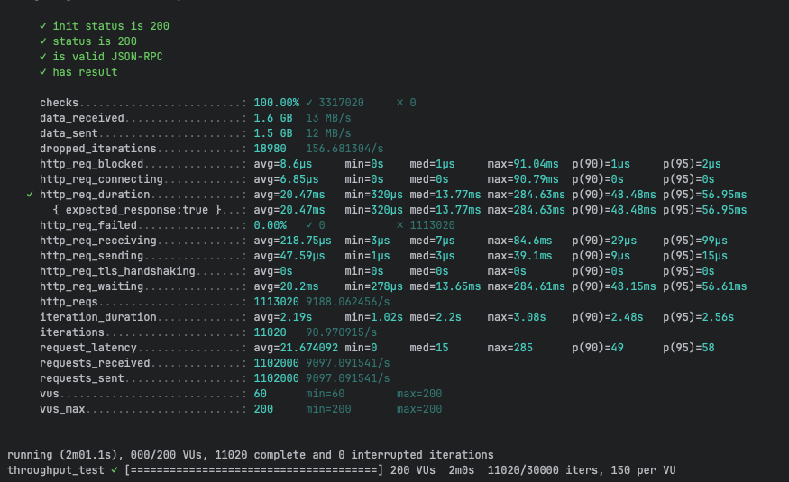
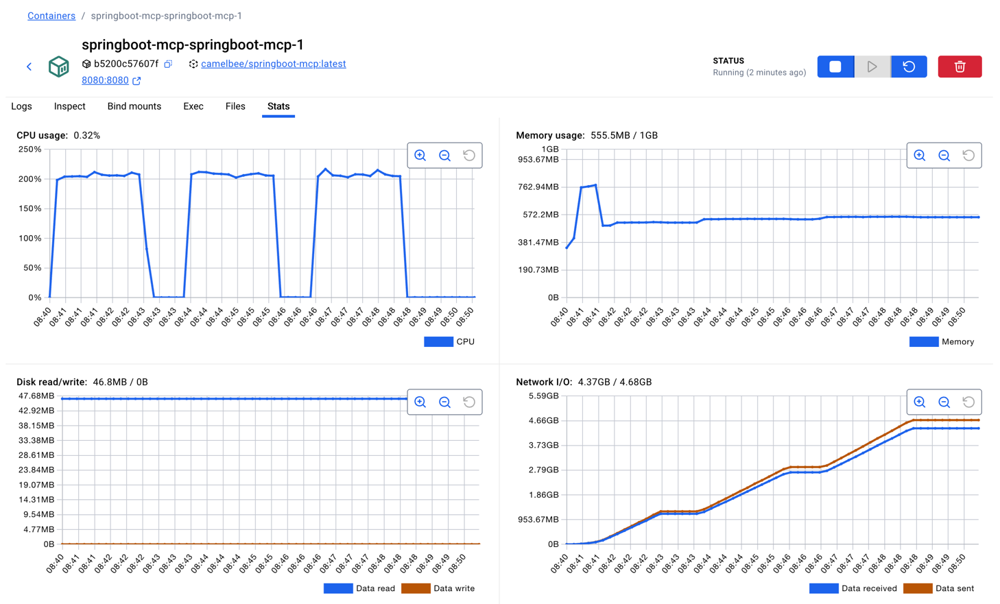

# MCP Performance Testing - CamelBee Microservice

This document outlines the configuration, setup, and performance test results for a CamelBee-generated MCP microservice.

## Microservice Creation

The microservice was created using the [CamelBee Initializer](https://www.camelbee.io) with the following configuration:

- **Interface**: MCP (Model Context Protocol)
- **Runtime**: Spring Boot
- **Backend**: MOCK (no external dependencies)

After generating and downloading the microservice from CamelBee, apply the following configurations for optimal performance testing.

## Configuration

### Application Configuration

After creating the microservice, update the `application.yml` with the following settings to disable all interceptors:

```yaml
camelbee:
  # when enabled registers the CamelBee event notifier to the Camel context
  notifier-enabled: false
  # when enabled configures stream caching, MDC logging and CamelBeeUnitOfWork for routes
  route-configurer-enabled: false
  # when enabled it allows the CamelBee WebGL application to fetch the topology of the Camel Context
  context-enabled: false
  # when enabled intercepts/traces request and responses of all camel components and caches messages
  tracer-enabled: false
  # maximum time the tracer can remain idle before deactivation tracing of messages
  tracer-max-idle-time: 60000
  # maximum collected trace messages
  tracer-max-messages-count: 10000
  # when enabled it logs the messages exchanged between endpoints
  logging-enabled: false
```


> **Note**: The `McpTools.java` class contains three test configurations. For this test, **Test 3 (MCP Tool + MapStruct + Apache Camel)** is active — the MCP tool call goes through a MapStruct DTO mapping (`mcpToDomainOrder` → `domainToMcpOrder`) and is routed through Apache Camel. Tests 1 and 2 are commented out.

```java 
@McpTool(name = "createOrder", description = "Create a new order with customer details, product information, and shipping preferences")
Order createOrder(
@McpToolParam(description = "Order object containing salesChannel, items with productName, quantity, and price") Order order,
@McpToolParam(description = "Client-generated correlation ID for distributed tracing and logging", required = false) String transactionId,
@McpToolParam(description = "Business process correlation ID for end-to-end transaction tracing across systems",
required = false) String businessTransactionId
) throws Exception {

      var result = fluentProducerTemplate
          .to("direct:mcpCreateOrder")
          .withHeader("transactionId", transactionId)
          .withBody(order)
          .send();

      if (result.getMessage().getBody() instanceof Exception) {
        throw result.getMessage().getBody(Exception.class);
      } else {
        return result.getMessage().getBody(Order.class);
      }

}
```

### Docker Compose Configuration

Update the CPU allocation in `docker-compose.yml` to **2 cores** for optimal performance:

```yaml
deploy:
  resources:
    limits:
      cpus: '2'      # Updated from default to 2 cores
      memory: 1G
    reservations:
      cpus: '1'
      memory: 1G
```

> **Note**: Increasing the CPU limit to 2 cores significantly improves throughput and allows the microservice to handle higher concurrent loads efficiently.

## Build and Deployment

### Build Steps

```bash
# Make the Maven wrapper executable
chmod +x mvnw

# Package the application (skip tests for faster build)
./mvnw package -DskipTests

# Start the Docker container
docker compose up --build -d
```

## Performance Testing

### Test Setup

- **Tool**: k6 load testing tool
- **Test File**: `mcp-throughput-test.js` (located in `docs/k6/mcp/`)
- **VUs (Virtual Users)**: 200
- **Duration**: 2 minutes per run
- **Warm-up**: 3 test runs to ensure JVM optimization

### Test Execution

```bash
cd docs/k6/mcp
k6 run mcp-throughput-test.js
```

## Performance Results

### Run 1 - Initial Warm-up

```

     ✓ init status is 200
     ✓ status is 200
     ✓ is valid JSON-RPC
     ✓ has result

     checks.........................: 100.00% ✓ 2306563     ✗ 0     
     data_received..................: 1.1 GB  9.2 MB/s
     data_sent......................: 1.0 GB  8.6 MB/s
     dropped_iterations.............: 22337   184.154965/s
     http_req_blocked...............: avg=12.77µs  min=0s    med=1µs     max=92.58ms  p(90)=1µs     p(95)=2µs    
     http_req_connecting............: avg=10.72µs  min=0s    med=0s      max=88.59ms  p(90)=0s      p(95)=0s     
   ✓ http_req_duration..............: avg=29.99ms  min=330µs med=15.28ms max=4.28s    p(90)=69.25ms p(95)=92.11ms
       { expected_response:true }...: avg=29.99ms  min=330µs med=15.28ms max=4.28s    p(90)=69.25ms p(95)=92.11ms
     http_req_failed................: 0.00%   ✓ 0           ✗ 773963
     http_req_receiving.............: avg=299.67µs min=3µs   med=7µs     max=998.51ms p(90)=34µs    p(95)=125µs  
     http_req_sending...............: avg=38.64µs  min=1µs   med=3µs     max=46.57ms  p(90)=9µs     p(95)=16µs   
     http_req_tls_handshaking.......: avg=0s       min=0s    med=0s      max=0s       p(90)=0s      p(95)=0s     
     http_req_waiting...............: avg=29.66ms  min=310µs med=15.13ms max=4.28s    p(90)=68.83ms p(95)=91.7ms 
     http_reqs......................: 773963  6380.853688/s
     iteration_duration.............: avg=3.15s    min=1.2s  med=2.43s   max=21.51s   p(90)=4.41s   p(95)=8.61s  
     iterations.....................: 7663    63.176769/s
     request_latency................: avg=31.04988 min=0     med=16      max=1997     p(90)=71      p(95)=93     
     requests_received..............: 766300  6317.676919/s
     requests_sent..................: 766300  6317.676919/s
     vus............................: 87      min=87        max=200 
     vus_max........................: 200     min=200       max=200 


running (2m01.3s), 000/200 VUs, 7663 complete and 0 interrupted iterations
throughput_test ✓ [======================================] 200 VUs  2m0s  07663/30000 iters, 150 per VU
```

**Throughput**: ~6,381 req/s

**Screenshot of the result:**



---

### Run 2 - JVM Optimization Phase

```


     ✓ init status is 200
     ✓ status is 200
     ✓ is valid JSON-RPC
     ✓ has result

     checks.........................: 100.00% ✓ 3112942     ✗ 0      
     data_received..................: 1.5 GB  13 MB/s
     data_sent......................: 1.4 GB  12 MB/s
     dropped_iterations.............: 19658   162.246389/s
     http_req_blocked...............: avg=9.94µs   min=0s    med=1µs     max=97.74ms p(90)=1µs     p(95)=2µs    
     http_req_connecting............: avg=8.41µs   min=0s    med=0s      max=97.73ms p(90)=0s      p(95)=0s     
   ✓ http_req_duration..............: avg=21.86ms  min=326µs med=14.15ms max=1.03s   p(90)=52.48ms p(95)=60.75ms
       { expected_response:true }...: avg=21.86ms  min=326µs med=14.15ms max=1.03s   p(90)=52.48ms p(95)=60.75ms
     http_req_failed................: 0.00%   ✓ 0           ✗ 1044542
     http_req_receiving.............: avg=229.17µs min=3µs   med=7µs     max=93.24ms p(90)=31µs    p(95)=108µs  
     http_req_sending...............: avg=40.13µs  min=1µs   med=3µs     max=50.94ms p(90)=9µs     p(95)=15µs   
     http_req_tls_handshaking.......: avg=0s       min=0s    med=0s      max=0s      p(90)=0s      p(95)=0s     
     http_req_waiting...............: avg=21.59ms  min=299µs med=14.02ms max=1.03s   p(90)=52.2ms  p(95)=60.46ms
     http_reqs......................: 1044542 8621.078848/s
     iteration_duration.............: avg=2.33s    min=1s    med=2.36s   max=3.57s   p(90)=2.64s   p(95)=2.71s  
     iterations.....................: 10342   85.357216/s
     request_latency................: avg=23.0969  min=0     med=15      max=325     p(90)=54      p(95)=62     
     requests_received..............: 1034200 8535.721632/s
     requests_sent..................: 1034200 8535.721632/s
     vus............................: 59      min=59        max=200  
     vus_max........................: 200     min=200       max=200  


running (2m01.2s), 000/200 VUs, 10342 complete and 0 interrupted iterations
throughput_test ✓ [======================================] 200 VUs  2m0s  10342/30000 iters, 150 per VU
```

**Throughput**: ~8,621 req/s
**Improvement**: +35.1% over Run 1

**Screenshot of the result:**



---

### Run 3 - Optimized Performance

```

     ✓ init status is 200
     ✓ status is 200
     ✓ is valid JSON-RPC
     ✓ has result

     checks.........................: 100.00% ✓ 3317020     ✗ 0      
     data_received..................: 1.6 GB  13 MB/s
     data_sent......................: 1.5 GB  12 MB/s
     dropped_iterations.............: 18980   156.681304/s
     http_req_blocked...............: avg=8.6µs     min=0s    med=1µs     max=91.04ms  p(90)=1µs     p(95)=2µs    
     http_req_connecting............: avg=6.85µs    min=0s    med=0s      max=90.79ms  p(90)=0s      p(95)=0s     
   ✓ http_req_duration..............: avg=20.47ms   min=320µs med=13.77ms max=284.63ms p(90)=48.48ms p(95)=56.95ms
       { expected_response:true }...: avg=20.47ms   min=320µs med=13.77ms max=284.63ms p(90)=48.48ms p(95)=56.95ms
     http_req_failed................: 0.00%   ✓ 0           ✗ 1113020
     http_req_receiving.............: avg=218.75µs  min=3µs   med=7µs     max=84.6ms   p(90)=29µs    p(95)=99µs   
     http_req_sending...............: avg=47.59µs   min=1µs   med=3µs     max=39.1ms   p(90)=9µs     p(95)=15µs   
     http_req_tls_handshaking.......: avg=0s        min=0s    med=0s      max=0s       p(90)=0s      p(95)=0s     
     http_req_waiting...............: avg=20.2ms    min=278µs med=13.65ms max=284.61ms p(90)=48.15ms p(95)=56.61ms
     http_reqs......................: 1113020 9188.062456/s
     iteration_duration.............: avg=2.19s     min=1.02s med=2.2s    max=3.08s    p(90)=2.48s   p(95)=2.56s  
     iterations.....................: 11020   90.970915/s
     request_latency................: avg=21.674092 min=0     med=15      max=285      p(90)=49      p(95)=58     
     requests_received..............: 1102000 9097.091541/s
     requests_sent..................: 1102000 9097.091541/s
     vus............................: 60      min=60        max=200  
     vus_max........................: 200     min=200       max=200  


running (2m01.1s), 000/200 VUs, 11020 complete and 0 interrupted iterations
throughput_test ✓ [======================================] 200 VUs  2m0s  11020/30000 iters, 150 per VU
```

**Throughput**: ~9,188 req/s
**Improvement**: +44.0% over Run 1, +6.6% over Run 2

**Screenshot of the result:**



---

## Performance Summary

| Metric | Run 1 | Run 2 | Run 3 |
|--------|-------|-------|-------|
| **Throughput (req/s)** | ~6,381 | ~8,621 | ~9,188 |
| **Avg Latency (ms)** | 29.99 | 21.86 | 20.47 |
| **Median Latency (ms)** | 15.28 | 14.15 | 13.77 |
| **P90 Latency (ms)** | 69.25 | 52.48 | 48.48 |
| **P95 Latency (ms)** | 92.11 | 60.75 | 56.95 |
| **Max Latency (ms)** | 4,280 | 1,030 | 284.63 |
| **Total Requests** | 773,963 | 1,044,542 | 1,113,020 |
| **Success Rate** | 100% | 100% | 100% |

## Key Observations

1. **JVM Warm-up Effect**: Performance improved significantly between runs, demonstrating effective JIT compilation optimization
2. **Consistent Throughput**: Achieved stable ~9K requests/second after warm-up
3. **Low Latency**: Median latency remained consistently around 13–15ms
4. **Zero Failures**: 100% success rate across all test runs
5. **Resource Efficiency**: Maintained stable performance with 2 CPU cores and 1GB memory

## Container Resource Usage

During the performance tests, the container exhibited the following resource utilization patterns:

- **CPU Usage**: Peaked at ~200% (fully utilizing both allocated cores) during each test run, dropping to ~0.32% at idle between runs
- **Memory Usage**: 555.5MB / 1GB — stabilized after warm-up, with step increases visible during each test run indicating JIT compilation and class loading
- **Disk Read/Write**: 46.8MB read / 0B write — all disk reads occurred at startup (class loading), zero writes during tests confirming fully in-memory processing
- **Network I/O**: 4.37GB received / 4.68GB sent cumulative across all three test runs

The CPU graph shows clear spikes during each of the three test runs, demonstrating efficient utilization of the allocated resources. Memory usage remained stable throughout, indicating no memory leaks or excessive garbage collection pressure.

**Screenshot of Docker container statistics:**



## Recommendations

1. **Production Deployment**: Disable all CamelBee interceptors as shown in the configuration for optimal performance
2. **Resource Allocation**: 2 CPU cores and 1GB memory provides good performance for this workload
3. **Warm-up Strategy**: Always perform warm-up requests before measuring production performance
4. **Monitoring**: Track P95 and P99 latencies in production to catch performance degradation early

## Environment

- **Runtime**: Spring Boot with Apache Camel
- **Protocol**: MCP
- **Container**: Docker
- **Resource Limits**: 2 CPUs, 1GB memory
- **Test Load**: 200 concurrent virtual users
