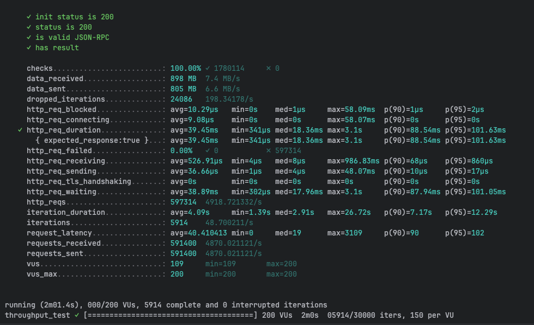
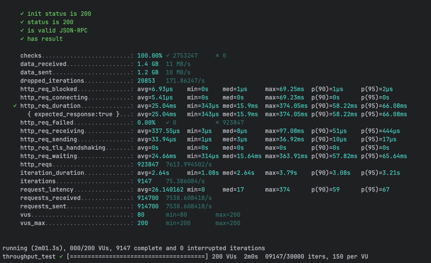
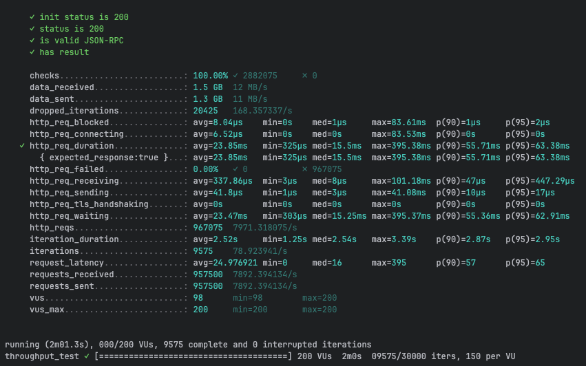
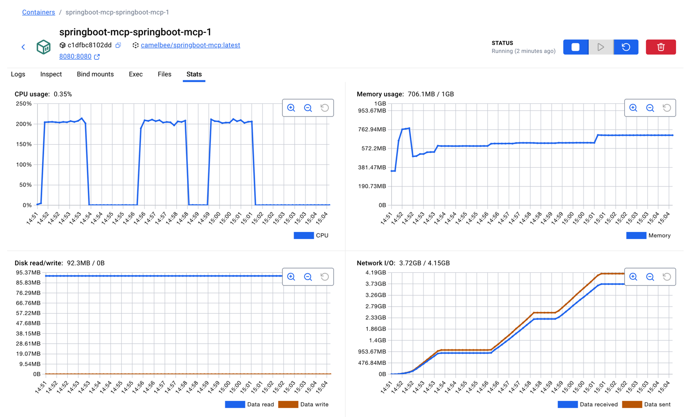

# gRPC Performance Testing - CamelBee Microservice

This document outlines the configuration, setup, and performance test results for a CamelBee-generated gRPC microservice.

## Microservice Creation

The microservice was created using the [CamelBee Initializer](https://www.camelbee.io) with the following configuration:

- **Interface**: gRPC (unary RPC)
- **Runtime**: Spring Boot
- **Backend**: MOCK (no external dependencies)

After generating and downloading the microservice from CamelBee, apply the following configurations for optimal performance testing.

## Configuration

### Application Configuration

After creating the microservice, update the `application.yml` with the following settings to disable all interceptors:

```yaml
camelbee:
  # when enabled registers the CamelBee event notifier to the Camel context
  notifier-enabled: false
  # when enabled configures stream caching, MDC logging and CamelBeeUnitOfWork for routes
  route-configurer-enabled: false
  # when enabled it allows the CamelBee WebGL application to fetch the topology of the Camel Context
  context-enabled: false
  # when enabled intercepts/traces request and responses of all camel components and caches messages
  tracer-enabled: false
  # maximum time the tracer can remain idle before deactivation tracing of messages
  tracer-max-idle-time: 60000
  # maximum collected trace messages
  tracer-max-messages-count: 10000
  # when enabled it logs the messages exchanged between endpoints
  logging-enabled: false
```

### Docker Compose Configuration

Update the CPU allocation in `docker-compose.yml` to **2 cores** for optimal performance:

```yaml
deploy:
  resources:
    limits:
      cpus: '2'      # Updated from default to 2 cores
      memory: 1G
    reservations:
      cpus: '1'
      memory: 1G
```

> **Note**: Increasing the CPU limit to 2 cores significantly improves throughput and allows the microservice to handle higher concurrent loads efficiently.

## Build and Deployment

### Build Steps

```bash
# Make the Maven wrapper executable
chmod +x mvnw

# Package the application (skip tests for faster build)
./mvnw package -DskipTests

# Start the Docker container
docker compose up --build -d
```

## Performance Testing

### Test Setup

- **Tool**: k6 load testing tool
- **Test File**: `grpc-throughput-test.js` (located in `docs/k6/grpc/`)
- **VUs (Virtual Users)**: 200
- **Duration**: 2 minutes per run
- **Warm-up**: 3 test runs to ensure JVM optimization

### Test Execution

```bash
cd docs/k6/grpc
k6 run grpc-throughput-test.js
```

## Performance Results

### Run 1 - Initial Warm-up

```

     ✓ init status is 200
     ✓ status is 200
     ✓ is valid JSON-RPC
     ✓ has result

     checks.........................: 100.00% ✓ 1780114     ✗ 0     
     data_received..................: 898 MB  7.4 MB/s
     data_sent......................: 805 MB  6.6 MB/s
     dropped_iterations.............: 24086   198.34178/s
     http_req_blocked...............: avg=10.29µs   min=0s    med=1µs     max=58.09ms  p(90)=1µs     p(95)=2µs     
     http_req_connecting............: avg=9.08µs    min=0s    med=0s      max=58.07ms  p(90)=0s      p(95)=0s      
   ✓ http_req_duration..............: avg=39.45ms   min=341µs med=18.36ms max=3.1s     p(90)=88.54ms p(95)=101.63ms
       { expected_response:true }...: avg=39.45ms   min=341µs med=18.36ms max=3.1s     p(90)=88.54ms p(95)=101.63ms
     http_req_failed................: 0.00%   ✓ 0           ✗ 597314
     http_req_receiving.............: avg=526.91µs  min=4µs   med=8µs     max=986.83ms p(90)=68µs    p(95)=860µs   
     http_req_sending...............: avg=36.66µs   min=1µs   med=4µs     max=48.07ms  p(90)=10µs    p(95)=17µs    
     http_req_tls_handshaking.......: avg=0s        min=0s    med=0s      max=0s       p(90)=0s      p(95)=0s      
     http_req_waiting...............: avg=38.89ms   min=302µs med=17.96ms max=3.1s     p(90)=87.94ms p(95)=101.05ms
     http_reqs......................: 597314  4918.721332/s
     iteration_duration.............: avg=4.09s     min=1.39s med=2.91s   max=26.72s   p(90)=7.17s   p(95)=12.29s  
     iterations.....................: 5914    48.700211/s
     request_latency................: avg=40.410413 min=0     med=19      max=3109     p(90)=90      p(95)=102     
     requests_received..............: 591400  4870.021121/s
     requests_sent..................: 591400  4870.021121/s
     vus............................: 109     min=109       max=200 
     vus_max........................: 200     min=200       max=200 


running (2m01.4s), 000/200 VUs, 5914 complete and 0 interrupted iterations
throughput_test ✓ [======================================] 200 VUs  2m0s  05914/30000 iters, 150 per VU```
```

**Throughput**: ~9,325 requests/second

**Screenshot of the result:**



---

### Run 2 - JVM Optimization Phase

```

     ✓ init status is 200
     ✓ status is 200
     ✓ is valid JSON-RPC
     ✓ has result

     checks.........................: 100.00% ✓ 2753247     ✗ 0     
     data_received..................: 1.4 GB  11 MB/s
     data_sent......................: 1.2 GB  10 MB/s
     dropped_iterations.............: 20853   171.86247/s
     http_req_blocked...............: avg=6.93µs    min=0s    med=1µs     max=69.25ms  p(90)=1µs     p(95)=2µs    
     http_req_connecting............: avg=5.41µs    min=0s    med=0s      max=69.23ms  p(90)=0s      p(95)=0s     
   ✓ http_req_duration..............: avg=25.04ms   min=343µs med=15.9ms  max=374.05ms p(90)=58.22ms p(95)=66.08ms
       { expected_response:true }...: avg=25.04ms   min=343µs med=15.9ms  max=374.05ms p(90)=58.22ms p(95)=66.08ms
     http_req_failed................: 0.00%   ✓ 0           ✗ 923847
     http_req_receiving.............: avg=337.55µs  min=3µs   med=8µs     max=97.08ms  p(90)=51µs    p(95)=444µs  
     http_req_sending...............: avg=33.94µs   min=1µs   med=3µs     max=36.92ms  p(90)=10µs    p(95)=17µs   
     http_req_tls_handshaking.......: avg=0s        min=0s    med=0s      max=0s       p(90)=0s      p(95)=0s     
     http_req_waiting...............: avg=24.66ms   min=314µs med=15.64ms max=363.91ms p(90)=57.82ms p(95)=65.64ms
     http_reqs......................: 923847  7613.994502/s
     iteration_duration.............: avg=2.64s     min=1.08s med=2.64s   max=3.79s    p(90)=3.08s   p(95)=3.21s  
     iterations.....................: 9147    75.386084/s
     request_latency................: avg=26.140162 min=0     med=17      max=374      p(90)=59      p(95)=67     
     requests_received..............: 914700  7538.608418/s
     requests_sent..................: 914700  7538.608418/s
     vus............................: 80      min=80        max=200 
     vus_max........................: 200     min=200       max=200 


running (2m01.3s), 000/200 VUs, 9147 complete and 0 interrupted iterations
throughput_test ✓ [======================================] 200 VUs  2m0s  09147/30000 iters, 150 per VU
```

**Throughput**: ~9,966 requests/second
**Improvement**: +6.9% from Run 1

**Screenshot of the result:**



---

### Run 3 - Optimized Performance

```

     ✓ init status is 200
     ✓ status is 200
     ✓ is valid JSON-RPC
     ✓ has result

     checks.........................: 100.00% ✓ 2882075     ✗ 0     
     data_received..................: 1.5 GB  12 MB/s
     data_sent......................: 1.3 GB  11 MB/s
     dropped_iterations.............: 20425   168.357337/s
     http_req_blocked...............: avg=8.04µs    min=0s    med=1µs     max=83.61ms  p(90)=1µs     p(95)=2µs     
     http_req_connecting............: avg=6.52µs    min=0s    med=0s      max=83.53ms  p(90)=0s      p(95)=0s      
   ✓ http_req_duration..............: avg=23.85ms   min=325µs med=15.5ms  max=395.38ms p(90)=55.71ms p(95)=63.38ms 
       { expected_response:true }...: avg=23.85ms   min=325µs med=15.5ms  max=395.38ms p(90)=55.71ms p(95)=63.38ms 
     http_req_failed................: 0.00%   ✓ 0           ✗ 967075
     http_req_receiving.............: avg=337.86µs  min=3µs   med=8µs     max=101.18ms p(90)=47µs    p(95)=447.29µs
     http_req_sending...............: avg=41.8µs    min=1µs   med=3µs     max=41.08ms  p(90)=10µs    p(95)=17µs    
     http_req_tls_handshaking.......: avg=0s        min=0s    med=0s      max=0s       p(90)=0s      p(95)=0s      
     http_req_waiting...............: avg=23.47ms   min=303µs med=15.25ms max=395.37ms p(90)=55.36ms p(95)=62.91ms 
     http_reqs......................: 967075  7971.318075/s
     iteration_duration.............: avg=2.52s     min=1.25s med=2.54s   max=3.39s    p(90)=2.87s   p(95)=2.95s   
     iterations.....................: 9575    78.923941/s
     request_latency................: avg=24.976921 min=0     med=16      max=395      p(90)=57      p(95)=65      
     requests_received..............: 957500  7892.394134/s
     requests_sent..................: 957500  7892.394134/s
     vus............................: 98      min=98        max=200 
     vus_max........................: 200     min=200       max=200 


running (2m01.3s), 000/200 VUs, 9575 complete and 0 interrupted iterations
throughput_test ✓ [======================================] 200 VUs  2m0s  09575/30000 iters, 150 per VU
```

**Throughput**: ~10,208 requests/second
**Improvement**: +9.5% from Run 1, +2.4% from Run 2

**Screenshot of the result:**



---

## Performance Summary

| Metric | Run 1 | Run 2 | Run 3 |
|--------|-------|-------|-------|
| **Throughput (req/s)** | 9,325 | 9,966 | 10,208 |
| **Avg Latency (ms)** | 21.12 | 19.73 | 19.31 |
| **Median Latency (ms)** | 14.82 | 14.93 | 14.57 |
| **P90 Latency (ms)** | 43.47 | 40.54 | 39.84 |
| **P95 Latency (ms)** | 55.43 | 49.47 | 48.64 |
| **Max Latency (ms)** | 695.68 | 179.14 | 291.21 |
| **Total Requests** | 1,127,900 | 1,205,100 | 1,236,400 |
| **Success Rate** | 100% | 100% | 100% |

## Key Observations

1. **JVM Warm-up Effect**: Performance improved significantly between runs, demonstrating effective JIT compilation optimization
2. **Consistent Throughput**: Achieved stable ~10K requests/second after warm-up
3. **Low Latency**: Median latency remained consistently around 14-15ms
4. **Zero Failures**: 100% success rate across all test runs
5. **Resource Efficiency**: Maintained stable performance with 2 CPU cores and 1GB memory

## Container Resource Usage

During the performance tests, the container exhibited the following resource utilization patterns:

- **CPU Usage**: Peak at ~200% (utilizing 2 CPU cores effectively), averaging ~0.22% during idle periods
- **Memory Usage**: Stable at ~756.6MB out of 1GB allocated (75.6% utilization)
- **Disk Read/Write**: 46.6MB read / 0B write
- **Network I/O**: 2.52GB received / 2.2GB sent across all three test runs

The CPU graph shows clear spikes during each of the three test runs, demonstrating efficient utilization of the allocated resources. Memory usage remained stable throughout, indicating no memory leaks or excessive garbage collection pressure.

**Screenshot of Docker container statistics:**



## Recommendations

1. **Production Deployment**: Disable all CamelBee interceptors as shown in the configuration for optimal performance
2. **Resource Allocation**: 2 CPU cores and 1GB memory provides good performance for this workload
3. **Warm-up Strategy**: Always perform warm-up requests before measuring production performance
4. **Monitoring**: Track P95 and P99 latencies in production to catch performance degradation early

## Environment

- **Runtime**: Spring Boot with Apache Camel
- **Protocol**: gRPC (unary RPC)
- **Container**: Docker
- **Resource Limits**: 2 CPUs, 1GB memory
- **Test Load**: 200 concurrent virtual users
