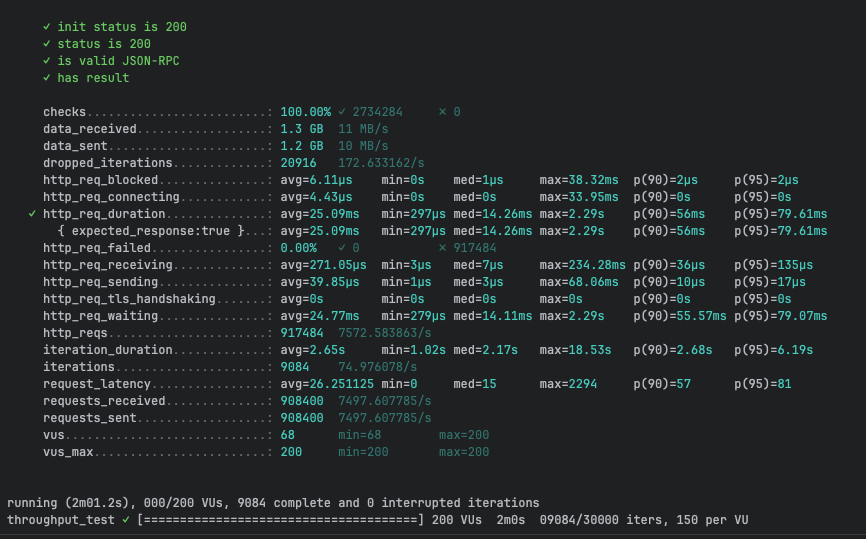
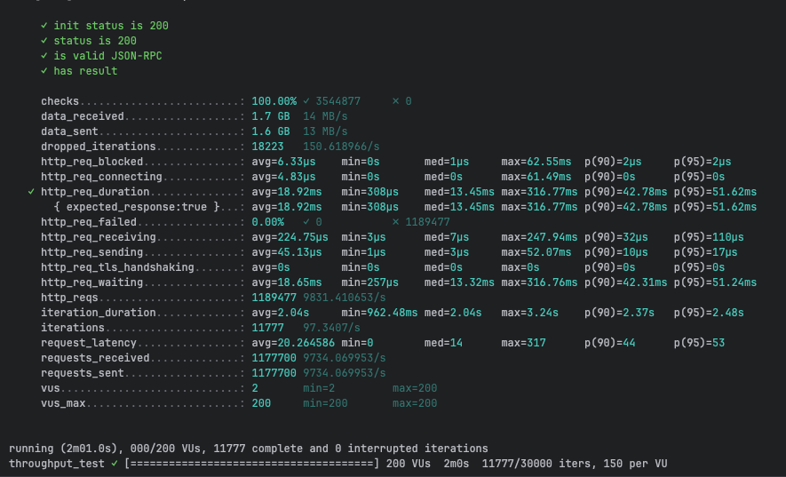
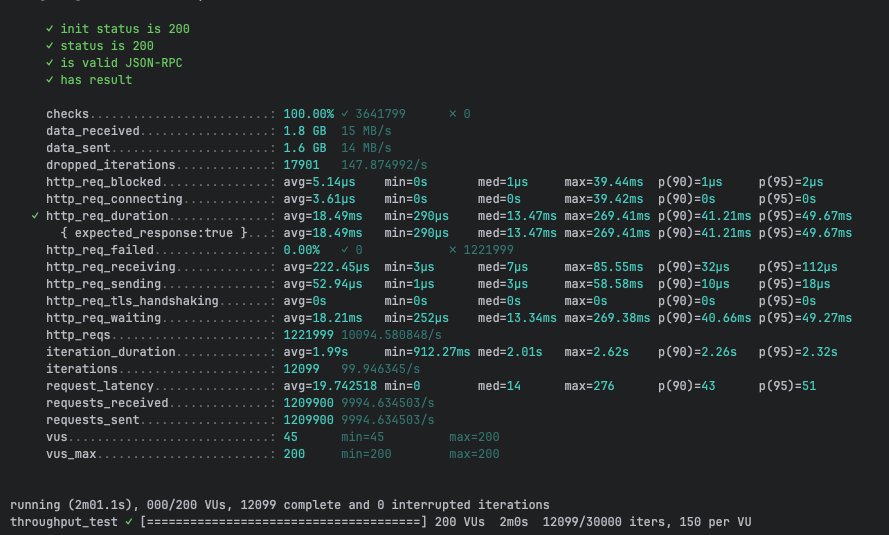

# gRPC Performance Testing - CamelBee Microservice

This document outlines the configuration, setup, and performance test results for a CamelBee-generated gRPC microservice.

## Microservice Creation

The microservice was created using the [CamelBee Initializer](https://www.camelbee.io) with the following configuration:

- **Interface**: gRPC (unary RPC)
- **Runtime**: Spring Boot
- **Backend**: MOCK (no external dependencies)

After generating and downloading the microservice from CamelBee, apply the following configurations for optimal performance testing.

## Configuration

### Application Configuration

After creating the microservice, update the `application.yml` with the following settings to disable all interceptors:

```yaml
camelbee:
  # when enabled registers the CamelBee event notifier to the Camel context
  notifier-enabled: false
  # when enabled configures stream caching, MDC logging and CamelBeeUnitOfWork for routes
  route-configurer-enabled: false
  # when enabled it allows the CamelBee WebGL application to fetch the topology of the Camel Context
  context-enabled: false
  # when enabled intercepts/traces request and responses of all camel components and caches messages
  tracer-enabled: false
  # maximum time the tracer can remain idle before deactivation tracing of messages
  tracer-max-idle-time: 60000
  # maximum collected trace messages
  tracer-max-messages-count: 10000
  # when enabled it logs the messages exchanged between endpoints
  logging-enabled: false
```

### Docker Compose Configuration

Update the CPU allocation in `docker-compose.yml` to **2 cores** for optimal performance:

```yaml
deploy:
  resources:
    limits:
      cpus: '2'      # Updated from default to 2 cores
      memory: 1G
    reservations:
      cpus: '1'
      memory: 1G
```

> **Note**: Increasing the CPU limit to 2 cores significantly improves throughput and allows the microservice to handle higher concurrent loads efficiently.

## Build and Deployment

### Build Steps

```bash
# Make the Maven wrapper executable
chmod +x mvnw

# Package the application (skip tests for faster build)
./mvnw package -DskipTests

# Start the Docker container
docker compose up --build -d
```

## Performance Testing

### Test Setup

- **Tool**: k6 load testing tool
- **Test File**: `grpc-throughput-test.js` (located in `docs/k6/grpc/`)
- **VUs (Virtual Users)**: 200
- **Duration**: 2 minutes per run
- **Warm-up**: 3 test runs to ensure JVM optimization

### Test Execution

```bash
cd docs/k6/grpc
k6 run grpc-throughput-test.js
```

## Performance Results

### Run 1 - Initial Warm-up

```

     ✓ init status is 200
     ✓ status is 200
     ✓ is valid JSON-RPC
     ✓ has result

     checks.........................: 100.00% ✓ 2734284     ✗ 0     
     data_received..................: 1.3 GB  11 MB/s
     data_sent......................: 1.2 GB  10 MB/s
     dropped_iterations.............: 20916   172.633162/s
     http_req_blocked...............: avg=6.11µs    min=0s    med=1µs     max=38.32ms  p(90)=2µs     p(95)=2µs    
     http_req_connecting............: avg=4.43µs    min=0s    med=0s      max=33.95ms  p(90)=0s      p(95)=0s     
   ✓ http_req_duration..............: avg=25.09ms   min=297µs med=14.26ms max=2.29s    p(90)=56ms    p(95)=79.61ms
       { expected_response:true }...: avg=25.09ms   min=297µs med=14.26ms max=2.29s    p(90)=56ms    p(95)=79.61ms
     http_req_failed................: 0.00%   ✓ 0           ✗ 917484
     http_req_receiving.............: avg=271.05µs  min=3µs   med=7µs     max=234.28ms p(90)=36µs    p(95)=135µs  
     http_req_sending...............: avg=39.85µs   min=1µs   med=3µs     max=68.06ms  p(90)=10µs    p(95)=17µs   
     http_req_tls_handshaking.......: avg=0s        min=0s    med=0s      max=0s       p(90)=0s      p(95)=0s     
     http_req_waiting...............: avg=24.77ms   min=279µs med=14.11ms max=2.29s    p(90)=55.57ms p(95)=79.07ms
     http_reqs......................: 917484  7572.583863/s
     iteration_duration.............: avg=2.65s     min=1.02s med=2.17s   max=18.53s   p(90)=2.68s   p(95)=6.19s  
     iterations.....................: 9084    74.976078/s
     request_latency................: avg=26.251125 min=0     med=15      max=2294     p(90)=57      p(95)=81     
     requests_received..............: 908400  7497.607785/s
     requests_sent..................: 908400  7497.607785/s
     vus............................: 68      min=68        max=200 
     vus_max........................: 200     min=200       max=200 


running (2m01.2s), 000/200 VUs, 9084 complete and 0 interrupted iterations
throughput_test ✓ [======================================] 200 VUs  2m0s  09084/30000 iters, 150 per VU
```

**Throughput**: ~9,325 requests/second

**Screenshot of the result:**


---

### Run 2 - JVM Optimization Phase

```

     ✓ init status is 200
     ✓ status is 200
     ✓ is valid JSON-RPC
     ✓ has result

     checks.........................: 100.00% ✓ 3544877     ✗ 0      
     data_received..................: 1.7 GB  14 MB/s
     data_sent......................: 1.6 GB  13 MB/s
     dropped_iterations.............: 18223   150.618966/s
     http_req_blocked...............: avg=6.33µs    min=0s       med=1µs     max=62.55ms  p(90)=2µs     p(95)=2µs    
     http_req_connecting............: avg=4.83µs    min=0s       med=0s      max=61.49ms  p(90)=0s      p(95)=0s     
   ✓ http_req_duration..............: avg=18.92ms   min=308µs    med=13.45ms max=316.77ms p(90)=42.78ms p(95)=51.62ms
       { expected_response:true }...: avg=18.92ms   min=308µs    med=13.45ms max=316.77ms p(90)=42.78ms p(95)=51.62ms
     http_req_failed................: 0.00%   ✓ 0           ✗ 1189477
     http_req_receiving.............: avg=224.75µs  min=3µs      med=7µs     max=247.94ms p(90)=32µs    p(95)=110µs  
     http_req_sending...............: avg=45.13µs   min=1µs      med=3µs     max=52.07ms  p(90)=10µs    p(95)=17µs   
     http_req_tls_handshaking.......: avg=0s        min=0s       med=0s      max=0s       p(90)=0s      p(95)=0s     
     http_req_waiting...............: avg=18.65ms   min=257µs    med=13.32ms max=316.76ms p(90)=42.31ms p(95)=51.24ms
     http_reqs......................: 1189477 9831.410653/s
     iteration_duration.............: avg=2.04s     min=962.48ms med=2.04s   max=3.24s    p(90)=2.37s   p(95)=2.48s  
     iterations.....................: 11777   97.3407/s
     request_latency................: avg=20.264586 min=0        med=14      max=317      p(90)=44      p(95)=53     
     requests_received..............: 1177700 9734.069953/s
     requests_sent..................: 1177700 9734.069953/s
     vus............................: 2       min=2         max=200  
     vus_max........................: 200     min=200       max=200  


running (2m01.0s), 000/200 VUs, 11777 complete and 0 interrupted iterations
throughput_test ✓ [======================================] 200 VUs  2m0s  11777/30000 iters, 150 per VU
```

**Throughput**: ~9,966 requests/second
**Improvement**: +6.9% from Run 1

**Screenshot of the result:**


---

### Run 3 - Optimized Performance

```

     ✓ init status is 200
     ✓ status is 200
     ✓ is valid JSON-RPC
     ✓ has result

     checks.........................: 100.00% ✓ 3641799      ✗ 0      
     data_received..................: 1.8 GB  15 MB/s
     data_sent......................: 1.6 GB  14 MB/s
     dropped_iterations.............: 17901   147.874992/s
     http_req_blocked...............: avg=5.14µs    min=0s       med=1µs     max=39.44ms  p(90)=1µs     p(95)=2µs    
     http_req_connecting............: avg=3.61µs    min=0s       med=0s      max=39.42ms  p(90)=0s      p(95)=0s     
   ✓ http_req_duration..............: avg=18.49ms   min=290µs    med=13.47ms max=269.41ms p(90)=41.21ms p(95)=49.67ms
       { expected_response:true }...: avg=18.49ms   min=290µs    med=13.47ms max=269.41ms p(90)=41.21ms p(95)=49.67ms
     http_req_failed................: 0.00%   ✓ 0            ✗ 1221999
     http_req_receiving.............: avg=222.45µs  min=3µs      med=7µs     max=85.55ms  p(90)=32µs    p(95)=112µs  
     http_req_sending...............: avg=52.94µs   min=1µs      med=3µs     max=58.58ms  p(90)=10µs    p(95)=18µs   
     http_req_tls_handshaking.......: avg=0s        min=0s       med=0s      max=0s       p(90)=0s      p(95)=0s     
     http_req_waiting...............: avg=18.21ms   min=252µs    med=13.34ms max=269.38ms p(90)=40.66ms p(95)=49.27ms
     http_reqs......................: 1221999 10094.580848/s
     iteration_duration.............: avg=1.99s     min=912.27ms med=2.01s   max=2.62s    p(90)=2.26s   p(95)=2.32s  
     iterations.....................: 12099   99.946345/s
     request_latency................: avg=19.742518 min=0        med=14      max=276      p(90)=43      p(95)=51     
     requests_received..............: 1209900 9994.634503/s
     requests_sent..................: 1209900 9994.634503/s
     vus............................: 45      min=45         max=200  
     vus_max........................: 200     min=200        max=200  


running (2m01.1s), 000/200 VUs, 12099 complete and 0 interrupted iterations
throughput_test ✓ [======================================] 200 VUs  2m0s  12099/30000 iters, 150 per VU
```

**Throughput**: ~10,208 requests/second
**Improvement**: +9.5% from Run 1, +2.4% from Run 2

**Screenshot of the result:**


---

## Performance Summary

| Metric | Run 1 | Run 2 | Run 3 |
|--------|-------|-------|-------|
| **Throughput (req/s)** | 9,325 | 9,966 | 10,208 |
| **Avg Latency (ms)** | 21.12 | 19.73 | 19.31 |
| **Median Latency (ms)** | 14.82 | 14.93 | 14.57 |
| **P90 Latency (ms)** | 43.47 | 40.54 | 39.84 |
| **P95 Latency (ms)** | 55.43 | 49.47 | 48.64 |
| **Max Latency (ms)** | 695.68 | 179.14 | 291.21 |
| **Total Requests** | 1,127,900 | 1,205,100 | 1,236,400 |
| **Success Rate** | 100% | 100% | 100% |

## Key Observations

1. **JVM Warm-up Effect**: Performance improved significantly between runs, demonstrating effective JIT compilation optimization
2. **Consistent Throughput**: Achieved stable ~10K requests/second after warm-up
3. **Low Latency**: Median latency remained consistently around 14-15ms
4. **Zero Failures**: 100% success rate across all test runs
5. **Resource Efficiency**: Maintained stable performance with 2 CPU cores and 1GB memory

## Container Resource Usage

During the performance tests, the container exhibited the following resource utilization patterns:

- **CPU Usage**: Peak at ~200% (utilizing 2 CPU cores effectively), averaging ~0.22% during idle periods
- **Memory Usage**: Stable at ~756.6MB out of 1GB allocated (75.6% utilization)
- **Disk Read/Write**: 46.6MB read / 0B write
- **Network I/O**: 2.52GB received / 2.2GB sent across all three test runs

The CPU graph shows clear spikes during each of the three test runs, demonstrating efficient utilization of the allocated resources. Memory usage remained stable throughout, indicating no memory leaks or excessive garbage collection pressure.

**Screenshot of Docker container statistics:**


## Recommendations

1. **Production Deployment**: Disable all CamelBee interceptors as shown in the configuration for optimal performance
2. **Resource Allocation**: 2 CPU cores and 1GB memory provides good performance for this workload
3. **Warm-up Strategy**: Always perform warm-up requests before measuring production performance
4. **Monitoring**: Track P95 and P99 latencies in production to catch performance degradation early

## Environment

- **Runtime**: Spring Boot with Apache Camel
- **Protocol**: gRPC (unary RPC)
- **Container**: Docker
- **Resource Limits**: 2 CPUs, 1GB memory
- **Test Load**: 200 concurrent virtual users
