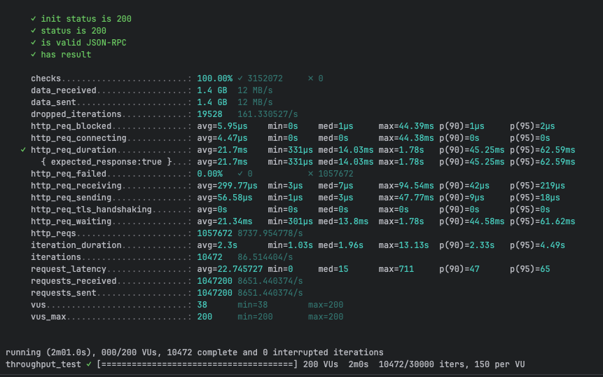
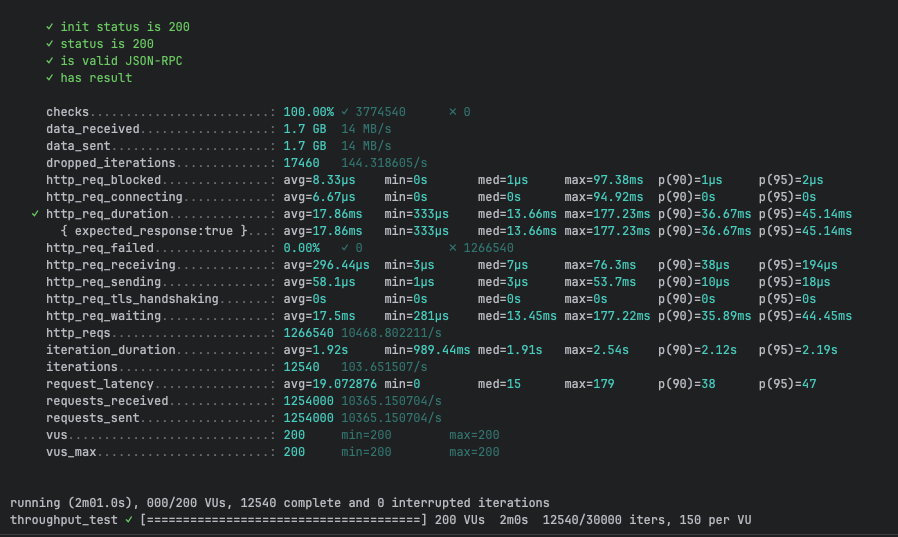
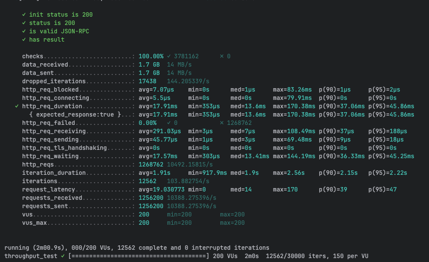
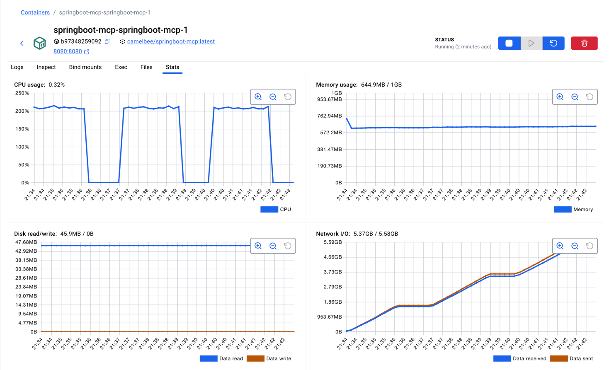

# MCP Performance Testing - CamelBee Microservice

This document outlines the configuration, setup, and performance test results for a CamelBee-generated MCP microservice.

## Microservice Creation

The microservice was created using the [CamelBee Initializer](https://www.camelbee.io) with the following configuration:

- **Interface**: MCP (Model Context Protocol)
- **Runtime**: Spring Boot WebFlux
- **Backend**: MOCK (no external dependencies)

After generating and downloading the microservice from CamelBee, apply the following configurations for optimal performance testing.

## Configuration

### Application Configuration

After creating the microservice, update the `application.yml` with the following settings to disable all interceptors:

```yaml
camelbee:
  # when enabled registers the CamelBee event notifier to the Camel context
  notifier-enabled: false
  # when enabled configures stream caching, MDC logging and CamelBeeUnitOfWork for routes
  route-configurer-enabled: false
  # when enabled it allows the CamelBee WebGL application to fetch the topology of the Camel Context
  context-enabled: false
  # when enabled intercepts/traces request and responses of all camel components and caches messages
  tracer-enabled: false
  # maximum time the tracer can remain idle before deactivation tracing of messages
  tracer-max-idle-time: 60000
  # maximum collected trace messages
  tracer-max-messages-count: 10000
  # when enabled it logs the messages exchanged between endpoints
  logging-enabled: false
```

> **Note**: The default `application.yaml` and `pom.xml` generated by the CamelBee Initializer are preconfigured for `spring-ai-starter-mcp-server-webmvc`. To build the WebFlux version instead, replace the contents of `application.yaml` with the contents of `application_webflux.yaml`, and the contents of `pom.xml` with the contents of `pom_webflux.xml`, then build the application.

> **Note**: The `McpTools.java` class contains three test configurations. For this test, **Test 1 (MCP Tool only)** is active — the MCP tool call is handled directly without MapStruct DTO mapping or Apache Camel. Tests 2 and 3 are commented out.

```java 
@McpTool(name = "createOrder", description = "Create a new order with customer details, product information, and shipping preferences")
Order createOrder(
@McpToolParam(description = "Order object containing salesChannel, items with productName, quantity, and price") Order order,
@McpToolParam(description = "Client-generated correlation ID for distributed tracing and logging", required = false) String transactionId,
@McpToolParam(description = "Business process correlation ID for end-to-end transaction tracing across systems",
required = false) String businessTransactionId
) throws Exception {

    Order response = new Order();
    response.setId("1");
    response.setSalesChannel(order.getSalesChannel());
    response.setItems(order.getItems());
    return response;

}
```

### Docker Compose Configuration

Update the CPU allocation in `docker-compose.yml` to **2 cores** for optimal performance:

```yaml
deploy:
  resources:
    limits:
      cpus: '2'      # Updated from default to 2 cores
      memory: 1G
    reservations:
      cpus: '1'
      memory: 1G
```

> **Note**: Increasing the CPU limit to 2 cores significantly improves throughput and allows the microservice to handle higher concurrent loads efficiently.

## Build and Deployment

### Build Steps

```bash
# Make the Maven wrapper executable
chmod +x mvnw

# Package the application (skip tests for faster build)
./mvnw package -DskipTests

# Start the Docker container
docker compose up --build -d
```

## Performance Testing

### Test Setup

- **Tool**: k6 load testing tool
- **Test File**: `mcp-throughput-test.js` (located in `docs/k6/mcp/`)
- **VUs (Virtual Users)**: 200
- **Duration**: 2 minutes per run
- **Warm-up**: 3 test runs to ensure JVM optimization

### Test Execution

```bash
cd docs/k6/mcp
k6 run mcp-throughput-test.js
```

## Performance Results

### Run 1 - Initial Warm-up

```

     ✓ init status is 200
     ✓ status is 200
     ✓ is valid JSON-RPC
     ✓ has result

     checks.........................: 100.00% ✓ 3152072     ✗ 0      
     data_received..................: 1.4 GB  12 MB/s
     data_sent......................: 1.4 GB  12 MB/s
     dropped_iterations.............: 19528   161.330527/s
     http_req_blocked...............: avg=5.95µs    min=0s    med=1µs     max=44.39ms p(90)=1µs     p(95)=2µs    
     http_req_connecting............: avg=4.47µs    min=0s    med=0s      max=44.38ms p(90)=0s      p(95)=0s     
   ✓ http_req_duration..............: avg=21.7ms    min=331µs med=14.03ms max=1.78s   p(90)=45.25ms p(95)=62.59ms
       { expected_response:true }...: avg=21.7ms    min=331µs med=14.03ms max=1.78s   p(90)=45.25ms p(95)=62.59ms
     http_req_failed................: 0.00%   ✓ 0           ✗ 1057672
     http_req_receiving.............: avg=299.77µs  min=3µs   med=7µs     max=94.54ms p(90)=42µs    p(95)=219µs  
     http_req_sending...............: avg=56.58µs   min=1µs   med=3µs     max=47.77ms p(90)=9µs     p(95)=18µs   
     http_req_tls_handshaking.......: avg=0s        min=0s    med=0s      max=0s      p(90)=0s      p(95)=0s     
     http_req_waiting...............: avg=21.34ms   min=301µs med=13.8ms  max=1.78s   p(90)=44.58ms p(95)=61.62ms
     http_reqs......................: 1057672 8737.954778/s
     iteration_duration.............: avg=2.3s      min=1.03s med=1.96s   max=13.13s  p(90)=2.33s   p(95)=4.49s  
     iterations.....................: 10472   86.514404/s
     request_latency................: avg=22.745727 min=0     med=15      max=711     p(90)=47      p(95)=65     
     requests_received..............: 1047200 8651.440374/s
     requests_sent..................: 1047200 8651.440374/s
     vus............................: 38      min=38        max=200  
     vus_max........................: 200     min=200       max=200  


running (2m01.0s), 000/200 VUs, 10472 complete and 0 interrupted iterations
throughput_test ✓ [======================================] 200 VUs  2m0s  10472/30000 iters, 150 per VU
```

**Throughput**: ~8,738 req/s

**Screenshot of the result:**


---

### Run 2 - JVM Optimization Phase

```

     ✓ init status is 200
     ✓ status is 200
     ✓ is valid JSON-RPC
     ✓ has result

     checks.........................: 100.00% ✓ 3774540      ✗ 0      
     data_received..................: 1.7 GB  14 MB/s
     data_sent......................: 1.7 GB  14 MB/s
     dropped_iterations.............: 17460   144.318605/s
     http_req_blocked...............: avg=8.33µs    min=0s       med=1µs     max=97.38ms  p(90)=1µs     p(95)=2µs    
     http_req_connecting............: avg=6.67µs    min=0s       med=0s      max=94.92ms  p(90)=0s      p(95)=0s     
   ✓ http_req_duration..............: avg=17.86ms   min=333µs    med=13.66ms max=177.23ms p(90)=36.67ms p(95)=45.14ms
       { expected_response:true }...: avg=17.86ms   min=333µs    med=13.66ms max=177.23ms p(90)=36.67ms p(95)=45.14ms
     http_req_failed................: 0.00%   ✓ 0            ✗ 1266540
     http_req_receiving.............: avg=296.44µs  min=3µs      med=7µs     max=76.3ms   p(90)=38µs    p(95)=194µs  
     http_req_sending...............: avg=58.1µs    min=1µs      med=3µs     max=53.7ms   p(90)=10µs    p(95)=18µs   
     http_req_tls_handshaking.......: avg=0s        min=0s       med=0s      max=0s       p(90)=0s      p(95)=0s     
     http_req_waiting...............: avg=17.5ms    min=281µs    med=13.45ms max=177.22ms p(90)=35.89ms p(95)=44.45ms
     http_reqs......................: 1266540 10468.802211/s
     iteration_duration.............: avg=1.92s     min=989.44ms med=1.91s   max=2.54s    p(90)=2.12s   p(95)=2.19s  
     iterations.....................: 12540   103.651507/s
     request_latency................: avg=19.072876 min=0        med=15      max=179      p(90)=38      p(95)=47     
     requests_received..............: 1254000 10365.150704/s
     requests_sent..................: 1254000 10365.150704/s
     vus............................: 200     min=200        max=200  
     vus_max........................: 200     min=200        max=200  


running (2m01.0s), 000/200 VUs, 12540 complete and 0 interrupted iterations
throughput_test ✓ [======================================] 200 VUs  2m0s  12540/30000 iters, 150 per VU
```

**Throughput**: ~10,469 req/s  
**Improvement**: +19.8% over Run 1


**Screenshot of the result:**


---

### Run 3 - Optimized Performance

```

     ✓ init status is 200
     ✓ status is 200
     ✓ is valid JSON-RPC
     ✓ has result

     checks.........................: 100.00% ✓ 3781162      ✗ 0      
     data_received..................: 1.7 GB  14 MB/s
     data_sent......................: 1.7 GB  14 MB/s
     dropped_iterations.............: 17438   144.205339/s
     http_req_blocked...............: avg=7.07µs    min=0s      med=1µs     max=83.26ms  p(90)=1µs     p(95)=2µs    
     http_req_connecting............: avg=5.5µs     min=0s      med=0s      max=79.91ms  p(90)=0s      p(95)=0s     
   ✓ http_req_duration..............: avg=17.91ms   min=353µs   med=13.6ms  max=170.38ms p(90)=37.06ms p(95)=45.86ms
       { expected_response:true }...: avg=17.91ms   min=353µs   med=13.6ms  max=170.38ms p(90)=37.06ms p(95)=45.86ms
     http_req_failed................: 0.00%   ✓ 0            ✗ 1268762
     http_req_receiving.............: avg=291.03µs  min=3µs     med=7µs     max=108.49ms p(90)=37µs    p(95)=188µs  
     http_req_sending...............: avg=45.77µs   min=1µs     med=3µs     max=69.48ms  p(90)=9µs     p(95)=18µs   
     http_req_tls_handshaking.......: avg=0s        min=0s      med=0s      max=0s       p(90)=0s      p(95)=0s     
     http_req_waiting...............: avg=17.57ms   min=303µs   med=13.41ms max=144.19ms p(90)=36.33ms p(95)=45.25ms
     http_reqs......................: 1268762 10492.15815/s
     iteration_duration.............: avg=1.91s     min=917.9ms med=1.9s    max=2.56s    p(90)=2.15s   p(95)=2.22s  
     iterations.....................: 12562   103.882754/s
     request_latency................: avg=19.030773 min=0       med=14      max=170      p(90)=39      p(95)=47     
     requests_received..............: 1256200 10388.275396/s
     requests_sent..................: 1256200 10388.275396/s
     vus............................: 200     min=200        max=200  
     vus_max........................: 200     min=200        max=200  


running (2m00.9s), 000/200 VUs, 12562 complete and 0 interrupted iterations
throughput_test ✓ [======================================] 200 VUs  2m0s  12562/30000 iters, 150 per VU
```

**Throughput**: ~10,492 req/s  
**Improvement**: +20.1% over Run 1, +0.2% over Run 2

**Screenshot of the result:**



---

## Performance Summary

| Metric | Run 1 | Run 2 | Run 3 |
|--------|-------|-------|-------|
| **Throughput (req/s)** | 8,738 | 10,469 | 10,492 |
| **Avg Latency (ms)** | 21.70 | 17.86 | 17.91 |
| **Median Latency (ms)** | 14.03 | 13.66 | 13.60 |
| **P90 Latency (ms)** | 45.25 | 36.67 | 37.06 |
| **P95 Latency (ms)** | 62.59 | 45.14 | 45.86 |
| **Max Latency (ms)** | 1,780 | 177.23 | 170.38 |
| **Total Requests** | 1,057,672 | 1,266,540 | 1,268,762 |
| **Success Rate** | 100% | 100% | 100% |

## Key Observations

1. **JVM Warm-up Effect**: Performance improved significantly between runs, demonstrating effective JIT compilation optimization
2. **Consistent Throughput**: Achieved stable ~10K requests/second after warm-up
3. **Low Latency**: Median latency remained consistently around 14-15ms
4. **Zero Failures**: 100% success rate across all test runs
5. **Resource Efficiency**: Maintained stable performance with 2 CPU cores and 1GB memory

## Container Resource Usage

During the performance tests, the container exhibited the following resource utilization patterns:

- **CPU Usage**: Peaked at ~200% (fully utilizing both allocated cores) during each test run, dropping to ~0.32% at idle between runs
- **Memory Usage**: 644.9MB / 1GB — stabilized at ~572MB after initial warm-up (peaked at ~763MB during the first run before settling), indicating efficient memory management with no leaks
- **Disk Read/Write**: 45.9MB read / 0B write — all disk reads occurred at startup (class loading, JARs), with zero disk writes during the tests confirming fully in-memory processing
- **Network I/O**: 5.37GB received / 5.58GB sent — cumulative across all three test runs, consistent with the total data volumes reported by k6 (~4.6GB received and ~4.4GB sent combined)

The CPU graph shows clear spikes during each of the three test runs, demonstrating efficient utilization of the allocated resources. Memory usage remained stable throughout, indicating no memory leaks or excessive garbage collection pressure.

**Screenshot of Docker container statistics:**



## Recommendations

1. **Production Deployment**: Disable all CamelBee interceptors as shown in the configuration for optimal performance
2. **Resource Allocation**: 2 CPU cores and 1GB memory provides good performance for this workload
3. **Warm-up Strategy**: Always perform warm-up requests before measuring production performance
4. **Monitoring**: Track P95 and P99 latencies in production to catch performance degradation early

## Environment

- **Runtime**: Spring Boot with Apache Camel
- **Protocol**: MCP
- **Container**: Docker
- **Resource Limits**: 2 CPUs, 1GB memory
- **Test Load**: 200 concurrent virtual users
