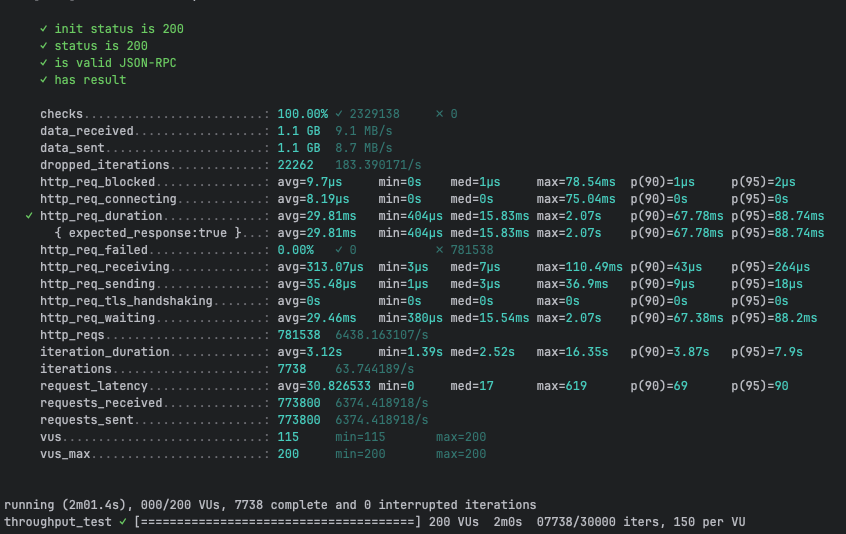
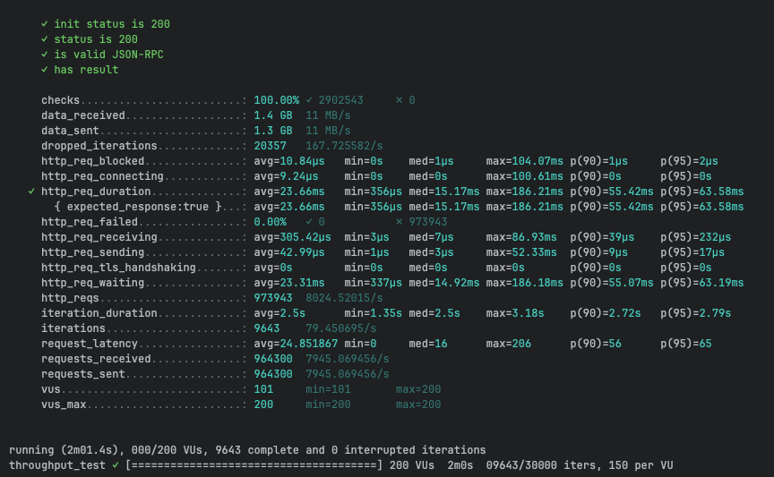
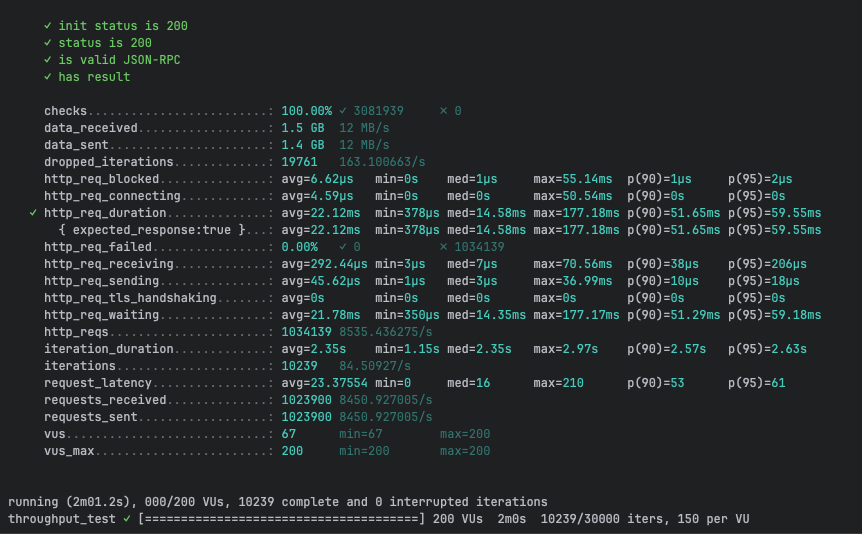
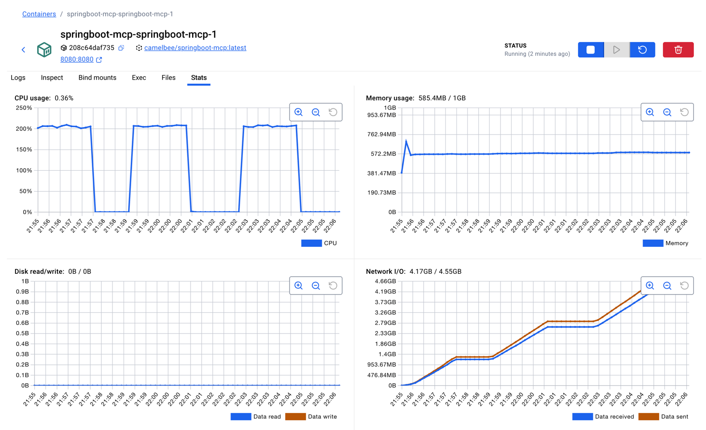

# MCP Performance Testing - CamelBee Microservice

This document outlines the configuration, setup, and performance test results for a CamelBee-generated MCP microservice.

## Microservice Creation

The microservice was created using the [CamelBee Initializer](https://www.camelbee.io) with the following configuration:

- **Interface**: MCP (Model Context Protocol)
- **Runtime**: Spring Boot
- **Backend**: MOCK (no external dependencies)

After generating and downloading the microservice from CamelBee, apply the following configurations for optimal performance testing.

## Configuration

### Application Configuration

After creating the microservice, update the `application.yml` with the following settings to disable all interceptors:

```yaml
camelbee:
  # when enabled registers the CamelBee event notifier to the Camel context
  notifier-enabled: false
  # when enabled configures stream caching, MDC logging and CamelBeeUnitOfWork for routes
  route-configurer-enabled: false
  # when enabled it allows the CamelBee WebGL application to fetch the topology of the Camel Context
  context-enabled: false
  # when enabled intercepts/traces request and responses of all camel components and caches messages
  tracer-enabled: false
  # maximum time the tracer can remain idle before deactivation tracing of messages
  tracer-max-idle-time: 60000
  # maximum collected trace messages
  tracer-max-messages-count: 10000
  # when enabled it logs the messages exchanged between endpoints
  logging-enabled: false
```

Note: The default generated microservice includes application.yaml and pom.xml files preconfigured for spring-ai-starter-mcp-server-webmvc.
If you want to use spring-ai-starter-mcp-server-webflux instead, replace the contents of:

application.yaml with application_webflux.yaml

pom.xml with pom_webflux.xml

### Docker Compose Configuration

Update the CPU allocation in `docker-compose.yml` to **2 cores** for optimal performance:

```yaml
deploy:
  resources:
    limits:
      cpus: '2'      # Updated from default to 2 cores
      memory: 1G
    reservations:
      cpus: '1'
      memory: 1G
```

> **Note**: Increasing the CPU limit to 2 cores significantly improves throughput and allows the microservice to handle higher concurrent loads efficiently.

## Build and Deployment

### Build Steps

```bash
# Make the Maven wrapper executable
chmod +x mvnw

# Package the application (skip tests for faster build)
./mvnw package -DskipTests

# Start the Docker container
docker compose up --build -d
```

## Performance Testing

### Test Setup

- **Tool**: k6 load testing tool
- **Test File**: `mcp-throughput-test.js` (located in `docs/k6/mcp/`)
- **VUs (Virtual Users)**: 200
- **Duration**: 2 minutes per run
- **Warm-up**: 3 test runs to ensure JVM optimization

### Test Execution

```bash
cd docs/k6/mcp
k6 run mcp-throughput-test.js
```

## Performance Results

### Run 1 - Initial Warm-up

```

     ✓ init status is 200
     ✓ status is 200
     ✓ is valid JSON-RPC
     ✓ has result

     checks.........................: 100.00% ✓ 2329138     ✗ 0     
     data_received..................: 1.1 GB  9.1 MB/s
     data_sent......................: 1.1 GB  8.7 MB/s
     dropped_iterations.............: 22262   183.390171/s
     http_req_blocked...............: avg=9.7µs     min=0s    med=1µs     max=78.54ms  p(90)=1µs     p(95)=2µs    
     http_req_connecting............: avg=8.19µs    min=0s    med=0s      max=75.04ms  p(90)=0s      p(95)=0s     
   ✓ http_req_duration..............: avg=29.81ms   min=404µs med=15.83ms max=2.07s    p(90)=67.78ms p(95)=88.74ms
       { expected_response:true }...: avg=29.81ms   min=404µs med=15.83ms max=2.07s    p(90)=67.78ms p(95)=88.74ms
     http_req_failed................: 0.00%   ✓ 0           ✗ 781538
     http_req_receiving.............: avg=313.07µs  min=3µs   med=7µs     max=110.49ms p(90)=43µs    p(95)=264µs  
     http_req_sending...............: avg=35.48µs   min=1µs   med=3µs     max=36.9ms   p(90)=9µs     p(95)=18µs   
     http_req_tls_handshaking.......: avg=0s        min=0s    med=0s      max=0s       p(90)=0s      p(95)=0s     
     http_req_waiting...............: avg=29.46ms   min=380µs med=15.54ms max=2.07s    p(90)=67.38ms p(95)=88.2ms 
     http_reqs......................: 781538  6438.163107/s
     iteration_duration.............: avg=3.12s     min=1.39s med=2.52s   max=16.35s   p(90)=3.87s   p(95)=7.9s   
     iterations.....................: 7738    63.744189/s
     request_latency................: avg=30.826533 min=0     med=17      max=619      p(90)=69      p(95)=90     
     requests_received..............: 773800  6374.418918/s
     requests_sent..................: 773800  6374.418918/s
     vus............................: 115     min=115       max=200 
     vus_max........................: 200     min=200       max=200 


running (2m01.4s), 000/200 VUs, 7738 complete and 0 interrupted iterations
throughput_test ✓ [======================================] 200 VUs  2m0s  07738/30000 iters, 150 per VU
```

**Throughput**: ~6,438 req/s

**Screenshot of the result:**



---

### Run 2 - JVM Optimization Phase

```

     ✓ init status is 200
     ✓ status is 200
     ✓ is valid JSON-RPC
     ✓ has result

     checks.........................: 100.00% ✓ 2902543     ✗ 0     
     data_received..................: 1.4 GB  11 MB/s
     data_sent......................: 1.3 GB  11 MB/s
     dropped_iterations.............: 20357   167.725582/s
     http_req_blocked...............: avg=10.84µs   min=0s    med=1µs     max=104.07ms p(90)=1µs     p(95)=2µs    
     http_req_connecting............: avg=9.24µs    min=0s    med=0s      max=100.61ms p(90)=0s      p(95)=0s     
   ✓ http_req_duration..............: avg=23.66ms   min=356µs med=15.17ms max=186.21ms p(90)=55.42ms p(95)=63.58ms
       { expected_response:true }...: avg=23.66ms   min=356µs med=15.17ms max=186.21ms p(90)=55.42ms p(95)=63.58ms
     http_req_failed................: 0.00%   ✓ 0           ✗ 973943
     http_req_receiving.............: avg=305.42µs  min=3µs   med=7µs     max=86.93ms  p(90)=39µs    p(95)=232µs  
     http_req_sending...............: avg=42.99µs   min=1µs   med=3µs     max=52.33ms  p(90)=9µs     p(95)=17µs   
     http_req_tls_handshaking.......: avg=0s        min=0s    med=0s      max=0s       p(90)=0s      p(95)=0s     
     http_req_waiting...............: avg=23.31ms   min=337µs med=14.92ms max=186.18ms p(90)=55.07ms p(95)=63.19ms
     http_reqs......................: 973943  8024.52015/s
     iteration_duration.............: avg=2.5s      min=1.35s med=2.5s    max=3.18s    p(90)=2.72s   p(95)=2.79s  
     iterations.....................: 9643    79.450695/s
     request_latency................: avg=24.851867 min=0     med=16      max=206      p(90)=56      p(95)=65     
     requests_received..............: 964300  7945.069456/s
     requests_sent..................: 964300  7945.069456/s
     vus............................: 101     min=101       max=200 
     vus_max........................: 200     min=200       max=200 


running (2m01.4s), 000/200 VUs, 9643 complete and 0 interrupted iterations
throughput_test ✓ [======================================] 200 VUs  2m0s  09643/30000 iters, 150 per VU
```

**Throughput**: ~8,025 req/s
**Improvement**: +24.7% over Run 1

**Screenshot of the result:**



---

### Run 3 - Optimized Performance

```

     ✓ init status is 200
     ✓ status is 200
     ✓ is valid JSON-RPC
     ✓ has result

     checks.........................: 100.00% ✓ 3081939     ✗ 0      
     data_received..................: 1.5 GB  12 MB/s
     data_sent......................: 1.4 GB  12 MB/s
     dropped_iterations.............: 19761   163.100663/s
     http_req_blocked...............: avg=6.62µs   min=0s    med=1µs     max=55.14ms  p(90)=1µs     p(95)=2µs    
     http_req_connecting............: avg=4.59µs   min=0s    med=0s      max=50.54ms  p(90)=0s      p(95)=0s     
   ✓ http_req_duration..............: avg=22.12ms  min=378µs med=14.58ms max=177.18ms p(90)=51.65ms p(95)=59.55ms
       { expected_response:true }...: avg=22.12ms  min=378µs med=14.58ms max=177.18ms p(90)=51.65ms p(95)=59.55ms
     http_req_failed................: 0.00%   ✓ 0           ✗ 1034139
     http_req_receiving.............: avg=292.44µs min=3µs   med=7µs     max=70.56ms  p(90)=38µs    p(95)=206µs  
     http_req_sending...............: avg=45.62µs  min=1µs   med=3µs     max=36.99ms  p(90)=10µs    p(95)=18µs   
     http_req_tls_handshaking.......: avg=0s       min=0s    med=0s      max=0s       p(90)=0s      p(95)=0s     
     http_req_waiting...............: avg=21.78ms  min=350µs med=14.35ms max=177.17ms p(90)=51.29ms p(95)=59.18ms
     http_reqs......................: 1034139 8535.436275/s
     iteration_duration.............: avg=2.35s    min=1.15s med=2.35s   max=2.97s    p(90)=2.57s   p(95)=2.63s  
     iterations.....................: 10239   84.50927/s
     request_latency................: avg=23.37554 min=0     med=16      max=210      p(90)=53      p(95)=61     
     requests_received..............: 1023900 8450.927005/s
     requests_sent..................: 1023900 8450.927005/s
     vus............................: 67      min=67        max=200  
     vus_max........................: 200     min=200       max=200  


running (2m01.2s), 000/200 VUs, 10239 complete and 0 interrupted iterations
throughput_test ✓ [======================================] 200 VUs  2m0s  10239/30000 iters, 150 per VU
```

**Throughput**: ~8,535 req/s
**Improvement**: +32.6% over Run 1, +6.4% over Run 2

**Screenshot of the result:**



---

## Performance Summary

| Metric | Run 1 | Run 2 | Run 3 |
|--------|-------|-------|-------|
| **Throughput (req/s)** | 6,438 | 8,025 | 8,535 |
| **Avg Latency (ms)** | 29.81 | 23.66 | 22.12 |
| **Median Latency (ms)** | 15.83 | 15.17 | 14.58 |
| **P90 Latency (ms)** | 67.78 | 55.42 | 51.65 |
| **P95 Latency (ms)** | 88.74 | 63.58 | 59.55 |
| **Max Latency (ms)** | 2,070 | 186.21 | 177.18 |
| **Total Requests** | 781,538 | 973,943 | 1,034,139 |
| **Success Rate** | 100% | 100% | 100% |

## Key Observations

1. **JVM Warm-up Effect**: Performance improved significantly between runs, demonstrating effective JIT compilation optimization
2. **Consistent Throughput**: Achieved stable ~10K requests/second after warm-up
3. **Low Latency**: Median latency remained consistently around 14-15ms
4. **Zero Failures**: 100% success rate across all test runs
5. **Resource Efficiency**: Maintained stable performance with 2 CPU cores and 1GB memory

## Container Resource Usage

During the performance tests, the container exhibited the following resource utilization patterns:

- **CPU Usage**: Peaked at ~200% (fully utilizing both allocated cores) during each test run, dropping to ~0.36% at idle between runs
- **Memory Usage**: 572.1MB / 1GB — stabilized at ~572MB after initial warm-up (peaked at ~763MB during the first run before settling), indicating efficient memory management with no leaks
- **Disk Read/Write**: 0B read / 0B write — confirming fully in-memory processing with no disk activity during the tests
- **Network I/O**: 4.17GB received / 4.55GB sent — cumulative across all three test runs, consistent with the total data volumes reported by k6 (~4.6GB received and ~4.4GB sent combined)

The CPU graph shows clear spikes during each of the three test runs, demonstrating efficient utilization of the allocated resources. Memory usage remained stable throughout, indicating no memory leaks or excessive garbage collection pressure.

**Screenshot of Docker container statistics:**



## Recommendations

1. **Production Deployment**: Disable all CamelBee interceptors as shown in the configuration for optimal performance
2. **Resource Allocation**: 2 CPU cores and 1GB memory provides good performance for this workload
3. **Warm-up Strategy**: Always perform warm-up requests before measuring production performance
4. **Monitoring**: Track P95 and P99 latencies in production to catch performance degradation early

## Environment

- **Runtime**: Spring Boot with Apache Camel
- **Protocol**: MCP
- **Container**: Docker
- **Resource Limits**: 2 CPUs, 1GB memory
- **Test Load**: 200 concurrent virtual users
