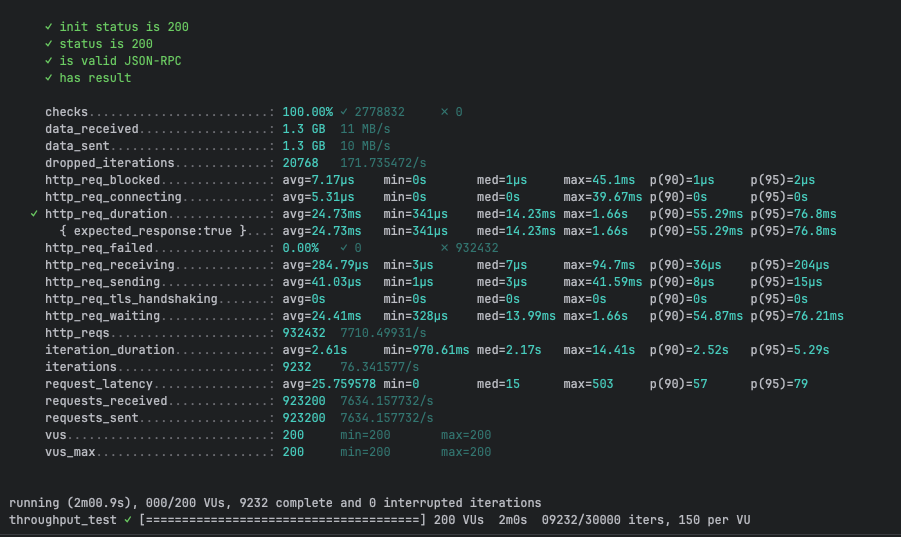
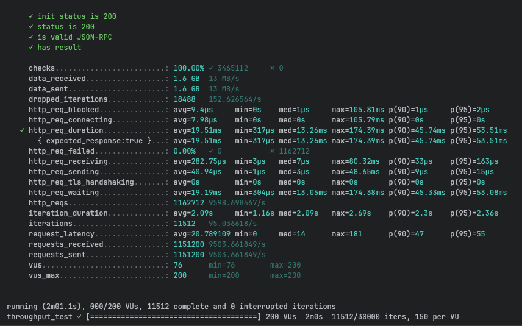
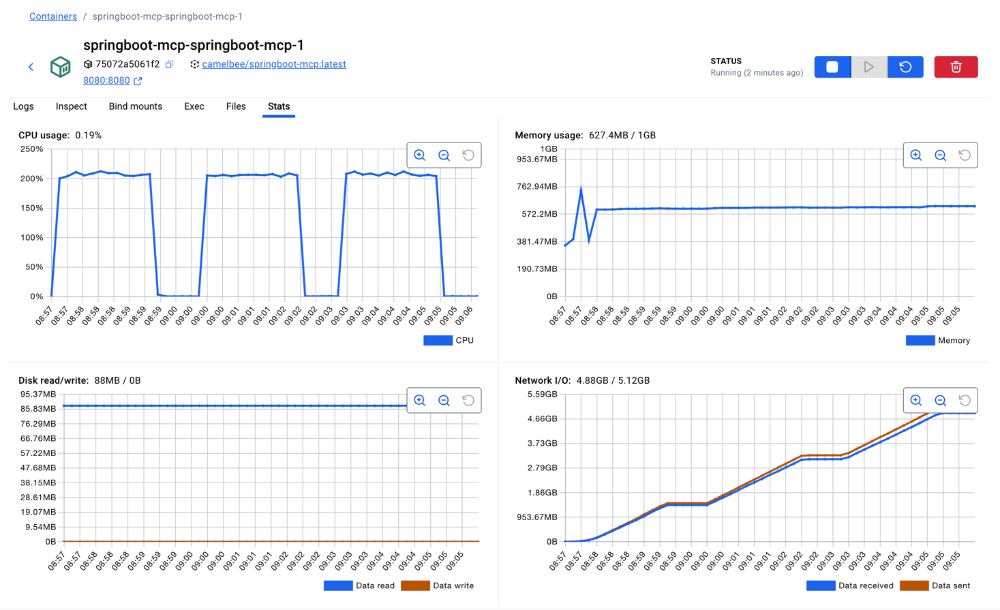

# MCP Performance Testing - CamelBee Microservice

This document outlines the configuration, setup, and performance test results for a CamelBee-generated MCP microservice.

## Microservice Creation

The microservice was created using the [CamelBee Initializer](https://www.camelbee.io) with the following configuration:

- **Interface**: MCP (Model Context Protocol)
- **Runtime**: Spring Boot WebFlux
- **Backend**: MOCK (no external dependencies)

After generating and downloading the microservice from CamelBee, apply the following configurations for optimal performance testing.

## Configuration

### Application Configuration

After creating the microservice, update the `application.yml` with the following settings to disable all interceptors:

```yaml
camelbee:
  # when enabled registers the CamelBee event notifier to the Camel context
  notifier-enabled: false
  # when enabled configures stream caching, MDC logging and CamelBeeUnitOfWork for routes
  route-configurer-enabled: false
  # when enabled it allows the CamelBee WebGL application to fetch the topology of the Camel Context
  context-enabled: false
  # when enabled intercepts/traces request and responses of all camel components and caches messages
  tracer-enabled: false
  # maximum time the tracer can remain idle before deactivation tracing of messages
  tracer-max-idle-time: 60000
  # maximum collected trace messages
  tracer-max-messages-count: 10000
  # when enabled it logs the messages exchanged between endpoints
  logging-enabled: false
```

> **Note**: The default `application.yaml` and `pom.xml` generated by the CamelBee Initializer are preconfigured for `spring-ai-starter-mcp-server-webmvc`. To build the WebFlux version instead, replace the contents of `application.yaml` with the contents of `application_webflux.yaml`, and the contents of `pom.xml` with the contents of `pom_webflux.xml`, then build the application.

> **Note**: The `McpTools.java` class contains three test configurations. For this test, **Test 3 (MCP Tool + MapStruct + Apache Camel)** is active — the MCP tool call goes through a MapStruct DTO mapping (`mcpToDomainOrder` → `domainToMcpOrder`) and is routed through Apache Camel. Tests 1 and 2 are commented out.

```java 
@McpTool(name = "createOrder", description = "Create a new order with customer details, product information, and shipping preferences")
Order createOrder(
@McpToolParam(description = "Order object containing salesChannel, items with productName, quantity, and price") Order order,
@McpToolParam(description = "Client-generated correlation ID for distributed tracing and logging", required = false) String transactionId,
@McpToolParam(description = "Business process correlation ID for end-to-end transaction tracing across systems",
required = false) String businessTransactionId
) throws Exception {

      var result = fluentProducerTemplate
          .to("direct:mcpCreateOrder")
          .withHeader("transactionId", transactionId)
          .withBody(order)
          .send();

      if (result.getMessage().getBody() instanceof Exception) {
        throw result.getMessage().getBody(Exception.class);
      } else {
        return result.getMessage().getBody(Order.class);
      }

}
```

### Docker Compose Configuration

Update the CPU allocation in `docker-compose.yml` to **2 cores** for optimal performance:

```yaml
deploy:
  resources:
    limits:
      cpus: '2'      # Updated from default to 2 cores
      memory: 1G
    reservations:
      cpus: '1'
      memory: 1G
```

> **Note**: Increasing the CPU limit to 2 cores significantly improves throughput and allows the microservice to handle higher concurrent loads efficiently.

## Build and Deployment

### Build Steps

```bash
# Make the Maven wrapper executable
chmod +x mvnw

# Package the application (skip tests for faster build)
./mvnw package -DskipTests

# Start the Docker container
docker compose up --build -d
```

## Performance Testing

### Test Setup

- **Tool**: k6 load testing tool
- **Test File**: `mcp-throughput-test.js` (located in `docs/k6/mcp/`)
- **VUs (Virtual Users)**: 200
- **Duration**: 2 minutes per run
- **Warm-up**: 3 test runs to ensure JVM optimization

### Test Execution

```bash
cd docs/k6/mcp
k6 run mcp-throughput-test.js
```

## Performance Results

### Run 1 - Initial Warm-up

```

     ✓ init status is 200
     ✓ status is 200
     ✓ is valid JSON-RPC
     ✓ has result

     checks.........................: 100.00% ✓ 2778832     ✗ 0     
     data_received..................: 1.3 GB  11 MB/s
     data_sent......................: 1.3 GB  10 MB/s
     dropped_iterations.............: 20768   171.735472/s
     http_req_blocked...............: avg=7.17µs    min=0s       med=1µs     max=45.1ms  p(90)=1µs     p(95)=2µs    
     http_req_connecting............: avg=5.31µs    min=0s       med=0s      max=39.67ms p(90)=0s      p(95)=0s     
   ✓ http_req_duration..............: avg=24.73ms   min=341µs    med=14.23ms max=1.66s   p(90)=55.29ms p(95)=76.8ms 
       { expected_response:true }...: avg=24.73ms   min=341µs    med=14.23ms max=1.66s   p(90)=55.29ms p(95)=76.8ms 
     http_req_failed................: 0.00%   ✓ 0           ✗ 932432
     http_req_receiving.............: avg=284.79µs  min=3µs      med=7µs     max=94.7ms  p(90)=36µs    p(95)=204µs  
     http_req_sending...............: avg=41.03µs   min=1µs      med=3µs     max=41.59ms p(90)=8µs     p(95)=15µs   
     http_req_tls_handshaking.......: avg=0s        min=0s       med=0s      max=0s      p(90)=0s      p(95)=0s     
     http_req_waiting...............: avg=24.41ms   min=328µs    med=13.99ms max=1.66s   p(90)=54.87ms p(95)=76.21ms
     http_reqs......................: 932432  7710.49931/s
     iteration_duration.............: avg=2.61s     min=970.61ms med=2.17s   max=14.41s  p(90)=2.52s   p(95)=5.29s  
     iterations.....................: 9232    76.341577/s
     request_latency................: avg=25.759578 min=0        med=15      max=503     p(90)=57      p(95)=79     
     requests_received..............: 923200  7634.157732/s
     requests_sent..................: 923200  7634.157732/s
     vus............................: 200     min=200       max=200 
     vus_max........................: 200     min=200       max=200 


running (2m00.9s), 000/200 VUs, 9232 complete and 0 interrupted iterations
throughput_test ✓ [======================================] 200 VUs  2m0s  09232/30000 iters, 150 per VU
```

**Throughput**: ~7,710 req/s

**Screenshot of the result:**



---

### Run 2 - JVM Optimization Phase

```

     ✓ init status is 200
     ✓ status is 200
     ✓ is valid JSON-RPC
     ✓ has result

     checks.........................: 100.00% ✓ 3465112     ✗ 0      
     data_received..................: 1.6 GB  13 MB/s
     data_sent......................: 1.6 GB  13 MB/s
     dropped_iterations.............: 18488   152.626564/s
     http_req_blocked...............: avg=9.4µs     min=0s    med=1µs     max=105.81ms p(90)=1µs     p(95)=2µs    
     http_req_connecting............: avg=7.98µs    min=0s    med=0s      max=105.79ms p(90)=0s      p(95)=0s     
   ✓ http_req_duration..............: avg=19.51ms   min=317µs med=13.26ms max=174.39ms p(90)=45.74ms p(95)=53.51ms
       { expected_response:true }...: avg=19.51ms   min=317µs med=13.26ms max=174.39ms p(90)=45.74ms p(95)=53.51ms
     http_req_failed................: 0.00%   ✓ 0           ✗ 1162712
     http_req_receiving.............: avg=282.75µs  min=3µs   med=7µs     max=80.32ms  p(90)=33µs    p(95)=163µs  
     http_req_sending...............: avg=40.94µs   min=1µs   med=3µs     max=48.65ms  p(90)=9µs     p(95)=15µs   
     http_req_tls_handshaking.......: avg=0s        min=0s    med=0s      max=0s       p(90)=0s      p(95)=0s     
     http_req_waiting...............: avg=19.19ms   min=304µs med=13.05ms max=174.38ms p(90)=45.33ms p(95)=53.08ms
     http_reqs......................: 1162712 9598.698467/s
     iteration_duration.............: avg=2.09s     min=1.16s med=2.09s   max=2.69s    p(90)=2.3s    p(95)=2.36s  
     iterations.....................: 11512   95.036618/s
     request_latency................: avg=20.789109 min=0     med=14      max=181      p(90)=47      p(95)=55     
     requests_received..............: 1151200 9503.661849/s
     requests_sent..................: 1151200 9503.661849/s
     vus............................: 76      min=76        max=200  
     vus_max........................: 200     min=200       max=200  


running (2m01.1s), 000/200 VUs, 11512 complete and 0 interrupted iterations
throughput_test ✓ [======================================] 200 VUs  2m0s  11512/30000 iters, 150 per VU
```

**Throughput**: ~9,599 req/s
**Improvement**: +24.5% over Run 1

**Screenshot of the result:**



---

### Run 3 - Optimized Performance

```

     ✓ init status is 200
     ✓ status is 200
     ✓ is valid JSON-RPC
     ✓ has result

     checks.........................: 100.00% ✓ 3487386     ✗ 0      
     data_received..................: 1.6 GB  13 MB/s
     data_sent......................: 1.6 GB  13 MB/s
     dropped_iterations.............: 18414   152.110644/s
     http_req_blocked...............: avg=6.75µs   min=0s    med=1µs     max=57.49ms  p(90)=1µs     p(95)=2µs    
     http_req_connecting............: avg=5.02µs   min=0s    med=0s      max=53.77ms  p(90)=0s      p(95)=0s     
   ✓ http_req_duration..............: avg=19.44ms  min=386µs med=13.38ms max=190.29ms p(90)=44.95ms p(95)=53.01ms
       { expected_response:true }...: avg=19.44ms  min=386µs med=13.38ms max=190.29ms p(90)=44.95ms p(95)=53.01ms
     http_req_failed................: 0.00%   ✓ 0           ✗ 1170186
     http_req_receiving.............: avg=264.87µs min=3µs   med=7µs     max=111.71ms p(90)=34µs    p(95)=156µs  
     http_req_sending...............: avg=47.85µs  min=1µs   med=3µs     max=69.33ms  p(90)=8µs     p(95)=15µs   
     http_req_tls_handshaking.......: avg=0s       min=0s    med=0s      max=0s       p(90)=0s      p(95)=0s     
     http_req_waiting...............: avg=19.13ms  min=338µs med=13.17ms max=190.28ms p(90)=44.54ms p(95)=52.64ms
     http_reqs......................: 1170186 9666.435665/s
     iteration_duration.............: avg=2.08s    min=1.06s med=2.08s   max=2.95s    p(90)=2.29s   p(95)=2.37s  
     iterations.....................: 11586   95.707284/s
     request_latency................: avg=20.65132 min=0     med=14      max=253      p(90)=46      p(95)=54     
     requests_received..............: 1158600 9570.728381/s
     requests_sent..................: 1158600 9570.728381/s
     vus............................: 42      min=42        max=200  
     vus_max........................: 200     min=200       max=200  


running (2m01.1s), 000/200 VUs, 11586 complete and 0 interrupted iterations
throughput_test ✓ [======================================] 200 VUs  2m0s  11586/30000 iters, 150 per VU
```

**Throughput**: ~9,666 req/s
**Improvement**: +25.4% over Run 1, +0.7% over Run 2

**Screenshot of the result:**


---

## Performance Summary

| Metric | Run 1 | Run 2 | Run 3 |
|--------|-------|-------|-------|
| **Throughput (req/s)** | ~7,710 | ~9,599 | ~9,666 |
| **Avg Latency (ms)** | 24.73 | 19.51 | 19.44 |
| **Median Latency (ms)** | 14.23 | 13.26 | 13.38 |
| **P90 Latency (ms)** | 55.29 | 45.74 | 44.95 |
| **P95 Latency (ms)** | 76.8 | 53.51 | 53.01 |
| **Max Latency (ms)** | 1,660 | 174.39 | 190.29 |
| **Total Requests** | 932,432 | 1,162,712 | 1,170,186 |
| **Success Rate** | 100% | 100% | 100% |

## Key Observations

1. **JVM Warm-up Effect**: Performance improved significantly between runs, demonstrating effective JIT compilation optimization
2. **Consistent Throughput**: Achieved stable ~9.6K requests/second after warm-up
3. **Low Latency**: Median latency remained consistently around 13–14ms
4. **Zero Failures**: 100% success rate across all test runs
5. **Resource Efficiency**: Maintained stable performance with 2 CPU cores and 1GB memory

## Container Resource Usage

During the performance tests, the container exhibited the following resource utilization patterns:

- **CPU Usage**: Peaked at ~200% (fully utilizing both allocated cores) during each test run, dropping to ~0.19% at idle between runs
- **Memory Usage**: 627.4MB / 1GB — stabilized after initial warm-up (peaked at ~763MB during the first run before settling), indicating efficient memory management with no leaks
- **Disk Read/Write**: 88MB read / 0B write — disk reads occurred at startup (class loading), zero writes during tests confirming fully in-memory processing
- **Network I/O**: 4.88GB received / 5.12GB sent — cumulative across all three test runs, consistent with the total data volumes reported by k6

The CPU graph shows clear spikes during each of the three test runs, demonstrating efficient utilization of the allocated resources. Memory usage remained stable throughout, indicating no memory leaks or excessive garbage collection pressure.

**Screenshot of Docker container statistics:**



## Recommendations

1. **Production Deployment**: Disable all CamelBee interceptors as shown in the configuration for optimal performance
2. **Resource Allocation**: 2 CPU cores and 1GB memory provides good performance for this workload
3. **Warm-up Strategy**: Always perform warm-up requests before measuring production performance
4. **Monitoring**: Track P95 and P99 latencies in production to catch performance degradation early

## Environment

- **Runtime**: Spring Boot with Apache Camel
- **Protocol**: MCP
- **Container**: Docker
- **Resource Limits**: 2 CPUs, 1GB memory
- **Test Load**: 200 concurrent virtual users
