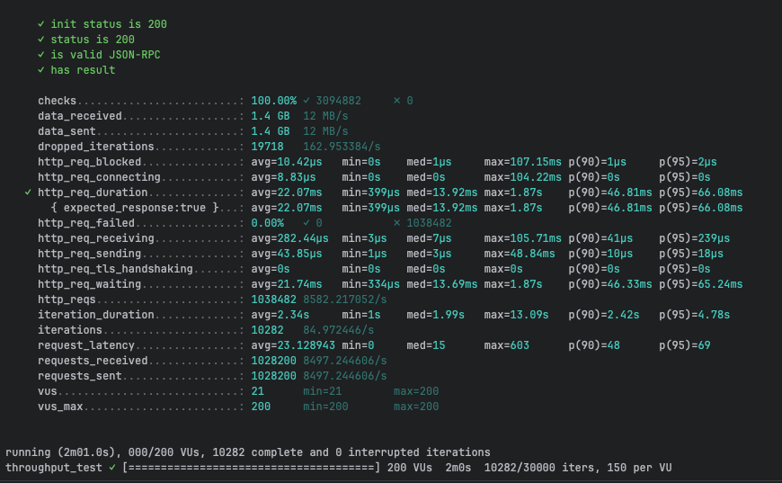
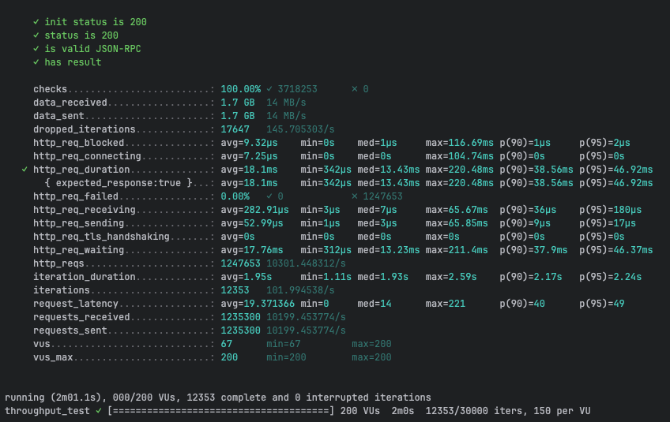
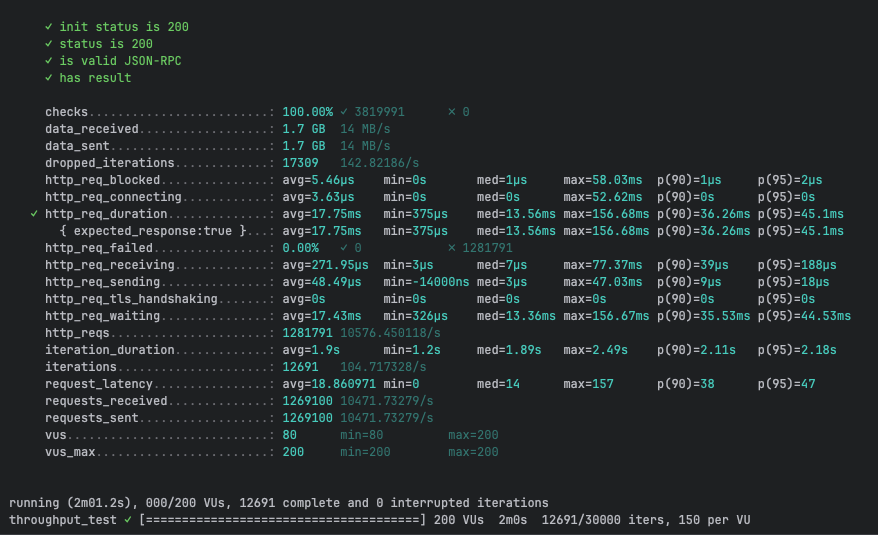
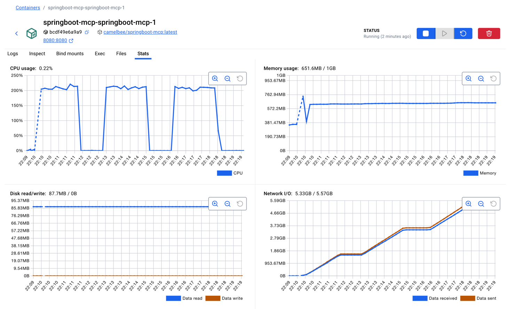

# MCP Performance Testing - CamelBee Microservice

This document outlines the configuration, setup, and performance test results for a CamelBee-generated MCP microservice.

## Microservice Creation

The microservice was created using the [CamelBee Initializer](https://www.camelbee.io) with the following configuration:

- **Interface**: MCP (Model Context Protocol)
- **Runtime**: Spring Boot
- **Backend**: MOCK (no external dependencies)

After generating and downloading the microservice from CamelBee, apply the following configurations for optimal performance testing.

## Configuration

### Application Configuration

After creating the microservice, update the `application.yml` with the following settings to disable all interceptors:

```yaml
camelbee:
  # when enabled registers the CamelBee event notifier to the Camel context
  notifier-enabled: false
  # when enabled configures stream caching, MDC logging and CamelBeeUnitOfWork for routes
  route-configurer-enabled: false
  # when enabled it allows the CamelBee WebGL application to fetch the topology of the Camel Context
  context-enabled: false
  # when enabled intercepts/traces request and responses of all camel components and caches messages
  tracer-enabled: false
  # maximum time the tracer can remain idle before deactivation tracing of messages
  tracer-max-idle-time: 60000
  # maximum collected trace messages
  tracer-max-messages-count: 10000
  # when enabled it logs the messages exchanged between endpoints
  logging-enabled: false
```

Note: The default generated microservice includes application.yaml and pom.xml files preconfigured for spring-ai-starter-mcp-server-webmvc.
If you want to use spring-ai-starter-mcp-server-webflux instead, replace the contents of:

application.yaml with application_webflux.yaml

pom.xml with pom_webflux.xml

### Docker Compose Configuration

Update the CPU allocation in `docker-compose.yml` to **2 cores** for optimal performance:

```yaml
deploy:
  resources:
    limits:
      cpus: '2'      # Updated from default to 2 cores
      memory: 1G
    reservations:
      cpus: '1'
      memory: 1G
```

> **Note**: Increasing the CPU limit to 2 cores significantly improves throughput and allows the microservice to handle higher concurrent loads efficiently.

## Build and Deployment

### Build Steps

```bash
# Make the Maven wrapper executable
chmod +x mvnw

# Package the application (skip tests for faster build)
./mvnw package -DskipTests

# Start the Docker container
docker compose up --build -d
```

## Performance Testing

### Test Setup

- **Tool**: k6 load testing tool
- **Test File**: `mcp-throughput-test.js` (located in `docs/k6/mcp/`)
- **VUs (Virtual Users)**: 200
- **Duration**: 2 minutes per run
- **Warm-up**: 3 test runs to ensure JVM optimization

### Test Execution

```bash
cd docs/k6/mcp
k6 run mcp-throughput-test.js
```

## Performance Results

### Run 1 - Initial Warm-up

```

     ✓ init status is 200
     ✓ status is 200
     ✓ is valid JSON-RPC
     ✓ has result

     checks.........................: 100.00% ✓ 3094882     ✗ 0      
     data_received..................: 1.4 GB  12 MB/s
     data_sent......................: 1.4 GB  12 MB/s
     dropped_iterations.............: 19718   162.953384/s
     http_req_blocked...............: avg=10.42µs   min=0s    med=1µs     max=107.15ms p(90)=1µs     p(95)=2µs    
     http_req_connecting............: avg=8.83µs    min=0s    med=0s      max=104.22ms p(90)=0s      p(95)=0s     
   ✓ http_req_duration..............: avg=22.07ms   min=399µs med=13.92ms max=1.87s    p(90)=46.81ms p(95)=66.08ms
       { expected_response:true }...: avg=22.07ms   min=399µs med=13.92ms max=1.87s    p(90)=46.81ms p(95)=66.08ms
     http_req_failed................: 0.00%   ✓ 0           ✗ 1038482
     http_req_receiving.............: avg=282.44µs  min=3µs   med=7µs     max=105.71ms p(90)=41µs    p(95)=239µs  
     http_req_sending...............: avg=43.85µs   min=1µs   med=3µs     max=48.84ms  p(90)=10µs    p(95)=18µs   
     http_req_tls_handshaking.......: avg=0s        min=0s    med=0s      max=0s       p(90)=0s      p(95)=0s     
     http_req_waiting...............: avg=21.74ms   min=334µs med=13.69ms max=1.87s    p(90)=46.33ms p(95)=65.24ms
     http_reqs......................: 1038482 8582.217052/s
     iteration_duration.............: avg=2.34s     min=1s    med=1.99s   max=13.09s   p(90)=2.42s   p(95)=4.78s  
     iterations.....................: 10282   84.972446/s
     request_latency................: avg=23.128943 min=0     med=15      max=603      p(90)=48      p(95)=69     
     requests_received..............: 1028200 8497.244606/s
     requests_sent..................: 1028200 8497.244606/s
     vus............................: 21      min=21        max=200  
     vus_max........................: 200     min=200       max=200  


running (2m01.0s), 000/200 VUs, 10282 complete and 0 interrupted iterations
throughput_test ✓ [======================================] 200 VUs  2m0s  10282/30000 iters, 150 per VU
```

**Throughput**: ~8,582 req/s

**Screenshot of the result:**



---

### Run 2 - JVM Optimization Phase

```

     ✓ init status is 200
     ✓ status is 200
     ✓ is valid JSON-RPC
     ✓ has result

     checks.........................: 100.00% ✓ 3718253      ✗ 0      
     data_received..................: 1.7 GB  14 MB/s
     data_sent......................: 1.7 GB  14 MB/s
     dropped_iterations.............: 17647   145.705303/s
     http_req_blocked...............: avg=9.32µs    min=0s    med=1µs     max=116.69ms p(90)=1µs     p(95)=2µs    
     http_req_connecting............: avg=7.25µs    min=0s    med=0s      max=104.74ms p(90)=0s      p(95)=0s     
   ✓ http_req_duration..............: avg=18.1ms    min=342µs med=13.43ms max=220.48ms p(90)=38.56ms p(95)=46.92ms
       { expected_response:true }...: avg=18.1ms    min=342µs med=13.43ms max=220.48ms p(90)=38.56ms p(95)=46.92ms
     http_req_failed................: 0.00%   ✓ 0            ✗ 1247653
     http_req_receiving.............: avg=282.91µs  min=3µs   med=7µs     max=65.67ms  p(90)=36µs    p(95)=180µs  
     http_req_sending...............: avg=52.99µs   min=1µs   med=3µs     max=65.85ms  p(90)=9µs     p(95)=17µs   
     http_req_tls_handshaking.......: avg=0s        min=0s    med=0s      max=0s       p(90)=0s      p(95)=0s     
     http_req_waiting...............: avg=17.76ms   min=312µs med=13.23ms max=211.4ms  p(90)=37.9ms  p(95)=46.37ms
     http_reqs......................: 1247653 10301.448312/s
     iteration_duration.............: avg=1.95s     min=1.11s med=1.93s   max=2.59s    p(90)=2.17s   p(95)=2.24s  
     iterations.....................: 12353   101.994538/s
     request_latency................: avg=19.371366 min=0     med=14      max=221      p(90)=40      p(95)=49     
     requests_received..............: 1235300 10199.453774/s
     requests_sent..................: 1235300 10199.453774/s
     vus............................: 67      min=67         max=200  
     vus_max........................: 200     min=200        max=200  


running (2m01.1s), 000/200 VUs, 12353 complete and 0 interrupted iterations
throughput_test ✓ [======================================] 200 VUs  2m0s  12353/30000 iters, 150 per VU
```

**Throughput**: ~10,301 req/s
**Improvement**: +20.0% over Run 1

**Screenshot of the result:**



---

### Run 3 - Optimized Performance

```

     ✓ init status is 200
     ✓ status is 200
     ✓ is valid JSON-RPC
     ✓ has result

     checks.........................: 100.00% ✓ 3819991      ✗ 0      
     data_received..................: 1.7 GB  14 MB/s
     data_sent......................: 1.7 GB  14 MB/s
     dropped_iterations.............: 17309   142.82186/s
     http_req_blocked...............: avg=5.46µs    min=0s       med=1µs     max=58.03ms  p(90)=1µs     p(95)=2µs    
     http_req_connecting............: avg=3.63µs    min=0s       med=0s      max=52.62ms  p(90)=0s      p(95)=0s     
   ✓ http_req_duration..............: avg=17.75ms   min=375µs    med=13.56ms max=156.68ms p(90)=36.26ms p(95)=45.1ms 
       { expected_response:true }...: avg=17.75ms   min=375µs    med=13.56ms max=156.68ms p(90)=36.26ms p(95)=45.1ms 
     http_req_failed................: 0.00%   ✓ 0            ✗ 1281791
     http_req_receiving.............: avg=271.95µs  min=3µs      med=7µs     max=77.37ms  p(90)=39µs    p(95)=188µs  
     http_req_sending...............: avg=48.49µs   min=-14000ns med=3µs     max=47.03ms  p(90)=9µs     p(95)=18µs   
     http_req_tls_handshaking.......: avg=0s        min=0s       med=0s      max=0s       p(90)=0s      p(95)=0s     
     http_req_waiting...............: avg=17.43ms   min=326µs    med=13.36ms max=156.67ms p(90)=35.53ms p(95)=44.53ms
     http_reqs......................: 1281791 10576.450118/s
     iteration_duration.............: avg=1.9s      min=1.2s     med=1.89s   max=2.49s    p(90)=2.11s   p(95)=2.18s  
     iterations.....................: 12691   104.717328/s
     request_latency................: avg=18.860971 min=0        med=14      max=157      p(90)=38      p(95)=47     
     requests_received..............: 1269100 10471.73279/s
     requests_sent..................: 1269100 10471.73279/s
     vus............................: 80      min=80         max=200  
     vus_max........................: 200     min=200        max=200  


running (2m01.2s), 000/200 VUs, 12691 complete and 0 interrupted iterations
throughput_test ✓ [======================================] 200 VUs  2m0s  12691/30000 iters, 150 per VU
```

**Throughput**: ~10,576 req/s
**Improvement**: +23.2% over Run 1, +2.7% over Run 2

**Screenshot of the result:**



---

## Performance Summary

| Metric | Run 1 | Run 2 | Run 3 |
|--------|-------|-------|-------|
| **Throughput (req/s)** | 8,582 | 10,301 | 10,576 |
| **Avg Latency (ms)** | 22.07 | 18.10 | 17.75 |
| **Median Latency (ms)** | 13.92 | 13.43 | 13.56 |
| **P90 Latency (ms)** | 46.81 | 38.56 | 36.26 |
| **P95 Latency (ms)** | 66.08 | 46.92 | 45.10 |
| **Max Latency (ms)** | 1,870 | 220.48 | 156.68 |
| **Total Requests** | 1,038,482 | 1,247,653 | 1,281,791 |
| **Success Rate** | 100% | 100% | 100% |

## Key Observations

1. **JVM Warm-up Effect**: Performance improved significantly between runs, demonstrating effective JIT compilation optimization
2. **Consistent Throughput**: Achieved stable ~10K requests/second after warm-up
3. **Low Latency**: Median latency remained consistently around 13-14ms
4. **Zero Failures**: 100% success rate across all test runs
5. **Resource Efficiency**: Maintained stable performance with 2 CPU cores and 1GB memory

## Container Resource Usage

During the performance tests, the container exhibited the following resource utilization patterns:

- **CPU Usage**: Peaked at ~200% (fully utilizing both allocated cores) during each test run, dropping to ~0.22% at idle between runs
- **Memory Usage**: 651.6MB / 1GB — stabilized at ~651MB after initial warm-up (peaked at ~763MB during the first run before settling), indicating efficient memory management with no leaks
- **Disk Read/Write**: 87.7MB read / 0B write — all disk reads occurred at startup (class loading, JARs), with zero disk writes during the tests confirming fully in-memory processing
- **Network I/O**: 5.33GB received / 5.57GB sent — cumulative across all three test runs, consistent with the total data volumes reported by k6

The CPU graph shows clear spikes during each of the three test runs, demonstrating efficient utilization of the allocated resources. Memory usage remained stable throughout, indicating no memory leaks or excessive garbage collection pressure.

**Screenshot of Docker container statistics:**



## Recommendations

1. **Production Deployment**: Disable all CamelBee interceptors as shown in the configuration for optimal performance
2. **Resource Allocation**: 2 CPU cores and 1GB memory provides good performance for this workload
3. **Warm-up Strategy**: Always perform warm-up requests before measuring production performance
4. **Monitoring**: Track P95 and P99 latencies in production to catch performance degradation early

## Environment

- **Runtime**: Spring Boot with Apache Camel
- **Protocol**: MCP
- **Container**: Docker
- **Resource Limits**: 2 CPUs, 1GB memory
- **Test Load**: 200 concurrent virtual users
