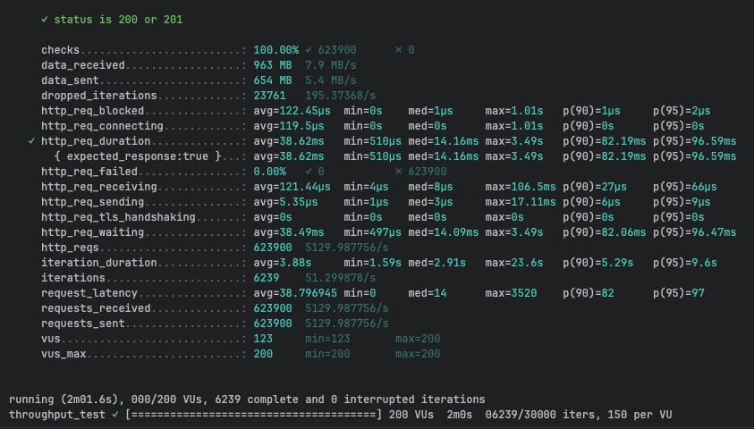
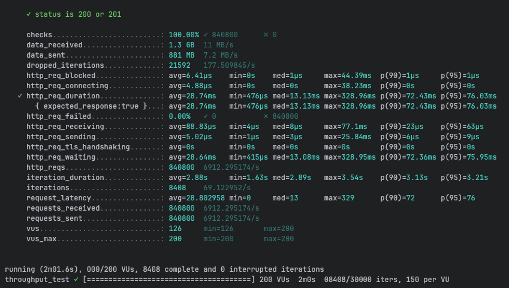
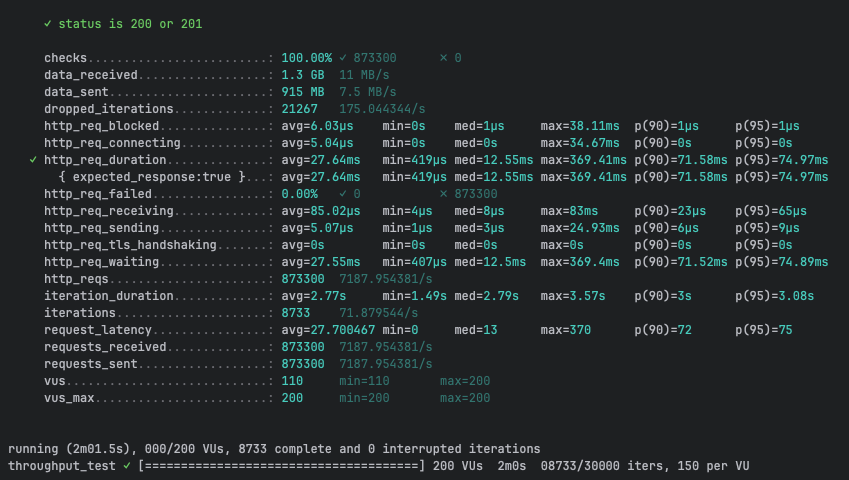
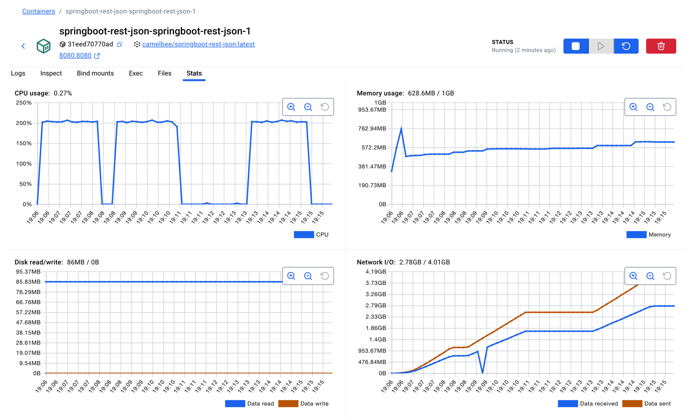

ON MAC/M1

NOTE after creating the micreoservoce update the application yaml like below, set all the interceptors to false

camelbee:
# when enabled registers the CamelBee event notifier to the Camel context
notifier-enabled: false
# when enabled configures stream caching, MDC logging and CamelBeeUnitOfWork for routes
route-configurer-enabled: false
# when enabled it allows the CamelBe WebGL application to fetch the topology of the Camel Context.
context-enabled: false
# when enabled intercepts/traces request and responses of all camel components and caches messages.
tracer-enabled: false
# maximum time the tracer can remain idle before deactivation tracing of messages.
tracer-max-idle-time: 60000
# maximum collected trace messages
tracer-max-messages-count: 10000
# when enabled it logs the messages exchanged between endpoints
logging-enabled: false

and in docker compoes: updated CPU as 2

    deploy:
      resources:
        limits:
          cpus: '2'
          memory: 1G
        reservations:
          cpus: '1'
          memory: 1G

chmod +x mvnw

./mvnw package -DskipTests

docker compose up --build -d

and then ran the
k6 run grpc-ttt.js  2 time to get the jvm warmed up the third run cloocedted the results:

first run:

k6 run rest-throughput-test.js

     ✓ status is 200 or 201

     checks.........................: 100.00% ✓ 623900      ✗ 0     
     data_received..................: 963 MB  7.9 MB/s
     data_sent......................: 654 MB  5.4 MB/s
     dropped_iterations.............: 23761   195.37368/s
     http_req_blocked...............: avg=122.45µs  min=0s    med=1µs     max=1.01s   p(90)=1µs     p(95)=2µs    
     http_req_connecting............: avg=119.5µs   min=0s    med=0s      max=1.01s   p(90)=0s      p(95)=0s     
✓ http_req_duration..............: avg=38.62ms   min=510µs med=14.16ms max=3.49s   p(90)=82.19ms p(95)=96.59ms
{ expected_response:true }...: avg=38.62ms   min=510µs med=14.16ms max=3.49s   p(90)=82.19ms p(95)=96.59ms
http_req_failed................: 0.00%   ✓ 0           ✗ 623900
http_req_receiving.............: avg=121.44µs  min=4µs   med=8µs     max=106.5ms p(90)=27µs    p(95)=66µs   
http_req_sending...............: avg=5.35µs    min=1µs   med=3µs     max=17.11ms p(90)=6µs     p(95)=9µs    
http_req_tls_handshaking.......: avg=0s        min=0s    med=0s      max=0s      p(90)=0s      p(95)=0s     
http_req_waiting...............: avg=38.49ms   min=497µs med=14.09ms max=3.49s   p(90)=82.06ms p(95)=96.47ms
http_reqs......................: 623900  5129.987756/s
iteration_duration.............: avg=3.88s     min=1.59s med=2.91s   max=23.6s   p(90)=5.29s   p(95)=9.6s   
iterations.....................: 6239    51.299878/s
request_latency................: avg=38.796945 min=0     med=14      max=3520    p(90)=82      p(95)=97     
requests_received..............: 623900  5129.987756/s
requests_sent..................: 623900  5129.987756/s
vus............................: 123     min=123       max=200
vus_max........................: 200     min=200       max=200

running (2m01.6s), 000/200 VUs, 6239 complete and 0 interrupted iterations
throughput_test ✓ [======================================] 200 VUs  2m0s  06239/30000 iters, 150 per VU

second run:

     ✓ status is 200 or 201

     checks.........................: 100.00% ✓ 840800      ✗ 0     
     data_received..................: 1.3 GB  11 MB/s
     data_sent......................: 881 MB  7.2 MB/s
     dropped_iterations.............: 21592   177.509845/s
     http_req_blocked...............: avg=6.41µs    min=0s    med=1µs     max=44.39ms  p(90)=1µs     p(95)=1µs    
     http_req_connecting............: avg=4.88µs    min=0s    med=0s      max=38.23ms  p(90)=0s      p(95)=0s     
✓ http_req_duration..............: avg=28.74ms   min=476µs med=13.13ms max=328.96ms p(90)=72.43ms p(95)=76.03ms
{ expected_response:true }...: avg=28.74ms   min=476µs med=13.13ms max=328.96ms p(90)=72.43ms p(95)=76.03ms
http_req_failed................: 0.00%   ✓ 0           ✗ 840800
http_req_receiving.............: avg=88.83µs   min=4µs   med=8µs     max=77.1ms   p(90)=23µs    p(95)=63µs   
http_req_sending...............: avg=5.02µs    min=1µs   med=3µs     max=25.84ms  p(90)=6µs     p(95)=9µs    
http_req_tls_handshaking.......: avg=0s        min=0s    med=0s      max=0s       p(90)=0s      p(95)=0s     
http_req_waiting...............: avg=28.64ms   min=415µs med=13.08ms max=328.95ms p(90)=72.36ms p(95)=75.95ms
http_reqs......................: 840800  6912.295174/s
iteration_duration.............: avg=2.88s     min=1.63s med=2.89s   max=3.54s    p(90)=3.13s   p(95)=3.21s  
iterations.....................: 8408    69.122952/s
request_latency................: avg=28.802958 min=0     med=13      max=329      p(90)=72      p(95)=76     
requests_received..............: 840800  6912.295174/s
requests_sent..................: 840800  6912.295174/s
vus............................: 126     min=126       max=200
vus_max........................: 200     min=200       max=200

running (2m01.6s), 000/200 VUs, 8408 complete and 0 interrupted iterations
throughput_test ✓ [======================================] 200 VUs  2m0s  08408/30000 iters, 150 per VU

third run:

     ✓ status is 200 or 201

     checks.........................: 100.00% ✓ 873300      ✗ 0     
     data_received..................: 1.3 GB  11 MB/s
     data_sent......................: 915 MB  7.5 MB/s
     dropped_iterations.............: 21267   175.044344/s
     http_req_blocked...............: avg=6.03µs    min=0s    med=1µs     max=38.11ms  p(90)=1µs     p(95)=1µs    
     http_req_connecting............: avg=5.04µs    min=0s    med=0s      max=34.67ms  p(90)=0s      p(95)=0s     
✓ http_req_duration..............: avg=27.64ms   min=419µs med=12.55ms max=369.41ms p(90)=71.58ms p(95)=74.97ms
{ expected_response:true }...: avg=27.64ms   min=419µs med=12.55ms max=369.41ms p(90)=71.58ms p(95)=74.97ms
http_req_failed................: 0.00%   ✓ 0           ✗ 873300
http_req_receiving.............: avg=85.02µs   min=4µs   med=8µs     max=83ms     p(90)=23µs    p(95)=65µs   
http_req_sending...............: avg=5.07µs    min=1µs   med=3µs     max=24.93ms  p(90)=6µs     p(95)=9µs    
http_req_tls_handshaking.......: avg=0s        min=0s    med=0s      max=0s       p(90)=0s      p(95)=0s     
http_req_waiting...............: avg=27.55ms   min=407µs med=12.5ms  max=369.4ms  p(90)=71.52ms p(95)=74.89ms
http_reqs......................: 873300  7187.954381/s
iteration_duration.............: avg=2.77s     min=1.49s med=2.79s   max=3.57s    p(90)=3s      p(95)=3.08s  
iterations.....................: 8733    71.879544/s
request_latency................: avg=27.700467 min=0     med=13      max=370      p(90)=72      p(95)=75     
requests_received..............: 873300  7187.954381/s
requests_sent..................: 873300  7187.954381/s
vus............................: 110     min=110       max=200
vus_max........................: 200     min=200       max=200

running (2m01.5s), 000/200 VUs, 8733 complete and 0 interrupted iterations
throughput_test ✓ [======================================] 200 VUs  2m0s  08733/30000 iters, 150 per VU

container stats:

