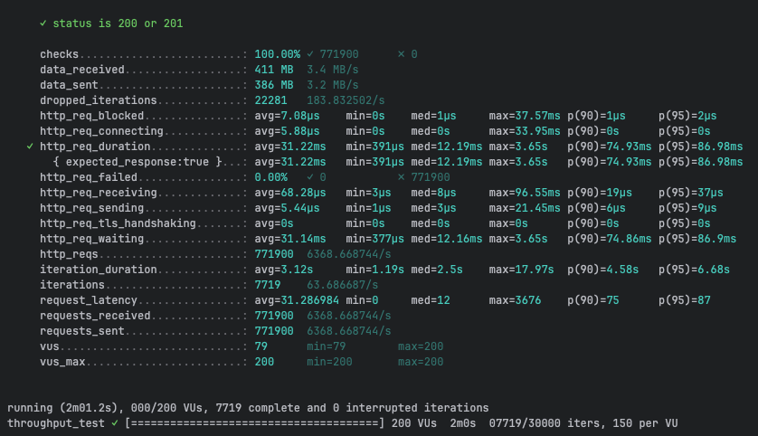
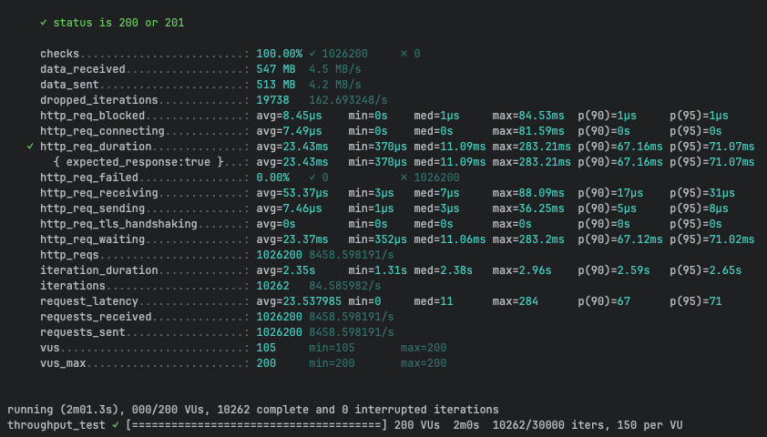
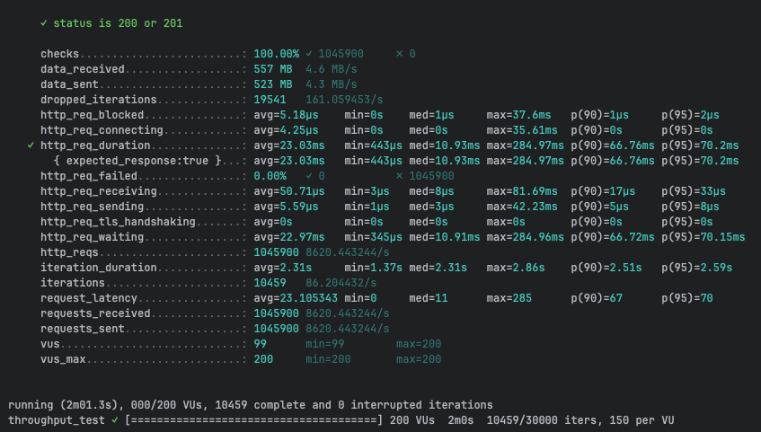
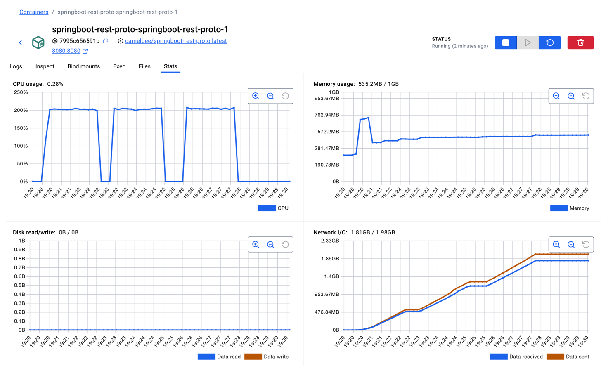

# REST with Protobuf Performance Testing - CamelBee Microservice (Spring Boot)

This document outlines the configuration, setup, and performance test results for a CamelBee-generated REST microservice using Protocol Buffers serialization on Spring Boot.

## Microservice Creation

The microservice was created using the [CamelBee Initializer](https://www.camelbee.io) with the following configuration:

- **Interface**: REST with Protocol Buffers (Protobuf) serialization
- **Runtime**: Spring Boot
- **Backend**: MOCK (no external dependencies)

After generating and downloading the microservice from CamelBee, apply the following configurations for optimal performance testing.

## Configuration

### Application Configuration

After creating the microservice, update the `application.yml` with the following settings to disable all interceptors:

```yaml
camelbee:
  # when enabled registers the CamelBee event notifier to the Camel context
  notifier-enabled: false
  # when enabled configures stream caching, MDC logging and CamelBeeUnitOfWork for routes
  route-configurer-enabled: false
  # when enabled it allows the CamelBee WebGL application to fetch the topology of the Camel Context
  context-enabled: false
  # when enabled intercepts/traces request and responses of all camel components and caches messages
  tracer-enabled: false
  # maximum time the tracer can remain idle before deactivation tracing of messages
  tracer-max-idle-time: 60000
  # maximum collected trace messages
  tracer-max-messages-count: 10000
  # when enabled it logs the messages exchanged between endpoints
  logging-enabled: false
```

### Docker Compose Configuration

Update the CPU allocation in `docker-compose.yml` to **2 cores** for optimal performance:

```yaml
deploy:
  resources:
    limits:
      cpus: '2'      # Updated from default to 2 cores
      memory: 1G
    reservations:
      cpus: '1'
      memory: 1G
```

> **Note**: Increasing the CPU limit to 2 cores significantly improves throughput and allows the microservice to handle higher concurrent loads efficiently.

## Build and Deployment

### Build Steps

```bash
# Make the Maven wrapper executable
chmod +x mvnw

# Package the application (skip tests for faster build)
./mvnw package -DskipTests

# Start the Docker container
docker compose up --build -d
```

## Performance Testing

### Test Setup

- **Tool**: k6 load testing tool
- **Test File**: `rest-throughput-test-proto.js` (located in `docs/k6/grpc/`)
- **Protocol**: REST with Protocol Buffers serialization
- **VUs (Virtual Users)**: 200
- **Duration**: 2 minutes per run
- **Warm-up**: 2 test runs to ensure JVM optimization, 3rd run for final results

### Test Execution

```bash
cd docs/k6/grpc
k6 run rest-throughput-test-proto.js
```

## Performance Results

### Run 1 - Initial Warm-up

```
Duration: 2m01.2s
✓ checks.........................: 100.00% ✓ 771,900  ✗ 0
  data_received..................: 411 MB  3.4 MB/s
  data_sent......................: 386 MB  3.2 MB/s
  dropped_iterations.............: 22,281  183.83/s
✓ http_req_duration..............: avg=31.22ms  min=391µs    med=12.19ms  max=3.65s
                                   p(90)=74.93ms  p(95)=86.98ms
  http_req_failed................: 0.00%   ✓ 0  ✗ 771,900
  http_req_receiving.............: avg=68.28µs  min=3µs      med=8µs      max=96.55ms
  http_req_sending...............: avg=5.44µs   min=1µs      med=3µs      max=21.45ms
  http_req_waiting...............: avg=31.14ms  min=377µs    med=12.16ms  max=3.65s
  http_reqs......................: 771,900  6,368.67/s
  iteration_duration.............: avg=3.12s    min=1.19s    med=2.5s     max=17.97s
  iterations.....................: 7,719   63.69/s
```

**Throughput**: ~6,369 requests/second

**Screenshot of the result:**



---

### Run 2 - JVM Optimization Phase

```
Duration: 2m01.3s
✓ checks.........................: 100.00% ✓ 1,026,200  ✗ 0
  data_received..................: 547 MB  4.5 MB/s
  data_sent......................: 513 MB  4.2 MB/s
  dropped_iterations.............: 19,738  162.69/s
✓ http_req_duration..............: avg=23.43ms  min=370µs    med=11.09ms  max=283.21ms
                                   p(90)=67.16ms  p(95)=71.07ms
  http_req_failed................: 0.00%   ✓ 0  ✗ 1,026,200
  http_req_receiving.............: avg=53.37µs  min=3µs      med=7µs      max=88.09ms
  http_req_sending...............: avg=7.46µs   min=1µs      med=3µs      max=36.25ms
  http_req_waiting...............: avg=23.37ms  min=352µs    med=11.06ms  max=283.2ms
  http_reqs......................: 1,026,200  8,458.60/s
  iteration_duration.............: avg=2.35s    min=1.31s    med=2.38s    max=2.96s
  iterations.....................: 10,262   84.59/s
```

**Throughput**: ~8,459 requests/second
**Improvement**: +32.8% from Run 1

**Screenshot of the result:**



---

### Run 3 - Optimized Performance

```
Duration: 2m01.3s
✓ checks.........................: 100.00% ✓ 1,045,900  ✗ 0
  data_received..................: 557 MB  4.6 MB/s
  data_sent......................: 523 MB  4.3 MB/s
  dropped_iterations.............: 19,541  161.06/s
✓ http_req_duration..............: avg=23.03ms  min=443µs    med=10.93ms  max=284.97ms
                                   p(90)=66.76ms  p(95)=70.2ms
  http_req_failed................: 0.00%   ✓ 0  ✗ 1,045,900
  http_req_receiving.............: avg=50.71µs  min=3µs      med=8µs      max=81.69ms
  http_req_sending...............: avg=5.59µs   min=1µs      med=3µs      max=42.23ms
  http_req_waiting...............: avg=22.97ms  min=345µs    med=10.91ms  max=284.96ms
  http_reqs......................: 1,045,900  8,620.44/s
  iteration_duration.............: avg=2.31s    min=1.37s    med=2.31s    max=2.86s
  iterations.....................: 10,459   86.20/s
```

**Throughput**: ~8,620 requests/second
**Improvement**: +35.3% from Run 1, +1.9% from Run 2

**Screenshot of the result:**



---

## Performance Summary

| Metric | Run 1 | Run 2 | Run 3 |
|--------|-------|-------|-------|
| **Throughput (req/s)** | 6,369 | 8,459 | 8,620 |
| **Avg Latency (ms)** | 31.22 | 23.43 | 23.03 |
| **Median Latency (ms)** | 12.19 | 11.09 | 10.93 |
| **P90 Latency (ms)** | 74.93 | 67.16 | 66.76 |
| **P95 Latency (ms)** | 86.98 | 71.07 | 70.2 |
| **Max Latency (ms)** | 3,650 | 283.21 | 284.97 |
| **Total Requests** | 771,900 | 1,026,200 | 1,045,900 |
| **Success Rate** | 100% | 100% | 100% |

## Key Observations

1. **Significant JVM Warm-up Effect**: Performance improved by 35% after warm-up, demonstrating effective JIT compilation
2. **Strong Throughput**: Achieved stable ~8.6K requests/second after warm-up
3. **Low Latency**: Median latency consistently around 11ms
4. **Zero Failures**: 100% success rate across all test runs
5. **Efficient Protocol Buffers**: Binary serialization provides excellent performance with compact payloads
6. **Improved Stability**: Max latency improved dramatically from 3.65s to ~285ms after warm-up

## Container Resource Usage

During the performance tests, the container exhibited the following resource utilization patterns:

- **CPU Usage**: Peak at ~210% (utilizing 2 CPU cores effectively), averaging ~0.28% during idle periods
- **Memory Usage**: Stable at ~535.2MB out of 1GB allocated (53.5% utilization)
- **Disk Read/Write**: 0B read / 0B write
- **Network I/O**: 1.81GB received / 1.98GB sent across all three test runs

The CPU graph shows three clear spikes corresponding to each test run, demonstrating efficient utilization of the allocated resources. Memory usage remained stable throughout with an initial spike during startup, then settling to a consistent footprint during the test runs.

**Screenshot of Docker container statistics:**



## Recommendations

1. **Production Deployment**: Disable all CamelBee interceptors as shown in the configuration for optimal performance
2. **Resource Allocation**: 2 CPU cores and 1GB memory provides excellent performance for this workload
3. **Warm-up Strategy**: Perform at least 2 warm-up runs before measuring production performance to allow JIT compilation to optimize
4. **Monitoring**: Track P95 and P99 latencies in production to catch performance degradation early
5. **Protocol Buffers Advantage**: Binary serialization offers better performance and smaller payloads than JSON

## Environment

- **Runtime**: Spring Boot with Apache Camel
- **Protocol**: REST (HTTP/1.1) with Protocol Buffers serialization
- **Container**: Docker
- **Resource Limits**: 2 CPUs, 1GB memory
- **Test Load**: 200 concurrent virtual users
